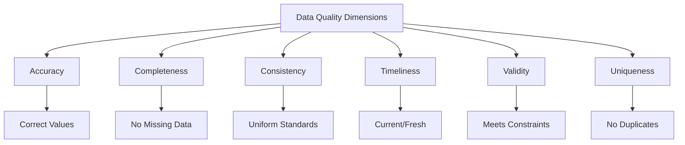

# Data Quality Assessment

## Introduction

Data quality is fundamental to successful data science projects. The principle "garbage in, garbage out" emphasizes that poor quality data leads to unreliable insights and flawed models. Understanding how to assess, measure, and improve data quality is a critical skill for data scientists.

Quality assessment involves examining data across multiple dimensions: accuracy, completeness, consistency, timeliness, validity, and uniqueness. This lesson provides practical tools and techniques for evaluating and documenting data quality.



## Data Quality Dimensions

```python
import pandas as pd
import numpy as np
from datetime import datetime, timedelta
import re

class DataQualityAssessor:
    """Comprehensive data quality assessment"""

    def __init__(self, df):
        self.df = df.copy()
        self.quality_report = {}

    def assess_completeness(self):
        """Measure data completeness"""
        total_cells = self.df.size
        missing_cells = self.df.isnull().sum().sum()
        completeness = (1 - missing_cells / total_cells) * 100

        # Per column analysis
        column_completeness = {}
        for col in self.df.columns:
            missing = self.df[col].isnull().sum()
            total = len(self.df)
            column_completeness[col] = {
                'missing_count': int(missing),
                'missing_percentage': float(missing / total * 100),
                'completeness': float((1 - missing / total) * 100)
            }

        self.quality_report['completeness'] = {
            'overall_completeness': float(completeness),
            'total_cells': int(total_cells),
            'missing_cells': int(missing_cells),
            'columns': column_completeness
        }

        return self.quality_report['completeness']

    def assess_uniqueness(self, key_columns=None):
        """Check for duplicate records"""
        total_rows = len(self.df)

        if key_columns:
            # Check duplicates on specific columns
            duplicates = self.df.duplicated(subset=key_columns, keep=False).sum()
            unique_rows = self.df.drop_duplicates(subset=key_columns).shape[0]
        else:
            # Check complete row duplicates
            duplicates = self.df.duplicated(keep=False).sum()
            unique_rows = self.df.drop_duplicates().shape[0]

        uniqueness = (unique_rows / total_rows) * 100

        self.quality_report['uniqueness'] = {
            'total_rows': int(total_rows),
            'unique_rows': int(unique_rows),
            'duplicate_rows': int(duplicates),
            'uniqueness_percentage': float(uniqueness),
            'key_columns': key_columns
        }

        return self.quality_report['uniqueness']

    def assess_validity(self, rules=None):
        """Check data validity against rules"""
        validity_issues = []

        if rules is None:
            rules = self._generate_default_rules()

        for rule in rules:
            column = rule['column']
            rule_type = rule['type']
            params = rule.get('params', {})

            if column not in self.df.columns:
                continue

            if rule_type == 'range':
                min_val = params.get('min')
                max_val = params.get('max')
                if min_val is not None:
                    violations = (self.df[column] < min_val).sum()
                    if violations > 0:
                        validity_issues.append({
                            'column': column,
                            'rule': f'Minimum value {min_val}',
                            'violations': int(violations)
                        })
                if max_val is not None:
                    violations = (self.df[column] > max_val).sum()
                    if violations > 0:
                        validity_issues.append({
                            'column': column,
                            'rule': f'Maximum value {max_val}',
                            'violations': int(violations)
                        })

            elif rule_type == 'regex':
                pattern = params.get('pattern')
                if pattern:
                    violations = ~self.df[column].astype(str).str.match(pattern)
                    violations = violations.sum()
                    if violations > 0:
                        validity_issues.append({
                            'column': column,
                            'rule': f'Regex pattern {pattern}',
                            'violations': int(violations)
                        })

            elif rule_type == 'categorical':
                allowed_values = params.get('values', [])
                violations = ~self.df[column].isin(allowed_values)
                violations = violations.sum()
                if violations > 0:
                    validity_issues.append({
                        'column': column,
                        'rule': f'Allowed values: {allowed_values}',
                        'violations': int(violations)
                    })

        self.quality_report['validity'] = {
            'total_issues': len(validity_issues),
            'issues': validity_issues
        }

        return self.quality_report['validity']

    def assess_consistency(self):
        """Check data consistency"""
        consistency_issues = []

        # Check data type consistency
        for col in self.df.columns:
            if self.df[col].dtype == 'object':
                # Check for mixed types in object columns
                types = self.df[col].apply(type).value_counts()
                if len(types) > 1:
                    consistency_issues.append({
                        'column': col,
                        'issue': 'Mixed data types',
                        'details': types.to_dict()
                    })

        # Check for inconsistent formatting (e.g., dates, phone numbers)
        for col in self.df.columns:
            if self.df[col].dtype == 'object':
                # Sample values to check patterns
                sample = self.df[col].dropna().astype(str).head(100)
                if len(sample) > 0:
                    # Check length variation
                    lengths = sample.str.len()
                    if lengths.std() > lengths.mean() * 0.5:  # High variation
                        consistency_issues.append({
                            'column': col,
                            'issue': 'Inconsistent formatting',
                            'details': f'Length varies significantly (mean: {lengths.mean():.1f}, std: {lengths.std():.1f})'
                        })

        self.quality_report['consistency'] = {
            'total_issues': len(consistency_issues),
            'issues': consistency_issues
        }

        return self.quality_report['consistency']

    def assess_timeliness(self, date_column, max_age_days=30):
        """Check data timeliness"""
        if date_column not in self.df.columns:
            return None

        dates = pd.to_datetime(self.df[date_column], errors='coerce')
        current_date = datetime.now()

        # Calculate age statistics
        ages = (current_date - dates).dt.days

        timeliness_info = {
            'date_column': date_column,
            'latest_date': str(dates.max()),
            'oldest_date': str(dates.min()),
            'mean_age_days': float(ages.mean()),
            'median_age_days': float(ages.median()),
            'max_age_days': float(ages.max()),
            'records_within_threshold': int((ages <= max_age_days).sum()),
            'records_beyond_threshold': int((ages > max_age_days).sum()),
            'threshold_days': max_age_days
        }

        self.quality_report['timeliness'] = timeliness_info
        return timeliness_info

    def assess_accuracy(self, reference_data=None, key_column=None):
        """Assess accuracy against reference data"""
        if reference_data is None:
            return None

        # Merge with reference data
        merged = self.df.merge(
            reference_data,
            on=key_column,
            how='inner',
            suffixes=('_actual', '_reference')
        )

        accuracy_results = {}

        # Compare columns
        for col in reference_data.columns:
            if col == key_column:
                continue

            actual_col = f"{col}_actual"
            ref_col = f"{col}_reference"

            if actual_col in merged.columns and ref_col in merged.columns:
                matches = merged[actual_col] == merged[ref_col]
                accuracy = matches.sum() / len(merged) * 100

                accuracy_results[col] = {
                    'accuracy_percentage': float(accuracy),
                    'matches': int(matches.sum()),
                    'mismatches': int((~matches).sum()),
                    'total_compared': len(merged)
                }

        self.quality_report['accuracy'] = accuracy_results
        return accuracy_results

    def _generate_default_rules(self):
        """Generate default validation rules"""
        rules = []

        for col in self.df.columns:
            dtype = self.df[col].dtype

            if np.issubdtype(dtype, np.number):
                # Numeric columns - check for negative values where inappropriate
                if 'age' in col.lower() or 'count' in col.lower() or 'quantity' in col.lower():
                    rules.append({
                        'column': col,
                        'type': 'range',
                        'params': {'min': 0}
                    })

            elif dtype == 'object':
                # String columns - check for common patterns
                if 'email' in col.lower():
                    rules.append({
                        'column': col,
                        'type': 'regex',
                        'params': {'pattern': r'^[\w\.-]+@[\w\.-]+\.\w+$'}
                    })

        return rules

    def generate_full_report(self):
        """Generate comprehensive quality report"""
        self.assess_completeness()
        self.assess_uniqueness()
        self.assess_validity()
        self.assess_consistency()

        return self.quality_report

# Create sample data with quality issues
sample_data = pd.DataFrame({
    'id': [1, 2, 3, 3, 5, 6, 7, 8, 9, None],  # Duplicate and missing
    'name': ['Alice', 'Bob', 'Charlie', 'Charlie', 'Eve', None, 'Frank', 'Grace', 'Henry', 'Ivy'],
    'email': ['alice@email.com', 'bob@email', 'charlie@email.com', 'charlie@email.com',
              'eve@email.com', 'frank@email.com', None, 'grace@email.com', 'henry@email.com', 'ivy@email.com'],
    'age': [25, 30, -5, 35, 42, 28, 33, None, 29, 150],  # Negative and extreme values
    'salary': [50000, 60000, 75000, 75000, None, 55000, 65000, 70000, 58000, 85000],
    'status': ['active', 'active', 'inactive', 'active', 'active', 'ACTIVE', 'inactive', 'Active', 'active', 'pending'],
    'created_date': pd.to_datetime(['2024-01-15', '2024-01-20', '2023-12-01', '2024-01-25',
                                     '2024-02-01', None, '2024-01-10', '2024-02-05', '2023-11-15', '2024-01-30'])
})

# Assess quality
assessor = DataQualityAssessor(sample_data)

print("COMPLETENESS ASSESSMENT:")
completeness = assessor.assess_completeness()
print(f"Overall Completeness: {completeness['overall_completeness']:.2f}%")
print(f"Missing Cells: {completeness['missing_cells']}/{completeness['total_cells']}")
print("\nPer Column:")
for col, metrics in completeness['columns'].items():
    print(f"  {col}: {metrics['completeness']:.2f}% complete ({metrics['missing_count']} missing)")

print("\n" + "="*60)
print("UNIQUENESS ASSESSMENT:")
uniqueness = assessor.assess_uniqueness(key_columns=['id', 'name'])
print(f"Uniqueness: {uniqueness['uniqueness_percentage']:.2f}%")
print(f"Duplicate Rows: {uniqueness['duplicate_rows']}/{uniqueness['total_rows']}")

print("\n" + "="*60)
print("VALIDITY ASSESSMENT:")
validity_rules = [
    {'column': 'age', 'type': 'range', 'params': {'min': 0, 'max': 120}},
    {'column': 'email', 'type': 'regex', 'params': {'pattern': r'^[\w\.-]+@[\w\.-]+\.\w+$'}},
    {'column': 'status', 'type': 'categorical', 'params': {'values': ['active', 'inactive', 'pending']}}
]
validity = assessor.assess_validity(validity_rules)
print(f"Total Validity Issues: {validity['total_issues']}")
for issue in validity['issues']:
    print(f"  {issue['column']}: {issue['rule']} - {issue['violations']} violations")

print("\n" + "="*60)
print("CONSISTENCY ASSESSMENT:")
consistency = assessor.assess_consistency()
print(f"Total Consistency Issues: {consistency['total_issues']}")
for issue in consistency['issues']:
    print(f"  {issue['column']}: {issue['issue']}")

print("\n" + "="*60)
print("TIMELINESS ASSESSMENT:")
timeliness = assessor.assess_timeliness('created_date', max_age_days=60)
if timeliness:
    print(f"Latest Date: {timeliness['latest_date']}")
    print(f"Oldest Date: {timeliness['oldest_date']}")
    print(f"Mean Age: {timeliness['mean_age_days']:.1f} days")
    print(f"Records within {timeliness['threshold_days']} days: {timeliness['records_within_threshold']}")
```

## Data Profiling

```python
class DataProfiler:
    """Generate comprehensive data profile"""

    def __init__(self, df):
        self.df = df

    def profile_numeric_column(self, column):
        """Profile numeric column"""
        data = self.df[column].dropna()

        profile = {
            'count': int(len(data)),
            'missing': int(self.df[column].isnull().sum()),
            'mean': float(data.mean()),
            'median': float(data.median()),
            'std': float(data.std()),
            'min': float(data.min()),
            'max': float(data.max()),
            'q25': float(data.quantile(0.25)),
            'q75': float(data.quantile(0.75)),
            'skewness': float(data.skew()),
            'kurtosis': float(data.kurtosis()),
            'zeros': int((data == 0).sum()),
            'negatives': int((data < 0).sum())
        }

        # Detect outliers using IQR method
        q1 = profile['q25']
        q3 = profile['q75']
        iqr = q3 - q1
        lower_bound = q1 - 1.5 * iqr
        upper_bound = q3 + 1.5 * iqr

        profile['outliers'] = int(((data < lower_bound) | (data > upper_bound)).sum())
        profile['outlier_bounds'] = {'lower': float(lower_bound), 'upper': float(upper_bound)}

        return profile

    def profile_categorical_column(self, column):
        """Profile categorical column"""
        data = self.df[column].dropna()

        value_counts = data.value_counts()

        profile = {
            'count': int(len(data)),
            'missing': int(self.df[column].isnull().sum()),
            'unique': int(data.nunique()),
            'mode': str(value_counts.index[0]) if len(value_counts) > 0 else None,
            'mode_frequency': int(value_counts.iloc[0]) if len(value_counts) > 0 else 0,
            'top_values': {str(k): int(v) for k, v in value_counts.head(10).items()},
            'cardinality': float(data.nunique() / len(data) * 100)
        }

        return profile

    def profile_datetime_column(self, column):
        """Profile datetime column"""
        data = pd.to_datetime(self.df[column], errors='coerce').dropna()

        if len(data) == 0:
            return None

        profile = {
            'count': int(len(data)),
            'missing': int(self.df[column].isnull().sum()),
            'min_date': str(data.min()),
            'max_date': str(data.max()),
            'range_days': int((data.max() - data.min()).days),
            'unique_dates': int(data.nunique())
        }

        # Analyze temporal patterns
        if hasattr(data.dt, 'dayofweek'):
            profile['day_of_week_distribution'] = data.dt.dayofweek.value_counts().to_dict()
            profile['month_distribution'] = data.dt.month.value_counts().to_dict()

        return profile

    def generate_profile(self):
        """Generate complete data profile"""
        profile = {
            'shape': {'rows': self.df.shape[0], 'columns': self.df.shape[1]},
            'memory_usage': f"{self.df.memory_usage(deep=True).sum() / 1024 / 1024:.2f} MB",
            'columns': {}
        }

        for col in self.df.columns:
            dtype = self.df[col].dtype

            col_profile = {
                'dtype': str(dtype),
                'missing_percentage': float(self.df[col].isnull().sum() / len(self.df) * 100)
            }

            if np.issubdtype(dtype, np.number):
                col_profile['type'] = 'numeric'
                col_profile['statistics'] = self.profile_numeric_column(col)
            elif dtype == 'object':
                # Check if it's a date
                sample = self.df[col].dropna().head(10)
                try:
                    pd.to_datetime(sample)
                    col_profile['type'] = 'datetime'
                    col_profile['statistics'] = self.profile_datetime_column(col)
                except:
                    col_profile['type'] = 'categorical'
                    col_profile['statistics'] = self.profile_categorical_column(col)
            else:
                col_profile['type'] = 'other'

            profile['columns'][col] = col_profile

        return profile

# Generate profile
profiler = DataProfiler(sample_data)
profile = profiler.generate_profile()

print("\nDATA PROFILE:")
print(f"Shape: {profile['shape']['rows']} rows × {profile['shape']['columns']} columns")
print(f"Memory: {profile['memory_usage']}")
print("\nColumn Profiles:")

for col, col_prof in profile['columns'].items():
    print(f"\n{col} ({col_prof['type']}):")
    print(f"  Missing: {col_prof['missing_percentage']:.2f}%")

    if 'statistics' in col_prof and col_prof['statistics']:
        stats = col_prof['statistics']
        if col_prof['type'] == 'numeric':
            print(f"  Range: [{stats['min']:.2f}, {stats['max']:.2f}]")
            print(f"  Mean: {stats['mean']:.2f}, Median: {stats['median']:.2f}")
            print(f"  Outliers: {stats['outliers']}")
        elif col_prof['type'] == 'categorical':
            print(f"  Unique values: {stats['unique']}")
            print(f"  Mode: {stats['mode']} ({stats['mode_frequency']} occurrences)")
        elif col_prof['type'] == 'datetime':
            print(f"  Range: {stats['min_date']} to {stats['max_date']}")
            print(f"  Span: {stats['range_days']} days")
```

## Quality Scoring

```python
class QualityScorer:
    """Calculate overall data quality score"""

    @staticmethod
    def calculate_quality_score(quality_report, weights=None):
        """
        Calculate weighted quality score
        """
        if weights is None:
            weights = {
                'completeness': 0.25,
                'uniqueness': 0.20,
                'validity': 0.25,
                'consistency': 0.15,
                'timeliness': 0.15
            }

        scores = {}

        # Completeness score
        if 'completeness' in quality_report:
            scores['completeness'] = quality_report['completeness']['overall_completeness']

        # Uniqueness score
        if 'uniqueness' in quality_report:
            scores['uniqueness'] = quality_report['uniqueness']['uniqueness_percentage']

        # Validity score
        if 'validity' in quality_report:
            total_rows = quality_report.get('shape', {}).get('rows', 1)
            total_violations = sum(issue['violations'] for issue in quality_report['validity']['issues'])
            scores['validity'] = max(0, (1 - total_violations / total_rows) * 100)

        # Consistency score (simplified)
        if 'consistency' in quality_report:
            total_columns = quality_report.get('shape', {}).get('columns', 1)
            issues = len(quality_report['consistency']['issues'])
            scores['consistency'] = max(0, (1 - issues / total_columns) * 100)

        # Calculate weighted score
        weighted_score = sum(scores.get(dim, 0) * weights[dim]
                           for dim in weights.keys())

        return {
            'overall_score': weighted_score,
            'dimension_scores': scores,
            'weights': weights,
            'grade': QualityScorer._get_grade(weighted_score)
        }

    @staticmethod
    def _get_grade(score):
        """Assign letter grade to quality score"""
        if score >= 95:
            return 'A+'
        elif score >= 90:
            return 'A'
        elif score >= 85:
            return 'B+'
        elif score >= 80:
            return 'B'
        elif score >= 75:
            return 'C+'
        elif score >= 70:
            return 'C'
        elif score >= 60:
            return 'D'
        else:
            return 'F'

# Calculate quality score
full_report = assessor.generate_full_report()
full_report['shape'] = {'rows': len(sample_data), 'columns': len(sample_data.columns)}

scorer = QualityScorer()
quality_score = scorer.calculate_quality_score(full_report)

print("\n" + "="*60)
print("OVERALL QUALITY SCORE:")
print(f"Score: {quality_score['overall_score']:.2f}/100")
print(f"Grade: {quality_score['grade']}")
print("\nDimension Scores:")
for dim, score in quality_score['dimension_scores'].items():
    weight = quality_score['weights'][dim]
    print(f"  {dim.capitalize()}: {score:.2f} (weight: {weight*100:.0f}%)")
```

## Quality Improvement Recommendations

```python
class QualityRecommender:
    """Generate recommendations for improving data quality"""

    @staticmethod
    def generate_recommendations(quality_report):
        """Generate actionable recommendations"""
        recommendations = []

        # Completeness recommendations
        if 'completeness' in quality_report:
            overall = quality_report['completeness']['overall_completeness']
            if overall < 95:
                recommendations.append({
                    'priority': 'High' if overall < 80 else 'Medium',
                    'dimension': 'Completeness',
                    'issue': f'Data is only {overall:.2f}% complete',
                    'recommendation': 'Investigate missing data patterns and implement data collection improvements',
                    'actions': [
                        'Identify columns with high missing rates',
                        'Determine if missing data is systematic',
                        'Implement validation at data entry points',
                        'Consider imputation strategies for critical fields'
                    ]
                })

        # Uniqueness recommendations
        if 'uniqueness' in quality_report:
            duplicates = quality_report['uniqueness']['duplicate_rows']
            if duplicates > 0:
                recommendations.append({
                    'priority': 'High',
                    'dimension': 'Uniqueness',
                    'issue': f'{duplicates} duplicate records found',
                    'recommendation': 'Remove duplicates and implement deduplication process',
                    'actions': [
                        'Review duplicate records to identify causes',
                        'Establish primary key constraints',
                        'Implement deduplication logic in ETL pipeline',
                        'Add unique constraints to database schema'
                    ]
                })

        # Validity recommendations
        if 'validity' in quality_report:
            issues = quality_report['validity']['issues']
            if issues:
                recommendations.append({
                    'priority': 'High',
                    'dimension': 'Validity',
                    'issue': f'{len(issues)} validation rules violated',
                    'recommendation': 'Implement data validation checks',
                    'actions': [
                        'Add validation rules to data entry forms',
                        'Implement server-side validation',
                        'Create data quality monitoring dashboard',
                        'Establish data governance policies'
                    ]
                })

        # Consistency recommendations
        if 'consistency' in quality_report:
            issues = quality_report['consistency']['issues']
            if issues:
                recommendations.append({
                    'priority': 'Medium',
                    'dimension': 'Consistency',
                    'issue': f'{len(issues)} consistency issues found',
                    'recommendation': 'Standardize data formats',
                    'actions': [
                        'Create data dictionaries with standard formats',
                        'Implement data transformation rules',
                        'Use controlled vocabularies',
                        'Apply consistent casing and formatting'
                    ]
                })

        return sorted(recommendations, key=lambda x: {'High': 0, 'Medium': 1, 'Low': 2}[x['priority']])

# Generate recommendations
recommender = QualityRecommender()
recommendations = recommender.generate_recommendations(full_report)

print("\n" + "="*60)
print("QUALITY IMPROVEMENT RECOMMENDATIONS:")
for i, rec in enumerate(recommendations, 1):
    print(f"\n{i}. [{rec['priority']} Priority] {rec['dimension']}")
    print(f"   Issue: {rec['issue']}")
    print(f"   Recommendation: {rec['recommendation']}")
    print("   Actions:")
    for action in rec['actions']:
        print(f"     - {action}")
```

## Summary

Data quality assessment is a critical process involving:

**Key Dimensions:**
- Completeness: No missing values
- Uniqueness: No unwanted duplicates
- Validity: Data meets business rules
- Consistency: Uniform formatting and standards
- Timeliness: Data is current and fresh
- Accuracy: Data matches reality

**Assessment Process:**
1. Profile data to understand characteristics
2. Measure quality across dimensions
3. Identify specific issues
4. Calculate quality scores
5. Generate improvement recommendations
6. Monitor quality over time

**Best Practices:**
- Automate quality checks in data pipelines
- Document quality metrics and thresholds
- Establish data quality SLAs
- Create quality monitoring dashboards
- Involve domain experts in validation
- Implement preventive measures at data sources
- Regularly review and update quality rules

High-quality data is essential for reliable analytics and machine learning models. Invest time in quality assessment and improvement for better outcomes.
