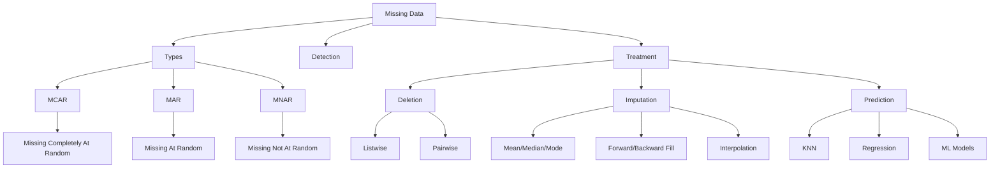

# Handling Missing Data

## Introduction

Missing data is one of the most common challenges in data science. Nearly every real-world dataset contains missing values, and how you handle them significantly impacts analysis quality and model performance. Understanding the types, patterns, and appropriate treatment strategies for missing data is essential for effective data cleaning.

Missing data can occur for various reasons: sensor failures, survey non-responses, data entry errors, system malfunctions, or intentional omissions. The key is not just to fill in the blanks, but to understand why data is missing and choose appropriate strategies that don't introduce bias.



## Types of Missing Data

```python
import pandas as pd
import numpy as np
import matplotlib.pyplot as plt
import seaborn as sns
from sklearn.impute import SimpleImputer, KNNImputer
from sklearn.experimental import enable_iterative_imputer
from sklearn.impute import IterativeImputer

class MissingDataAnalyzer:
    """Analyze patterns and types of missing data"""

    def __init__(self, df):
        self.df = df.copy()

    def missing_summary(self):
        """Generate summary of missing data"""
        missing_count = self.df.isnull().sum()
        missing_pct = (missing_count / len(self.df)) * 100

        summary = pd.DataFrame({
            'Missing_Count': missing_count,
            'Missing_Percentage': missing_pct,
            'Data_Type': self.df.dtypes
        })

        summary = summary[summary['Missing_Count'] > 0].sort_values(
            'Missing_Percentage', ascending=False
        )

        return summary

    def missing_patterns(self):
        """Identify patterns in missing data"""
        # Create binary matrix (1 = missing, 0 = present)
        missing_matrix = self.df.isnull().astype(int)

        # Find unique missing patterns
        patterns = missing_matrix.groupby(
            list(missing_matrix.columns)
        ).size().reset_index(name='Count')

        patterns = patterns.sort_values('Count', ascending=False)

        return patterns

    def missing_correlation(self):
        """Calculate correlation between missing values"""
        missing_matrix = self.df.isnull().astype(int)
        correlation = missing_matrix.corr()

        return correlation

    def visualize_missing(self):
        """Visualize missing data patterns"""
        # Calculate missing percentage per column
        missing_pct = (self.df.isnull().sum() / len(self.df)) * 100
        missing_pct = missing_pct[missing_pct > 0].sort_values(ascending=True)

        if len(missing_pct) == 0:
            print("No missing data to visualize")
            return

        # Create visualization data
        print("Missing Data Visualization:")
        print("="*60)
        for col in missing_pct.index:
            pct = missing_pct[col]
            bar_length = int(pct / 2)  # Scale to 50 chars max
            bar = '█' * bar_length
            print(f"{col:20s} [{pct:5.1f}%] {bar}")

    def test_mcar(self, column, related_columns):
        """
        Test if data is Missing Completely At Random
        Using Little's MCAR test approach (simplified)
        """
        # Create missing indicator
        df_test = self.df[[column] + related_columns].copy()
        df_test['is_missing'] = self.df[column].isnull().astype(int)

        # Compare distributions of related columns
        # for missing vs non-missing cases
        results = {}

        for col in related_columns:
            if col in df_test.columns:
                missing_group = df_test[df_test['is_missing'] == 1][col].dropna()
                present_group = df_test[df_test['is_missing'] == 0][col].dropna()

                if len(missing_group) > 0 and len(present_group) > 0:
                    # Simple comparison using means
                    results[col] = {
                        'missing_mean': float(missing_group.mean()),
                        'present_mean': float(present_group.mean()),
                        'difference': float(abs(missing_group.mean() - present_group.mean()))
                    }

        return results

# Create sample data with different missing patterns
np.random.seed(42)
n = 1000

# MCAR example: completely random
data_mcar = pd.DataFrame({
    'id': range(n),
    'age': np.random.randint(18, 80, n),
    'income': np.random.normal(50000, 15000, n),
    'score': np.random.normal(75, 10, n)
})

# Introduce MCAR missingness
missing_indices = np.random.choice(n, size=int(n * 0.1), replace=False)
data_mcar.loc[missing_indices, 'income'] = np.nan

# MAR example: missing depends on observed values
data_mar = data_mcar.copy()
# Older people less likely to report income
high_age_indices = data_mar[data_mar['age'] > 65].index
missing_mar = np.random.choice(high_age_indices, size=int(len(high_age_indices) * 0.3), replace=False)
data_mar.loc[missing_mar, 'income'] = np.nan

# MNAR example: missing depends on the value itself
data_mnar = data_mcar.copy()
# Low income people less likely to report income
low_income_indices = data_mnar[data_mnar['income'] < 40000].index
missing_mnar = np.random.choice(low_income_indices, size=int(len(low_income_indices) * 0.4), replace=False)
data_mnar.loc[missing_mnar, 'income'] = np.nan

# Analyze missing data
print("MISSING DATA ANALYSIS")
print("="*60)

analyzer_mcar = MissingDataAnalyzer(data_mcar)
print("\nMCAR Dataset:")
print(analyzer_mcar.missing_summary())
print("\nMissing Data Visualization:")
analyzer_mcar.visualize_missing()

analyzer_mar = MissingDataAnalyzer(data_mar)
print("\n\nMAR Dataset:")
print(analyzer_mar.missing_summary())

# Test for MCAR
mcar_test = analyzer_mar.test_mcar('income', ['age', 'score'])
print("\nMCAR Test Results:")
for col, result in mcar_test.items():
    print(f"  {col}:")
    print(f"    Mean when income missing: {result['missing_mean']:.2f}")
    print(f"    Mean when income present: {result['present_mean']:.2f}")
    print(f"    Difference: {result['difference']:.2f}")
```

## Deletion Strategies

```python
class MissingDataDeletion:
    """Strategies for deleting missing data"""

    @staticmethod
    def listwise_deletion(df, threshold=0.0):
        """
        Remove rows with any missing values (complete case analysis)
        threshold: minimum percentage of non-null values required
        """
        if threshold == 0:
            # Standard listwise deletion
            df_clean = df.dropna()
        else:
            # Keep rows with at least threshold% non-null values
            min_count = int(threshold * len(df.columns))
            df_clean = df.dropna(thresh=min_count)

        removed = len(df) - len(df_clean)
        removed_pct = (removed / len(df)) * 100

        return df_clean, {
            'original_rows': len(df),
            'remaining_rows': len(df_clean),
            'removed_rows': removed,
            'removed_percentage': removed_pct
        }

    @staticmethod
    def pairwise_deletion(df):
        """
        Use all available data for each calculation
        (Don't delete, just skip in calculations)
        """
        # This is implicit in pandas operations
        # Example: correlation with pairwise deletion
        correlation = df.corr()  # Automatically uses pairwise deletion

        return correlation

    @staticmethod
    def column_deletion(df, threshold=0.5):
        """
        Remove columns with too many missing values
        threshold: maximum proportion of missing values allowed
        """
        missing_pct = df.isnull().sum() / len(df)
        columns_to_keep = missing_pct[missing_pct <= threshold].index

        df_clean = df[columns_to_keep]

        removed_cols = list(set(df.columns) - set(columns_to_keep))

        return df_clean, {
            'original_columns': len(df.columns),
            'remaining_columns': len(df_clean.columns),
            'removed_columns': removed_cols
        }

# Example deletion strategies
deletion_handler = MissingDataDeletion()

# Listwise deletion
df_listwise, stats_listwise = deletion_handler.listwise_deletion(data_mar)
print("\nListwise Deletion Results:")
print(f"  Original rows: {stats_listwise['original_rows']}")
print(f"  Remaining rows: {stats_listwise['remaining_rows']}")
print(f"  Removed: {stats_listwise['removed_percentage']:.2f}%")

# Column deletion
sample_data_many_missing = data_mar.copy()
sample_data_many_missing['bad_column'] = np.nan  # 100% missing
sample_data_many_missing.loc[np.random.choice(n, size=700), 'score'] = np.nan  # 70% missing

df_coldelete, stats_coldelete = deletion_handler.column_deletion(
    sample_data_many_missing,
    threshold=0.5
)
print("\nColumn Deletion Results:")
print(f"  Removed columns: {stats_coldelete['removed_columns']}")
```

## Simple Imputation Methods

```python
class SimpleImputationMethods:
    """Basic imputation strategies"""

    @staticmethod
    def mean_imputation(df, columns=None):
        """Replace missing values with column mean"""
        df_imputed = df.copy()

        if columns is None:
            columns = df.select_dtypes(include=[np.number]).columns

        for col in columns:
            if col in df_imputed.columns:
                mean_value = df_imputed[col].mean()
                df_imputed[col].fillna(mean_value, inplace=True)

        return df_imputed

    @staticmethod
    def median_imputation(df, columns=None):
        """Replace missing values with column median"""
        df_imputed = df.copy()

        if columns is None:
            columns = df.select_dtypes(include=[np.number]).columns

        for col in columns:
            if col in df_imputed.columns:
                median_value = df_imputed[col].median()
                df_imputed[col].fillna(median_value, inplace=True)

        return df_imputed

    @staticmethod
    def mode_imputation(df, columns=None):
        """Replace missing values with column mode"""
        df_imputed = df.copy()

        if columns is None:
            columns = df.columns

        for col in columns:
            if col in df_imputed.columns and len(df_imputed[col].mode()) > 0:
                mode_value = df_imputed[col].mode()[0]
                df_imputed[col].fillna(mode_value, inplace=True)

        return df_imputed

    @staticmethod
    def forward_fill(df, columns=None):
        """Forward fill (carry last observation forward)"""
        df_imputed = df.copy()

        if columns:
            df_imputed[columns] = df_imputed[columns].fillna(method='ffill')
        else:
            df_imputed = df_imputed.fillna(method='ffill')

        return df_imputed

    @staticmethod
    def backward_fill(df, columns=None):
        """Backward fill"""
        df_imputed = df.copy()

        if columns:
            df_imputed[columns] = df_imputed[columns].fillna(method='bfill')
        else:
            df_imputed = df_imputed.fillna(method='bfill')

        return df_imputed

    @staticmethod
    def interpolate(df, columns=None, method='linear'):
        """
        Interpolate missing values
        methods: 'linear', 'polynomial', 'spline', 'time'
        """
        df_imputed = df.copy()

        if columns is None:
            columns = df.select_dtypes(include=[np.number]).columns

        for col in columns:
            if col in df_imputed.columns:
                df_imputed[col] = df_imputed[col].interpolate(method=method)

        return df_imputed

# Example simple imputation
simple_imputer = SimpleImputationMethods()

print("\nSIMPLE IMPUTATION EXAMPLES:")
print("="*60)

# Mean imputation
df_mean = simple_imputer.mean_imputation(data_mar, columns=['income'])
print(f"\nMean Imputation:")
print(f"  Original mean: {data_mcar['income'].mean():.2f}")
print(f"  After imputation mean: {df_mean['income'].mean():.2f}")
print(f"  Missing values remaining: {df_mean['income'].isnull().sum()}")

# Median imputation
df_median = simple_imputer.median_imputation(data_mar, columns=['income'])
print(f"\nMedian Imputation:")
print(f"  Original median: {data_mcar['income'].median():.2f}")
print(f"  After imputation median: {df_median['income'].median():.2f}")

# Compare distributions
print(f"\nDistribution Comparison:")
print(f"  Original std: {data_mcar['income'].std():.2f}")
print(f"  Mean imputed std: {df_mean['income'].std():.2f}")
print(f"  Median imputed std: {df_median['income'].std():.2f}")
```

## Advanced Imputation Methods

```python
class AdvancedImputation:
    """Advanced imputation techniques"""

    @staticmethod
    def knn_imputation(df, n_neighbors=5):
        """
        K-Nearest Neighbors imputation
        Impute using weighted mean of k nearest neighbors
        """
        imputer = KNNImputer(n_neighbors=n_neighbors)

        # Select numeric columns
        numeric_cols = df.select_dtypes(include=[np.number]).columns
        df_numeric = df[numeric_cols]

        # Impute
        df_imputed = pd.DataFrame(
            imputer.fit_transform(df_numeric),
            columns=numeric_cols,
            index=df.index
        )

        # Combine with non-numeric columns
        for col in df.columns:
            if col not in numeric_cols:
                df_imputed[col] = df[col]

        return df_imputed

    @staticmethod
    def iterative_imputation(df, max_iter=10):
        """
        Iterative imputation (MICE - Multiple Imputation by Chained Equations)
        Models each feature as a function of other features
        """
        imputer = IterativeImputer(max_iter=max_iter, random_state=42)

        # Select numeric columns
        numeric_cols = df.select_dtypes(include=[np.number]).columns
        df_numeric = df[numeric_cols]

        # Impute
        df_imputed = pd.DataFrame(
            imputer.fit_transform(df_numeric),
            columns=numeric_cols,
            index=df.index
        )

        # Combine with non-numeric columns
        for col in df.columns:
            if col not in numeric_cols:
                df_imputed[col] = df[col]

        return df_imputed

    @staticmethod
    def regression_imputation(df, target_col, feature_cols):
        """
        Use regression to predict missing values
        """
        from sklearn.linear_model import LinearRegression

        df_imputed = df.copy()

        # Separate complete and incomplete cases
        complete_cases = df_imputed[df_imputed[target_col].notna()]
        incomplete_cases = df_imputed[df_imputed[target_col].isna()]

        if len(incomplete_cases) == 0:
            return df_imputed

        # Train regression model
        X_train = complete_cases[feature_cols].dropna()
        y_train = complete_cases.loc[X_train.index, target_col]

        model = LinearRegression()
        model.fit(X_train, y_train)

        # Predict missing values
        X_predict = incomplete_cases[feature_cols].dropna()
        if len(X_predict) > 0:
            predictions = model.predict(X_predict)
            df_imputed.loc[X_predict.index, target_col] = predictions

        return df_imputed

# Example advanced imputation
advanced_imputer = AdvancedImputation()

print("\n\nADVANCED IMPUTATION EXAMPLES:")
print("="*60)

# KNN imputation
df_knn = advanced_imputer.knn_imputation(data_mar)
print(f"\nKNN Imputation:")
print(f"  Missing values remaining: {df_knn.isnull().sum().sum()}")
print(f"  Income mean: {df_knn['income'].mean():.2f}")
print(f"  Income std: {df_knn['income'].std():.2f}")

# Iterative imputation
df_iterative = advanced_imputer.iterative_imputation(data_mar)
print(f"\nIterative Imputation (MICE):")
print(f"  Missing values remaining: {df_iterative.isnull().sum().sum()}")
print(f"  Income mean: {df_iterative['income'].mean():.2f}")
print(f"  Income std: {df_iterative['income'].std():.2f}")

# Regression imputation
df_regression = advanced_imputer.regression_imputation(
    data_mar,
    target_col='income',
    feature_cols=['age', 'score']
)
print(f"\nRegression Imputation:")
print(f"  Missing values remaining in income: {df_regression['income'].isnull().sum()}")
print(f"  Income mean: {df_regression['income'].mean():.2f}")
```

## Imputation Strategy Selection

```python
class ImputationSelector:
    """Help select appropriate imputation strategy"""

    @staticmethod
    def recommend_strategy(df, column):
        """Recommend imputation strategy based on data characteristics"""
        recommendations = []

        # Get column statistics
        col_data = df[column].dropna()
        missing_pct = df[column].isnull().sum() / len(df) * 100

        # Check data type
        is_numeric = pd.api.types.is_numeric_dtype(df[column])
        is_categorical = pd.api.types.is_categorical_dtype(df[column]) or df[column].dtype == 'object'

        # Recommendation based on missing percentage
        if missing_pct < 5:
            recommendations.append({
                'method': 'Deletion',
                'reason': f'Low missing percentage ({missing_pct:.1f}%)',
                'priority': 'High'
            })

        if missing_pct > 50:
            recommendations.append({
                'method': 'Column Deletion',
                'reason': f'Very high missing percentage ({missing_pct:.1f}%)',
                'priority': 'High'
            })

        # Recommendations for numeric data
        if is_numeric:
            # Check distribution
            skewness = col_data.skew()

            if abs(skewness) < 0.5:
                recommendations.append({
                    'method': 'Mean Imputation',
                    'reason': 'Approximately normal distribution',
                    'priority': 'Medium'
                })
            else:
                recommendations.append({
                    'method': 'Median Imputation',
                    'reason': f'Skewed distribution (skewness: {skewness:.2f})',
                    'priority': 'High'
                })

            recommendations.append({
                'method': 'KNN Imputation',
                'reason': 'Can capture local patterns in data',
                'priority': 'High'
            })

            recommendations.append({
                'method': 'Iterative Imputation',
                'reason': 'Can model relationships between features',
                'priority': 'Medium'
            })

        # Recommendations for categorical data
        if is_categorical:
            recommendations.append({
                'method': 'Mode Imputation',
                'reason': 'Categorical data - use most frequent value',
                'priority': 'High'
            })

            cardinality = df[column].nunique()
            if cardinality > 10:
                recommendations.append({
                    'method': 'Create "Missing" Category',
                    'reason': f'High cardinality ({cardinality} unique values)',
                    'priority': 'Medium'
                })

        return sorted(recommendations, key=lambda x: {'High': 0, 'Medium': 1, 'Low': 2}[x['priority']])

# Example strategy selection
selector = ImputationSelector()

print("\n\nIMPUTATION STRATEGY RECOMMENDATIONS:")
print("="*60)

recommendations = selector.recommend_strategy(data_mar, 'income')
print(f"\nFor column 'income':")
for i, rec in enumerate(recommendations, 1):
    print(f"\n{i}. {rec['method']} [{rec['priority']} Priority]")
    print(f"   Reason: {rec['reason']}")
```

## Evaluating Imputation Quality

```python
class ImputationEvaluator:
    """Evaluate quality of imputation"""

    @staticmethod
    def compare_distributions(original, imputed, column):
        """Compare distributions before and after imputation"""
        original_data = original[column].dropna()
        imputed_data = imputed[column]

        comparison = {
            'original_mean': float(original_data.mean()),
            'imputed_mean': float(imputed_data.mean()),
            'original_std': float(original_data.std()),
            'imputed_std': float(imputed_data.std()),
            'original_median': float(original_data.median()),
            'imputed_median': float(imputed_data.median())
        }

        comparison['mean_diff'] = abs(comparison['original_mean'] - comparison['imputed_mean'])
        comparison['std_diff'] = abs(comparison['original_std'] - comparison['imputed_std'])

        return comparison

    @staticmethod
    def calculate_rmse(original_complete, imputed, missing_mask, column):
        """
        Calculate RMSE on artificially created missing values
        (requires complete original data for validation)
        """
        # Get values that were actually missing
        original_values = original_complete.loc[missing_mask, column]
        imputed_values = imputed.loc[missing_mask, column]

        mse = ((original_values - imputed_values) ** 2).mean()
        rmse = np.sqrt(mse)

        return rmse

# Example evaluation
evaluator = ImputationEvaluator()

print("\n\nIMPUTATION QUALITY EVALUATION:")
print("="*60)

# Compare different imputation methods
methods = {
    'Mean': simple_imputer.mean_imputation(data_mar, ['income']),
    'Median': simple_imputer.median_imputation(data_mar, ['income']),
    'KNN': df_knn,
    'Iterative': df_iterative
}

for method_name, df_imputed in methods.items():
    comparison = evaluator.compare_distributions(data_mcar, df_imputed, 'income')

    print(f"\n{method_name} Imputation:")
    print(f"  Mean difference: {comparison['mean_diff']:.2f}")
    print(f"  Std difference: {comparison['std_diff']:.2f}")
```

## Summary

Handling missing data requires careful consideration:

**Types of Missingness:**
- **MCAR**: Missing Completely At Random - can delete safely
- **MAR**: Missing At Random - depends on observed data
- **MNAR**: Missing Not At Random - depends on unobserved data

**Deletion Strategies:**
- Listwise deletion: Remove rows with any missing values
- Pairwise deletion: Use all available data for each calculation
- Column deletion: Remove columns with excessive missing values

**Simple Imputation:**
- Mean/Median/Mode: Replace with central tendency
- Forward/Backward fill: Use adjacent values
- Interpolation: Estimate from surrounding values

**Advanced Imputation:**
- KNN: Use similar observations
- Iterative (MICE): Model each feature using others
- Regression: Predict missing values from other features

**Best Practices:**
- Understand why data is missing
- Document all imputation decisions
- Consider multiple imputation for uncertainty
- Evaluate impact on downstream analysis
- Be cautious with high percentages of missing data
- Preserve relationships in the data when possible

Choose your strategy based on the amount of missing data, missingness mechanism, data type, and analytical goals.
