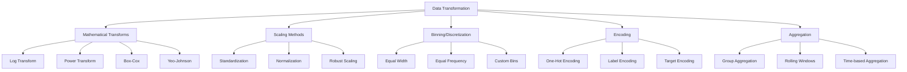

# Data Transformation

## Introduction

Data transformation is the process of converting data from one format or structure to another, making it suitable for analysis, visualization, and machine learning. Proper transformation can reveal hidden patterns, improve model performance, and ensure statistical assumptions are met.

Transformations serve multiple purposes: they can normalize skewed distributions, stabilize variance across groups, linearize relationships between variables, and reduce the impact of outliers. Understanding when and how to apply different transformations is crucial for effective data science work.

The choice of transformation depends on several factors including data distribution characteristics, the requirements of downstream algorithms, interpretability needs, and domain-specific considerations. Some transformations are reversible (allowing you to interpret results in original units), while others permanently change the scale of your data.



## Mathematical Transformations

Mathematical transformations apply functions to data to change its distribution or scale. These are particularly useful for handling skewed data and meeting statistical assumptions.

```python
import pandas as pd
import numpy as np
from scipy import stats
from sklearn.preprocessing import PowerTransformer, QuantileTransformer
import matplotlib.pyplot as plt

class MathematicalTransformer:
    """Comprehensive mathematical transformation methods"""

    @staticmethod
    def log_transform(data, offset=1, base='natural'):
        """
        Logarithmic transformation - reduces right skewness

        Args:
            data: Input data
            offset: Value to add before taking log (handles zeros/negatives)
            base: 'natural' (ln), 10, or 2
        """
        transformed_data = data + offset

        if base == 'natural':
            return np.log(transformed_data)
        elif base == 10:
            return np.log10(transformed_data)
        elif base == 2:
            return np.log2(transformed_data)
        else:
            raise ValueError("Base must be 'natural', 10, or 2")

    @staticmethod
    def sqrt_transform(data):
        """
        Square root transformation - moderate skewness reduction
        Only works with non-negative data
        """
        if (data < 0).any():
            raise ValueError("Square root requires non-negative values")
        return np.sqrt(data)

    @staticmethod
    def power_transform(data, power):
        """
        Power transformation: x^power
        power < 1: reduces right skewness
        power > 1: reduces left skewness
        """
        return np.power(data, power)

    @staticmethod
    def box_cox_transform(data):
        """
        Box-Cox transformation - finds optimal power transform
        Requires strictly positive data

        Returns: transformed data and optimal lambda parameter
        """
        # Ensure positive data
        if (data <= 0).any():
            min_val = data.min()
            data = data - min_val + 1
            print(f"Shifted data by {-min_val + 1} to make positive")

        transformed, lambda_param = stats.boxcox(data)

        print(f"Optimal lambda: {lambda_param:.4f}")
        if abs(lambda_param) < 0.01:
            print("  → Approximately log transform")
        elif abs(lambda_param - 0.5) < 0.01:
            print("  → Approximately square root transform")
        elif abs(lambda_param - 1) < 0.01:
            print("  → No transformation needed")

        return transformed, lambda_param

    @staticmethod
    def yeo_johnson_transform(data):
        """
        Yeo-Johnson transformation - like Box-Cox but handles negative values
        More flexible than Box-Cox

        Returns: transformed data and transformer object
        """
        transformer = PowerTransformer(method='yeo-johnson', standardize=False)

        # Reshape for sklearn
        data_reshaped = data.values.reshape(-1, 1) if isinstance(data, pd.Series) else data.reshape(-1, 1)
        transformed = transformer.fit_transform(data_reshaped).flatten()

        return transformed, transformer

    @staticmethod
    def quantile_transform(data, output_distribution='normal', n_quantiles=1000):
        """
        Quantile transformation - maps to specified distribution
        Very powerful but loses interpretability

        Args:
            output_distribution: 'normal' or 'uniform'
            n_quantiles: Number of quantiles to use
        """
        transformer = QuantileTransformer(
            output_distribution=output_distribution,
            n_quantiles=min(n_quantiles, len(data)),
            random_state=42
        )

        data_reshaped = data.values.reshape(-1, 1) if isinstance(data, pd.Series) else data.reshape(-1, 1)
        transformed = transformer.fit_transform(data_reshaped).flatten()

        return transformed, transformer

    @staticmethod
    def reciprocal_transform(data):
        """
        Reciprocal transformation: 1/x
        Reverses order and handles ratios differently
        """
        # Add small epsilon to avoid division by zero
        epsilon = 1e-10
        return 1 / (data + epsilon)

# Create sample data with various distributions
np.random.seed(42)
n = 1000

# Right-skewed data (exponential distribution)
right_skewed = pd.Series(np.random.exponential(scale=2, size=n))

# Left-skewed data (created by transforming)
left_skewed = pd.Series(10 - np.random.exponential(scale=2, size=n))

# Normal data
normal_data = pd.Series(np.random.normal(loc=50, scale=10, size=n))

transformer = MathematicalTransformer()

print("MATHEMATICAL TRANSFORMATION EXAMPLES")
print("="*60)

# Analyze right-skewed data
print("\nRight-Skewed Data Analysis:")
print(f"  Mean: {right_skewed.mean():.2f}")
print(f"  Median: {right_skewed.median():.2f}")
print(f"  Std: {right_skewed.std():.2f}")
print(f"  Skewness: {right_skewed.skew():.2f}")
print(f"  Kurtosis: {right_skewed.kurtosis():.2f}")

# Apply various transformations
print("\nTransformation Results:")

# Log transform
log_data = transformer.log_transform(right_skewed)
print(f"\n1. Log Transform:")
print(f"   Skewness: {log_data.skew():.2f} (original: {right_skewed.skew():.2f})")
print(f"   Kurtosis: {log_data.kurtosis():.2f}")

# Square root
sqrt_data = transformer.sqrt_transform(right_skewed)
print(f"\n2. Square Root Transform:")
print(f"   Skewness: {sqrt_data.skew():.2f}")

# Box-Cox
print(f"\n3. Box-Cox Transform:")
boxcox_data, lambda_param = transformer.box_cox_transform(right_skewed)
print(f"   Skewness: {pd.Series(boxcox_data).skew():.2f}")

# Yeo-Johnson
print(f"\n4. Yeo-Johnson Transform:")
yj_data, yj_transformer = transformer.yeo_johnson_transform(right_skewed)
print(f"   Skewness: {pd.Series(yj_data).skew():.2f}")

# Quantile transform to normal
print(f"\n5. Quantile Transform (to normal):")
qt_data, qt_transformer = transformer.quantile_transform(right_skewed, output_distribution='normal')
print(f"   Skewness: {pd.Series(qt_data).skew():.4f}")
print(f"   Mean: {pd.Series(qt_data).mean():.2f}")
print(f"   Std: {pd.Series(qt_data).std():.2f}")

# Quantile transform to uniform
qt_uniform, qt_uni_transformer = transformer.quantile_transform(right_skewed, output_distribution='uniform')
print(f"\n6. Quantile Transform (to uniform):")
print(f"   Min: {pd.Series(qt_uniform).min():.2f}")
print(f"   Max: {pd.Series(qt_uniform).max():.2f}")
print(f"   Mean: {pd.Series(qt_uniform).mean():.2f}")
```

## Scaling and Normalization

Scaling transforms put different features on comparable scales, which is essential for many machine learning algorithms.

```python
from sklearn.preprocessing import StandardScaler, MinMaxScaler, RobustScaler, MaxAbsScaler

class ScalingTransformer:
    """Various scaling methods"""

    @staticmethod
    def standardize(data):
        """
        Standardization (z-score normalization)
        Transforms to mean=0, std=1
        Sensitive to outliers
        """
        scaler = StandardScaler()

        if isinstance(data, pd.DataFrame):
            scaled = pd.DataFrame(
                scaler.fit_transform(data),
                columns=data.columns,
                index=data.index
            )
        else:
            scaled = scaler.fit_transform(data.values.reshape(-1, 1)).flatten()

        return scaled, scaler

    @staticmethod
    def min_max_scale(data, feature_range=(0, 1)):
        """
        Min-Max scaling to specified range
        Default: scales to [0, 1]
        Very sensitive to outliers
        """
        scaler = MinMaxScaler(feature_range=feature_range)

        if isinstance(data, pd.DataFrame):
            scaled = pd.DataFrame(
                scaler.fit_transform(data),
                columns=data.columns,
                index=data.index
            )
        else:
            scaled = scaler.fit_transform(data.values.reshape(-1, 1)).flatten()

        return scaled, scaler

    @staticmethod
    def robust_scale(data):
        """
        Robust scaling using median and IQR
        Less sensitive to outliers than standardization
        """
        scaler = RobustScaler()

        if isinstance(data, pd.DataFrame):
            scaled = pd.DataFrame(
                scaler.fit_transform(data),
                columns=data.columns,
                index=data.index
            )
        else:
            scaled = scaler.fit_transform(data.values.reshape(-1, 1)).flatten()

        return scaled, scaler

    @staticmethod
    def max_abs_scale(data):
        """
        Scale by maximum absolute value
        Range: [-1, 1]
        Preserves sparsity (doesn't center data)
        """
        scaler = MaxAbsScaler()

        if isinstance(data, pd.DataFrame):
            scaled = pd.DataFrame(
                scaler.fit_transform(data),
                columns=data.columns,
                index=data.index
            )
        else:
            scaled = scaler.fit_transform(data.values.reshape(-1, 1)).flatten()

        return scaled, scaler

# Create sample data with outliers
data_with_outliers = pd.Series([1, 2, 3, 4, 5, 6, 7, 8, 9, 100])

scaler = ScalingTransformer()

print("\n\nSCALING TRANSFORMATION EXAMPLES")
print("="*60)
print(f"Original data: {data_with_outliers.values}")

# Standardization
standardized, std_scaler = scaler.standardize(data_with_outliers)
print(f"\nStandardized:")
print(f"  Mean: {standardized.mean():.4f}")
print(f"  Std: {standardized.std():.4f}")
print(f"  Range: [{standardized.min():.2f}, {standardized.max():.2f}]")

# Min-Max scaling
minmax_scaled, mm_scaler = scaler.min_max_scale(data_with_outliers)
print(f"\nMin-Max Scaled [0, 1]:")
print(f"  Min: {minmax_scaled.min():.4f}")
print(f"  Max: {minmax_scaled.max():.4f}")
print(f"  First few values: {minmax_scaled[:5].values}")

# Robust scaling
robust_scaled, rob_scaler = scaler.robust_scale(data_with_outliers)
print(f"\nRobust Scaled:")
print(f"  Median: {robust_scaled.median():.4f}")
print(f"  IQR: {robust_scaled.quantile(0.75) - robust_scaled.quantile(0.25):.4f}")
print(f"  Less affected by outlier at position 9: {robust_scaled.iloc[9]:.2f}")
```

## Binning and Discretization

Binning converts continuous variables into categorical bins, which can reveal patterns and reduce noise.

```python
class BinningTransformer:
    """Binning and discretization methods"""

    @staticmethod
    def equal_width_binning(data, n_bins=5, labels=None):
        """
        Equal-width binning - bins have same width
        May result in unequal frequencies
        """
        binned = pd.cut(data, bins=n_bins, labels=labels)

        # Get bin edges
        bins = pd.cut(data, bins=n_bins, retbins=True)[1]

        return binned, bins

    @staticmethod
    def equal_frequency_binning(data, n_bins=5, labels=None):
        """
        Equal-frequency (quantile) binning
        Each bin has approximately same number of observations
        """
        binned = pd.qcut(data, q=n_bins, labels=labels, duplicates='drop')

        # Get bin edges
        bins = pd.qcut(data, q=n_bins, retbins=True, duplicates='drop')[1]

        return binned, bins

    @staticmethod
    def custom_binning(data, bins, labels=None, right=True):
        """
        Custom bin edges based on domain knowledge

        Args:
            bins: List of bin edges
            labels: Optional labels for bins
            right: Whether bins include right edge
        """
        return pd.cut(data, bins=bins, labels=labels, right=right)

    @staticmethod
    def entropy_based_binning(data, target, max_bins=10):
        """
        Entropy-based binning for supervised discretization
        Creates bins that maximize information gain
        """
        # Simple implementation using decision tree
        from sklearn.tree import DecisionTreeClassifier

        dt = DecisionTreeClassifier(max_leaf_nodes=max_bins, random_state=42)
        dt.fit(data.values.reshape(-1, 1), target)

        # Get split points from tree
        tree = dt.tree_
        thresholds = sorted([tree.threshold[i] for i in range(tree.node_count)
                           if tree.threshold[i] != -2])

        # Create bins
        bins = [-np.inf] + thresholds + [np.inf]

        return pd.cut(data, bins=bins), bins

# Example data
age_data = pd.Series(np.random.randint(18, 80, 200))
salary_data = pd.Series(np.random.gamma(shape=2, scale=30000, size=200))

binner = BinningTransformer()

print("\n\nBINNING EXAMPLES")
print("="*60)

# Equal width binning
equal_width, ew_bins = binner.equal_width_binning(age_data, n_bins=5)
print(f"\nEqual Width Binning (Age):")
print(f"  Bin edges: {[f'{x:.1f}' for x in ew_bins]}")
print(f"  Distribution:")
print(equal_width.value_counts().sort_index())

# Equal frequency binning
equal_freq, ef_bins = binner.equal_frequency_binning(age_data, n_bins=5)
print(f"\nEqual Frequency Binning (Age):")
print(f"  Bin edges: {[f'{x:.1f}' for x in ef_bins]}")
print(f"  Distribution:")
print(equal_freq.value_counts().sort_index())

# Custom binning with labels
custom_bins = [0, 25, 35, 50, 65, 100]
custom_labels = ['Youth', 'Young Adult', 'Middle Age', 'Senior', 'Elderly']
custom = binner.custom_binning(age_data, bins=custom_bins, labels=custom_labels)
print(f"\nCustom Binning with Labels (Age):")
print(custom.value_counts())

# Salary binning
salary_binned, sal_bins = binner.equal_frequency_binning(salary_data, n_bins=4,
                                                          labels=['Low', 'Medium', 'High', 'Very High'])
print(f"\nSalary Binning (Equal Frequency):")
print(salary_binned.value_counts())
```

## Aggregation Transformations

Aggregation combines multiple values into summary statistics, useful for feature engineering and data reduction.

```python
class AggregationTransformer:
    """Aggregation transformation methods"""

    @staticmethod
    def group_aggregate(df, group_cols, agg_dict):
        """
        Group by columns and apply aggregations

        Args:
            group_cols: Columns to group by
            agg_dict: Dictionary mapping columns to aggregation functions
        """
        result = df.groupby(group_cols).agg(agg_dict)

        # Flatten multi-level columns if needed
        if isinstance(result.columns, pd.MultiIndex):
            result.columns = ['_'.join(col).strip() for col in result.columns.values]

        return result.reset_index()

    @staticmethod
    def rolling_aggregate(df, column, window, agg_funcs, min_periods=1):
        """
        Rolling window aggregation

        Args:
            column: Column to aggregate
            window: Window size
            agg_funcs: List of aggregation functions
            min_periods: Minimum observations required
        """
        results = {}

        for func in agg_funcs:
            col_name = f'{column}_rolling_{window}_{func}'
            results[col_name] = df[column].rolling(
                window=window,
                min_periods=min_periods
            ).agg(func)

        return pd.DataFrame(results, index=df.index)

    @staticmethod
    def expanding_aggregate(df, column, agg_funcs):
        """
        Expanding window aggregation (cumulative)
        """
        results = {}

        for func in agg_funcs:
            col_name = f'{column}_expanding_{func}'
            results[col_name] = df[column].expanding().agg(func)

        return pd.DataFrame(results, index=df.index)

    @staticmethod
    def exponential_weighted(df, column, span, agg_func='mean'):
        """
        Exponentially weighted aggregation
        More weight to recent observations
        """
        return df[column].ewm(span=span).agg(agg_func)

# Example: Transaction data
np.random.seed(42)
transaction_df = pd.DataFrame({
    'customer_id': np.random.choice(['A', 'B', 'C', 'D'], 500),
    'date': pd.date_range('2024-01-01', periods=500, freq='D'),
    'amount': np.random.gamma(shape=2, scale=100, size=500),
    'category': np.random.choice(['Food', 'Electronics', 'Clothing'], 500)
})

aggregator = AggregationTransformer()

print("\n\nAGGREGATION EXAMPLES")
print("="*60)

# Group aggregation
customer_summary = aggregator.group_aggregate(
    transaction_df,
    ['customer_id'],
    {
        'amount': ['sum', 'mean', 'std', 'count'],
        'category': lambda x: x.mode()[0] if len(x.mode()) > 0 else None
    }
)

print("\nCustomer Summary Statistics:")
print(customer_summary.head())

# Rolling aggregations
transaction_df = transaction_df.sort_values('date').reset_index(drop=True)
rolling_stats = aggregator.rolling_aggregate(
    transaction_df,
    'amount',
    window=7,
    agg_funcs=['mean', 'std', 'min', 'max']
)

transaction_df = pd.concat([transaction_df, rolling_stats], axis=1)

print("\nRolling 7-Day Statistics (first 10 rows):")
print(transaction_df[['date', 'amount', 'amount_rolling_7_mean', 'amount_rolling_7_std']].head(10))

# Expanding aggregation
expanding_stats = aggregator.expanding_aggregate(
    transaction_df,
    'amount',
    agg_funcs=['mean', 'sum']
)

print("\nExpanding Statistics (cumulative - showing rows 5-10):")
print(expanding_stats.iloc[5:10])

# Exponentially weighted moving average
transaction_df['amount_ewma'] = aggregator.exponential_weighted(
    transaction_df,
    'amount',
    span=7
)

print("\nExponentially Weighted Moving Average (first 10 rows):")
print(transaction_df[['date', 'amount', 'amount_ewma']].head(10))
```

## Summary

Data transformation is essential for effective data analysis and machine learning:

**Mathematical Transformations:**
- **Log Transform**: Reduces right skewness, multiplicative → additive relationships
- **Square Root**: Moderate skewness reduction, Poisson-distributed data
- **Box-Cox**: Automatically finds optimal power transformation (positive data only)
- **Yeo-Johnson**: Like Box-Cox but handles negative values
- **Quantile Transform**: Maps to any distribution, very powerful but less interpretable

**Scaling Methods:**
- **Standardization**: Mean=0, Std=1, required for many ML algorithms
- **Min-Max**: Scales to specific range, preserves relationships
- **Robust Scaling**: Uses median/IQR, resistant to outliers
- **Max-Abs Scaling**: Scales to [-1,1], preserves sparsity

**Binning/Discretization:**
- **Equal Width**: Simple, may have unbalanced bins
- **Equal Frequency**: Balanced bins, variable widths
- **Custom Bins**: Domain knowledge, interpretable categories

**Aggregation:**
- **Group Aggregation**: Summarize by categories
- **Rolling Windows**: Moving statistics for trends
- **Expanding Windows**: Cumulative statistics
- **Exponential Weighting**: More weight to recent values

**Best Practices:**
- Understand your data distribution before transforming
- Consider interpretability vs. performance tradeoffs
- Apply transformations consistently to train/test sets
- Document transformations for reproducibility
- Visualize distributions before and after
- Consider domain constraints and business logic
- Test multiple approaches and validate results

Choose transformations based on data characteristics, algorithm requirements, and the need for interpretability in your specific use case.
