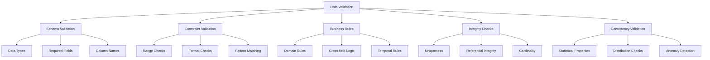

# Data Validation

## Introduction

Data validation is the process of ensuring that data meets predefined quality standards, business rules, and integrity constraints before it enters analysis or production systems. It acts as a gatekeeper, preventing bad data from corrupting downstream processes, models, and decisions.

Validation is fundamentally different from cleaning: while cleaning attempts to fix problematic data, validation identifies and reports issues without modification. This distinction is crucial because it preserves data integrity and provides transparency about data quality problems that may require human review or systematic solutions.

Effective validation involves multiple layers: schema validation (checking data types and structures), constraint validation (ensuring values fall within acceptable ranges), business rule validation (verifying domain-specific logic), and referential integrity validation (maintaining relationships between datasets). Each layer serves a specific purpose in maintaining overall data quality.

The cost of poor data quality compounds over time. Invalid data can lead to incorrect analyses, flawed models, failed automated processes, and ultimately poor business decisions. Implementing robust validation early in your data pipeline is far more effective than trying to fix problems after they've propagated through your systems.



## Comprehensive Data Validator

```python
import pandas as pd
import numpy as np
import re
from typing import Dict, List, Tuple, Any, Callable
from datetime import datetime

class DataValidator:
    """
    Comprehensive data validation framework
    Checks data quality without modifying data
    """

    def __init__(self, df: pd.DataFrame, name: str = "Dataset"):
        self.df = df.copy()
        self.name = name
        self.validation_errors = []
        self.validation_warnings = []
        self.validation_info = []

    def _add_error(self, message: str):
        """Add validation error"""
        self.validation_errors.append(f"ERROR: {message}")

    def _add_warning(self, message: str):
        """Add validation warning"""
        self.validation_warnings.append(f"WARNING: {message}")

    def _add_info(self, message: str):
        """Add validation info"""
        self.validation_info.append(f"INFO: {message}")

    def validate_schema(self, expected_columns: List[str], strict: bool = True):
        """
        Validate that expected columns exist

        Args:
            expected_columns: List of required column names
            strict: If True, no extra columns allowed
        """
        actual_columns = set(self.df.columns)
        expected_columns = set(expected_columns)

        # Check for missing columns
        missing = expected_columns - actual_columns
        if missing:
            self._add_error(f"Missing columns: {sorted(missing)}")

        # Check for extra columns
        if strict:
            extra = actual_columns - expected_columns
            if extra:
                self._add_warning(f"Unexpected columns: {sorted(extra)}")

        return self

    def validate_data_types(self, type_specs: Dict[str, str]):
        """
        Validate column data types

        Args:
            type_specs: Dict mapping column names to expected types
                       Types: 'int', 'float', 'str', 'datetime', 'bool', 'category'
        """
        for column, expected_type in type_specs.items():
            if column not in self.df.columns:
                self._add_error(f"Column '{column}' not found for type validation")
                continue

            actual_type = self.df[column].dtype

            # Map expected types to pandas types
            type_mapping = {
                'int': ['int64', 'int32', 'int16', 'int8'],
                'float': ['float64', 'float32', 'float16'],
                'str': ['object'],
                'datetime': ['datetime64[ns]'],
                'bool': ['bool'],
                'category': ['category']
            }

            expected_dtypes = type_mapping.get(expected_type, [])

            if str(actual_type) not in expected_dtypes:
                self._add_error(
                    f"Column '{column}': expected {expected_type}, "
                    f"got {actual_type}"
                )

        return self

    def validate_ranges(self, range_specs: Dict[str, Tuple[Any, Any]],
                       inclusive: str = 'both'):
        """
        Validate that numeric values fall within acceptable ranges

        Args:
            range_specs: Dict mapping columns to (min, max) tuples
            inclusive: 'both', 'left', 'right', 'neither'
        """
        for column, (min_val, max_val) in range_specs.items():
            if column not in self.df.columns:
                self._add_error(f"Column '{column}' not found for range validation")
                continue

            # Filter out null values for validation
            valid_data = self.df[column].dropna()

            if len(valid_data) == 0:
                self._add_warning(f"Column '{column}': all values are null")
                continue

            # Apply range check based on inclusive parameter
            if inclusive == 'both':
                invalid = (valid_data < min_val) | (valid_data > max_val)
            elif inclusive == 'left':
                invalid = (valid_data < min_val) | (valid_data >= max_val)
            elif inclusive == 'right':
                invalid = (valid_data <= min_val) | (valid_data > max_val)
            else:  # neither
                invalid = (valid_data <= min_val) | (valid_data >= max_val)

            if invalid.any():
                count = invalid.sum()
                pct = (count / len(valid_data)) * 100
                examples = valid_data[invalid].head(3).tolist()

                self._add_error(
                    f"Column '{column}': {count} values ({pct:.1f}%) "
                    f"outside range [{min_val}, {max_val}]. "
                    f"Examples: {examples}"
                )

        return self

    def validate_regex(self, regex_specs: Dict[str, str],
                      case_sensitive: bool = True):
        """
        Validate string patterns using regular expressions

        Args:
            regex_specs: Dict mapping columns to regex patterns
            case_sensitive: Whether matching should be case-sensitive
        """
        for column, pattern in regex_specs.items():
            if column not in self.df.columns:
                self._add_error(f"Column '{column}' not found for regex validation")
                continue

            flags = 0 if case_sensitive else re.IGNORECASE
            valid_data = self.df[column].dropna().astype(str)

            if len(valid_data) == 0:
                self._add_warning(f"Column '{column}': all values are null")
                continue

            # Check pattern matching
            invalid = ~valid_data.str.match(pattern, flags=flags, na=False)

            if invalid.any():
                count = invalid.sum()
                pct = (count / len(valid_data)) * 100
                examples = valid_data[invalid].head(3).tolist()

                self._add_error(
                    f"Column '{column}': {count} values ({pct:.1f}%) "
                    f"don't match pattern '{pattern}'. "
                    f"Examples: {examples}"
                )

        return self

    def validate_uniqueness(self, columns: List[str]):
        """
        Validate that specified columns have unique values

        Args:
            columns: List of columns that should be unique
        """
        for column in columns:
            if column not in self.df.columns:
                self._add_error(f"Column '{column}' not found for uniqueness validation")
                continue

            duplicates = self.df[column].duplicated(keep=False)
            dup_count = duplicates.sum()

            if dup_count > 0:
                unique_dup_values = self.df[column][duplicates].nunique()
                examples = self.df[column][duplicates].unique()[:3].tolist()

                self._add_error(
                    f"Column '{column}': {dup_count} duplicate values "
                    f"({unique_dup_values} unique duplicated values). "
                    f"Examples: {examples}"
                )

        return self

    def validate_completeness(self, required_columns: List[str],
                            max_missing_pct: float = 0.0):
        """
        Validate that required columns have sufficient non-null values

        Args:
            required_columns: Columns that must have values
            max_missing_pct: Maximum allowed percentage of missing values
        """
        for column in required_columns:
            if column not in self.df.columns:
                self._add_error(f"Column '{column}' not found for completeness validation")
                continue

            missing_count = self.df[column].isnull().sum()
            missing_pct = (missing_count / len(self.df)) * 100

            if missing_pct > max_missing_pct:
                self._add_error(
                    f"Column '{column}': {missing_pct:.1f}% missing "
                    f"(threshold: {max_missing_pct:.1f}%)"
                )

        return self

    def validate_custom(self, column: str, validator_func: Callable,
                       error_message: str):
        """
        Apply custom validation function

        Args:
            column: Column to validate
            validator_func: Function that returns True for valid values
            error_message: Error message template
        """
        if column not in self.df.columns:
            self._add_error(f"Column '{column}' not found for custom validation")
            return self

        valid_data = self.df[column].dropna()

        try:
            invalid = ~valid_data.apply(validator_func)

            if invalid.any():
                count = invalid.sum()
                pct = (count / len(valid_data)) * 100
                examples = valid_data[invalid].head(3).tolist()

                self._add_error(
                    f"Column '{column}': {error_message}. "
                    f"{count} invalid values ({pct:.1f}%). "
                    f"Examples: {examples}"
                )
        except Exception as e:
            self._add_error(f"Custom validation failed for '{column}': {str(e)}")

        return self

    def validate_referential_integrity(self, column: str, reference_values: set):
        """
        Validate that all values exist in reference set (foreign key check)

        Args:
            column: Column to check
            reference_values: Set of valid values
        """
        if column not in self.df.columns:
            self._add_error(f"Column '{column}' not found for referential integrity check")
            return self

        valid_data = self.df[column].dropna()
        invalid_values = set(valid_data) - reference_values

        if invalid_values:
            count = valid_data.isin(invalid_values).sum()
            pct = (count / len(valid_data)) * 100
            examples = list(invalid_values)[:5]

            self._add_error(
                f"Column '{column}': {count} values ({pct:.1f}%) "
                f"not in reference set. "
                f"Invalid values: {examples}"
            )

        return self

    def validate_statistical_properties(self, column: str,
                                       expected_mean: float = None,
                                       expected_std: float = None,
                                       tolerance: float = 0.1):
        """
        Validate statistical properties of numeric columns

        Args:
            column: Column to check
            expected_mean: Expected mean value
            expected_std: Expected standard deviation
            tolerance: Allowed deviation (as proportion)
        """
        if column not in self.df.columns:
            self._add_error(f"Column '{column}' not found for statistical validation")
            return self

        valid_data = self.df[column].dropna()

        if len(valid_data) == 0:
            self._add_warning(f"Column '{column}': no valid data for statistics")
            return self

        actual_mean = valid_data.mean()
        actual_std = valid_data.std()

        if expected_mean is not None:
            mean_diff = abs(actual_mean - expected_mean) / expected_mean
            if mean_diff > tolerance:
                self._add_warning(
                    f"Column '{column}': mean {actual_mean:.2f} deviates from "
                    f"expected {expected_mean:.2f} by {mean_diff*100:.1f}%"
                )

        if expected_std is not None:
            std_diff = abs(actual_std - expected_std) / expected_std
            if std_diff > tolerance:
                self._add_warning(
                    f"Column '{column}': std {actual_std:.2f} deviates from "
                    f"expected {expected_std:.2f} by {std_diff*100:.1f}%"
                )

        return self

    def get_report(self, verbose: bool = True) -> str:
        """
        Generate validation report

        Args:
            verbose: Include warnings and info messages
        """
        report = []
        report.append("=" * 60)
        report.append(f"VALIDATION REPORT: {self.name}")
        report.append("=" * 60)
        report.append(f"Dataset shape: {self.df.shape}")
        report.append("")

        # Errors
        if self.validation_errors:
            report.append(f"ERRORS ({len(self.validation_errors)}):")
            report.append("-" * 60)
            for error in self.validation_errors:
                report.append(error)
            report.append("")
        else:
            report.append("✓ No validation errors found")
            report.append("")

        # Warnings
        if verbose and self.validation_warnings:
            report.append(f"WARNINGS ({len(self.validation_warnings)}):")
            report.append("-" * 60)
            for warning in self.validation_warnings:
                report.append(warning)
            report.append("")

        # Info
        if verbose and self.validation_info:
            report.append(f"INFO ({len(self.validation_info)}):")
            report.append("-" * 60)
            for info in self.validation_info:
                report.append(info)
            report.append("")

        # Summary
        report.append("SUMMARY:")
        report.append(f"  Errors: {len(self.validation_errors)}")
        report.append(f"  Warnings: {len(self.validation_warnings)}")
        report.append(f"  Status: {'FAILED' if self.validation_errors else 'PASSED'}")
        report.append("=" * 60)

        return "\n".join(report)

    def is_valid(self) -> bool:
        """Return True if no validation errors"""
        return len(self.validation_errors) == 0

# Example usage with comprehensive validation
np.random.seed(42)

# Create sample data with various quality issues
sample_df = pd.DataFrame({
    'user_id': [1, 2, 3, 3, 5, 6, 7, 8, 9, 10],  # Duplicate at index 3
    'age': [25, 30, 150, -5, 42, 28, 35, 45, 22, 31],  # Invalid: 150, -5
    'email': [
        'alice@example.com',
        'bob@example.com',
        'invalid-email',  # Invalid format
        'carol@example.com',
        'dave@example.com',
        'eve@example.com',
        'frank@example.com',
        'grace@example.com',
        'henry@example.com',
        'iris@example.com'
    ],
    'score': [85, 92, 78, 105, 88, 91, 73, 82, 95, 89],  # Invalid: 105
    'status': ['active', 'active', 'pending', 'active', 'inactive',
               'active', 'pending', 'active', 'active', 'invalid'],  # Invalid: 'invalid'
    'signup_date': pd.to_datetime([
        '2024-01-15', '2024-01-20', '2024-02-01', '2024-02-05',
        '2024-02-10', '2024-02-15', '2024-02-20', '2024-02-25',
        '2024-03-01', '2024-03-05'
    ]),
    'revenue': [100.5, 250.0, 175.3, 320.0, 0, 210.5, 180.0, 295.5, 150.0, 265.0]
})

print("DATA VALIDATION EXAMPLES")
print("="*60)

# Create validator and run comprehensive checks
validator = DataValidator(sample_df, name="User Dataset")

# Schema validation
validator.validate_schema(
    expected_columns=['user_id', 'age', 'email', 'score', 'status', 'signup_date', 'revenue'],
    strict=True
)

# Data type validation
validator.validate_data_types({
    'user_id': 'int',
    'age': 'int',
    'email': 'str',
    'score': 'int',
    'status': 'str',
    'revenue': 'float'
})

# Range validation
validator.validate_ranges({
    'age': (0, 120),
    'score': (0, 100),
    'revenue': (0, 10000)
})

# Format validation using regex
validator.validate_regex({
    'email': r'^[\w\.-]+@[\w\.-]+\.\w+$'
})

# Uniqueness validation
validator.validate_uniqueness(['user_id'])

# Completeness validation
validator.validate_completeness(['user_id', 'email'], max_missing_pct=0.0)

# Referential integrity
valid_statuses = {'active', 'inactive', 'pending'}
validator.validate_referential_integrity('status', valid_statuses)

# Custom validation: age must be adult
validator.validate_custom(
    'age',
    lambda x: x >= 18,
    "Age must be 18 or older"
)

# Statistical properties
validator.validate_statistical_properties(
    'score',
    expected_mean=85.0,
    expected_std=8.0,
    tolerance=0.15
)

# Print comprehensive report
print(validator.get_report(verbose=True))
print(f"\nValidation Status: {'PASSED' if validator.is_valid() else 'FAILED'}")
```

## Advanced Validation Techniques

```python
class AdvancedValidator:
    """Advanced validation methods for complex scenarios"""

    @staticmethod
    def validate_cross_field_logic(df: pd.DataFrame, rules: List[Tuple[str, Callable]]):
        """
        Validate business rules that span multiple columns

        Args:
            df: DataFrame to validate
            rules: List of (rule_name, rule_function) tuples
                   rule_function should return boolean Series
        """
        errors = []

        for rule_name, rule_func in rules:
            try:
                violations = ~rule_func(df)
                violation_count = violations.sum()

                if violation_count > 0:
                    errors.append(
                        f"{rule_name}: {violation_count} violations found"
                    )
            except Exception as e:
                errors.append(f"{rule_name}: Validation failed - {str(e)}")

        return errors

    @staticmethod
    def validate_temporal_consistency(df: pd.DataFrame,
                                     date_columns: List[str],
                                     order: List[str]):
        """
        Validate that dates follow expected order

        Args:
            df: DataFrame to validate
            date_columns: All date columns in the DataFrame
            order: Expected chronological order of columns
        """
        errors = []

        # Ensure all date columns are datetime
        for col in date_columns:
            if col in df.columns and not pd.api.types.is_datetime64_any_dtype(df[col]):
                errors.append(f"Column '{col}' is not datetime type")
                return errors

        # Check temporal order
        for i in range(len(order) - 1):
            col1, col2 = order[i], order[i+1]

            if col1 not in df.columns or col2 not in df.columns:
                continue

            violations = df[col1] > df[col2]
            violations = violations & df[col1].notna() & df[col2].notna()

            if violations.any():
                count = violations.sum()
                errors.append(
                    f"Temporal violation: {count} cases where {col1} > {col2}"
                )

        return errors

    @staticmethod
    def validate_distribution(df: pd.DataFrame, column: str,
                            expected_distribution: str = 'normal',
                            significance_level: float = 0.05):
        """
        Validate that data follows expected distribution

        Args:
            column: Column to test
            expected_distribution: 'normal', 'uniform', etc.
            significance_level: Significance level for statistical test
        """
        from scipy import stats as scipy_stats

        data = df[column].dropna()

        if len(data) < 20:
            return "Insufficient data for distribution test"

        if expected_distribution == 'normal':
            # Shapiro-Wilk test for normality
            statistic, p_value = scipy_stats.shapiro(data)

            if p_value < significance_level:
                return (f"Distribution test FAILED: Data does not appear normal "
                       f"(p-value: {p_value:.4f})")
            else:
                return (f"Distribution test PASSED: Data appears normal "
                       f"(p-value: {p_value:.4f})")

        return "Distribution test not implemented for this distribution type"

# Example: Cross-field validation
transaction_df = pd.DataFrame({
    'order_date': pd.to_datetime(['2024-01-01', '2024-01-05', '2024-01-10']),
    'ship_date': pd.to_datetime(['2024-01-03', '2024-01-04', '2024-01-15']),
    'delivery_date': pd.to_datetime(['2024-01-10', '2024-01-12', '2024-01-20']),
    'order_amount': [100, 250, 150],
    'tax_amount': [10, 25, 15],
    'total_amount': [110, 275, 170]  # One error: 275 should be 275
})

print("\n\nADVANCED VALIDATION EXAMPLES")
print("="*60)

adv_validator = AdvancedValidator()

# Cross-field business rules
rules = [
    ("Total equals order + tax",
     lambda df: np.isclose(df['total_amount'], df['order_amount'] + df['tax_amount'])),
    ("Order amount positive",
     lambda df: df['order_amount'] > 0),
    ("Tax is 10% of order",
     lambda df: np.isclose(df['tax_amount'], df['order_amount'] * 0.10))
]

errors = adv_validator.validate_cross_field_logic(transaction_df, rules)

print("Cross-Field Validation Results:")
if errors:
    for error in errors:
        print(f"  - {error}")
else:
    print("  All business rules passed")

# Temporal consistency
temporal_errors = adv_validator.validate_temporal_consistency(
    transaction_df,
    date_columns=['order_date', 'ship_date', 'delivery_date'],
    order=['order_date', 'ship_date', 'delivery_date']
)

print("\nTemporal Consistency Results:")
if temporal_errors:
    for error in temporal_errors:
        print(f"  - {error}")
else:
    print("  All temporal constraints satisfied")

# Distribution validation
np.random.seed(42)
normal_data = pd.DataFrame({
    'values': np.random.normal(100, 15, 1000)
})

dist_result = adv_validator.validate_distribution(normal_data, 'values', 'normal')
print(f"\nDistribution Validation:")
print(f"  {dist_result}")
```

## Summary

Data validation is critical for maintaining data quality and preventing errors:

**Core Validation Types:**
- **Schema Validation**: Verify structure, columns, and data types
- **Constraint Validation**: Check ranges, formats, and patterns
- **Business Rule Validation**: Enforce domain-specific logic
- **Integrity Validation**: Ensure uniqueness and referential integrity
- **Statistical Validation**: Verify expected distributions and properties

**Advanced Techniques:**
- **Cross-field validation**: Rules spanning multiple columns
- **Temporal consistency**: Date and time sequence validation
- **Distribution testing**: Statistical shape validation
- **Custom validators**: Domain-specific validation logic

**Best Practices:**
- Validate early in the data pipeline
- Separate validation from cleaning
- Provide detailed error messages with examples
- Use severity levels (error vs. warning)
- Log all validation results
- Make validation rules configurable
- Test validators with known good and bad data
- Document validation rules and their business rationale

**Implementation Strategy:**
- Start with schema validation (structure)
- Add constraint validation (basic rules)
- Implement business rule validation (complex logic)
- Include statistical validation (distribution checks)
- Create comprehensive reports
- Integrate with data pipelines
- Monitor validation failure trends

Effective validation catches problems before they impact analysis, models, or business decisions, making it an essential component of any data science workflow.
