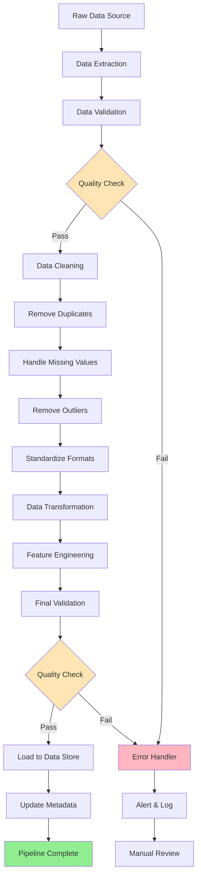

# Data Cleaning Pipelines

## Introduction

Data cleaning pipelines are automated workflows that transform raw, messy data into clean, analysis-ready datasets. Unlike ad-hoc data cleaning approaches that require manual intervention for each dataset, pipelines provide a systematic, reproducible framework for handling data quality issues consistently across projects.

In modern data science workflows, pipelines are essential for several reasons. First, they ensure reproducibility—the same input data will always produce the same output, regardless of when or where the pipeline runs. Second, they enable automation, allowing data cleaning to happen automatically as new data arrives. Third, they facilitate collaboration by providing a clear specification of all transformations applied to the data. Finally, pipelines make it easier to maintain and update data processing logic as requirements evolve.

A well-designed data cleaning pipeline consists of modular steps that can be independently developed, tested, and maintained. Each step performs a specific transformation, and steps can be chained together to create complex workflows. This modularity makes pipelines easier to debug, test, and extend over time.

## Building Modular Data Cleaning Pipelines

### Custom Pipeline Architecture

The foundation of any data cleaning pipeline is a modular architecture that allows individual cleaning operations to be composed into larger workflows:

```python
import pandas as pd
import numpy as np
from datetime import datetime
import logging

# Set up logging
logging.basicConfig(level=logging.INFO,
                   format='%(asctime)s - %(levelname)s - %(message)s')
logger = logging.getLogger(__name__)

class DataCleaningPipeline:
    """
    A modular data cleaning pipeline that chains transformation steps.
    """
    def __init__(self, name="DataPipeline"):
        self.name = name
        self.steps = []
        self.execution_log = []

    def add_step(self, name, func, **kwargs):
        """Add a cleaning step to the pipeline"""
        self.steps.append({
            'name': name,
            'function': func,
            'params': kwargs
        })
        logger.info(f"Added step: {name}")
        return self

    def execute(self, df):
        """Execute all pipeline steps sequentially"""
        result = df.copy()
        start_time = datetime.now()

        logger.info(f"Starting pipeline '{self.name}' with {len(df)} rows")

        for i, step in enumerate(self.steps, 1):
            step_start = datetime.now()
            step_name = step['name']

            try:
                logger.info(f"Step {i}/{len(self.steps)}: {step_name}")

                # Execute the step
                if step['params']:
                    result = step['function'](result, **step['params'])
                else:
                    result = step['function'](result)

                step_duration = (datetime.now() - step_start).total_seconds()

                # Log execution details
                self.execution_log.append({
                    'step': step_name,
                    'duration_seconds': step_duration,
                    'rows_before': len(df) if i == 1 else self.execution_log[-1]['rows_after'],
                    'rows_after': len(result),
                    'status': 'success'
                })

                logger.info(f"Completed: {step_name} ({step_duration:.2f}s) - {len(result)} rows")

            except Exception as e:
                logger.error(f"Error in step '{step_name}': {str(e)}")
                self.execution_log.append({
                    'step': step_name,
                    'status': 'failed',
                    'error': str(e)
                })
                raise

        total_duration = (datetime.now() - start_time).total_seconds()
        logger.info(f"Pipeline completed in {total_duration:.2f}s - {len(result)} rows remaining")

        return result

    def get_execution_summary(self):
        """Get a summary of the pipeline execution"""
        return pd.DataFrame(self.execution_log)

# Define modular cleaning functions
def remove_duplicates(df, subset=None, keep='first'):
    """Remove duplicate rows"""
    initial_count = len(df)
    df_clean = df.drop_duplicates(subset=subset, keep=keep)
    removed = initial_count - len(df_clean)
    logger.info(f"Removed {removed} duplicate rows")
    return df_clean

def handle_missing_values(df, strategy='median', threshold=0.5):
    """
    Handle missing values with different strategies

    Parameters:
    - strategy: 'median', 'mean', 'mode', or 'drop'
    - threshold: Drop columns with more than this fraction missing
    """
    # Drop columns with too many missing values
    missing_pct = df.isnull().sum() / len(df)
    cols_to_drop = missing_pct[missing_pct > threshold].index.tolist()

    if cols_to_drop:
        logger.info(f"Dropping columns with >{threshold*100}% missing: {cols_to_drop}")
        df = df.drop(columns=cols_to_drop)

    # Handle remaining missing values
    if strategy == 'drop':
        df = df.dropna()
    else:
        numeric_cols = df.select_dtypes(include=[np.number]).columns

        for col in numeric_cols:
            if df[col].isnull().any():
                if strategy == 'median':
                    fill_value = df[col].median()
                elif strategy == 'mean':
                    fill_value = df[col].mean()
                elif strategy == 'mode':
                    fill_value = df[col].mode()[0]

                df[col] = df[col].fillna(fill_value)
                logger.info(f"Filled {col} with {strategy}: {fill_value:.2f}")

    return df

def remove_outliers(df, columns=None, method='iqr', threshold=1.5):
    """
    Remove outliers using IQR or z-score method

    Parameters:
    - columns: List of columns to check, or None for all numeric
    - method: 'iqr' or 'zscore'
    - threshold: 1.5 for IQR, 3.0 for z-score typically
    """
    if columns is None:
        columns = df.select_dtypes(include=[np.number]).columns

    mask = pd.Series([True] * len(df), index=df.index)

    for col in columns:
        if method == 'iqr':
            Q1 = df[col].quantile(0.25)
            Q3 = df[col].quantile(0.75)
            IQR = Q3 - Q1
            lower_bound = Q1 - threshold * IQR
            upper_bound = Q3 + threshold * IQR
            col_mask = (df[col] >= lower_bound) & (df[col] <= upper_bound)
        elif method == 'zscore':
            z_scores = np.abs((df[col] - df[col].mean()) / df[col].std())
            col_mask = z_scores <= threshold

        outliers_removed = (~col_mask).sum()
        if outliers_removed > 0:
            logger.info(f"Identified {outliers_removed} outliers in {col}")

        mask = mask & col_mask

    total_removed = (~mask).sum()
    logger.info(f"Removed {total_removed} rows with outliers")

    return df[mask]

def standardize_text(df, columns=None):
    """Standardize text columns (lowercase, strip whitespace)"""
    if columns is None:
        columns = df.select_dtypes(include=['object']).columns

    for col in columns:
        df[col] = df[col].str.strip().str.lower()
        logger.info(f"Standardized text in {col}")

    return df

def convert_data_types(df, type_mapping):
    """
    Convert columns to specified data types

    Parameters:
    - type_mapping: Dict mapping column names to target types
    """
    for col, dtype in type_mapping.items():
        if col in df.columns:
            try:
                df[col] = df[col].astype(dtype)
                logger.info(f"Converted {col} to {dtype}")
            except Exception as e:
                logger.warning(f"Could not convert {col} to {dtype}: {e}")

    return df

# Example usage
sample_data = pd.DataFrame({
    'id': [1, 2, 2, 4, 100, 5, 7, 8, 9, 10],
    'name': ['Alice ', 'BOB', 'BOB', 'Charlie', 'Diana', 'Eve', None, 'Frank', 'Grace', 'Henry'],
    'age': [25, 30, 30, 35, 150, 28, 42, None, 33, 29],
    'salary': [50000, 60000, 60000, 75000, 80000, None, 55000, 70000, 65000, 1000000],
    'join_date': ['2020-01-15', '2019-06-20', '2019-06-20', '2021-03-10',
                  '2022-07-01', '2020-11-05', '2021-09-12', '2023-01-08',
                  '2022-04-17', '2023-02-28']
})

print("ORIGINAL DATA")
print("="*80)
print(sample_data)
print(f"\nShape: {sample_data.shape}")
print(f"Missing values:\n{sample_data.isnull().sum()}")

# Build and execute pipeline
pipeline = DataCleaningPipeline(name="Employee Data Cleaning")
pipeline.add_step("Remove Duplicates", remove_duplicates, subset=['id', 'name'])
pipeline.add_step("Handle Missing Values", handle_missing_values, strategy='median', threshold=0.8)
pipeline.add_step("Remove Outliers", remove_outliers, method='iqr', threshold=1.5)
pipeline.add_step("Standardize Text", standardize_text, columns=['name'])
pipeline.add_step("Convert Types", convert_data_types,
                 type_mapping={'join_date': 'datetime64[ns]'})

cleaned_data = pipeline.execute(sample_data)

print("\n" + "="*80)
print("CLEANED DATA")
print("="*80)
print(cleaned_data)
print(f"\nShape: {cleaned_data.shape}")

print("\n" + "="*80)
print("EXECUTION SUMMARY")
print("="*80)
print(pipeline.get_execution_summary())
```

## Pipeline Orchestration Tools

### Scikit-learn Pipeline Integration

For machine learning workflows, scikit-learn's Pipeline class seamlessly integrates data cleaning with model training:

```python
from sklearn.pipeline import Pipeline
from sklearn.compose import ColumnTransformer
from sklearn.preprocessing import StandardScaler, OneHotEncoder
from sklearn.impute import SimpleImputer
from sklearn.ensemble import RandomForestClassifier
from sklearn.model_selection import train_test_split
from sklearn.metrics import classification_report

# Create sample data with both numeric and categorical features
ml_data = pd.DataFrame({
    'age': [25, 30, None, 35, 28, 42, 33, 29, 31, 27],
    'income': [50000, 60000, 75000, None, 55000, 80000, 65000, 58000, 62000, 51000],
    'education': ['Bachelor', 'Master', 'Bachelor', 'PhD', 'Bachelor',
                  'Master', None, 'Bachelor', 'Master', 'Bachelor'],
    'purchased': [0, 1, 0, 1, 0, 1, 1, 0, 1, 0]
})

# Separate features and target
X = ml_data.drop('purchased', axis=1)
y = ml_data['purchased']

# Define transformers for different column types
numeric_features = ['age', 'income']
categorical_features = ['education']

# Numeric pipeline: impute then scale
numeric_transformer = Pipeline(steps=[
    ('imputer', SimpleImputer(strategy='median')),
    ('scaler', StandardScaler())
])

# Categorical pipeline: impute then encode
categorical_transformer = Pipeline(steps=[
    ('imputer', SimpleImputer(strategy='constant', fill_value='Unknown')),
    ('encoder', OneHotEncoder(drop='first', sparse_output=False))
])

# Combine transformers
preprocessor = ColumnTransformer(
    transformers=[
        ('num', numeric_transformer, numeric_features),
        ('cat', categorical_transformer, categorical_features)
    ])

# Complete ML pipeline
ml_pipeline = Pipeline(steps=[
    ('preprocessor', preprocessor),
    ('classifier', RandomForestClassifier(n_estimators=100, random_state=42))
])

# Split data
X_train, X_test, y_train, y_test = train_test_split(X, y, test_size=0.3, random_state=42)

# Fit pipeline
ml_pipeline.fit(X_train, y_train)

# Predict
y_pred = ml_pipeline.predict(X_test)

print("SCIKIT-LEARN PIPELINE RESULTS")
print("="*80)
print(classification_report(y_test, y_pred, zero_division=0))
```

### Modern Orchestration Concepts

While full implementation of tools like Prefect or Airflow is beyond this scope, understanding their concepts is crucial:

```python
from datetime import timedelta
from typing import Dict, Any

class PipelineTask:
    """Represents a single task in an orchestrated pipeline"""
    def __init__(self, name: str, function, retry_count: int = 3,
                 timeout: int = 300):
        self.name = name
        self.function = function
        self.retry_count = retry_count
        self.timeout = timeout
        self.dependencies = []

    def add_dependency(self, task):
        """Add a task that must complete before this one"""
        self.dependencies.append(task)
        return self

    def execute(self, context: Dict[str, Any]):
        """Execute the task with retry logic"""
        for attempt in range(self.retry_count):
            try:
                logger.info(f"Executing {self.name} (attempt {attempt + 1})")
                result = self.function(context)
                logger.info(f"Task {self.name} completed successfully")
                return result
            except Exception as e:
                logger.warning(f"Task {self.name} failed: {e}")
                if attempt == self.retry_count - 1:
                    logger.error(f"Task {self.name} failed after {self.retry_count} attempts")
                    raise

class DataPipelineOrchestrator:
    """Orchestrates pipeline execution with dependency management"""
    def __init__(self, name: str):
        self.name = name
        self.tasks = []

    def add_task(self, task: PipelineTask):
        """Add a task to the pipeline"""
        self.tasks.append(task)
        return self

    def execute(self):
        """Execute all tasks in dependency order"""
        context = {}
        executed = set()

        def can_execute(task):
            return all(dep.name in executed for dep in task.dependencies)

        while len(executed) < len(self.tasks):
            executed_this_round = False

            for task in self.tasks:
                if task.name not in executed and can_execute(task):
                    result = task.execute(context)
                    context[task.name] = result
                    executed.add(task.name)
                    executed_this_round = True

            if not executed_this_round:
                raise RuntimeError("Circular dependency or execution failure detected")

        return context

# Example: Building a DAG-based pipeline
def extract_data(context):
    """Extract data from source"""
    logger.info("Extracting data from source...")
    data = pd.DataFrame({
        'id': range(1, 101),
        'value': np.random.randn(100),
        'category': np.random.choice(['A', 'B', 'C'], 100)
    })
    return data

def clean_data(context):
    """Clean extracted data"""
    logger.info("Cleaning data...")
    data = context['extract']
    # Remove outliers
    cleaned = data[np.abs(data['value']) < 3]
    return cleaned

def transform_data(context):
    """Transform cleaned data"""
    logger.info("Transforming data...")
    data = context['clean']
    # Add computed columns
    data['value_squared'] = data['value'] ** 2
    return data

def validate_data(context):
    """Validate transformed data"""
    logger.info("Validating data...")
    data = context['transform']

    # Quality checks
    assert len(data) > 0, "No data remaining after cleaning"
    assert not data.isnull().any().any(), "Null values found"
    assert data['value_squared'].min() >= 0, "Negative squared values found"

    return True

# Create tasks
extract_task = PipelineTask("extract", extract_data)
clean_task = PipelineTask("clean", clean_data).add_dependency(extract_task)
transform_task = PipelineTask("transform", transform_data).add_dependency(clean_task)
validate_task = PipelineTask("validate", validate_data).add_dependency(transform_task)

# Create orchestrator and add tasks
orchestrator = DataPipelineOrchestrator("ETL Pipeline")
orchestrator.add_task(extract_task)
orchestrator.add_task(clean_task)
orchestrator.add_task(transform_task)
orchestrator.add_task(validate_task)

# Execute pipeline
print("\nORCHESTRATED PIPELINE EXECUTION")
print("="*80)
results = orchestrator.execute()
print(f"\nFinal transformed data shape: {results['transform'].shape}")
print(results['transform'].head())
```

## Pipeline Architecture Diagram



## Error Handling and Logging

Robust pipelines must handle errors gracefully and provide comprehensive logging:

```python
import traceback
from enum import Enum

class ErrorSeverity(Enum):
    WARNING = "warning"
    ERROR = "error"
    CRITICAL = "critical"

class PipelineError(Exception):
    """Custom exception for pipeline errors"""
    def __init__(self, message, severity=ErrorSeverity.ERROR, step_name=None):
        self.message = message
        self.severity = severity
        self.step_name = step_name
        super().__init__(self.message)

class RobustPipeline:
    """Pipeline with comprehensive error handling and logging"""
    def __init__(self, name, fail_fast=False):
        self.name = name
        self.fail_fast = fail_fast
        self.steps = []
        self.errors = []
        self.warnings = []

    def add_step(self, name, func, critical=True, **kwargs):
        """
        Add a step to the pipeline

        Parameters:
        - critical: If True, pipeline fails when step fails
        """
        self.steps.append({
            'name': name,
            'function': func,
            'critical': critical,
            'params': kwargs
        })
        return self

    def execute(self, df):
        """Execute pipeline with error handling"""
        result = df.copy()

        for step in self.steps:
            step_name = step['name']

            try:
                logger.info(f"Executing: {step_name}")

                if step['params']:
                    result = step['function'](result, **step['params'])
                else:
                    result = step['function'](result)

            except Exception as e:
                error_msg = f"Error in {step_name}: {str(e)}"
                logger.error(error_msg)
                logger.debug(traceback.format_exc())

                if step['critical']:
                    self.errors.append({
                        'step': step_name,
                        'error': str(e),
                        'traceback': traceback.format_exc()
                    })

                    if self.fail_fast:
                        raise PipelineError(error_msg,
                                          ErrorSeverity.CRITICAL,
                                          step_name)
                else:
                    self.warnings.append({
                        'step': step_name,
                        'warning': str(e)
                    })
                    logger.warning(f"Non-critical step {step_name} failed, continuing...")

        # Final error check
        if self.errors:
            logger.error(f"Pipeline completed with {len(self.errors)} errors")
            if self.fail_fast:
                raise PipelineError(f"Pipeline failed with {len(self.errors)} errors",
                                  ErrorSeverity.CRITICAL)

        return result

    def get_error_report(self):
        """Generate error report"""
        return {
            'errors': self.errors,
            'warnings': self.warnings,
            'error_count': len(self.errors),
            'warning_count': len(self.warnings)
        }

# Example with intentional errors
def risky_operation(df):
    """Operation that might fail"""
    # This will fail if column doesn't exist
    df['result'] = df['nonexistent_column'] * 2
    return df

def safe_operation(df):
    """Operation that should succeed"""
    df['safe_column'] = 1
    return df

error_data = pd.DataFrame({'value': [1, 2, 3]})

robust_pipeline = RobustPipeline("Test Pipeline", fail_fast=False)
robust_pipeline.add_step("Safe Step", safe_operation, critical=False)
robust_pipeline.add_step("Risky Step", risky_operation, critical=False)
robust_pipeline.add_step("Another Safe Step", safe_operation, critical=True)

print("\nROBUST PIPELINE WITH ERROR HANDLING")
print("="*80)
result = robust_pipeline.execute(error_data)

print("\nError Report:")
print(robust_pipeline.get_error_report())
```

## Testing Data Pipelines

Comprehensive testing ensures pipeline reliability:

```python
import unittest

class TestDataCleaningPipeline(unittest.TestCase):
    """Unit tests for data cleaning pipeline"""

    def setUp(self):
        """Set up test data"""
        self.test_data = pd.DataFrame({
            'id': [1, 2, 2, 4, 5],
            'value': [10, 20, 20, None, 50],
            'category': ['A', 'B', 'B', 'C', 'A']
        })

    def test_remove_duplicates(self):
        """Test duplicate removal"""
        result = remove_duplicates(self.test_data)
        self.assertEqual(len(result), 4, "Should remove 1 duplicate")
        self.assertFalse(result.duplicated().any(), "No duplicates should remain")

    def test_handle_missing_median(self):
        """Test missing value imputation with median"""
        result = handle_missing_values(self.test_data, strategy='median')
        self.assertFalse(result['value'].isnull().any(), "No nulls should remain")
        self.assertEqual(result['value'].iloc[3], 20.0, "Should fill with median")

    def test_pipeline_integration(self):
        """Test full pipeline execution"""
        pipeline = DataCleaningPipeline("Test")
        pipeline.add_step("Remove Duplicates", remove_duplicates)
        pipeline.add_step("Handle Missing", handle_missing_values, strategy='median')

        result = pipeline.execute(self.test_data)

        # Assertions
        self.assertLessEqual(len(result), len(self.test_data))
        self.assertFalse(result.isnull().any().any())
        self.assertEqual(len(pipeline.execution_log), 2)

    def test_pipeline_preserves_columns(self):
        """Test that pipeline preserves required columns"""
        pipeline = DataCleaningPipeline("Test")
        pipeline.add_step("Remove Duplicates", remove_duplicates)

        result = pipeline.execute(self.test_data)

        self.assertSetEqual(set(result.columns), set(self.test_data.columns))

# Run tests
print("\nRUNNING PIPELINE TESTS")
print("="*80)
suite = unittest.TestLoader().loadTestsFromTestCase(TestDataCleaningPipeline)
runner = unittest.TextTestRunner(verbosity=2)
runner.run(suite)
```

## Pipeline Monitoring and Data Quality Checks

Continuous monitoring ensures ongoing data quality:

```python
class DataQualityMonitor:
    """Monitor data quality throughout pipeline execution"""

    def __init__(self):
        self.checks = []
        self.results = []

    def add_check(self, name, check_func, severity=ErrorSeverity.WARNING):
        """Add a quality check"""
        self.checks.append({
            'name': name,
            'function': check_func,
            'severity': severity
        })

    def run_checks(self, df):
        """Run all quality checks"""
        self.results = []

        for check in self.checks:
            try:
                result = check['function'](df)
                self.results.append({
                    'check': check['name'],
                    'passed': result,
                    'severity': check['severity'].value
                })

                if not result:
                    logger.warning(f"Quality check failed: {check['name']}")

            except Exception as e:
                logger.error(f"Quality check error in {check['name']}: {e}")
                self.results.append({
                    'check': check['name'],
                    'passed': False,
                    'error': str(e),
                    'severity': check['severity'].value
                })

        return self.get_summary()

    def get_summary(self):
        """Get summary of check results"""
        total = len(self.results)
        passed = sum(1 for r in self.results if r['passed'])

        return {
            'total_checks': total,
            'passed': passed,
            'failed': total - passed,
            'pass_rate': passed / total if total > 0 else 0,
            'details': self.results
        }

# Define quality check functions
def check_no_nulls(df):
    """Check for null values"""
    return not df.isnull().any().any()

def check_positive_values(df):
    """Check that numeric values are positive"""
    numeric_cols = df.select_dtypes(include=[np.number]).columns
    return (df[numeric_cols] >= 0).all().all()

def check_row_count(df, min_rows=10):
    """Check minimum row count"""
    return len(df) >= min_rows

def check_unique_ids(df, id_col='id'):
    """Check that IDs are unique"""
    if id_col in df.columns:
        return not df[id_col].duplicated().any()
    return True

# Create monitor and add checks
monitor = DataQualityMonitor()
monitor.add_check("No Null Values", check_no_nulls, ErrorSeverity.ERROR)
monitor.add_check("Positive Values", check_positive_values, ErrorSeverity.WARNING)
monitor.add_check("Minimum Rows", lambda df: check_row_count(df, 5), ErrorSeverity.CRITICAL)
monitor.add_check("Unique IDs", check_unique_ids, ErrorSeverity.ERROR)

# Test with sample data
test_data = pd.DataFrame({
    'id': [1, 2, 3, 4, 5],
    'value': [10, 20, 30, 40, 50],
    'amount': [100, 200, 300, 400, 500]
})

print("\nDATA QUALITY MONITORING")
print("="*80)
quality_summary = monitor.run_checks(test_data)
print(f"Pass Rate: {quality_summary['pass_rate']*100:.1f}%")
print(f"Passed: {quality_summary['passed']}/{quality_summary['total_checks']}")
print("\nCheck Details:")
for detail in quality_summary['details']:
    status = "PASS" if detail['passed'] else "FAIL"
    print(f"  [{status}] {detail['check']} ({detail['severity']})")
```

## Reproducibility and Version Control

Ensuring pipelines produce consistent results:

```python
import hashlib
import json
from datetime import datetime

class VersionedPipeline:
    """Pipeline with versioning and reproducibility features"""

    def __init__(self, name, version="1.0.0"):
        self.name = name
        self.version = version
        self.steps = []
        self.config = {}
        self.execution_history = []

    def set_config(self, config):
        """Set pipeline configuration"""
        self.config = config
        return self

    def add_step(self, name, func, **kwargs):
        """Add versioned step"""
        self.steps.append({
            'name': name,
            'function': func.__name__,
            'params': kwargs
        })
        return self

    def get_pipeline_hash(self):
        """Generate hash of pipeline configuration"""
        pipeline_def = {
            'name': self.name,
            'version': self.version,
            'steps': [(s['name'], s['function'], s['params']) for s in self.steps],
            'config': self.config
        }

        pipeline_str = json.dumps(pipeline_def, sort_keys=True)
        return hashlib.md5(pipeline_str.encode()).hexdigest()

    def get_data_hash(self, df):
        """Generate hash of input data"""
        return hashlib.md5(pd.util.hash_pandas_object(df).values).hexdigest()

    def save_metadata(self, input_df, output_df):
        """Save execution metadata"""
        metadata = {
            'timestamp': datetime.now().isoformat(),
            'pipeline_name': self.name,
            'pipeline_version': self.version,
            'pipeline_hash': self.get_pipeline_hash(),
            'input_hash': self.get_data_hash(input_df),
            'output_hash': self.get_data_hash(output_df),
            'input_shape': input_df.shape,
            'output_shape': output_df.shape,
            'config': self.config
        }

        self.execution_history.append(metadata)
        return metadata

# Example usage
versioned_pipeline = VersionedPipeline("Customer Data Pipeline", version="2.1.0")
versioned_pipeline.set_config({
    'missing_threshold': 0.5,
    'outlier_method': 'iqr',
    'encoding': 'utf-8'
})

sample_versioned_data = pd.DataFrame({
    'customer_id': [1, 2, 3, 4, 5],
    'revenue': [1000, 2000, 1500, 3000, 2500]
})

print("\nPIPELINE VERSIONING")
print("="*80)
print(f"Pipeline: {versioned_pipeline.name} v{versioned_pipeline.version}")
print(f"Pipeline Hash: {versioned_pipeline.get_pipeline_hash()}")
print(f"Configuration: {versioned_pipeline.config}")

# Save metadata
output_data = sample_versioned_data.copy()
metadata = versioned_pipeline.save_metadata(sample_versioned_data, output_data)
print(f"\nExecution Metadata:")
print(json.dumps(metadata, indent=2, default=str))
```

## Best Practices

1. **Design for modularity** - Create small, single-purpose functions that can be composed
2. **Implement comprehensive logging** - Track every transformation for debugging and auditing
3. **Add retry logic** - Handle transient failures gracefully with exponential backoff
4. **Validate at each stage** - Implement quality checks between pipeline steps
5. **Make pipelines idempotent** - Ensure running the same pipeline multiple times produces the same result
6. **Version your pipelines** - Track changes to pipeline logic over time
7. **Test thoroughly** - Write unit tests for individual steps and integration tests for complete pipelines
8. **Monitor in production** - Track execution time, failure rates, and data quality metrics
9. **Document dependencies** - Clearly specify what each step requires and produces
10. **Plan for rollback** - Design pipelines to be reversible when issues occur

## Key Takeaways

Data cleaning pipelines are essential infrastructure for modern data science workflows. Well-designed pipelines provide automation, reproducibility, and reliability that manual cleaning processes cannot match.

**Core Concepts:**
- Pipelines chain modular transformation steps into automated workflows
- Each step should be independently testable and reusable
- Error handling and logging are critical for production deployments
- Quality monitoring ensures data meets requirements throughout processing

**Technical Implementation:**
- Custom pipeline classes provide flexibility and control
- Scikit-learn pipelines integrate cleaning with machine learning
- Orchestration tools manage complex dependencies and scheduling
- Versioning ensures reproducibility across pipeline executions

**Production Considerations:**
- Comprehensive testing prevents data quality issues
- Monitoring and alerting catch problems early
- Documentation and version control enable team collaboration
- Graceful error handling prevents cascade failures

Building robust data cleaning pipelines requires upfront investment but pays dividends through increased reliability, reduced manual effort, and improved data quality. As data volumes and complexity grow, automated pipelines become not just beneficial but essential for maintaining consistent data quality standards.
