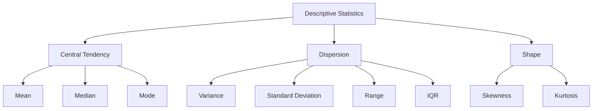

# Descriptive Statistics

## Introduction

Descriptive statistics are the foundation of exploratory data analysis, providing quantitative measures that summarize and describe the main characteristics of a dataset. Unlike inferential statistics that make predictions about populations, descriptive statistics focus on organizing, displaying, and describing data at hand. Understanding these fundamental measures is essential for any data scientist, as they form the first step in understanding data distributions, identifying patterns, and detecting anomalies.

Every dataset tells a story through its central tendency (where values cluster), dispersion (how spread out values are), and shape (the pattern of distribution). These three categories of descriptive statistics work together to create a comprehensive picture of your data. Whether you're analyzing customer demographics, financial metrics, or scientific measurements, mastering descriptive statistics enables you to quickly grasp data characteristics and communicate findings effectively.



## Measures of Central Tendency

Central tendency describes the center or typical value in a dataset. The three primary measures each have specific use cases and respond differently to outliers and data distributions.

```python
import pandas as pd
import numpy as np
import matplotlib.pyplot as plt
import seaborn as sns
from scipy import stats

# Create sample datasets
np.random.seed(42)

# Normal distribution
normal_data = np.random.normal(100, 15, 1000)

# Skewed distribution
skewed_data = np.random.exponential(scale=50, size=1000)

# Dataset with outliers
outlier_data = np.concatenate([
    np.random.normal(100, 15, 950),
    np.array([300, 320, 280, 290, 310] * 10)  # Outliers
])

class CentralTendencyAnalyzer:
    """Analyze measures of central tendency"""

    def __init__(self, data, name="Dataset"):
        self.data = pd.Series(data)
        self.name = name

    def calculate_all(self):
        """Calculate all central tendency measures"""
        results = {
            'mean': self.data.mean(),
            'median': self.data.median(),
            'mode': self.data.mode().iloc[0] if len(self.data.mode()) > 0 else None,
            'trimmed_mean_10': stats.trim_mean(self.data, 0.1),
            'geometric_mean': stats.gmean(self.data[self.data > 0]) if (self.data > 0).all() else None
        }

        return results

    def compare_measures(self):
        """Compare and interpret different measures"""
        results = self.calculate_all()

        print(f"\n{self.name} - Central Tendency Analysis:")
        print("="*60)
        print(f"Mean:           {results['mean']:.2f}")
        print(f"Median:         {results['median']:.2f}")
        print(f"Mode:           {results['mode']:.2f}" if results['mode'] is not None else "Mode:           N/A")
        print(f"Trimmed Mean:   {results['trimmed_mean_10']:.2f}")

        # Interpret the relationship
        mean_median_diff = results['mean'] - results['median']

        print("\nInterpretation:")
        if abs(mean_median_diff) < 1:
            print("  Distribution appears symmetric (mean ≈ median)")
        elif mean_median_diff > 0:
            print(f"  Right-skewed distribution (mean > median by {mean_median_diff:.2f})")
        else:
            print(f"  Left-skewed distribution (mean < median by {abs(mean_median_diff):.2f})")

        return results

# Analyze different distributions
print("CENTRAL TENDENCY ANALYSIS")
print("="*60)

normal_analyzer = CentralTendencyAnalyzer(normal_data, "Normal Distribution")
normal_results = normal_analyzer.compare_measures()

skewed_analyzer = CentralTendencyAnalyzer(skewed_data, "Skewed Distribution")
skewed_results = skewed_analyzer.compare_measures()

outlier_analyzer = CentralTendencyAnalyzer(outlier_data, "Data with Outliers")
outlier_results = outlier_analyzer.compare_measures()
```

## Measures of Dispersion

Dispersion measures describe the spread or variability in data. Understanding dispersion is crucial because datasets with the same mean can have vastly different distributions.

```python
class DispersionAnalyzer:
    """Analyze measures of dispersion"""

    def __init__(self, data, name="Dataset"):
        self.data = pd.Series(data)
        self.name = name

    def calculate_all(self):
        """Calculate all dispersion measures"""
        results = {
            'range': self.data.max() - self.data.min(),
            'variance': self.data.var(),
            'std_dev': self.data.std(),
            'iqr': self.data.quantile(0.75) - self.data.quantile(0.25),
            'mad': stats.median_abs_deviation(self.data),
            'coefficient_of_variation': (self.data.std() / self.data.mean()) * 100,
            'quartiles': {
                'Q1': self.data.quantile(0.25),
                'Q2': self.data.quantile(0.50),
                'Q3': self.data.quantile(0.75)
            }
        }

        return results

    def identify_outliers(self, method='iqr'):
        """Identify outliers using IQR method"""
        if method == 'iqr':
            Q1 = self.data.quantile(0.25)
            Q3 = self.data.quantile(0.75)
            IQR = Q3 - Q1

            lower_bound = Q1 - 1.5 * IQR
            upper_bound = Q3 + 1.5 * IQR

            outliers = self.data[(self.data < lower_bound) | (self.data > upper_bound)]

        elif method == 'zscore':
            z_scores = np.abs(stats.zscore(self.data))
            outliers = self.data[z_scores > 3]

        return outliers, lower_bound if method == 'iqr' else None, upper_bound if method == 'iqr' else None

    def display_summary(self):
        """Display comprehensive dispersion summary"""
        results = self.calculate_all()

        print(f"\n{self.name} - Dispersion Analysis:")
        print("="*60)
        print(f"Range:                  {results['range']:.2f}")
        print(f"Variance:               {results['variance']:.2f}")
        print(f"Standard Deviation:     {results['std_dev']:.2f}")
        print(f"IQR:                    {results['iqr']:.2f}")
        print(f"MAD:                    {results['mad']:.2f}")
        print(f"Coeff. of Variation:    {results['coefficient_of_variation']:.2f}%")

        print(f"\nQuartiles:")
        print(f"  Q1 (25th percentile): {results['quartiles']['Q1']:.2f}")
        print(f"  Q2 (50th percentile): {results['quartiles']['Q2']:.2f}")
        print(f"  Q3 (75th percentile): {results['quartiles']['Q3']:.2f}")

        # Identify outliers
        outliers, lower, upper = self.identify_outliers()
        print(f"\nOutliers (IQR method):")
        print(f"  Count: {len(outliers)}")
        print(f"  Bounds: [{lower:.2f}, {upper:.2f}]")

        return results

# Analyze dispersion
print("\n\nDISPERSION ANALYSIS")
print("="*60)

normal_disp = DispersionAnalyzer(normal_data, "Normal Distribution")
normal_disp_results = normal_disp.display_summary()

skewed_disp = DispersionAnalyzer(skewed_data, "Skewed Distribution")
skewed_disp_results = skewed_disp.display_summary()
```

## Measures of Shape

Shape measures describe the form of the distribution, particularly its symmetry and tail behavior.

```python
class ShapeAnalyzer:
    """Analyze distribution shape"""

    def __init__(self, data, name="Dataset"):
        self.data = pd.Series(data)
        self.name = name

    def calculate_shape_metrics(self):
        """Calculate skewness and kurtosis"""
        results = {
            'skewness': self.data.skew(),
            'kurtosis': self.data.kurtosis(),
            'excess_kurtosis': self.data.kurtosis()  # pandas uses excess kurtosis by default
        }

        return results

    def interpret_shape(self):
        """Interpret shape characteristics"""
        metrics = self.calculate_shape_metrics()

        print(f"\n{self.name} - Shape Analysis:")
        print("="*60)
        print(f"Skewness:        {metrics['skewness']:.4f}")
        print(f"Kurtosis:        {metrics['kurtosis']:.4f}")

        # Interpret skewness
        print("\nSkewness Interpretation:")
        if abs(metrics['skewness']) < 0.5:
            print("  Approximately symmetric distribution")
        elif metrics['skewness'] > 0:
            print(f"  Right-skewed (positive skew: {metrics['skewness']:.2f})")
            print("  Tail extends to the right; mean > median")
        else:
            print(f"  Left-skewed (negative skew: {metrics['skewness']:.2f})")
            print("  Tail extends to the left; mean < median")

        # Interpret kurtosis
        print("\nKurtosis Interpretation:")
        if abs(metrics['kurtosis']) < 0.5:
            print("  Mesokurtic (similar to normal distribution)")
        elif metrics['kurtosis'] > 0:
            print(f"  Leptokurtic (excess kurtosis: {metrics['kurtosis']:.2f})")
            print("  Heavy tails; more outliers than normal distribution")
        else:
            print(f"  Platykurtic (excess kurtosis: {metrics['kurtosis']:.2f})")
            print("  Light tails; fewer outliers than normal distribution")

        return metrics

# Analyze shape
print("\n\nSHAPE ANALYSIS")
print("="*60)

normal_shape = ShapeAnalyzer(normal_data, "Normal Distribution")
normal_shape_results = normal_shape.interpret_shape()

skewed_shape = ShapeAnalyzer(skewed_data, "Skewed Distribution")
skewed_shape_results = skewed_shape.interpret_shape()
```

## Comprehensive Statistical Summary

```python
class ComprehensiveStatistics:
    """Complete statistical analysis"""

    def __init__(self, df):
        self.df = df

    def generate_report(self):
        """Generate comprehensive statistical report"""
        print("\nCOMPREHENSIVE STATISTICAL SUMMARY")
        print("="*60)

        for column in self.df.select_dtypes(include=[np.number]).columns:
            print(f"\n{column}:")
            print("-"*60)

            data = self.df[column].dropna()

            # Central tendency
            print(f"  Mean:                {data.mean():.2f}")
            print(f"  Median:              {data.median():.2f}")
            print(f"  Mode:                {data.mode()[0]:.2f}" if len(data.mode()) > 0 else "  Mode:                N/A")

            # Dispersion
            print(f"  Std Dev:             {data.std():.2f}")
            print(f"  Variance:            {data.var():.2f}")
            print(f"  Range:               {data.max() - data.min():.2f}")
            print(f"  IQR:                 {data.quantile(0.75) - data.quantile(0.25):.2f}")

            # Shape
            print(f"  Skewness:            {data.skew():.4f}")
            print(f"  Kurtosis:            {data.kurtosis():.4f}")

            # Percentiles
            print(f"  Min:                 {data.min():.2f}")
            print(f"  25th percentile:     {data.quantile(0.25):.2f}")
            print(f"  50th percentile:     {data.quantile(0.50):.2f}")
            print(f"  75th percentile:     {data.quantile(0.75):.2f}")
            print(f"  Max:                 {data.max():.2f}")

# Create sample dataframe
sample_df = pd.DataFrame({
    'Age': np.random.normal(35, 10, 1000),
    'Income': np.random.exponential(50000, 1000),
    'Score': np.random.uniform(0, 100, 1000)
})

stats_analyzer = ComprehensiveStatistics(sample_df)
stats_analyzer.generate_report()

# Compare with pandas describe()
print("\n\nPandas describe() Output:")
print("="*60)
print(sample_df.describe())
```

## Summary

Descriptive statistics provide essential tools for understanding data:

**Central Tendency:**
- **Mean**: Average value, sensitive to outliers
- **Median**: Middle value, robust to outliers
- **Mode**: Most frequent value, useful for categorical data

**Dispersion:**
- **Variance/Std Dev**: Average squared deviation from mean
- **Range**: Difference between max and min
- **IQR**: Range of middle 50% of data, robust to outliers
- **Coefficient of Variation**: Relative variability as percentage

**Shape:**
- **Skewness**: Measures asymmetry of distribution
- **Kurtosis**: Measures tail heaviness and peakedness

**Best Practices:**
- Use median for skewed distributions or data with outliers
- Report both mean and median for comprehensive understanding
- Use IQR instead of standard deviation for non-normal data
- Always visualize distributions alongside descriptive statistics
- Consider robust statistics for real-world data with outliers
- Calculate descriptive statistics separately for different groups
