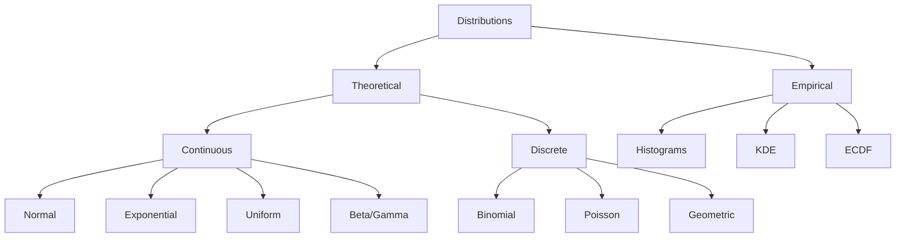

# Data Distributions

## Introduction

Understanding data distributions is fundamental to exploratory data analysis and statistical modeling. A distribution describes how values in a dataset are spread across the possible range, revealing patterns, tendencies, and characteristics that inform analytical decisions. Recognizing distribution types helps data scientists select appropriate statistical methods, identify transformations needed for modeling, and understand the underlying processes that generated the data.

Distributions can be theoretical (mathematical models like normal or exponential) or empirical (observed from actual data). The shape, center, and spread of distributions tell us about the nature of our data: whether values cluster around a central point, whether extreme values are common, and whether the data is symmetric or skewed. This knowledge is crucial for feature engineering, hypothesis testing, and model selection in machine learning pipelines.



## Common Probability Distributions

```python
import pandas as pd
import numpy as np
import matplotlib.pyplot as plt
import seaborn as sns
from scipy import stats
from scipy.stats import (
    norm, uniform, expon, beta, gamma,
    binom, poisson, geom
)

class DistributionGenerator:
    """Generate and analyze various probability distributions"""

    def __init__(self, size=1000, seed=42):
        self.size = size
        np.random.seed(seed)

    def generate_normal(self, mu=0, sigma=1):
        """Generate normal (Gaussian) distribution"""
        return np.random.normal(mu, sigma, self.size)

    def generate_uniform(self, low=0, high=1):
        """Generate uniform distribution"""
        return np.random.uniform(low, high, self.size)

    def generate_exponential(self, scale=1):
        """Generate exponential distribution"""
        return np.random.exponential(scale, self.size)

    def generate_lognormal(self, mu=0, sigma=1):
        """Generate log-normal distribution"""
        return np.random.lognormal(mu, sigma, self.size)

    def generate_beta(self, alpha=2, beta_param=5):
        """Generate beta distribution"""
        return np.random.beta(alpha, beta_param, self.size)

    def generate_gamma(self, shape=2, scale=2):
        """Generate gamma distribution"""
        return np.random.gamma(shape, scale, self.size)

    def generate_binomial(self, n=10, p=0.5):
        """Generate binomial distribution"""
        return np.random.binomial(n, p, self.size)

    def generate_poisson(self, lam=5):
        """Generate Poisson distribution"""
        return np.random.poisson(lam, self.size)

# Generate sample distributions
gen = DistributionGenerator(size=1000)

print("COMMON PROBABILITY DISTRIBUTIONS")
print("="*60)

# Continuous distributions
normal_data = gen.generate_normal(mu=100, sigma=15)
uniform_data = gen.generate_uniform(low=0, high=100)
exponential_data = gen.generate_exponential(scale=50)
lognormal_data = gen.generate_lognormal(mu=4, sigma=0.5)

print("\nContinuous Distributions:")
print("-"*60)
print(f"Normal:       Mean={normal_data.mean():.2f}, Std={normal_data.std():.2f}")
print(f"Uniform:      Mean={uniform_data.mean():.2f}, Std={uniform_data.std():.2f}")
print(f"Exponential:  Mean={exponential_data.mean():.2f}, Std={exponential_data.std():.2f}")
print(f"Log-Normal:   Mean={lognormal_data.mean():.2f}, Std={lognormal_data.std():.2f}")

# Discrete distributions
binomial_data = gen.generate_binomial(n=20, p=0.6)
poisson_data = gen.generate_poisson(lam=5)

print("\nDiscrete Distributions:")
print("-"*60)
print(f"Binomial:     Mean={binomial_data.mean():.2f}, Std={binomial_data.std():.2f}")
print(f"Poisson:      Mean={poisson_data.mean():.2f}, Std={poisson_data.std():.2f}")
```

## Testing for Normality

Normality testing is crucial because many statistical methods assume normally distributed data. Multiple tests exist, each with strengths and weaknesses.

```python
class NormalityTester:
    """Test if data follows a normal distribution"""

    def __init__(self, data, name="Dataset"):
        self.data = np.array(data)
        self.name = name

    def shapiro_wilk_test(self):
        """
        Shapiro-Wilk test for normality
        Best for small to medium samples (n < 5000)
        """
        statistic, p_value = stats.shapiro(self.data)

        return {
            'test': 'Shapiro-Wilk',
            'statistic': statistic,
            'p_value': p_value,
            'is_normal': p_value > 0.05
        }

    def kolmogorov_smirnov_test(self):
        """
        Kolmogorov-Smirnov test for normality
        Compares empirical distribution to theoretical normal
        """
        # Standardize data
        standardized = (self.data - self.data.mean()) / self.data.std()

        statistic, p_value = stats.kstest(standardized, 'norm')

        return {
            'test': 'Kolmogorov-Smirnov',
            'statistic': statistic,
            'p_value': p_value,
            'is_normal': p_value > 0.05
        }

    def anderson_darling_test(self):
        """
        Anderson-Darling test for normality
        More sensitive to tails than KS test
        """
        result = stats.anderson(self.data, dist='norm')

        # Use 5% significance level (index 2)
        critical_value = result.critical_values[2]
        is_normal = result.statistic < critical_value

        return {
            'test': 'Anderson-Darling',
            'statistic': result.statistic,
            'critical_value_5%': critical_value,
            'is_normal': is_normal
        }

    def dagostino_pearson_test(self):
        """
        D'Agostino-Pearson test for normality
        Combines skewness and kurtosis
        """
        statistic, p_value = stats.normaltest(self.data)

        return {
            'test': "D'Agostino-Pearson",
            'statistic': statistic,
            'p_value': p_value,
            'is_normal': p_value > 0.05
        }

    def qq_plot_analysis(self):
        """
        Quantile-Quantile plot analysis
        Visual assessment of normality
        """
        # Calculate theoretical quantiles
        (osm, osr), (slope, intercept, r) = stats.probplot(self.data, dist="norm")

        # R-squared indicates fit quality
        r_squared = r ** 2

        return {
            'test': 'Q-Q Plot',
            'r_squared': r_squared,
            'is_normal': r_squared > 0.95  # High R² indicates good fit
        }

    def comprehensive_test(self):
        """Run all normality tests"""
        print(f"\n{self.name} - Normality Tests:")
        print("="*60)

        # Visual characteristics
        print(f"Skewness:  {stats.skew(self.data):.4f}")
        print(f"Kurtosis:  {stats.kurtosis(self.data):.4f}")
        print()

        # Statistical tests
        tests = [
            self.shapiro_wilk_test(),
            self.kolmogorov_smirnov_test(),
            self.anderson_darling_test(),
            self.dagostino_pearson_test(),
            self.qq_plot_analysis()
        ]

        for test_result in tests:
            print(f"{test_result['test']}:")

            if 'p_value' in test_result:
                print(f"  Statistic: {test_result['statistic']:.6f}")
                print(f"  P-value:   {test_result['p_value']:.6f}")
            elif 'critical_value_5%' in test_result:
                print(f"  Statistic:      {test_result['statistic']:.6f}")
                print(f"  Critical Value: {test_result['critical_value_5%']:.6f}")
            elif 'r_squared' in test_result:
                print(f"  R-squared: {test_result['r_squared']:.6f}")

            verdict = "NORMAL" if test_result['is_normal'] else "NOT NORMAL"
            print(f"  Result: {verdict}")
            print()

        # Summary
        normal_count = sum(1 for t in tests if t['is_normal'])
        print(f"Summary: {normal_count}/{len(tests)} tests indicate normality")

        return tests

# Test different distributions
print("\n\nNORMALITY TESTING")
print("="*60)

# Test normal data
normal_tester = NormalityTester(normal_data, "Normal Distribution")
normal_results = normal_tester.comprehensive_test()

# Test exponential data (definitely not normal)
exp_tester = NormalityTester(exponential_data, "Exponential Distribution")
exp_results = exp_tester.comprehensive_test()

# Test uniform data
uniform_tester = NormalityTester(uniform_data, "Uniform Distribution")
uniform_results = uniform_tester.comprehensive_test()
```

## Fitting Distributions to Data

```python
class DistributionFitter:
    """Fit theoretical distributions to empirical data"""

    def __init__(self, data):
        self.data = np.array(data)

    def fit_normal(self):
        """Fit normal distribution"""
        mu, sigma = stats.norm.fit(self.data)

        return {
            'distribution': 'Normal',
            'parameters': {'mu': mu, 'sigma': sigma},
            'fitted_dist': stats.norm(mu, sigma)
        }

    def fit_exponential(self):
        """Fit exponential distribution"""
        loc, scale = stats.expon.fit(self.data)

        return {
            'distribution': 'Exponential',
            'parameters': {'loc': loc, 'scale': scale},
            'fitted_dist': stats.expon(loc, scale)
        }

    def fit_lognormal(self):
        """Fit log-normal distribution"""
        shape, loc, scale = stats.lognorm.fit(self.data, floc=0)

        return {
            'distribution': 'Log-Normal',
            'parameters': {'shape': shape, 'loc': loc, 'scale': scale},
            'fitted_dist': stats.lognorm(shape, loc, scale)
        }

    def fit_gamma(self):
        """Fit gamma distribution"""
        shape, loc, scale = stats.gamma.fit(self.data)

        return {
            'distribution': 'Gamma',
            'parameters': {'shape': shape, 'loc': loc, 'scale': scale},
            'fitted_dist': stats.gamma(shape, loc, scale)
        }

    def fit_beta(self):
        """Fit beta distribution (data should be in [0, 1])"""
        # Normalize data to [0, 1] if needed
        data_normalized = (self.data - self.data.min()) / (self.data.max() - self.data.min())

        alpha, beta_param, loc, scale = stats.beta.fit(data_normalized)

        return {
            'distribution': 'Beta',
            'parameters': {'alpha': alpha, 'beta': beta_param, 'loc': loc, 'scale': scale},
            'fitted_dist': stats.beta(alpha, beta_param, loc, scale)
        }

    def compare_fits(self):
        """Compare multiple distribution fits"""
        fits = [
            self.fit_normal(),
            self.fit_exponential(),
            self.fit_lognormal(),
            self.fit_gamma()
        ]

        print("\nDISTRIBUTION FITTING RESULTS")
        print("="*60)

        for fit in fits:
            print(f"\n{fit['distribution']}:")
            print("-"*60)

            for param, value in fit['parameters'].items():
                print(f"  {param}: {value:.4f}")

            # Kolmogorov-Smirnov goodness of fit
            ks_stat, ks_p = stats.kstest(self.data, fit['fitted_dist'].cdf)
            print(f"\n  Goodness of Fit (KS test):")
            print(f"    Statistic: {ks_stat:.6f}")
            print(f"    P-value:   {ks_p:.6f}")

        return fits

    def calculate_aic_bic(self, fitted_dist, n_params):
        """Calculate AIC and BIC for model comparison"""
        # Log-likelihood
        log_likelihood = np.sum(fitted_dist.logpdf(self.data))

        n = len(self.data)

        # AIC = 2k - 2ln(L)
        aic = 2 * n_params - 2 * log_likelihood

        # BIC = k*ln(n) - 2ln(L)
        bic = n_params * np.log(n) - 2 * log_likelihood

        return aic, bic

# Fit distributions to exponential data
print("\n\nFITTING DISTRIBUTIONS")
print("="*60)

fitter = DistributionFitter(exponential_data)
fitted_results = fitter.compare_fits()
```

## Distribution Transformations

```python
class DistributionTransformer:
    """Transform data to approximate normality"""

    def __init__(self, data):
        self.data = np.array(data)
        self.data = self.data[self.data > 0]  # Ensure positive for log transform

    def log_transform(self):
        """Natural logarithm transformation"""
        return np.log(self.data)

    def sqrt_transform(self):
        """Square root transformation"""
        return np.sqrt(self.data)

    def box_cox_transform(self):
        """Box-Cox transformation (finds optimal lambda)"""
        transformed, lambda_param = stats.boxcox(self.data)

        return transformed, lambda_param

    def yeo_johnson_transform(self):
        """Yeo-Johnson transformation (works with negative values)"""
        transformed, lambda_param = stats.yeojohnson(self.data)

        return transformed, lambda_param

    def inverse_transform(self):
        """Inverse transformation"""
        return 1 / self.data

    def evaluate_transformations(self):
        """Evaluate multiple transformations"""
        print("\nTRANSFORMATION EVALUATION")
        print("="*60)

        # Original data
        print("\nOriginal Data:")
        print(f"  Skewness: {stats.skew(self.data):.4f}")
        print(f"  Kurtosis: {stats.kurtosis(self.data):.4f}")

        shapiro_stat, shapiro_p = stats.shapiro(self.data[:5000])  # Limit for Shapiro
        print(f"  Shapiro-Wilk P-value: {shapiro_p:.6f}")

        # Log transformation
        log_data = self.log_transform()
        print("\nLog Transformation:")
        print(f"  Skewness: {stats.skew(log_data):.4f}")
        print(f"  Kurtosis: {stats.kurtosis(log_data):.4f}")

        shapiro_stat, shapiro_p = stats.shapiro(log_data[:5000])
        print(f"  Shapiro-Wilk P-value: {shapiro_p:.6f}")

        # Square root transformation
        sqrt_data = self.sqrt_transform()
        print("\nSquare Root Transformation:")
        print(f"  Skewness: {stats.skew(sqrt_data):.4f}")
        print(f"  Kurtosis: {stats.kurtosis(sqrt_data):.4f}")

        shapiro_stat, shapiro_p = stats.shapiro(sqrt_data[:5000])
        print(f"  Shapiro-Wilk P-value: {shapiro_p:.6f}")

        # Box-Cox transformation
        boxcox_data, lambda_param = self.box_cox_transform()
        print("\nBox-Cox Transformation:")
        print(f"  Lambda: {lambda_param:.4f}")
        print(f"  Skewness: {stats.skew(boxcox_data):.4f}")
        print(f"  Kurtosis: {stats.kurtosis(boxcox_data):.4f}")

        shapiro_stat, shapiro_p = stats.shapiro(boxcox_data[:5000])
        print(f"  Shapiro-Wilk P-value: {shapiro_p:.6f}")

        return {
            'original': self.data,
            'log': log_data,
            'sqrt': sqrt_data,
            'boxcox': boxcox_data
        }

# Transform exponential data
transformer = DistributionTransformer(exponential_data)
transformed_results = transformer.evaluate_transformations()
```

## Empirical Distribution Analysis

```python
class EmpiricalDistribution:
    """Analyze empirical distributions from data"""

    def __init__(self, data, name="Dataset"):
        self.data = np.array(data)
        self.name = name

    def calculate_ecdf(self):
        """Calculate empirical cumulative distribution function"""
        sorted_data = np.sort(self.data)
        ecdf = np.arange(1, len(sorted_data) + 1) / len(sorted_data)

        return sorted_data, ecdf

    def estimate_kde(self, bandwidth='scott'):
        """Estimate kernel density"""
        kde = stats.gaussian_kde(self.data, bw_method=bandwidth)

        # Generate points for evaluation
        x_eval = np.linspace(self.data.min(), self.data.max(), 1000)
        density = kde(x_eval)

        return x_eval, density

    def calculate_percentiles(self, percentiles=[1, 5, 10, 25, 50, 75, 90, 95, 99]):
        """Calculate specific percentiles"""
        return {p: np.percentile(self.data, p) for p in percentiles}

    def distribution_summary(self):
        """Comprehensive distribution summary"""
        print(f"\n{self.name} - Distribution Summary:")
        print("="*60)

        # Basic statistics
        print(f"Count:    {len(self.data)}")
        print(f"Mean:     {self.data.mean():.2f}")
        print(f"Median:   {np.median(self.data):.2f}")
        print(f"Std Dev:  {self.data.std():.2f}")
        print(f"Min:      {self.data.min():.2f}")
        print(f"Max:      {self.data.max():.2f}")

        # Shape
        print(f"\nSkewness: {stats.skew(self.data):.4f}")
        print(f"Kurtosis: {stats.kurtosis(self.data):.4f}")

        # Percentiles
        percentiles = self.calculate_percentiles()
        print("\nPercentiles:")
        for p, value in percentiles.items():
            print(f"  {p:3d}%: {value:8.2f}")

# Analyze empirical distribution
emp_dist = EmpiricalDistribution(lognormal_data, "Log-Normal Sample")
emp_dist.distribution_summary()
```

## Summary

Understanding data distributions is essential for effective data analysis:

**Common Distributions:**
- **Normal**: Symmetric, bell-shaped; foundation for many statistical methods
- **Uniform**: Equal probability across range
- **Exponential**: Models time between events; heavily right-skewed
- **Log-Normal**: Multiplicative processes; positive, right-skewed
- **Binomial**: Count of successes in fixed trials
- **Poisson**: Count of events in fixed interval

**Normality Testing:**
- **Shapiro-Wilk**: Most powerful for small samples
- **Kolmogorov-Smirnov**: General distribution comparison
- **Anderson-Darling**: Sensitive to tail differences
- **Q-Q Plot**: Visual assessment of normality

**Distribution Fitting:**
- Use multiple candidate distributions
- Compare goodness of fit with KS test, AIC, BIC
- Validate assumptions with residual analysis

**Transformations:**
- **Log**: For right-skewed data
- **Square Root**: For count data
- **Box-Cox**: Automated optimal transformation
- **Yeo-Johnson**: Works with negative values

**Best Practices:**
- Always visualize distributions (histograms, Q-Q plots, KDE)
- Use multiple normality tests, not just one
- Consider transformations for non-normal data
- Understand why normality matters for your analysis
- Check distribution assumptions before applying statistical tests
- Use robust methods when normality assumptions fail
