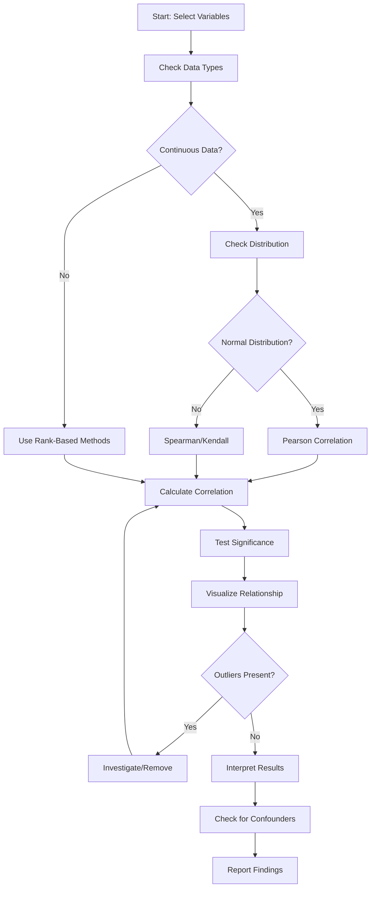

# Correlation Analysis

## Introduction

Correlation analysis is a fundamental statistical technique used to measure and describe the strength and direction of relationships between two or more variables. Understanding correlation is essential for data scientists as it helps identify patterns, make predictions, and inform feature selection for machine learning models. However, correlation does not imply causation, and interpreting correlation coefficients requires careful consideration of the context and potential confounding factors.

Correlation coefficients range from -1 to +1, where values close to +1 indicate strong positive relationships, values close to -1 indicate strong negative relationships, and values near 0 suggest no linear relationship. Different correlation methods are suited for different types of data and relationships, making it crucial to choose the appropriate technique for your analysis.

## Types of Correlation Coefficients

### Pearson Correlation Coefficient

The Pearson correlation coefficient (r) measures the linear relationship between two continuous variables. It is the most commonly used correlation measure and assumes that both variables are normally distributed and have a linear relationship.

```python
import pandas as pd
import numpy as np
from scipy import stats
import matplotlib.pyplot as plt
import seaborn as sns

# Generate sample data with different correlation strengths
np.random.seed(42)

# Strong positive correlation
x1 = np.random.randn(100)
y1 = x1 * 0.9 + np.random.randn(100) * 0.2

# Weak positive correlation
x2 = np.random.randn(100)
y2 = x2 * 0.3 + np.random.randn(100) * 0.8

# Negative correlation
x3 = np.random.randn(100)
y3 = -x3 * 0.8 + np.random.randn(100) * 0.3

# Create DataFrame
df = pd.DataFrame({
    'height': np.random.normal(170, 10, 100),
    'weight': np.random.normal(70, 15, 100),
    'age': np.random.randint(18, 65, 100),
    'income': np.random.normal(50000, 20000, 100)
})

# Add correlated feature
df['bmi'] = df['weight'] / ((df['height']/100) ** 2)

# Calculate Pearson correlation
pearson_corr = df['height'].corr(df['weight'])
print(f"Pearson correlation between height and weight: {pearson_corr:.4f}")

# Calculate with scipy for more details
pearson_r, p_value = stats.pearsonr(df['height'], df['weight'])
print(f"Pearson r: {pearson_r:.4f}, p-value: {p_value:.4f}")

# Correlation matrix
print("\nCorrelation Matrix:")
corr_matrix = df.corr()
print(corr_matrix)
```

**Interpretation Guidelines:**
- 0.00 to 0.19: Very weak correlation
- 0.20 to 0.39: Weak correlation
- 0.40 to 0.59: Moderate correlation
- 0.60 to 0.79: Strong correlation
- 0.80 to 1.00: Very strong correlation

### Spearman Rank Correlation

Spearman's rank correlation coefficient (ρ) measures monotonic relationships using rank values rather than raw data. It is more robust to outliers and does not assume linear relationships or normal distributions.

```python
# Generate data with non-linear monotonic relationship
x = np.arange(1, 101)
y = np.log(x) + np.random.randn(100) * 0.5

# Create DataFrame
df_nonlinear = pd.DataFrame({'x': x, 'y': y})

# Compare Pearson vs Spearman
pearson = df_nonlinear['x'].corr(df_nonlinear['y'], method='pearson')
spearman = df_nonlinear['x'].corr(df_nonlinear['y'], method='spearman')

print(f"Pearson correlation: {pearson:.4f}")
print(f"Spearman correlation: {spearman:.4f}")

# Using scipy for p-values
spearman_r, spearman_p = stats.spearmanr(df_nonlinear['x'], df_nonlinear['y'])
print(f"Spearman ρ: {spearman_r:.4f}, p-value: {spearman_p:.4f}")
```

**When to Use Spearman:**
- Data contains outliers
- Relationship is monotonic but not linear
- Data is ordinal or ranked
- Distribution assumptions of Pearson are violated

### Kendall Tau Correlation

Kendall's tau (τ) is another rank-based correlation measure that is more robust for small sample sizes and provides better statistical properties for hypothesis testing.

```python
# Calculate Kendall's tau
kendall_tau, kendall_p = stats.kendalltau(df['height'], df['weight'])
print(f"Kendall's tau: {kendall_tau:.4f}, p-value: {kendall_p:.4f}")

# Compare all three methods
print("\nComparison of correlation methods:")
print(f"Pearson:  {stats.pearsonr(df['height'], df['weight'])[0]:.4f}")
print(f"Spearman: {stats.spearmanr(df['height'], df['weight'])[0]:.4f}")
print(f"Kendall:  {kendall_tau:.4f}")
```

## Correlation Matrices and Visualization

Correlation matrices provide a comprehensive view of relationships between multiple variables simultaneously.

```python
# Create a larger dataset
np.random.seed(42)
df_large = pd.DataFrame({
    'temperature': np.random.normal(25, 5, 200),
    'humidity': np.random.normal(60, 15, 200),
    'wind_speed': np.random.normal(15, 5, 200),
    'pressure': np.random.normal(1013, 10, 200)
})

# Add correlated features
df_large['feels_like'] = (df_large['temperature'] * 0.7 +
                           df_large['humidity'] * 0.2 +
                           np.random.randn(200) * 2)
df_large['visibility'] = (100 - df_large['humidity'] * 0.5 -
                          df_large['wind_speed'] * 0.3 +
                          np.random.randn(200) * 5)

# Calculate correlation matrix
corr_matrix = df_large.corr()
print("Correlation Matrix:")
print(corr_matrix.round(3))

# Find highly correlated pairs
def find_high_correlations(corr_matrix, threshold=0.7):
    """Find variable pairs with correlation above threshold"""
    high_corr = []
    for i in range(len(corr_matrix.columns)):
        for j in range(i+1, len(corr_matrix.columns)):
            if abs(corr_matrix.iloc[i, j]) > threshold:
                high_corr.append({
                    'var1': corr_matrix.columns[i],
                    'var2': corr_matrix.columns[j],
                    'correlation': corr_matrix.iloc[i, j]
                })
    return pd.DataFrame(high_corr)

high_corr_pairs = find_high_correlations(corr_matrix, threshold=0.5)
print("\nHighly Correlated Pairs (|r| > 0.5):")
print(high_corr_pairs)
```

## Spurious Correlations and Pitfalls

Spurious correlations occur when two variables appear to be related but have no causal connection. These can arise from confounding variables, small sample sizes, or pure coincidence.

```python
# Demonstrate spurious correlation
np.random.seed(123)

# Create time series with trends
time = np.arange(100)
ice_cream_sales = 100 + 2 * time + np.random.randn(100) * 10
drowning_incidents = 50 + 1.5 * time + np.random.randn(100) * 5

df_spurious = pd.DataFrame({
    'time': time,
    'ice_cream_sales': ice_cream_sales,
    'drowning_incidents': drowning_incidents
})

# Calculate correlation
spurious_corr = df_spurious['ice_cream_sales'].corr(
    df_spurious['drowning_incidents']
)
print(f"Spurious correlation: {spurious_corr:.4f}")
print("Note: Both variables trend upward, creating false correlation")

# Control for time trend
from scipy.stats import linregress

# Detrend both variables
_, _, _, _, ice_cream_residuals = linregress(time, ice_cream_sales)
_, _, _, _, drowning_residuals = linregress(time, drowning_incidents)

# Correlation after detrending is much weaker
print(f"\nThis demonstrates how confounding variables can create")
print(f"misleading correlations. Always investigate causality!")
```

## Partial and Semi-Partial Correlations

Partial correlation measures the relationship between two variables while controlling for the effects of other variables.

```python
from scipy.stats.mstats import pearsonr

def partial_correlation(df, x, y, control):
    """
    Calculate partial correlation between x and y, controlling for control variables
    """
    # Fit linear models
    from sklearn.linear_model import LinearRegression

    # Residuals of x regressed on control
    model_x = LinearRegression()
    model_x.fit(df[control].values.reshape(-1, 1), df[x])
    residuals_x = df[x] - model_x.predict(df[control].values.reshape(-1, 1))

    # Residuals of y regressed on control
    model_y = LinearRegression()
    model_y.fit(df[control].values.reshape(-1, 1), df[y])
    residuals_y = df[y] - model_y.predict(df[control].values.reshape(-1, 1))

    # Correlation of residuals
    return np.corrcoef(residuals_x, residuals_y)[0, 1]

# Example: correlation between weight and income, controlling for age
np.random.seed(42)
df_partial = pd.DataFrame({
    'age': np.random.randint(20, 60, 100),
    'weight': np.random.normal(70, 15, 100),
    'income': np.random.normal(50000, 20000, 100)
})

# Add age effects
df_partial['weight'] = df_partial['weight'] + df_partial['age'] * 0.3
df_partial['income'] = df_partial['income'] + df_partial['age'] * 500

# Regular correlation
regular_corr = df_partial['weight'].corr(df_partial['income'])
print(f"Regular correlation (weight vs income): {regular_corr:.4f}")

# Partial correlation controlling for age
partial_corr = partial_correlation(df_partial, 'weight', 'income', 'age')
print(f"Partial correlation (controlling for age): {partial_corr:.4f}")
```

## Correlation Workflow



## Best Practices

```python
class CorrelationAnalyzer:
    """Comprehensive correlation analysis tool"""

    def __init__(self, data):
        self.data = data
        self.numeric_data = data.select_dtypes(include=[np.number])

    def analyze_all(self, method='pearson', threshold=0.5):
        """Perform comprehensive correlation analysis"""
        results = {}

        # Calculate correlation matrix
        corr_matrix = self.numeric_data.corr(method=method)
        results['correlation_matrix'] = corr_matrix

        # Find significant correlations
        significant = []
        for i in range(len(corr_matrix.columns)):
            for j in range(i+1, len(corr_matrix.columns)):
                corr_val = corr_matrix.iloc[i, j]
                if abs(corr_val) > threshold:
                    significant.append({
                        'variable1': corr_matrix.columns[i],
                        'variable2': corr_matrix.columns[j],
                        'correlation': corr_val,
                        'strength': self._interpret_strength(abs(corr_val))
                    })

        results['significant_pairs'] = pd.DataFrame(significant)

        return results

    def _interpret_strength(self, corr):
        """Interpret correlation strength"""
        if corr < 0.2:
            return 'Very weak'
        elif corr < 0.4:
            return 'Weak'
        elif corr < 0.6:
            return 'Moderate'
        elif corr < 0.8:
            return 'Strong'
        else:
            return 'Very strong'

    def test_significance(self, var1, var2, method='pearson'):
        """Test statistical significance of correlation"""
        if method == 'pearson':
            r, p = stats.pearsonr(self.data[var1], self.data[var2])
        elif method == 'spearman':
            r, p = stats.spearmanr(self.data[var1], self.data[var2])
        elif method == 'kendall':
            r, p = stats.kendalltau(self.data[var1], self.data[var2])

        return {
            'correlation': r,
            'p_value': p,
            'significant': p < 0.05,
            'method': method
        }

# Example usage
analyzer = CorrelationAnalyzer(df_large)
results = analyzer.analyze_all(threshold=0.3)

print("Significant Correlations:")
print(results['significant_pairs'])

# Test specific pair
sig_test = analyzer.test_significance('temperature', 'feels_like')
print(f"\nSignificance test (temperature vs feels_like):")
print(f"Correlation: {sig_test['correlation']:.4f}")
print(f"P-value: {sig_test['p_value']:.4f}")
print(f"Significant: {sig_test['significant']}")
```

## Key Takeaways

1. **Correlation measures association, not causation** - Always investigate the underlying mechanisms before drawing conclusions about causal relationships.

2. **Choose the right method** - Use Pearson for linear relationships with normally distributed data, Spearman for monotonic relationships, and Kendall for small samples or hypothesis testing.

3. **Visualize before calculating** - Always plot your data to identify non-linear relationships, outliers, and patterns that correlation coefficients might miss.

4. **Test significance** - Use p-values to determine if observed correlations are statistically meaningful or could have occurred by chance.

5. **Beware of spurious correlations** - Control for confounding variables and consider temporal trends that might create false relationships.

6. **Context matters** - Interpretation depends on the domain, sample size, and research question. A correlation of 0.3 might be meaningful in social sciences but weak in physical sciences.

7. **Multicollinearity concerns** - High correlations between predictor variables can cause problems in regression models and require special handling.

Understanding correlation analysis is essential for exploratory data analysis, feature selection, and building intuition about your data before applying more sophisticated modeling techniques.
