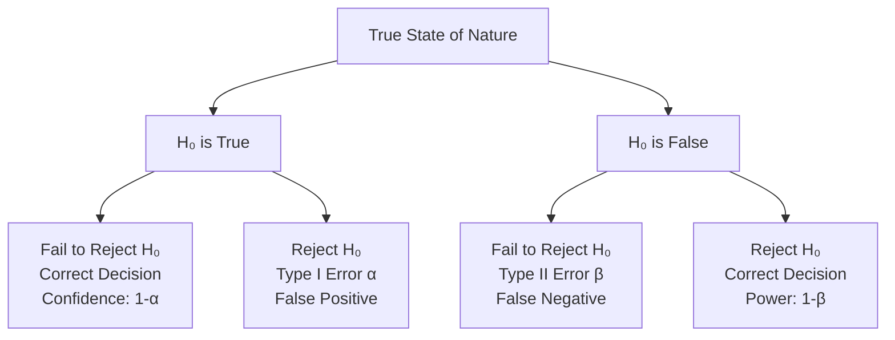
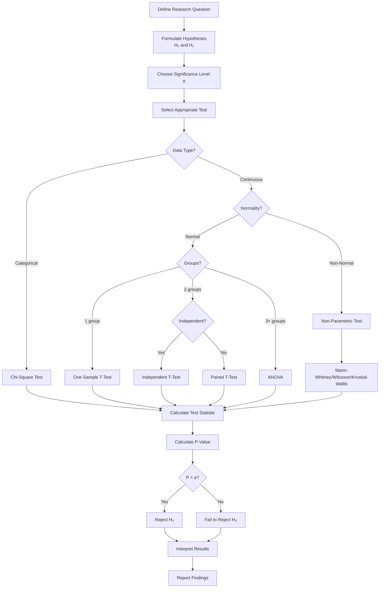

# Hypothesis Testing

## Introduction

Hypothesis testing is a fundamental statistical method used to make inferences about populations based on sample data. It provides a systematic framework for determining whether observed patterns in data are likely to represent genuine effects or could have occurred by random chance. In data science, hypothesis testing helps validate assumptions, compare groups, and make evidence-based decisions.

The process involves formulating two competing hypotheses: the null hypothesis (H₀), which represents the status quo or no effect, and the alternative hypothesis (H₁), which represents the claim we want to test. By calculating the probability of observing our data under the null hypothesis, we can make informed decisions about which hypothesis is more likely to be true.

## Fundamental Concepts

### Null and Alternative Hypotheses

```python
import numpy as np
import pandas as pd
from scipy import stats
import matplotlib.pyplot as plt
import seaborn as sns

# Example: Testing if a new drug reduces blood pressure
# H₀: μ_drug = μ_placebo (no difference)
# H₁: μ_drug < μ_placebo (drug reduces blood pressure)

np.random.seed(42)

# Simulate data
placebo_group = np.random.normal(140, 15, 50)  # mean BP: 140
drug_group = np.random.normal(135, 15, 50)     # mean BP: 135

print("Sample Statistics:")
print(f"Placebo group mean: {placebo_group.mean():.2f}")
print(f"Drug group mean: {drug_group.mean():.2f}")
print(f"Difference: {placebo_group.mean() - drug_group.mean():.2f}")
```

### P-Values and Significance Levels

The p-value represents the probability of obtaining results at least as extreme as those observed, assuming the null hypothesis is true. The significance level (α) is the threshold for rejecting the null hypothesis.

```python
def explain_p_value(p_value, alpha=0.05):
    """Interpret p-value in context"""
    print(f"\nP-value: {p_value:.4f}")
    print(f"Significance level (α): {alpha}")

    if p_value < alpha:
        print(f"Result: REJECT null hypothesis (p < α)")
        print(f"Interpretation: Strong evidence against H₀")
    else:
        print(f"Result: FAIL TO REJECT null hypothesis (p ≥ α)")
        print(f"Interpretation: Insufficient evidence against H₀")

    # Describe strength of evidence
    if p_value < 0.001:
        strength = "Very strong"
    elif p_value < 0.01:
        strength = "Strong"
    elif p_value < 0.05:
        strength = "Moderate"
    elif p_value < 0.10:
        strength = "Weak"
    else:
        strength = "Very weak or none"

    print(f"Evidence strength: {strength}")

# Perform t-test
t_stat, p_value = stats.ttest_ind(placebo_group, drug_group)
print(f"T-statistic: {t_stat:.4f}")
explain_p_value(p_value)
```

### Type I and Type II Errors



```python
class ErrorAnalyzer:
    """Demonstrate Type I and Type II errors"""

    def __init__(self, alpha=0.05):
        self.alpha = alpha

    def simulate_errors(self, n_simulations=1000, effect_size=0):
        """
        Simulate hypothesis tests and count errors

        effect_size: 0 for H₀ true, >0 for H₀ false
        """
        type_i_errors = 0
        type_ii_errors = 0
        correct_decisions = 0

        for _ in range(n_simulations):
            # Generate data
            group1 = np.random.normal(100, 15, 30)
            group2 = np.random.normal(100 + effect_size, 15, 30)

            # Perform t-test
            _, p_value = stats.ttest_ind(group1, group2)

            # Count outcomes
            if effect_size == 0:  # H₀ is true
                if p_value < self.alpha:
                    type_i_errors += 1  # False positive
                else:
                    correct_decisions += 1
            else:  # H₀ is false
                if p_value >= self.alpha:
                    type_ii_errors += 1  # False negative
                else:
                    correct_decisions += 1

        return {
            'type_i_errors': type_i_errors / n_simulations,
            'type_ii_errors': type_ii_errors / n_simulations,
            'correct_rate': correct_decisions / n_simulations
        }

# Demonstrate Type I error rate (should be approximately α)
analyzer = ErrorAnalyzer(alpha=0.05)
results_null_true = analyzer.simulate_errors(n_simulations=1000, effect_size=0)
print("When H₀ is TRUE (no effect):")
print(f"Type I error rate: {results_null_true['type_i_errors']:.4f}")
print(f"Expected: {analyzer.alpha:.4f}")

# Demonstrate Type II error rate
results_null_false = analyzer.simulate_errors(n_simulations=1000, effect_size=5)
print("\nWhen H₀ is FALSE (effect exists):")
print(f"Type II error rate: {results_null_false['type_ii_errors']:.4f}")
print(f"Statistical power (1-β): {results_null_false['correct_rate']:.4f}")
```

## Common Statistical Tests

### T-Tests

T-tests compare means between groups or against a known value.

```python
# One-sample t-test
# H₀: μ = 100
sample = np.random.normal(105, 15, 30)
t_stat, p_value = stats.ttest_1samp(sample, 100)

print("One-Sample T-Test:")
print(f"H₀: μ = 100")
print(f"Sample mean: {sample.mean():.2f}")
print(f"T-statistic: {t_stat:.4f}")
print(f"P-value: {p_value:.4f}")

# Independent samples t-test
group_a = np.random.normal(100, 15, 30)
group_b = np.random.normal(105, 15, 30)
t_stat, p_value = stats.ttest_ind(group_a, group_b)

print("\nIndependent Samples T-Test:")
print(f"H₀: μ₁ = μ₂")
print(f"Group A mean: {group_a.mean():.2f}")
print(f"Group B mean: {group_b.mean():.2f}")
print(f"T-statistic: {t_stat:.4f}")
print(f"P-value: {p_value:.4f}")

# Paired samples t-test
before = np.random.normal(140, 15, 30)
after = before - np.random.normal(5, 3, 30)  # Correlated
t_stat, p_value = stats.ttest_rel(before, after)

print("\nPaired Samples T-Test:")
print(f"H₀: μ_before = μ_after")
print(f"Mean difference: {(before - after).mean():.2f}")
print(f"T-statistic: {t_stat:.4f}")
print(f"P-value: {p_value:.4f}")
```

### Chi-Square Tests

Chi-square tests analyze categorical data and test independence or goodness of fit.

```python
# Chi-square test of independence
# Example: Relationship between gender and product preference

observed = np.array([
    [30, 20, 10],  # Male preferences
    [20, 30, 20]   # Female preferences
])

chi2_stat, p_value, dof, expected = stats.chi2_contingency(observed)

print("Chi-Square Test of Independence:")
print(f"H₀: Gender and preference are independent")
print(f"\nObserved frequencies:")
print(observed)
print(f"\nExpected frequencies:")
print(expected.round(2))
print(f"\nChi-square statistic: {chi2_stat:.4f}")
print(f"Degrees of freedom: {dof}")
print(f"P-value: {p_value:.4f}")

# Chi-square goodness of fit test
# Example: Testing if a die is fair
observed_rolls = np.array([15, 18, 12, 20, 16, 19])  # 100 rolls
expected_rolls = np.array([100/6] * 6)  # Fair die expectation

chi2_stat, p_value = stats.chisquare(observed_rolls, expected_rolls)

print("\nChi-Square Goodness of Fit:")
print(f"H₀: Die is fair (all sides equally likely)")
print(f"Observed: {observed_rolls}")
print(f"Expected: {expected_rolls}")
print(f"Chi-square statistic: {chi2_stat:.4f}")
print(f"P-value: {p_value:.4f}")
```

### ANOVA (Analysis of Variance)

ANOVA tests differences between means of three or more groups.

```python
# One-way ANOVA
treatment_a = np.random.normal(100, 15, 30)
treatment_b = np.random.normal(105, 15, 30)
treatment_c = np.random.normal(110, 15, 30)

f_stat, p_value = stats.f_oneway(treatment_a, treatment_b, treatment_c)

print("One-Way ANOVA:")
print(f"H₀: μ₁ = μ₂ = μ₃")
print(f"Treatment A mean: {treatment_a.mean():.2f}")
print(f"Treatment B mean: {treatment_b.mean():.2f}")
print(f"Treatment C mean: {treatment_c.mean():.2f}")
print(f"F-statistic: {f_stat:.4f}")
print(f"P-value: {p_value:.4f}")

# Post-hoc analysis: Tukey HSD
from scipy.stats import tukey_hsd

# Combine data
all_data = np.concatenate([treatment_a, treatment_b, treatment_c])
groups = np.array(['A']*30 + ['B']*30 + ['C']*30)

# Tukey's HSD test
result = tukey_hsd(treatment_a, treatment_b, treatment_c)
print("\nTukey's HSD Post-Hoc Test:")
print("Confidence intervals for pairwise differences:")
print(result.confidence_interval())
```

### Non-Parametric Tests

Non-parametric tests don't assume specific distributions and are useful for ordinal data or when assumptions are violated.

```python
# Mann-Whitney U test (alternative to independent t-test)
group1 = np.random.exponential(2, 30)  # Non-normal distribution
group2 = np.random.exponential(2.5, 30)

u_stat, p_value = stats.mannwhitneyu(group1, group2, alternative='two-sided')

print("Mann-Whitney U Test:")
print(f"H₀: Distributions are equal")
print(f"U-statistic: {u_stat:.4f}")
print(f"P-value: {p_value:.4f}")

# Wilcoxon signed-rank test (alternative to paired t-test)
before = np.random.exponential(2, 30)
after = before - np.random.uniform(0, 1, 30)

w_stat, p_value = stats.wilcoxon(before, after)

print("\nWilcoxon Signed-Rank Test:")
print(f"H₀: Median difference = 0")
print(f"W-statistic: {w_stat:.4f}")
print(f"P-value: {p_value:.4f}")

# Kruskal-Wallis test (alternative to ANOVA)
group_a = np.random.exponential(2, 30)
group_b = np.random.exponential(2.5, 30)
group_c = np.random.exponential(3, 30)

h_stat, p_value = stats.kruskal(group_a, group_b, group_c)

print("\nKruskal-Wallis Test:")
print(f"H₀: All groups have same distribution")
print(f"H-statistic: {h_stat:.4f}")
print(f"P-value: {p_value:.4f}")
```

## Power Analysis and Sample Size

Statistical power is the probability of correctly rejecting a false null hypothesis.

```python
from scipy.stats import norm

def calculate_power(effect_size, n, alpha=0.05):
    """
    Calculate statistical power for a two-sample t-test

    effect_size: Cohen's d
    n: sample size per group
    alpha: significance level
    """
    # Critical value for two-tailed test
    z_critical = norm.ppf(1 - alpha/2)

    # Non-centrality parameter
    ncp = effect_size * np.sqrt(n/2)

    # Power calculation
    power = 1 - norm.cdf(z_critical - ncp) + norm.cdf(-z_critical - ncp)

    return power

# Demonstrate relationship between sample size and power
effect_size = 0.5  # Medium effect (Cohen's d)
sample_sizes = np.arange(10, 200, 10)
powers = [calculate_power(effect_size, n) for n in sample_sizes]

# Find minimum sample size for 80% power
for n, power in zip(sample_sizes, powers):
    if power >= 0.80:
        print(f"Minimum sample size for 80% power: {n} per group")
        break

print(f"\nPower Analysis (effect size = {effect_size}):")
for n in [30, 50, 100]:
    power = calculate_power(effect_size, n)
    print(f"n = {n}: power = {power:.4f}")
```

## Hypothesis Testing Workflow



## Practical Implementation

```python
class HypothesisTestSuite:
    """Comprehensive hypothesis testing toolkit"""

    def __init__(self, alpha=0.05):
        self.alpha = alpha
        self.results = {}

    def test_normality(self, data, name="data"):
        """Test if data follows normal distribution"""
        stat, p_value = stats.shapiro(data)
        is_normal = p_value > self.alpha

        self.results[f'normality_{name}'] = {
            'test': 'Shapiro-Wilk',
            'statistic': stat,
            'p_value': p_value,
            'is_normal': is_normal
        }

        return is_normal

    def compare_two_groups(self, group1, group2, paired=False):
        """Compare two groups with appropriate test"""
        # Test normality
        normal1 = self.test_normality(group1, 'group1')
        normal2 = self.test_normality(group2, 'group2')

        # Choose appropriate test
        if normal1 and normal2:
            if paired:
                stat, p_value = stats.ttest_rel(group1, group2)
                test_name = "Paired T-Test"
            else:
                stat, p_value = stats.ttest_ind(group1, group2)
                test_name = "Independent T-Test"
        else:
            if paired:
                stat, p_value = stats.wilcoxon(group1, group2)
                test_name = "Wilcoxon Signed-Rank Test"
            else:
                stat, p_value = stats.mannwhitneyu(group1, group2)
                test_name = "Mann-Whitney U Test"

        # Calculate effect size (Cohen's d)
        effect_size = (np.mean(group1) - np.mean(group2)) / np.sqrt(
            (np.std(group1)**2 + np.std(group2)**2) / 2
        )

        self.results['comparison'] = {
            'test': test_name,
            'statistic': stat,
            'p_value': p_value,
            'significant': p_value < self.alpha,
            'effect_size': effect_size,
            'group1_mean': np.mean(group1),
            'group2_mean': np.mean(group2)
        }

        return self.results['comparison']

    def compare_multiple_groups(self, *groups):
        """Compare three or more groups"""
        # Test normality for all groups
        all_normal = all(self.test_normality(g, f'group{i}')
                        for i, g in enumerate(groups))

        # Choose appropriate test
        if all_normal:
            stat, p_value = stats.f_oneway(*groups)
            test_name = "One-Way ANOVA"
        else:
            stat, p_value = stats.kruskal(*groups)
            test_name = "Kruskal-Wallis Test"

        self.results['multiple_comparison'] = {
            'test': test_name,
            'statistic': stat,
            'p_value': p_value,
            'significant': p_value < self.alpha,
            'n_groups': len(groups)
        }

        return self.results['multiple_comparison']

    def generate_report(self):
        """Generate comprehensive test report"""
        report = "\n=== Hypothesis Testing Report ===\n"
        report += f"Significance Level: {self.alpha}\n\n"

        for test_name, result in self.results.items():
            report += f"{test_name.upper()}:\n"
            for key, value in result.items():
                if isinstance(value, float):
                    report += f"  {key}: {value:.4f}\n"
                else:
                    report += f"  {key}: {value}\n"
            report += "\n"

        return report

# Example usage
tester = HypothesisTestSuite(alpha=0.05)

# Generate sample data
np.random.seed(42)
treatment = np.random.normal(105, 15, 50)
control = np.random.normal(100, 15, 50)

# Perform comparison
result = tester.compare_two_groups(treatment, control, paired=False)

print(tester.generate_report())
print(f"Decision: {'Reject H₀' if result['significant'] else 'Fail to reject H₀'}")
```

## Key Takeaways

1. **Hypothesis testing provides a framework for decision-making** - It helps quantify uncertainty and make evidence-based conclusions from data.

2. **P-values are not effect sizes** - A small p-value indicates statistical significance but doesn't tell you how large or important the effect is. Always report effect sizes alongside p-values.

3. **Choose the appropriate test** - Consider data type, distribution, sample size, and independence when selecting a statistical test.

4. **Type I and Type II errors are inversely related** - Reducing one type of error typically increases the other. Balance is achieved through proper study design and sample size.

5. **Statistical significance does not imply practical significance** - A result can be statistically significant but have negligible practical importance, especially with large sample sizes.

6. **Assumptions matter** - Verify test assumptions (normality, independence, equal variance) before interpreting results. Use non-parametric alternatives when assumptions are violated.

7. **Power analysis guides study design** - Calculate required sample sizes before collecting data to ensure adequate power to detect meaningful effects.

8. **Multiple testing requires correction** - When performing many tests, adjust significance levels (e.g., Bonferroni correction) to control family-wise error rate.

Hypothesis testing is a cornerstone of statistical inference in data science, enabling researchers and analysts to make objective, data-driven decisions while explicitly quantifying uncertainty and error rates.
