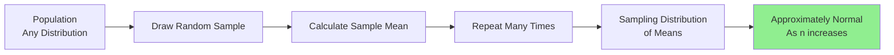

# Statistical Inference

## Introduction

Statistical inference is the process of drawing conclusions about populations or data-generating processes based on sample data. It forms the bridge between descriptive statistics and decision-making, allowing data scientists to make predictions, estimate unknown parameters, and quantify uncertainty. Unlike descriptive statistics that simply summarize observed data, inferential statistics enable us to generalize findings beyond the sample to larger populations.

The two main approaches to statistical inference are frequentist inference, which treats parameters as fixed but unknown values, and Bayesian inference, which treats parameters as random variables with probability distributions. This lesson focuses primarily on frequentist methods, including point estimation, confidence intervals, and the theoretical foundations that make inference possible.

## Point Estimation

Point estimation involves using sample data to calculate a single value (statistic) that serves as the best guess for an unknown population parameter.

```python
import numpy as np
import pandas as pd
from scipy import stats
import matplotlib.pyplot as plt
import seaborn as sns

# Generate population and sample
np.random.seed(42)
population = np.random.normal(100, 15, 10000)  # True mean = 100, std = 15
sample = np.random.choice(population, size=50, replace=False)

# Point estimates
sample_mean = np.mean(sample)
sample_std = np.std(sample, ddof=1)  # ddof=1 for sample std
sample_median = np.median(sample)

print("Point Estimates:")
print(f"Sample mean (estimator for μ): {sample_mean:.2f}")
print(f"True population mean: {population.mean():.2f}")
print(f"Sample std (estimator for σ): {sample_std:.2f}")
print(f"True population std: {population.std():.2f}")
print(f"Sample median: {sample_median:.2f}")

# Bias and variance of estimators
def demonstrate_estimator_properties(population, n_samples=1000, sample_size=50):
    """Demonstrate properties of estimators through simulation"""
    sample_means = []
    sample_vars = []

    for _ in range(n_samples):
        sample = np.random.choice(population, size=sample_size, replace=False)
        sample_means.append(np.mean(sample))
        sample_vars.append(np.var(sample, ddof=1))

    print("\nEstimator Properties:")
    print(f"Mean of sample means: {np.mean(sample_means):.2f}")
    print(f"True population mean: {population.mean():.2f}")
    print(f"Bias: {np.mean(sample_means) - population.mean():.4f}")
    print(f"\nVariance of sample means: {np.var(sample_means):.2f}")
    print(f"Theoretical SE²: {population.var() / sample_size:.2f}")

    return sample_means, sample_vars

sample_means, sample_vars = demonstrate_estimator_properties(population)
```

### Properties of Good Estimators

```python
class EstimatorEvaluator:
    """Evaluate properties of statistical estimators"""

    def __init__(self, population):
        self.population = population
        self.true_mean = np.mean(population)
        self.true_variance = np.var(population)

    def evaluate_bias(self, estimator_func, n_simulations=1000, sample_size=50):
        """Calculate bias of an estimator"""
        estimates = []

        for _ in range(n_simulations):
            sample = np.random.choice(self.population, size=sample_size, replace=True)
            estimates.append(estimator_func(sample))

        bias = np.mean(estimates) - self.true_mean
        return bias, estimates

    def evaluate_mse(self, estimator_func, n_simulations=1000, sample_size=50):
        """Calculate Mean Squared Error"""
        estimates = []

        for _ in range(n_simulations):
            sample = np.random.choice(self.population, size=sample_size, replace=True)
            estimates.append(estimator_func(sample))

        mse = np.mean((np.array(estimates) - self.true_mean) ** 2)
        variance = np.var(estimates)
        bias = np.mean(estimates) - self.true_mean

        return {
            'mse': mse,
            'variance': variance,
            'bias': bias,
            'bias_squared': bias ** 2
        }

# Example: Compare trimmed mean estimators
evaluator = EstimatorEvaluator(population)

# Standard mean
mean_mse = evaluator.evaluate_mse(lambda x: np.mean(x))
print("Standard Mean:")
print(f"  MSE: {mean_mse['mse']:.4f}")
print(f"  Bias: {mean_mse['bias']:.4f}")
print(f"  Variance: {mean_mse['variance']:.4f}")

# 10% trimmed mean
trimmed_mse = evaluator.evaluate_mse(lambda x: stats.trim_mean(x, 0.1))
print("\n10% Trimmed Mean:")
print(f"  MSE: {trimmed_mse['mse']:.4f}")
print(f"  Bias: {trimmed_mse['bias']:.4f}")
print(f"  Variance: {trimmed_mse['variance']:.4f}")
```

## Confidence Intervals

Confidence intervals provide a range of plausible values for a population parameter, along with a confidence level indicating the reliability of the interval.

```python
def calculate_confidence_interval(data, confidence=0.95):
    """
    Calculate confidence interval for the mean

    Returns: (lower, upper, margin_of_error)
    """
    n = len(data)
    mean = np.mean(data)
    se = stats.sem(data)  # Standard error

    # Use t-distribution for small samples
    margin = se * stats.t.ppf((1 + confidence) / 2, n - 1)

    return mean - margin, mean + margin, margin

# Example with different sample sizes
for sample_size in [10, 30, 100, 500]:
    sample = np.random.choice(population, size=sample_size, replace=False)
    lower, upper, margin = calculate_confidence_interval(sample, confidence=0.95)

    print(f"\nSample size: {sample_size}")
    print(f"Sample mean: {np.mean(sample):.2f}")
    print(f"95% CI: [{lower:.2f}, {upper:.2f}]")
    print(f"Margin of error: ±{margin:.2f}")
    print(f"CI width: {upper - lower:.2f}")
```

### Interpreting Confidence Intervals

```python
def simulate_confidence_intervals(population, n_simulations=100,
                                 sample_size=50, confidence=0.95):
    """
    Simulate multiple confidence intervals to demonstrate coverage probability
    """
    true_mean = np.mean(population)
    contains_true_mean = 0
    intervals = []

    for _ in range(n_simulations):
        sample = np.random.choice(population, size=sample_size, replace=True)
        lower, upper, _ = calculate_confidence_interval(sample, confidence)
        intervals.append((lower, upper))

        if lower <= true_mean <= upper:
            contains_true_mean += 1

    coverage = contains_true_mean / n_simulations

    print(f"\nConfidence Interval Simulation:")
    print(f"Confidence level: {confidence * 100}%")
    print(f"Number of intervals: {n_simulations}")
    print(f"Coverage rate: {coverage * 100:.1f}%")
    print(f"Expected coverage: {confidence * 100}%")

    return intervals, coverage

intervals, coverage = simulate_confidence_intervals(population, n_simulations=1000)

# Visualize concept
print("\nInterpretation:")
print("A 95% confidence interval means that if we repeated this")
print("sampling procedure many times, approximately 95% of the")
print("constructed intervals would contain the true population mean.")
```

### Confidence Intervals for Different Parameters

```python
class ConfidenceIntervalCalculator:
    """Calculate confidence intervals for various parameters"""

    def __init__(self, confidence=0.95):
        self.confidence = confidence
        self.alpha = 1 - confidence

    def mean_ci(self, data):
        """CI for population mean"""
        n = len(data)
        mean = np.mean(data)
        se = stats.sem(data)
        margin = se * stats.t.ppf(1 - self.alpha/2, n - 1)

        return {
            'parameter': 'mean',
            'estimate': mean,
            'lower': mean - margin,
            'upper': mean + margin,
            'margin': margin
        }

    def proportion_ci(self, successes, n):
        """CI for population proportion (Wilson score interval)"""
        p = successes / n
        z = stats.norm.ppf(1 - self.alpha/2)

        denominator = 1 + z**2/n
        center = (p + z**2/(2*n)) / denominator
        margin = z * np.sqrt(p*(1-p)/n + z**2/(4*n**2)) / denominator

        return {
            'parameter': 'proportion',
            'estimate': p,
            'lower': center - margin,
            'upper': center + margin,
            'margin': margin
        }

    def variance_ci(self, data):
        """CI for population variance"""
        n = len(data)
        var = np.var(data, ddof=1)

        chi2_lower = stats.chi2.ppf(self.alpha/2, n - 1)
        chi2_upper = stats.chi2.ppf(1 - self.alpha/2, n - 1)

        lower = (n - 1) * var / chi2_upper
        upper = (n - 1) * var / chi2_lower

        return {
            'parameter': 'variance',
            'estimate': var,
            'lower': lower,
            'upper': upper
        }

    def difference_of_means_ci(self, data1, data2):
        """CI for difference of two means"""
        mean1 = np.mean(data1)
        mean2 = np.mean(data2)
        diff = mean1 - mean2

        # Pooled standard error
        n1, n2 = len(data1), len(data2)
        se1 = stats.sem(data1)
        se2 = stats.sem(data2)
        se_diff = np.sqrt(se1**2 + se2**2)

        # Degrees of freedom (Welch-Satterthwaite)
        df = (se1**2 + se2**2)**2 / (se1**4/(n1-1) + se2**4/(n2-1))

        margin = se_diff * stats.t.ppf(1 - self.alpha/2, df)

        return {
            'parameter': 'difference_of_means',
            'estimate': diff,
            'lower': diff - margin,
            'upper': diff + margin,
            'margin': margin
        }

# Example usage
ci_calc = ConfidenceIntervalCalculator(confidence=0.95)

# Mean CI
sample1 = np.random.normal(100, 15, 50)
mean_ci = ci_calc.mean_ci(sample1)
print("Mean Confidence Interval:")
print(f"Estimate: {mean_ci['estimate']:.2f}")
print(f"95% CI: [{mean_ci['lower']:.2f}, {mean_ci['upper']:.2f}]")

# Proportion CI
successes = 65
n = 100
prop_ci = ci_calc.proportion_ci(successes, n)
print(f"\nProportion Confidence Interval:")
print(f"Estimate: {prop_ci['estimate']:.3f}")
print(f"95% CI: [{prop_ci['lower']:.3f}, {prop_ci['upper']:.3f}]")

# Difference of means CI
sample2 = np.random.normal(105, 15, 50)
diff_ci = ci_calc.difference_of_means_ci(sample1, sample2)
print(f"\nDifference of Means CI:")
print(f"Estimate: {diff_ci['estimate']:.2f}")
print(f"95% CI: [{diff_ci['lower']:.2f}, {diff_ci['upper']:.2f}]")
```

## Sampling Distributions

A sampling distribution is the probability distribution of a statistic obtained from a large number of samples from a specific population.

```python
def demonstrate_sampling_distribution(population, statistic_func,
                                     n_samples=1000, sample_size=30):
    """
    Demonstrate sampling distribution of a statistic
    """
    statistics = []

    for _ in range(n_samples):
        sample = np.random.choice(population, size=sample_size, replace=True)
        statistics.append(statistic_func(sample))

    statistics = np.array(statistics)

    print(f"Sampling Distribution Properties:")
    print(f"Mean of sampling distribution: {np.mean(statistics):.2f}")
    print(f"SE of sampling distribution: {np.std(statistics):.2f}")
    print(f"Theoretical SE: {np.std(population) / np.sqrt(sample_size):.2f}")

    return statistics

# Sampling distribution of the mean
sampling_dist_mean = demonstrate_sampling_distribution(
    population,
    np.mean,
    n_samples=10000,
    sample_size=30
)

# Sampling distribution of the median
sampling_dist_median = demonstrate_sampling_distribution(
    population,
    np.median,
    n_samples=10000,
    sample_size=30
)

print("\nComparison:")
print(f"Mean SE: {np.std(sampling_dist_mean):.2f}")
print(f"Median SE: {np.std(sampling_dist_median):.2f}")
print("Note: Mean is more efficient (lower SE) than median")
```

## Central Limit Theorem

The Central Limit Theorem (CLT) states that the sampling distribution of the mean approaches a normal distribution as the sample size increases, regardless of the population's distribution.



```python
def demonstrate_clt(population_func, sample_sizes=[5, 10, 30, 100],
                   n_simulations=10000):
    """
    Demonstrate Central Limit Theorem with different sample sizes
    """
    results = {}

    for sample_size in sample_sizes:
        sample_means = []

        for _ in range(n_simulations):
            # Generate sample from population
            sample = population_func(sample_size)
            sample_means.append(np.mean(sample))

        sample_means = np.array(sample_means)

        # Test normality
        _, p_value = stats.shapiro(sample_means[:5000])  # Shapiro-Wilk test

        results[sample_size] = {
            'mean': np.mean(sample_means),
            'std': np.std(sample_means),
            'normality_p': p_value
        }

    return results

# Test with different population distributions

# 1. Uniform distribution (not normal)
print("Population: Uniform(0, 1)")
uniform_results = demonstrate_clt(lambda n: np.random.uniform(0, 1, n))
for size, stats_dict in uniform_results.items():
    print(f"n={size}: mean={stats_dict['mean']:.3f}, "
          f"SE={stats_dict['std']:.3f}, "
          f"normality p={stats_dict['normality_p']:.4f}")

# 2. Exponential distribution (highly skewed)
print("\nPopulation: Exponential(λ=1)")
exp_results = demonstrate_clt(lambda n: np.random.exponential(1, n))
for size, stats_dict in exp_results.items():
    print(f"n={size}: mean={stats_dict['mean']:.3f}, "
          f"SE={stats_dict['std']:.3f}, "
          f"normality p={stats_dict['normality_p']:.4f}")

# 3. Binomial distribution (discrete)
print("\nPopulation: Binomial(n=10, p=0.3)")
binom_results = demonstrate_clt(lambda n: np.random.binomial(10, 0.3, n))
for size, stats_dict in binom_results.items():
    print(f"n={size}: mean={stats_dict['mean']:.3f}, "
          f"SE={stats_dict['std']:.3f}, "
          f"normality p={stats_dict['normality_p']:.4f}")

print("\nObservation: As sample size increases, p-values increase,")
print("indicating better fit to normal distribution (CLT in action)")
```

## Bootstrap Methods

Bootstrap is a resampling technique that estimates the sampling distribution of a statistic by repeatedly sampling with replacement from the original sample.

```python
def bootstrap_ci(data, statistic_func, n_bootstrap=10000, confidence=0.95):
    """
    Calculate bootstrap confidence interval

    Parameters:
    -----------
    data: array-like
        Original sample
    statistic_func: callable
        Function to calculate statistic
    n_bootstrap: int
        Number of bootstrap samples
    confidence: float
        Confidence level

    Returns:
    --------
    dict with estimate, CI, and bootstrap distribution
    """
    bootstrap_statistics = []

    for _ in range(n_bootstrap):
        # Resample with replacement
        bootstrap_sample = np.random.choice(data, size=len(data), replace=True)
        bootstrap_statistics.append(statistic_func(bootstrap_sample))

    bootstrap_statistics = np.array(bootstrap_statistics)

    # Percentile method
    alpha = 1 - confidence
    lower = np.percentile(bootstrap_statistics, alpha/2 * 100)
    upper = np.percentile(bootstrap_statistics, (1 - alpha/2) * 100)

    return {
        'estimate': statistic_func(data),
        'lower': lower,
        'upper': upper,
        'bootstrap_dist': bootstrap_statistics
    }

# Example: Bootstrap CI for median
sample_data = np.random.exponential(2, 100)

# Standard CI (not applicable for median)
median_bootstrap = bootstrap_ci(sample_data, np.median)
print("Bootstrap Confidence Interval for Median:")
print(f"Estimate: {median_bootstrap['estimate']:.2f}")
print(f"95% CI: [{median_bootstrap['lower']:.2f}, {median_bootstrap['upper']:.2f}]")

# Bootstrap CI for custom statistic (e.g., 75th percentile)
percentile_75 = lambda x: np.percentile(x, 75)
p75_bootstrap = bootstrap_ci(sample_data, percentile_75)
print(f"\nBootstrap CI for 75th Percentile:")
print(f"Estimate: {p75_bootstrap['estimate']:.2f}")
print(f"95% CI: [{p75_bootstrap['lower']:.2f}, {p75_bootstrap['upper']:.2f}]")

# Bootstrap CI for correlation coefficient
def correlation_stat(data):
    # Assuming data is 2D array
    return np.corrcoef(data[:, 0], data[:, 1])[0, 1]

bivariate_data = np.column_stack([
    np.random.normal(0, 1, 100),
    np.random.normal(0, 1, 100)
])
corr_bootstrap = bootstrap_ci(bivariate_data, correlation_stat)
print(f"\nBootstrap CI for Correlation:")
print(f"Estimate: {corr_bootstrap['estimate']:.3f}")
print(f"95% CI: [{corr_bootstrap['lower']:.3f}, {corr_bootstrap['upper']:.3f}]")
```

## Practical Inference Workflow

```python
class InferenceToolkit:
    """Comprehensive statistical inference toolkit"""

    def __init__(self, data, confidence=0.95):
        self.data = np.array(data)
        self.confidence = confidence
        self.n = len(data)

    def summary(self):
        """Comprehensive summary with inference"""
        print(f"Sample Size: {self.n}")
        print(f"\nPoint Estimates:")
        print(f"  Mean: {np.mean(self.data):.2f}")
        print(f"  Median: {np.median(self.data):.2f}")
        print(f"  Std Dev: {np.std(self.data, ddof=1):.2f}")

        # Confidence intervals
        mean_ci = calculate_confidence_interval(self.data, self.confidence)
        print(f"\n{self.confidence*100}% Confidence Intervals:")
        print(f"  Mean: [{mean_ci[0]:.2f}, {mean_ci[1]:.2f}]")

        # Bootstrap median CI
        median_boot = bootstrap_ci(self.data, np.median, n_bootstrap=1000,
                                   confidence=self.confidence)
        print(f"  Median: [{median_boot['lower']:.2f}, {median_boot['upper']:.2f}]")

        # Test normality
        _, p_norm = stats.shapiro(self.data)
        print(f"\nNormality Test (Shapiro-Wilk): p = {p_norm:.4f}")
        if p_norm > 0.05:
            print("  Data appears normally distributed")
        else:
            print("  Data may not be normally distributed")

    def compare_to_value(self, value):
        """Test if population mean differs from specified value"""
        t_stat, p_value = stats.ttest_1samp(self.data, value)

        print(f"\nOne-Sample t-test (H₀: μ = {value}):")
        print(f"  t-statistic: {t_stat:.4f}")
        print(f"  p-value: {p_value:.4f}")

        if p_value < (1 - self.confidence):
            print(f"  Result: Reject H₀ at {self.confidence*100}% confidence")
        else:
            print(f"  Result: Fail to reject H₀")

        return {'t_statistic': t_stat, 'p_value': p_value}

    def estimate_population_size(self, margin_of_error):
        """Estimate required sample size for desired margin of error"""
        # Use sample std as estimate of population std
        sigma_est = np.std(self.data, ddof=1)
        z = stats.norm.ppf((1 + self.confidence) / 2)

        required_n = (z * sigma_est / margin_of_error) ** 2

        print(f"\nSample Size Estimation:")
        print(f"  For margin of error: ±{margin_of_error}")
        print(f"  Required sample size: {int(np.ceil(required_n))}")

        return int(np.ceil(required_n))

# Example usage
np.random.seed(42)
sample_data = np.random.normal(100, 15, 75)

toolkit = InferenceToolkit(sample_data, confidence=0.95)
toolkit.summary()
toolkit.compare_to_value(100)
toolkit.estimate_population_size(margin_of_error=2.0)
```

## Key Takeaways

1. **Point estimates provide single best guesses** - While useful, they don't convey uncertainty. Always accompany point estimates with measures of uncertainty like confidence intervals.

2. **Confidence intervals quantify uncertainty** - A 95% CI means that if we repeated the sampling procedure many times, 95% of the intervals would contain the true parameter.

3. **The Central Limit Theorem is fundamental** - It allows us to use normal-based inference methods for sample means, even when the underlying population is not normal, provided the sample size is large enough.

4. **Bootstrap is powerful and flexible** - When theoretical distributions are unknown or complex, bootstrap resampling provides a practical way to estimate sampling distributions and confidence intervals.

5. **Sample size matters** - Larger samples produce more precise estimates (narrower confidence intervals) and more reliable inferences. Use power analysis to determine appropriate sample sizes.

6. **Assumptions must be verified** - Check distributional assumptions before applying parametric methods. Consider robust or non-parametric alternatives when assumptions are violated.

7. **Sampling distributions are key to inference** - Understanding how statistics vary across repeated samples is essential for quantifying uncertainty and making valid inferences.

8. **Statistical inference bridges sample and population** - It allows us to draw general conclusions about populations while acknowledging and quantifying the uncertainty inherent in working with limited sample data.

Statistical inference provides the theoretical foundation for making data-driven decisions with quantified uncertainty, making it indispensable for modern data science practice.
