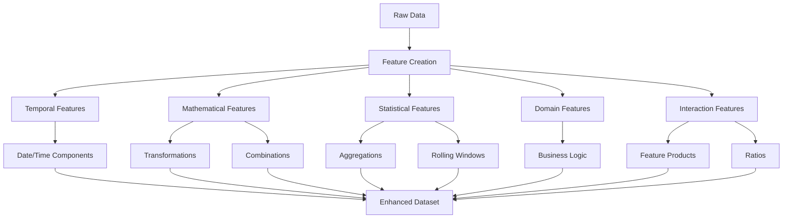

# Feature Creation

## Introduction

Feature creation, also known as feature engineering or feature construction, is the art and science of generating new variables from existing data to improve machine learning model performance. Well-crafted features can transform mediocre models into powerful predictive systems by exposing hidden patterns and relationships that raw data alone cannot reveal.

The process involves domain knowledge, creativity, and systematic exploration of mathematical and logical transformations. Good features make patterns more accessible to algorithms, reduce the need for complex models, and often lead to better generalization. Feature creation is considered one of the highest-value activities in applied machine learning, often providing greater performance gains than algorithm selection or hyperparameter tuning.



## Temporal Feature Engineering

```python
import pandas as pd
import numpy as np
from datetime import datetime, timedelta

class TemporalFeatureCreator:
    """Create time-based features from datetime columns"""

    @staticmethod
    def extract_datetime_components(df, date_column):
        """Extract comprehensive datetime features"""
        df = df.copy()
        date_col = pd.to_datetime(df[date_column])

        # Basic components
        df[f'{date_column}_year'] = date_col.dt.year
        df[f'{date_column}_month'] = date_col.dt.month
        df[f'{date_column}_day'] = date_col.dt.day
        df[f'{date_column}_dayofweek'] = date_col.dt.dayofweek
        df[f'{date_column}_dayofyear'] = date_col.dt.dayofyear
        df[f'{date_column}_week'] = date_col.dt.isocalendar().week
        df[f'{date_column}_quarter'] = date_col.dt.quarter

        # Time components
        df[f'{date_column}_hour'] = date_col.dt.hour
        df[f'{date_column}_minute'] = date_col.dt.minute

        # Cyclical features (preserves circular nature of time)
        df[f'{date_column}_month_sin'] = np.sin(2 * np.pi * date_col.dt.month / 12)
        df[f'{date_column}_month_cos'] = np.cos(2 * np.pi * date_col.dt.month / 12)
        df[f'{date_column}_day_sin'] = np.sin(2 * np.pi * date_col.dt.day / 31)
        df[f'{date_column}_day_cos'] = np.cos(2 * np.pi * date_col.dt.day / 31)

        # Boolean features
        df[f'{date_column}_is_weekend'] = date_col.dt.dayofweek.isin([5, 6]).astype(int)
        df[f'{date_column}_is_month_start'] = date_col.dt.is_month_start.astype(int)
        df[f'{date_column}_is_month_end'] = date_col.dt.is_month_end.astype(int)
        df[f'{date_column}_is_quarter_start'] = date_col.dt.is_quarter_start.astype(int)
        df[f'{date_column}_is_quarter_end'] = date_col.dt.is_quarter_end.astype(int)

        return df

    @staticmethod
    def create_time_since_features(df, date_column, reference_date=None):
        """Create features measuring time elapsed"""
        df = df.copy()
        date_col = pd.to_datetime(df[date_column])

        if reference_date is None:
            reference_date = date_col.max()
        else:
            reference_date = pd.to_datetime(reference_date)

        # Time differences
        time_diff = (reference_date - date_col).dt.total_seconds()

        df[f'{date_column}_days_since'] = time_diff / (24 * 3600)
        df[f'{date_column}_weeks_since'] = time_diff / (7 * 24 * 3600)
        df[f'{date_column}_months_since'] = time_diff / (30 * 24 * 3600)

        return df

# Example usage
dates = pd.date_range('2024-01-01', periods=365, freq='D')
df_temporal = pd.DataFrame({
    'transaction_date': dates,
    'amount': np.random.uniform(10, 1000, len(dates))
})

# Create temporal features
temporal_creator = TemporalFeatureCreator()
df_temporal = temporal_creator.extract_datetime_components(df_temporal, 'transaction_date')
df_temporal = temporal_creator.create_time_since_features(df_temporal, 'transaction_date')

print("Temporal Features Created:")
print(df_temporal.columns.tolist())
print("\nSample Data:")
print(df_temporal.head())
```

## Mathematical Transformations

```python
class MathematicalFeatureCreator:
    """Create features using mathematical transformations"""

    @staticmethod
    def create_polynomial_features(df, columns, degree=2):
        """Create polynomial features"""
        df = df.copy()

        for col in columns:
            for d in range(2, degree + 1):
                df[f'{col}_pow{d}'] = df[col] ** d

        return df

    @staticmethod
    def create_logarithmic_features(df, columns):
        """Create log transformations (useful for skewed data)"""
        df = df.copy()

        for col in columns:
            # Add small constant to avoid log(0)
            df[f'{col}_log'] = np.log1p(df[col].clip(lower=0))
            df[f'{col}_log10'] = np.log10(df[col].clip(lower=0) + 1)

        return df

    @staticmethod
    def create_root_features(df, columns):
        """Create root transformations"""
        df = df.copy()

        for col in columns:
            df[f'{col}_sqrt'] = np.sqrt(df[col].clip(lower=0))
            df[f'{col}_cbrt'] = np.cbrt(df[col])

        return df

    @staticmethod
    def create_reciprocal_features(df, columns):
        """Create reciprocal features"""
        df = df.copy()

        for col in columns:
            # Avoid division by zero
            df[f'{col}_reciprocal'] = 1 / (df[col] + 1e-10)

        return df

    @staticmethod
    def create_binning_features(df, column, bins=5, strategy='quantile'):
        """Create binned versions of continuous features"""
        df = df.copy()

        if strategy == 'quantile':
            df[f'{column}_binned'] = pd.qcut(df[column], q=bins, labels=False, duplicates='drop')
        elif strategy == 'uniform':
            df[f'{column}_binned'] = pd.cut(df[column], bins=bins, labels=False)

        return df

# Example usage
df_math = pd.DataFrame({
    'price': np.random.uniform(10, 1000, 1000),
    'quantity': np.random.uniform(1, 100, 1000),
    'distance': np.random.exponential(50, 1000)
})

math_creator = MathematicalFeatureCreator()
df_math = math_creator.create_polynomial_features(df_math, ['price', 'quantity'], degree=2)
df_math = math_creator.create_logarithmic_features(df_math, ['price', 'distance'])
df_math = math_creator.create_root_features(df_math, ['quantity'])
df_math = math_creator.create_binning_features(df_math, 'price', bins=5, strategy='quantile')

print("\nMathematical Features Sample:")
print(df_math.head())
print(f"\nTotal features: {len(df_math.columns)}")
```

## Interaction and Combination Features

```python
class InteractionFeatureCreator:
    """Create features from interactions between existing features"""

    @staticmethod
    def create_pairwise_products(df, columns):
        """Create products of all column pairs"""
        df = df.copy()

        for i, col1 in enumerate(columns):
            for col2 in columns[i+1:]:
                df[f'{col1}_x_{col2}'] = df[col1] * df[col2]

        return df

    @staticmethod
    def create_pairwise_ratios(df, columns):
        """Create ratios of all column pairs"""
        df = df.copy()

        for i, col1 in enumerate(columns):
            for col2 in columns[i+1:]:
                # Safe division
                df[f'{col1}_div_{col2}'] = df[col1] / (df[col2] + 1e-10)
                df[f'{col2}_div_{col1}'] = df[col2] / (df[col1] + 1e-10)

        return df

    @staticmethod
    def create_pairwise_differences(df, columns):
        """Create differences between column pairs"""
        df = df.copy()

        for i, col1 in enumerate(columns):
            for col2 in columns[i+1:]:
                df[f'{col1}_minus_{col2}'] = df[col1] - df[col2]
                df[f'{col2}_minus_{col1}'] = df[col2] - df[col1]

        return df

    @staticmethod
    def create_aggregate_features(df, columns):
        """Create aggregate features across columns"""
        df = df.copy()

        feature_matrix = df[columns].values

        df['sum_features'] = feature_matrix.sum(axis=1)
        df['mean_features'] = feature_matrix.mean(axis=1)
        df['std_features'] = feature_matrix.std(axis=1)
        df['min_features'] = feature_matrix.min(axis=1)
        df['max_features'] = feature_matrix.max(axis=1)
        df['range_features'] = df['max_features'] - df['min_features']

        return df

# Example usage
df_interaction = pd.DataFrame({
    'feature_A': np.random.randn(500),
    'feature_B': np.random.randn(500),
    'feature_C': np.random.randn(500)
})

interaction_creator = InteractionFeatureCreator()
df_interaction = interaction_creator.create_pairwise_products(
    df_interaction, ['feature_A', 'feature_B', 'feature_C']
)
df_interaction = interaction_creator.create_pairwise_ratios(
    df_interaction, ['feature_A', 'feature_B']
)
df_interaction = interaction_creator.create_aggregate_features(
    df_interaction, ['feature_A', 'feature_B', 'feature_C']
)

print("\nInteraction Features Created:")
print(df_interaction.columns.tolist())
print(f"Total features: {len(df_interaction.columns)}")
```

## Statistical and Rolling Features

```python
class StatisticalFeatureCreator:
    """Create statistical features, particularly useful for time series"""

    @staticmethod
    def create_rolling_features(df, column, windows=[7, 14, 30]):
        """Create rolling window statistics"""
        df = df.copy()

        for window in windows:
            df[f'{column}_rolling_mean_{window}'] = df[column].rolling(window, min_periods=1).mean()
            df[f'{column}_rolling_std_{window}'] = df[column].rolling(window, min_periods=1).std()
            df[f'{column}_rolling_min_{window}'] = df[column].rolling(window, min_periods=1).min()
            df[f'{column}_rolling_max_{window}'] = df[column].rolling(window, min_periods=1).max()
            df[f'{column}_rolling_median_{window}'] = df[column].rolling(window, min_periods=1).median()

        return df

    @staticmethod
    def create_lag_features(df, column, lags=[1, 7, 30]):
        """Create lagged features"""
        df = df.copy()

        for lag in lags:
            df[f'{column}_lag_{lag}'] = df[column].shift(lag)

        return df

    @staticmethod
    def create_expanding_features(df, column):
        """Create expanding window features"""
        df = df.copy()

        df[f'{column}_expanding_mean'] = df[column].expanding(min_periods=1).mean()
        df[f'{column}_expanding_std'] = df[column].expanding(min_periods=1).std()
        df[f'{column}_cumsum'] = df[column].cumsum()
        df[f'{column}_cummax'] = df[column].cummax()
        df[f'{column}_cummin'] = df[column].cummin()

        return df

# Example with time series data
df_stats = pd.DataFrame({
    'date': pd.date_range('2024-01-01', periods=100),
    'sales': np.random.uniform(100, 1000, 100) + np.arange(100) * 5  # Trend
})

stats_creator = StatisticalFeatureCreator()
df_stats = stats_creator.create_rolling_features(df_stats, 'sales', windows=[7, 14])
df_stats = stats_creator.create_lag_features(df_stats, 'sales', lags=[1, 7])
df_stats = stats_creator.create_expanding_features(df_stats, 'sales')

print("\nStatistical Features Sample:")
print(df_stats.tail(10))
```

## Domain-Specific Feature Creation

```python
class DomainFeatureCreator:
    """Create domain-specific features based on business logic"""

    @staticmethod
    def create_ecommerce_features(df):
        """E-commerce specific features"""
        df = df.copy()

        # Assume df has: price, quantity, discount_pct, shipping_cost
        df['total_value'] = df['price'] * df['quantity']
        df['discount_amount'] = df['total_value'] * df['discount_pct']
        df['final_price'] = df['total_value'] - df['discount_amount'] + df['shipping_cost']
        df['avg_item_price'] = df['total_value'] / df['quantity']
        df['shipping_to_price_ratio'] = df['shipping_cost'] / (df['total_value'] + 1e-10)
        df['is_bulk_order'] = (df['quantity'] > df['quantity'].quantile(0.75)).astype(int)
        df['is_high_value'] = (df['total_value'] > df['total_value'].quantile(0.9)).astype(int)

        return df

    @staticmethod
    def create_customer_features(df):
        """Customer behavior features"""
        df = df.copy()

        # Group by customer and create aggregates
        customer_features = df.groupby('customer_id').agg({
            'transaction_id': 'count',  # Number of transactions
            'amount': ['sum', 'mean', 'std', 'min', 'max'],
            'date': lambda x: (x.max() - x.min()).days  # Customer lifetime
        }).reset_index()

        customer_features.columns = [
            'customer_id', 'transaction_count', 'total_spent',
            'avg_transaction', 'std_transaction', 'min_transaction',
            'max_transaction', 'customer_lifetime_days'
        ]

        # Merge back
        df = df.merge(customer_features, on='customer_id', how='left')

        return df

# Example e-commerce features
df_ecommerce = pd.DataFrame({
    'price': np.random.uniform(10, 500, 200),
    'quantity': np.random.randint(1, 20, 200),
    'discount_pct': np.random.uniform(0, 0.3, 200),
    'shipping_cost': np.random.uniform(5, 50, 200)
})

domain_creator = DomainFeatureCreator()
df_ecommerce = domain_creator.create_ecommerce_features(df_ecommerce)

print("\nE-commerce Domain Features:")
print(df_ecommerce.head())
print(f"\nNew features: {[col for col in df_ecommerce.columns if col not in ['price', 'quantity', 'discount_pct', 'shipping_cost']]}")
```

## Best Practices for Feature Creation

```python
class FeatureCreationBestPractices:
    """Guidelines and utilities for effective feature creation"""

    @staticmethod
    def handle_infinite_values(df):
        """Replace infinite values with NaN or extremes"""
        df = df.copy()
        df.replace([np.inf, -np.inf], np.nan, inplace=True)
        return df

    @staticmethod
    def create_features_safely(df, feature_func, *args, **kwargs):
        """Wrapper to create features with error handling"""
        try:
            df_new = feature_func(df, *args, **kwargs)
            df_new = FeatureCreationBestPractices.handle_infinite_values(df_new)
            return df_new
        except Exception as e:
            print(f"Error in feature creation: {e}")
            return df

    @staticmethod
    def validate_features(df, original_columns):
        """Validate newly created features"""
        new_columns = [col for col in df.columns if col not in original_columns]

        validation_report = {
            'new_features': len(new_columns),
            'features_with_nulls': sum(df[new_columns].isnull().any()),
            'constant_features': sum(df[new_columns].nunique() == 1),
            'features_list': new_columns
        }

        return validation_report

# Example validation
original_cols = list(df_ecommerce.columns)
validation = FeatureCreationBestPractices.validate_features(df_ecommerce, ['price', 'quantity', 'discount_pct', 'shipping_cost'])

print("\nFeature Validation Report:")
print(f"New features created: {validation['new_features']}")
print(f"Features with nulls: {validation['features_with_nulls']}")
print(f"Constant features: {validation['constant_features']}")
```

## Summary

Feature creation is a critical step in the machine learning pipeline that can dramatically improve model performance. Key takeaways:

**Core Strategies:**
- **Temporal Features**: Extract components from dates, create cyclical encodings, calculate time differences
- **Mathematical Transformations**: Apply polynomials, logarithms, roots, and reciprocals to expose non-linear patterns
- **Interactions**: Combine features through products, ratios, and differences to capture relationships
- **Statistical Features**: Use rolling windows, lags, and expanding statistics for time series
- **Domain Features**: Apply business logic and domain expertise to create meaningful variables

**Best Practices:**
- Start with domain knowledge and exploratory data analysis
- Handle edge cases like division by zero and infinite values
- Use cyclical encoding for circular features (months, hours, days of week)
- Create both simple and complex features incrementally
- Validate features for null values, constant values, and data leakage
- Document feature creation logic for reproducibility
- Balance feature quantity with model complexity and overfitting risk
- Test features on validation data before deployment

**Considerations:**
- More features can lead to overfitting; use feature selection afterward
- Computational cost increases with feature count
- Some features may introduce data leakage if not carefully designed
- Feature creation should be part of your ML pipeline to ensure consistency

Well-engineered features make patterns more accessible to algorithms and often provide greater performance gains than sophisticated models alone.
