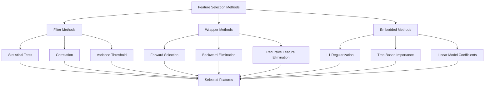

# Feature Selection

## Introduction

Feature selection is the process of identifying and retaining the most informative, relevant, and non-redundant features while removing those that contribute little to model performance or introduce noise. It's a critical step that improves model accuracy, reduces overfitting, decreases training time, and enhances model interpretability.

In real-world applications, datasets often contain hundreds or thousands of features, many of which may be irrelevant, redundant, or even harmful to model performance. Effective feature selection helps address the curse of dimensionality, where model performance degrades as the number of features increases relative to the number of samples. The goal is to find the optimal subset that maximizes predictive power while minimizing complexity.



## Filter Methods

Filter methods evaluate features independently of any machine learning algorithm using statistical tests and measures. They're fast and scalable but don't account for feature interactions.

```python
import pandas as pd
import numpy as np
from sklearn.feature_selection import (
    SelectKBest, f_classif, f_regression, chi2,
    mutual_info_classif, mutual_info_regression, VarianceThreshold
)
from sklearn.datasets import make_classification, make_regression
import matplotlib.pyplot as plt

class FilterMethods:
    """Implement various filter-based feature selection methods"""

    @staticmethod
    def variance_threshold_selection(X, threshold=0.0):
        """
        Remove features with low variance
        Features with zero or very low variance contain little information
        """
        selector = VarianceThreshold(threshold=threshold)
        X_selected = selector.fit_transform(X)

        selected_features = X.columns[selector.get_support()].tolist()
        feature_variances = pd.DataFrame({
            'feature': X.columns,
            'variance': X.var()
        }).sort_values('variance', ascending=False)

        return X_selected, selected_features, feature_variances

    @staticmethod
    def univariate_selection(X, y, score_func=f_classif, k=10):
        """
        Select features based on univariate statistical tests
        score_func: f_classif, f_regression, chi2, mutual_info_classif, etc.
        """
        selector = SelectKBest(score_func=score_func, k=k)
        X_selected = selector.fit_transform(X, y)

        selected_features = X.columns[selector.get_support()].tolist()

        # Get scores for all features
        scores = pd.DataFrame({
            'feature': X.columns,
            'score': selector.scores_,
            'selected': selector.get_support()
        }).sort_values('score', ascending=False)

        return X_selected, selected_features, scores

    @staticmethod
    def correlation_selection(X, y=None, threshold=0.95, method='pearson'):
        """
        Remove highly correlated features
        Keep one feature from each correlated pair
        """
        # Calculate correlation matrix
        corr_matrix = X.corr(method=method).abs()

        # Select upper triangle of correlation matrix
        upper = corr_matrix.where(
            np.triu(np.ones(corr_matrix.shape), k=1).astype(bool)
        )

        # Find features with correlation greater than threshold
        to_drop = [column for column in upper.columns if any(upper[column] > threshold)]

        X_selected = X.drop(columns=to_drop)
        selected_features = X_selected.columns.tolist()

        return X_selected, selected_features, corr_matrix

    @staticmethod
    def mutual_information_selection(X, y, task='classification', k=10):
        """
        Select features based on mutual information
        Captures non-linear relationships
        """
        if task == 'classification':
            mi_scores = mutual_info_classif(X, y, random_state=42)
        else:
            mi_scores = mutual_info_regression(X, y, random_state=42)

        mi_df = pd.DataFrame({
            'feature': X.columns,
            'mi_score': mi_scores
        }).sort_values('mi_score', ascending=False)

        selected_features = mi_df.head(k)['feature'].tolist()
        X_selected = X[selected_features]

        return X_selected, selected_features, mi_df

# Example: Classification task
X_class, y_class = make_classification(
    n_samples=1000, n_features=20, n_informative=10,
    n_redundant=5, n_repeated=0, random_state=42
)
X_class_df = pd.DataFrame(X_class, columns=[f'feature_{i}' for i in range(20)])

filter_methods = FilterMethods()

# Variance threshold
print("FILTER METHODS EXAMPLES")
print("="*60)

X_var, features_var, variances = filter_methods.variance_threshold_selection(
    X_class_df, threshold=0.5
)
print("\nVariance Threshold Selection:")
print(f"Original features: {X_class_df.shape[1]}")
print(f"Selected features: {len(features_var)}")
print(f"\nTop 5 features by variance:")
print(variances.head())

# Univariate selection
X_uni, features_uni, scores = filter_methods.univariate_selection(
    X_class_df, y_class, score_func=f_classif, k=10
)
print("\n\nUnivariate Selection (ANOVA F-test):")
print(f"Selected {len(features_uni)} features")
print(f"\nTop 5 features by score:")
print(scores.head())

# Correlation-based selection
X_corr, features_corr, corr_matrix = filter_methods.correlation_selection(
    X_class_df, threshold=0.8
)
print("\n\nCorrelation-based Selection:")
print(f"Original features: {X_class_df.shape[1]}")
print(f"After removing correlated features: {len(features_corr)}")

# Mutual information
X_mi, features_mi, mi_scores = filter_methods.mutual_information_selection(
    X_class_df, y_class, task='classification', k=10
)
print("\n\nMutual Information Selection:")
print(f"Selected {len(features_mi)} features")
print(f"\nTop 5 features by MI score:")
print(mi_scores.head())
```

## Wrapper Methods

Wrapper methods evaluate feature subsets by training and testing a specific machine learning model. They account for feature interactions but are computationally expensive.

```python
from sklearn.feature_selection import RFE, RFECV, SequentialFeatureSelector
from sklearn.linear_model import LogisticRegression
from sklearn.ensemble import RandomForestClassifier
from sklearn.model_selection import cross_val_score

class WrapperMethods:
    """Implement wrapper-based feature selection methods"""

    @staticmethod
    def recursive_feature_elimination(X, y, estimator=None, n_features_to_select=10):
        """
        Recursively remove features and build model on remaining attributes
        """
        if estimator is None:
            estimator = LogisticRegression(max_iter=1000, random_state=42)

        rfe = RFE(estimator=estimator, n_features_to_select=n_features_to_select)
        rfe.fit(X, y)

        selected_features = X.columns[rfe.support_].tolist()

        # Get feature ranking
        ranking = pd.DataFrame({
            'feature': X.columns,
            'ranking': rfe.ranking_,
            'selected': rfe.support_
        }).sort_values('ranking')

        X_selected = X[selected_features]

        return X_selected, selected_features, ranking

    @staticmethod
    def rfecv_selection(X, y, estimator=None, cv=5, scoring='accuracy'):
        """
        RFE with cross-validation to automatically select number of features
        """
        if estimator is None:
            estimator = LogisticRegression(max_iter=1000, random_state=42)

        rfecv = RFECV(estimator=estimator, cv=cv, scoring=scoring, n_jobs=-1)
        rfecv.fit(X, y)

        selected_features = X.columns[rfecv.support_].tolist()

        results = {
            'n_features': rfecv.n_features_,
            'cv_scores': rfecv.cv_results_,
            'selected_features': selected_features
        }

        X_selected = X[selected_features]

        return X_selected, selected_features, results

    @staticmethod
    def forward_selection(X, y, estimator=None, n_features_to_select=10, cv=5):
        """
        Forward feature selection: start with empty set, add features one by one
        """
        if estimator is None:
            estimator = LogisticRegression(max_iter=1000, random_state=42)

        sfs = SequentialFeatureSelector(
            estimator=estimator,
            n_features_to_select=n_features_to_select,
            direction='forward',
            cv=cv,
            n_jobs=-1
        )
        sfs.fit(X, y)

        selected_features = X.columns[sfs.get_support()].tolist()
        X_selected = X[selected_features]

        return X_selected, selected_features

    @staticmethod
    def backward_elimination(X, y, estimator=None, n_features_to_select=10, cv=5):
        """
        Backward feature elimination: start with all features, remove one by one
        """
        if estimator is None:
            estimator = LogisticRegression(max_iter=1000, random_state=42)

        sfs = SequentialFeatureSelector(
            estimator=estimator,
            n_features_to_select=n_features_to_select,
            direction='backward',
            cv=cv,
            n_jobs=-1
        )
        sfs.fit(X, y)

        selected_features = X.columns[sfs.get_support()].tolist()
        X_selected = X[selected_features]

        return X_selected, selected_features

# Example wrapper methods
wrapper_methods = WrapperMethods()

print("\n\nWRAPPER METHODS EXAMPLES")
print("="*60)

# RFE
X_rfe, features_rfe, ranking = wrapper_methods.recursive_feature_elimination(
    X_class_df, y_class, n_features_to_select=10
)
print("\nRecursive Feature Elimination (RFE):")
print(f"Selected {len(features_rfe)} features")
print(f"\nFeature ranking:")
print(ranking.head(10))

# RFECV
X_rfecv, features_rfecv, results = wrapper_methods.rfecv_selection(
    X_class_df, y_class, cv=5, scoring='accuracy'
)
print("\n\nRFE with Cross-Validation:")
print(f"Optimal number of features: {results['n_features']}")
print(f"Selected features: {features_rfecv}")

# Forward selection (smaller dataset for speed)
X_forward, features_forward = wrapper_methods.forward_selection(
    X_class_df, y_class, n_features_to_select=5, cv=3
)
print("\n\nForward Sequential Selection:")
print(f"Selected {len(features_forward)} features: {features_forward}")
```

## Embedded Methods

Embedded methods perform feature selection during the model training process. They're more efficient than wrapper methods while capturing feature interactions.

```python
from sklearn.linear_model import Lasso, Ridge, ElasticNet, LogisticRegression
from sklearn.ensemble import RandomForestClassifier, GradientBoostingClassifier
from sklearn.tree import DecisionTreeClassifier

class EmbeddedMethods:
    """Implement embedded feature selection methods"""

    @staticmethod
    def l1_regularization_selection(X, y, alpha=0.01, task='classification'):
        """
        Use L1 (Lasso) regularization for feature selection
        L1 drives some coefficients to exactly zero
        """
        if task == 'classification':
            model = LogisticRegression(penalty='l1', C=1/alpha, solver='saga', max_iter=1000, random_state=42)
        else:
            model = Lasso(alpha=alpha, random_state=42)

        model.fit(X, y)

        # Get feature coefficients
        if task == 'classification':
            coef = np.abs(model.coef_[0])
        else:
            coef = np.abs(model.coef_)

        # Select features with non-zero coefficients
        selected_mask = coef > 1e-5
        selected_features = X.columns[selected_mask].tolist()

        coef_df = pd.DataFrame({
            'feature': X.columns,
            'coefficient': coef,
            'selected': selected_mask
        }).sort_values('coefficient', ascending=False)

        X_selected = X[selected_features]

        return X_selected, selected_features, coef_df

    @staticmethod
    def tree_based_selection(X, y, estimator=None, threshold='mean'):
        """
        Use tree-based model feature importance for selection
        """
        if estimator is None:
            estimator = RandomForestClassifier(n_estimators=100, random_state=42)

        estimator.fit(X, y)

        # Get feature importances
        importances = estimator.feature_importances_

        # Determine threshold
        if threshold == 'mean':
            thresh = np.mean(importances)
        elif threshold == 'median':
            thresh = np.median(importances)
        else:
            thresh = threshold

        selected_mask = importances >= thresh
        selected_features = X.columns[selected_mask].tolist()

        importance_df = pd.DataFrame({
            'feature': X.columns,
            'importance': importances,
            'selected': selected_mask
        }).sort_values('importance', ascending=False)

        X_selected = X[selected_features]

        return X_selected, selected_features, importance_df

    @staticmethod
    def elastic_net_selection(X, y, alpha=0.01, l1_ratio=0.5, task='classification'):
        """
        Use Elastic Net (combination of L1 and L2) for feature selection
        l1_ratio: 0=L2 only, 1=L1 only, 0.5=equal mix
        """
        if task == 'classification':
            model = LogisticRegression(
                penalty='elasticnet',
                C=1/alpha,
                l1_ratio=l1_ratio,
                solver='saga',
                max_iter=1000,
                random_state=42
            )
        else:
            model = ElasticNet(alpha=alpha, l1_ratio=l1_ratio, random_state=42)

        model.fit(X, y)

        if task == 'classification':
            coef = np.abs(model.coef_[0])
        else:
            coef = np.abs(model.coef_)

        selected_mask = coef > 1e-5
        selected_features = X.columns[selected_mask].tolist()

        coef_df = pd.DataFrame({
            'feature': X.columns,
            'coefficient': coef,
            'selected': selected_mask
        }).sort_values('coefficient', ascending=False)

        X_selected = X[selected_features]

        return X_selected, selected_features, coef_df

# Example embedded methods
embedded_methods = EmbeddedMethods()

print("\n\nEMBEDDED METHODS EXAMPLES")
print("="*60)

# L1 regularization
X_l1, features_l1, coef_l1 = embedded_methods.l1_regularization_selection(
    X_class_df, y_class, alpha=0.1, task='classification'
)
print("\nL1 Regularization (Lasso) Selection:")
print(f"Selected {len(features_l1)} features")
print(f"\nTop 5 features by absolute coefficient:")
print(coef_l1.head())

# Tree-based selection
X_tree, features_tree, importance_tree = embedded_methods.tree_based_selection(
    X_class_df, y_class, threshold='mean'
)
print("\n\nTree-Based Feature Importance:")
print(f"Selected {len(features_tree)} features above mean importance")
print(f"\nTop 5 most important features:")
print(importance_tree.head())

# Elastic Net
X_enet, features_enet, coef_enet = embedded_methods.elastic_net_selection(
    X_class_df, y_class, alpha=0.1, l1_ratio=0.5, task='classification'
)
print("\n\nElastic Net Selection:")
print(f"Selected {len(features_enet)} features")
```

## Feature Selection Evaluation

```python
from sklearn.model_selection import cross_val_score, train_test_split
from sklearn.metrics import accuracy_score, f1_score

class FeatureSelectionEvaluator:
    """Evaluate the impact of feature selection"""

    @staticmethod
    def compare_performance(X_original, X_selected, y, estimator=None, cv=5):
        """
        Compare model performance with and without feature selection
        """
        if estimator is None:
            estimator = RandomForestClassifier(n_estimators=100, random_state=42)

        # Performance with all features
        scores_original = cross_val_score(estimator, X_original, y, cv=cv, scoring='accuracy')

        # Performance with selected features
        scores_selected = cross_val_score(estimator, X_selected, y, cv=cv, scoring='accuracy')

        comparison = {
            'original_features': X_original.shape[1],
            'selected_features': X_selected.shape[1],
            'reduction_pct': (1 - X_selected.shape[1] / X_original.shape[1]) * 100,
            'original_mean_score': scores_original.mean(),
            'original_std_score': scores_original.std(),
            'selected_mean_score': scores_selected.mean(),
            'selected_std_score': scores_selected.std(),
            'score_improvement': scores_selected.mean() - scores_original.mean()
        }

        return comparison

    @staticmethod
    def stability_analysis(X, y, selection_method, n_iterations=10, test_size=0.3):
        """
        Analyze stability of feature selection across different data samples
        """
        selected_features_list = []

        for i in range(n_iterations):
            # Create different train/test splits
            X_train, X_test, y_train, y_test = train_test_split(
                X, y, test_size=test_size, random_state=i
            )

            # Apply feature selection
            _, selected_features, _ = selection_method(X_train, y_train)
            selected_features_list.append(set(selected_features))

        # Calculate stability metrics
        all_features = set()
        for features in selected_features_list:
            all_features.update(features)

        # Feature frequency: how often each feature is selected
        feature_freq = {}
        for feature in all_features:
            count = sum(1 for features in selected_features_list if feature in features)
            feature_freq[feature] = count / n_iterations

        # Stability: average Jaccard similarity between iterations
        from itertools import combinations
        similarities = []
        for set1, set2 in combinations(selected_features_list, 2):
            if len(set1.union(set2)) > 0:
                jaccard = len(set1.intersection(set2)) / len(set1.union(set2))
                similarities.append(jaccard)

        stability_score = np.mean(similarities) if similarities else 0

        stability_report = {
            'stability_score': stability_score,
            'feature_frequencies': pd.DataFrame(
                list(feature_freq.items()),
                columns=['feature', 'selection_frequency']
            ).sort_values('selection_frequency', ascending=False),
            'avg_features_selected': np.mean([len(f) for f in selected_features_list])
        }

        return stability_report

# Example evaluation
evaluator = FeatureSelectionEvaluator()

print("\n\nFEATURE SELECTION EVALUATION")
print("="*60)

# Compare performance
comparison = evaluator.compare_performance(
    X_class_df, X_tree, y_class, cv=5
)
print("\nPerformance Comparison:")
print(f"Original features: {comparison['original_features']}")
print(f"Selected features: {comparison['selected_features']}")
print(f"Feature reduction: {comparison['reduction_pct']:.1f}%")
print(f"Original accuracy: {comparison['original_mean_score']:.4f} ± {comparison['original_std_score']:.4f}")
print(f"Selected accuracy: {comparison['selected_mean_score']:.4f} ± {comparison['selected_std_score']:.4f}")
print(f"Score improvement: {comparison['score_improvement']:.4f}")

# Stability analysis
stability = evaluator.stability_analysis(
    X_class_df, y_class,
    lambda X, y: embedded_methods.tree_based_selection(X, y, threshold='mean'),
    n_iterations=10
)
print("\n\nStability Analysis:")
print(f"Stability score: {stability['stability_score']:.4f}")
print(f"Average features selected: {stability['avg_features_selected']:.1f}")
print(f"\nMost frequently selected features:")
print(stability['feature_frequencies'].head(10))
```

## Choosing the Right Method

```python
class FeatureSelectionGuide:
    """Guide for selecting appropriate feature selection method"""

    @staticmethod
    def recommend_method(n_samples, n_features, has_labels=True,
                        task_type='classification', computational_budget='medium'):
        """
        Recommend feature selection method based on problem characteristics
        """
        recommendations = []

        # High dimensionality
        if n_features > 100:
            recommendations.append({
                'method': 'Variance Threshold + Univariate Selection',
                'reason': 'Quick filtering for high-dimensional data',
                'priority': 'High'
            })
            recommendations.append({
                'method': 'L1 Regularization',
                'reason': 'Efficient for many features',
                'priority': 'High'
            })

        # Low sample size
        if n_samples < 1000:
            recommendations.append({
                'method': 'Filter Methods',
                'reason': 'Less prone to overfitting with small samples',
                'priority': 'High'
            })

        # Computational constraints
        if computational_budget == 'low':
            recommendations.append({
                'method': 'Filter Methods (Correlation, Variance)',
                'reason': 'Very fast, no model training required',
                'priority': 'High'
            })
        elif computational_budget == 'high':
            recommendations.append({
                'method': 'Wrapper Methods (RFECV)',
                'reason': 'Best performance, considers feature interactions',
                'priority': 'High'
            })

        # Task-specific
        if task_type == 'classification':
            recommendations.append({
                'method': 'Random Forest Feature Importance',
                'reason': 'Handles non-linear relationships, built-in for trees',
                'priority': 'Medium'
            })

        # General recommendations
        recommendations.append({
            'method': 'Mutual Information',
            'reason': 'Captures non-linear relationships without model training',
            'priority': 'Medium'
        })

        return sorted(recommendations,
                     key=lambda x: {'High': 0, 'Medium': 1, 'Low': 2}[x['priority']])

# Example recommendation
guide = FeatureSelectionGuide()

print("\n\nFEATURE SELECTION RECOMMENDATIONS")
print("="*60)

recommendations = guide.recommend_method(
    n_samples=1000,
    n_features=100,
    task_type='classification',
    computational_budget='medium'
)

print("\nRecommended methods for your dataset:")
for i, rec in enumerate(recommendations, 1):
    print(f"\n{i}. {rec['method']} [{rec['priority']} Priority]")
    print(f"   Reason: {rec['reason']}")
```

## Summary

Feature selection is essential for building efficient, interpretable, and accurate machine learning models. Key takeaways:

**Filter Methods:**
- Fast and scalable, independent of model
- Use statistical tests: variance threshold, ANOVA F-test, chi-squared, mutual information
- Don't capture feature interactions
- Best for initial exploration and high-dimensional data

**Wrapper Methods:**
- Evaluate feature subsets using actual model performance
- RFE, forward selection, backward elimination
- Account for feature interactions but computationally expensive
- Best when you have sufficient computational resources

**Embedded Methods:**
- Perform selection during model training
- L1/L2 regularization, tree-based importance
- Balance between filter and wrapper methods
- Best for most practical applications

**Best Practices:**
- Start with filter methods for quick reduction
- Use embedded methods for balanced performance
- Reserve wrapper methods for final optimization
- Evaluate stability across different data samples
- Compare model performance before and after selection
- Consider domain knowledge alongside statistical methods
- Watch for data leakage when selecting features
- Use cross-validation to assess selected features

**Selection Criteria:**
- Dataset size (samples vs features)
- Computational resources available
- Need for interpretability
- Presence of feature interactions
- Model type being used

Effective feature selection reduces overfitting, improves training speed, enhances interpretability, and often leads to better generalization on unseen data.
