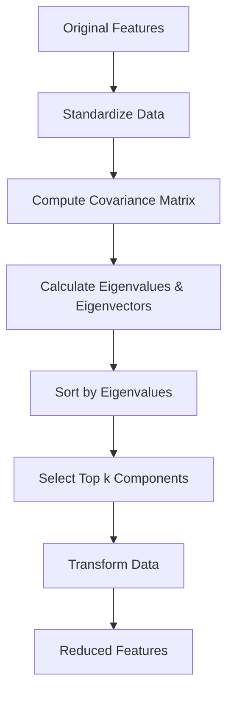

# Feature Extraction

## Introduction

Feature extraction is the process of transforming raw data into a set of features that better represent the underlying patterns in the data. Unlike feature selection, which chooses a subset of existing features, feature extraction creates new features by combining or transforming the original ones. This technique is particularly valuable when working with high-dimensional data, unstructured data like text and images, or when you need to capture complex relationships between variables.

Feature extraction reduces computational complexity, mitigates the curse of dimensionality, and can improve model performance by creating more meaningful representations of the data. Modern machine learning heavily relies on feature extraction, from Principal Component Analysis (PCA) in traditional methods to deep learning autoencoders that learn hierarchical representations.

## Principal Component Analysis (PCA)

PCA is the most widely used linear feature extraction technique. It identifies the directions of maximum variance in the data and projects it onto a lower-dimensional subspace while preserving as much information as possible.

### How PCA Works



### Implementing PCA

```python
import numpy as np
import pandas as pd
from sklearn.decomposition import PCA
from sklearn.preprocessing import StandardScaler
import matplotlib.pyplot as plt

# Generate sample data
np.random.seed(42)
n_samples = 1000
n_features = 50

# Create correlated features
X = np.random.randn(n_samples, n_features)
X[:, 10:20] = X[:, 0:10] + np.random.randn(n_samples, 10) * 0.1
X[:, 20:30] = X[:, 5:15] * 2 + np.random.randn(n_samples, 10) * 0.2

print(f"Original data shape: {X.shape}")

# Standardize features (important for PCA)
scaler = StandardScaler()
X_scaled = scaler.fit_transform(X)

# Apply PCA with variance threshold
pca = PCA(n_components=0.95)  # Retain 95% of variance
X_pca = pca.fit_transform(X_scaled)

print(f"Reduced data shape: {X_pca.shape}")
print(f"Explained variance ratio: {pca.explained_variance_ratio_.sum():.4f}")
print(f"Number of components: {pca.n_components_}")

# Analyze variance contribution
cumulative_variance = np.cumsum(pca.explained_variance_ratio_)
for i in range(min(10, len(cumulative_variance))):
    print(f"PC{i+1}: {pca.explained_variance_ratio_[i]:.4f} "
          f"(Cumulative: {cumulative_variance[i]:.4f})")

# Inverse transform to see reconstruction
X_reconstructed = pca.inverse_transform(X_pca)
reconstruction_error = np.mean((X_scaled - X_reconstructed) ** 2)
print(f"\nReconstruction error: {reconstruction_error:.6f}")
```

### Choosing Number of Components

```python
# Method 1: Explained variance threshold
pca_full = PCA()
pca_full.fit(X_scaled)

explained_variance = np.cumsum(pca_full.explained_variance_ratio_)

# Find components for different thresholds
for threshold in [0.80, 0.90, 0.95, 0.99]:
    n_components = np.argmax(explained_variance >= threshold) + 1
    print(f"{threshold*100}% variance: {n_components} components")

# Method 2: Scree plot analysis
def plot_scree(pca_model):
    """Create scree plot to visualize variance explained"""
    variance_ratio = pca_model.explained_variance_ratio_
    cumulative_variance = np.cumsum(variance_ratio)

    components = range(1, len(variance_ratio) + 1)

    print("Scree plot data:")
    print(f"Components: {components[:10]}")
    print(f"Individual variance: {variance_ratio[:10]}")
    print(f"Cumulative variance: {cumulative_variance[:10]}")

plot_scree(pca_full)
```

## Text Feature Extraction

### TF-IDF (Term Frequency-Inverse Document Frequency)

TF-IDF transforms text into numerical features by weighting terms based on their importance.

```python
from sklearn.feature_extraction.text import TfidfVectorizer, CountVectorizer

# Sample text documents
documents = [
    "Machine learning is a subset of artificial intelligence",
    "Deep learning uses neural networks with multiple layers",
    "Natural language processing enables computers to understand text",
    "Computer vision allows machines to interpret images",
    "Reinforcement learning trains agents through rewards"
]

# TF-IDF Vectorization
tfidf = TfidfVectorizer(max_features=20, stop_words='english')
tfidf_matrix = tfidf.fit_transform(documents)

print(f"TF-IDF shape: {tfidf_matrix.shape}")
print(f"Feature names: {tfidf.get_feature_names_out()}")

# Convert to DataFrame for better visualization
tfidf_df = pd.DataFrame(
    tfidf_matrix.toarray(),
    columns=tfidf.get_feature_names_out()
)
print("\nTF-IDF Matrix:")
print(tfidf_df.head())

# Analyze feature importance
feature_importance = tfidf_matrix.sum(axis=0).A1
feature_names = tfidf.get_feature_names_out()
importance_df = pd.DataFrame({
    'feature': feature_names,
    'importance': feature_importance
}).sort_values('importance', ascending=False)

print("\nTop features by importance:")
print(importance_df.head(10))
```

### Advanced Text Features: N-grams

```python
# Bigram and Trigram extraction
ngram_vectorizer = TfidfVectorizer(
    ngram_range=(1, 3),  # Unigrams, bigrams, and trigrams
    max_features=30,
    stop_words='english'
)

ngram_matrix = ngram_vectorizer.fit_transform(documents)
ngram_features = ngram_vectorizer.get_feature_names_out()

print(f"N-gram features shape: {ngram_matrix.shape}")
print(f"N-gram features sample: {ngram_features[:10]}")

# Character-level features
char_vectorizer = TfidfVectorizer(
    analyzer='char',
    ngram_range=(2, 4),
    max_features=20
)

char_matrix = char_vectorizer.fit_transform(documents)
print(f"\nCharacter n-grams shape: {char_matrix.shape}")
print(f"Character features: {char_vectorizer.get_feature_names_out()[:10]}")
```

### Word Embeddings Simulation

```python
# Simulating word embeddings (simplified)
from sklearn.decomposition import TruncatedSVD

# Create word co-occurrence matrix
count_vectorizer = CountVectorizer(max_features=100)
count_matrix = count_vectorizer.fit_transform(documents)

# Use SVD to create dense embeddings
embedding_size = 10
svd = TruncatedSVD(n_components=embedding_size)
word_embeddings = svd.fit_transform(count_matrix.T)

vocab = count_vectorizer.get_feature_names_out()
embeddings_df = pd.DataFrame(
    word_embeddings,
    index=vocab,
    columns=[f'dim_{i}' for i in range(embedding_size)]
)

print(f"Word embeddings shape: {word_embeddings.shape}")
print("\nSample embeddings:")
print(embeddings_df.head())

# Calculate word similarity (cosine similarity)
def cosine_similarity(vec1, vec2):
    return np.dot(vec1, vec2) / (np.linalg.norm(vec1) * np.linalg.norm(vec2))

# Find similar words
def find_similar_words(word, embeddings_df, top_n=3):
    if word not in embeddings_df.index:
        return f"Word '{word}' not in vocabulary"

    word_vec = embeddings_df.loc[word].values
    similarities = []

    for other_word in embeddings_df.index:
        if other_word != word:
            other_vec = embeddings_df.loc[other_word].values
            sim = cosine_similarity(word_vec, other_vec)
            similarities.append((other_word, sim))

    similarities.sort(key=lambda x: x[1], reverse=True)
    return similarities[:top_n]

# Example usage
if 'learning' in embeddings_df.index:
    similar = find_similar_words('learning', embeddings_df)
    print(f"\nWords similar to 'learning': {similar}")
```

## Image Feature Extraction

### Statistical Features

```python
# Simulating image feature extraction
def extract_image_features(image_array):
    """Extract statistical features from image"""
    features = {}

    # Assuming grayscale image (2D array)
    features['mean_intensity'] = np.mean(image_array)
    features['std_intensity'] = np.std(image_array)
    features['min_intensity'] = np.min(image_array)
    features['max_intensity'] = np.max(image_array)
    features['median_intensity'] = np.median(image_array)

    # Histogram features
    hist, _ = np.histogram(image_array.flatten(), bins=10)
    for i, count in enumerate(hist):
        features[f'hist_bin_{i}'] = count

    return features

# Simulate multiple images
np.random.seed(42)
n_images = 100
image_size = (64, 64)

image_features_list = []
for i in range(n_images):
    # Simulate random image
    image = np.random.randint(0, 256, image_size)
    features = extract_image_features(image)
    image_features_list.append(features)

image_features_df = pd.DataFrame(image_features_list)
print(f"Image features shape: {image_features_df.shape}")
print("\nImage features sample:")
print(image_features_df.head())
```

## Autoencoders for Feature Extraction

Autoencoders are neural networks that learn compressed representations of data.

```python
# Conceptual autoencoder structure
class AutoencoderConcept:
    """Conceptual representation of autoencoder"""

    def __init__(self, input_dim, encoding_dim):
        self.input_dim = input_dim
        self.encoding_dim = encoding_dim

    def describe_architecture(self):
        """Describe autoencoder architecture"""
        print("Autoencoder Architecture:")
        print(f"Input Layer: {self.input_dim} neurons")
        print(f"Hidden Layer 1 (Encoder): {self.input_dim // 2} neurons")
        print(f"Bottleneck (Encoding): {self.encoding_dim} neurons")
        print(f"Hidden Layer 2 (Decoder): {self.input_dim // 2} neurons")
        print(f"Output Layer (Reconstruction): {self.input_dim} neurons")

    def simulate_encoding(self, X):
        """Simulate encoding process with PCA"""
        pca = PCA(n_components=self.encoding_dim)
        encoded = pca.fit_transform(X)
        return encoded, pca

# Example usage
autoencoder = AutoencoderConcept(input_dim=50, encoding_dim=10)
autoencoder.describe_architecture()

# Simulate with PCA
X_sample = np.random.randn(1000, 50)
encoded_data, encoder = autoencoder.simulate_encoding(X_sample)

print(f"\nOriginal shape: {X_sample.shape}")
print(f"Encoded shape: {encoded_data.shape}")
print(f"Compression ratio: {X_sample.shape[1] / encoded_data.shape[1]:.1f}x")
```

## Feature Extraction Pipeline

```python
from sklearn.pipeline import Pipeline, FeatureUnion
from sklearn.decomposition import PCA, TruncatedSVD
from sklearn.preprocessing import StandardScaler

# Create a comprehensive feature extraction pipeline
def create_feature_extraction_pipeline():
    """Create pipeline combining multiple extraction methods"""

    pipeline = Pipeline([
        ('scaler', StandardScaler()),
        ('feature_union', FeatureUnion([
            ('pca', PCA(n_components=10)),
            ('svd', TruncatedSVD(n_components=5))
        ]))
    ])

    return pipeline

# Example usage
X_sample = np.random.randn(500, 30)

pipeline = create_feature_extraction_pipeline()
X_extracted = pipeline.fit_transform(X_sample)

print(f"Original features: {X_sample.shape[1]}")
print(f"Extracted features: {X_extracted.shape[1]}")
print(f"PCA components: 10")
print(f"SVD components: 5")
print(f"Total extracted: {X_extracted.shape[1]}")
```

## Best Practices

1. **Always standardize data** before applying PCA or other distance-based methods
2. **Choose dimensionality** based on explained variance and cross-validation
3. **Domain knowledge** should guide feature extraction for text and images
4. **Validate extracted features** by checking model performance
5. **Document transformations** for reproducibility
6. **Consider interpretability** - simpler methods like PCA are easier to explain
7. **Monitor information loss** through reconstruction error

## Key Takeaways

- Feature extraction creates new features by transforming original data
- PCA is the most common linear extraction method, preserving maximum variance
- Text features include TF-IDF, n-grams, and word embeddings
- Image features can be statistical, edge-based, or learned through deep learning
- Autoencoders learn non-linear compressed representations
- Always standardize data before extraction and validate results
- The goal is dimensionality reduction while preserving information
- Different domains (text, images, tabular) require different extraction strategies
- Feature extraction reduces computational cost and can improve model performance
- Balance between compression ratio and information preservation is critical
