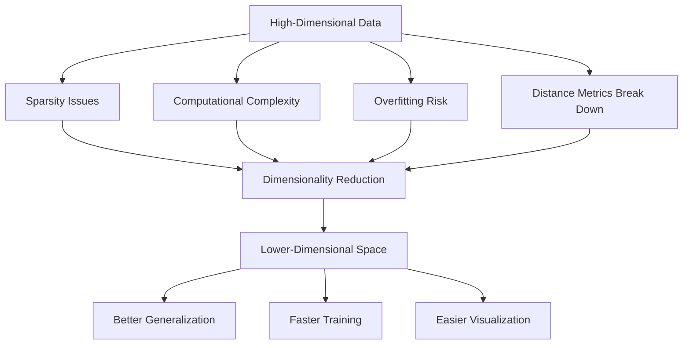
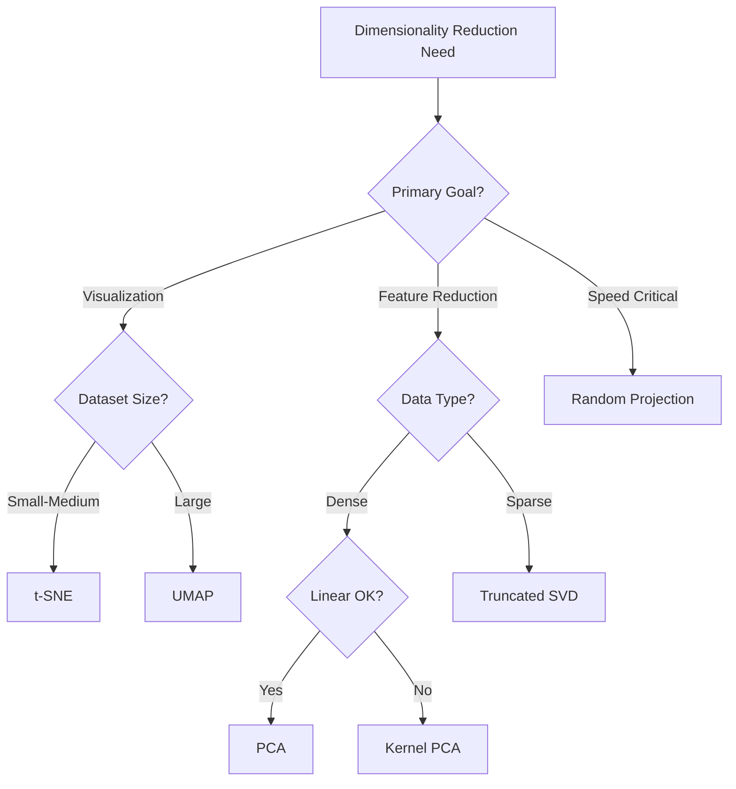

# Dimensionality Reduction

## Introduction

Dimensionality reduction is the process of reducing the number of features in a dataset while retaining as much information as possible. This technique addresses the curse of dimensionality, a phenomenon where the performance of machine learning algorithms degrades as the number of features increases. High-dimensional data suffers from sparsity, increased computational costs, and reduced model interpretability.

Modern datasets often contain hundreds or thousands of features, many of which may be redundant, correlated, or irrelevant. Dimensionality reduction techniques help by transforming data into a lower-dimensional space, improving visualization, reducing overfitting, and accelerating model training. The key challenge is balancing information preservation with dimensionality reduction.

## The Curse of Dimensionality



### Understanding the Problem

```python
import numpy as np
import pandas as pd
from sklearn.datasets import make_classification
from sklearn.model_selection import cross_val_score
from sklearn.ensemble import RandomForestClassifier
import matplotlib.pyplot as plt

# Demonstrate curse of dimensionality
def analyze_dimensionality_effect():
    """Show how performance varies with dimensionality"""
    n_samples = 1000
    dimensions = [2, 5, 10, 20, 50, 100, 200, 500]
    scores = []

    for n_features in dimensions:
        # Create dataset with varying dimensions
        X, y = make_classification(
            n_samples=n_samples,
            n_features=n_features,
            n_informative=min(n_features, 10),
            n_redundant=max(0, n_features - 10),
            random_state=42
        )

        # Evaluate model
        clf = RandomForestClassifier(n_estimators=50, random_state=42)
        score = cross_val_score(clf, X, y, cv=5).mean()
        scores.append(score)

        print(f"Dimensions: {n_features:4d} | Accuracy: {score:.4f}")

    return dimensions, scores

dimensions, scores = analyze_dimensionality_effect()
```

## Principal Component Analysis (PCA)

PCA is the most widely used linear dimensionality reduction technique. It finds orthogonal axes (principal components) that capture maximum variance in the data.

### Mathematical Foundation

```python
from sklearn.decomposition import PCA
from sklearn.preprocessing import StandardScaler

# Generate high-dimensional data
np.random.seed(42)
n_samples = 1000
n_features = 100

# Create data with inherent lower dimensionality
latent_dim = 5
latent = np.random.randn(n_samples, latent_dim)
mixing_matrix = np.random.randn(latent_dim, n_features)
X = latent @ mixing_matrix + np.random.randn(n_samples, n_features) * 0.1

print(f"Original shape: {X.shape}")
print(f"True latent dimensions: {latent_dim}")

# Standardize data (crucial for PCA)
scaler = StandardScaler()
X_scaled = scaler.fit_transform(X)

# Apply PCA
pca = PCA()
X_pca = pca.fit_transform(X_scaled)

# Analyze explained variance
explained_variance = pca.explained_variance_ratio_
cumulative_variance = np.cumsum(explained_variance)

print("\nExplained Variance Analysis:")
for i in range(min(10, len(explained_variance))):
    print(f"PC{i+1}: {explained_variance[i]:.4f} "
          f"(Cumulative: {cumulative_variance[i]:.4f})")

# Find number of components for 95% variance
n_components_95 = np.argmax(cumulative_variance >= 0.95) + 1
print(f"\nComponents for 95% variance: {n_components_95}")
```

### PCA with Variance Threshold

```python
# Apply PCA with variance threshold
pca_reduced = PCA(n_components=0.95)  # Retain 95% variance
X_reduced = pca_reduced.fit_transform(X_scaled)

print(f"Original features: {X.shape[1]}")
print(f"Reduced features: {X_reduced.shape[1]}")
print(f"Variance retained: {pca_reduced.explained_variance_ratio_.sum():.4f}")
print(f"Compression ratio: {X.shape[1] / X_reduced.shape[1]:.2f}x")

# Reconstruction quality
X_reconstructed = pca_reduced.inverse_transform(X_reduced)
reconstruction_error = np.mean((X_scaled - X_reconstructed) ** 2)
print(f"Reconstruction error (MSE): {reconstruction_error:.6f}")

# Per-sample reconstruction error
sample_errors = np.mean((X_scaled - X_reconstructed) ** 2, axis=1)
print(f"Mean sample error: {sample_errors.mean():.6f}")
print(f"Max sample error: {sample_errors.max():.6f}")
print(f"Min sample error: {sample_errors.min():.6f}")
```

### Incremental PCA for Large Datasets

```python
from sklearn.decomposition import IncrementalPCA

# Simulate large dataset processing
def incremental_pca_example():
    """Demonstrate incremental PCA for memory efficiency"""
    n_samples = 10000
    n_features = 500
    n_components = 50
    batch_size = 1000

    # Initialize Incremental PCA
    ipca = IncrementalPCA(n_components=n_components, batch_size=batch_size)

    # Process in batches
    for i in range(0, n_samples, batch_size):
        # Simulate batch of data
        batch = np.random.randn(batch_size, n_features)
        batch_scaled = StandardScaler().fit_transform(batch)

        # Partial fit
        ipca.partial_fit(batch_scaled)

        if (i // batch_size + 1) % 2 == 0:
            print(f"Processed {i + batch_size} samples")

    print(f"\nIncremental PCA complete")
    print(f"Components: {ipca.n_components_}")
    print(f"Explained variance: {ipca.explained_variance_ratio_.sum():.4f}")

    return ipca

ipca = incremental_pca_example()
```

## t-SNE (t-Distributed Stochastic Neighbor Embedding)

t-SNE is a non-linear dimensionality reduction technique primarily used for visualization. It excels at preserving local structure and revealing clusters.

### Understanding t-SNE

```python
from sklearn.manifold import TSNE
from sklearn.datasets import load_digits

# Load sample dataset
digits = load_digits()
X_digits = digits.data
y_digits = digits.target

print(f"Digits dataset shape: {X_digits.shape}")
print(f"Number of classes: {len(np.unique(y_digits))}")

# Apply t-SNE
tsne = TSNE(
    n_components=2,
    perplexity=30,
    learning_rate=200,
    n_iter=1000,
    random_state=42
)

X_tsne = tsne.fit_transform(X_digits)

print(f"t-SNE output shape: {X_tsne.shape}")
print(f"KL divergence (final): {tsne.kl_divergence_:.4f}")

# Analyze embedding quality
from sklearn.metrics import silhouette_score

silhouette = silhouette_score(X_tsne, y_digits)
print(f"Silhouette score: {silhouette:.4f}")
```

### t-SNE Parameters and Their Effects

```python
def compare_tsne_perplexity():
    """Compare t-SNE with different perplexity values"""
    perplexities = [5, 30, 50, 100]

    # Generate sample data
    X_sample, y_sample = make_classification(
        n_samples=500,
        n_features=50,
        n_informative=10,
        n_classes=5,
        n_clusters_per_class=1,
        random_state=42
    )

    results = {}
    for perp in perplexities:
        tsne = TSNE(
            n_components=2,
            perplexity=perp,
            random_state=42,
            n_iter=1000
        )
        X_embedded = tsne.fit_transform(X_sample)
        silhouette = silhouette_score(X_embedded, y_sample)

        results[perp] = {
            'embedding': X_embedded,
            'kl_divergence': tsne.kl_divergence_,
            'silhouette': silhouette
        }

        print(f"Perplexity {perp:3d}: "
              f"KL={tsne.kl_divergence_:.4f}, "
              f"Silhouette={silhouette:.4f}")

    return results

tsne_results = compare_tsne_perplexity()
```

## UMAP (Uniform Manifold Approximation and Projection)

UMAP is a modern alternative to t-SNE that preserves both local and global structure while being faster.

### UMAP Implementation

```python
# Note: UMAP requires the umap-learn package
# This is a conceptual example with fallback

try:
    import umap
    UMAP_AVAILABLE = True
except ImportError:
    UMAP_AVAILABLE = False
    print("UMAP not available. Using PCA for comparison.")

def apply_umap_or_alternative(X, y=None):
    """Apply UMAP if available, otherwise use alternative"""
    if UMAP_AVAILABLE:
        reducer = umap.UMAP(
            n_components=2,
            n_neighbors=15,
            min_dist=0.1,
            metric='euclidean',
            random_state=42
        )
        X_reduced = reducer.fit_transform(X)
        method = "UMAP"
    else:
        # Fallback to PCA for demonstration
        reducer = PCA(n_components=2, random_state=42)
        X_reduced = reducer.fit_transform(X)
        method = "PCA (UMAP not available)"

    print(f"Method: {method}")
    print(f"Output shape: {X_reduced.shape}")

    if y is not None:
        silhouette = silhouette_score(X_reduced, y)
        print(f"Silhouette score: {silhouette:.4f}")

    return X_reduced, method

# Example usage
X_sample, y_sample = make_classification(
    n_samples=1000,
    n_features=50,
    n_informative=20,
    n_classes=5,
    random_state=42
)

X_embedded, method_used = apply_umap_or_alternative(X_sample, y_sample)
```

### UMAP vs t-SNE Comparison

```python
def compare_reduction_methods(X, y):
    """Compare different dimensionality reduction methods"""
    methods = {}

    # PCA
    pca = PCA(n_components=2, random_state=42)
    X_pca = pca.fit_transform(X)
    methods['PCA'] = {
        'embedding': X_pca,
        'silhouette': silhouette_score(X_pca, y),
        'variance_explained': pca.explained_variance_ratio_.sum()
    }

    # t-SNE
    tsne = TSNE(n_components=2, random_state=42, n_iter=1000)
    X_tsne = tsne.fit_transform(X)
    methods['t-SNE'] = {
        'embedding': X_tsne,
        'silhouette': silhouette_score(X_tsne, y),
        'kl_divergence': tsne.kl_divergence_
    }

    # UMAP (if available)
    if UMAP_AVAILABLE:
        reducer = umap.UMAP(n_components=2, random_state=42)
        X_umap = reducer.fit_transform(X)
        methods['UMAP'] = {
            'embedding': X_umap,
            'silhouette': silhouette_score(X_umap, y)
        }

    # Print comparison
    print("Method Comparison:")
    print("-" * 50)
    for name, results in methods.items():
        print(f"\n{name}:")
        print(f"  Silhouette Score: {results['silhouette']:.4f}")
        if 'variance_explained' in results:
            print(f"  Variance Explained: {results['variance_explained']:.4f}")
        if 'kl_divergence' in results:
            print(f"  KL Divergence: {results['kl_divergence']:.4f}")

    return methods

comparison = compare_reduction_methods(X_sample, y_sample)
```

## Truncated SVD (Singular Value Decomposition)

Truncated SVD is similar to PCA but works directly on the data matrix without centering, making it suitable for sparse matrices.

```python
from sklearn.decomposition import TruncatedSVD
from scipy.sparse import random as sparse_random

# Create sparse data
n_samples = 1000
n_features = 500
density = 0.1

X_sparse = sparse_random(
    n_samples, n_features,
    density=density,
    random_state=42
)

print(f"Sparse matrix shape: {X_sparse.shape}")
print(f"Density: {density * 100}%")
print(f"Non-zero elements: {X_sparse.nnz}")

# Apply Truncated SVD
n_components = 50
svd = TruncatedSVD(n_components=n_components, random_state=42)
X_svd = svd.fit_transform(X_sparse)

print(f"\nReduced shape: {X_svd.shape}")
print(f"Explained variance ratio: {svd.explained_variance_ratio_.sum():.4f}")
print(f"Top 10 components variance:")
for i in range(min(10, n_components)):
    print(f"  Component {i+1}: {svd.explained_variance_ratio_[i]:.6f}")
```

## Random Projection

Random projection is a fast dimensionality reduction method based on the Johnson-Lindenstrauss lemma.

```python
from sklearn.random_projection import GaussianRandomProjection, SparseRandomProjection

# Generate data
X_data = np.random.randn(1000, 500)

# Gaussian Random Projection
grp = GaussianRandomProjection(n_components=50, random_state=42)
X_grp = grp.fit_transform(X_data)

print(f"Gaussian Random Projection:")
print(f"  Original shape: {X_data.shape}")
print(f"  Reduced shape: {X_grp.shape}")
print(f"  Components matrix shape: {grp.components_.shape}")

# Sparse Random Projection (more memory efficient)
srp = SparseRandomProjection(n_components=50, density='auto', random_state=42)
X_srp = srp.fit_transform(X_data)

print(f"\nSparse Random Projection:")
print(f"  Reduced shape: {X_srp.shape}")
print(f"  Density: {srp.density_}")
```

## When to Use Each Technique



### Decision Framework

```python
class DimensionalityReductionSelector:
    """Helper class to select appropriate reduction technique"""

    def __init__(self, X, purpose='general'):
        self.X = X
        self.n_samples, self.n_features = X.shape
        self.purpose = purpose

    def recommend(self):
        """Recommend best technique based on data characteristics"""
        recommendations = []

        # Check if data is sparse
        if hasattr(self.X, 'sparse'):
            recommendations.append({
                'method': 'Truncated SVD',
                'reason': 'Data is sparse',
                'priority': 1
            })

        # Check dataset size
        if self.n_samples > 10000 and self.purpose == 'visualization':
            recommendations.append({
                'method': 'UMAP',
                'reason': 'Large dataset for visualization',
                'priority': 1
            })
        elif self.purpose == 'visualization':
            recommendations.append({
                'method': 't-SNE',
                'reason': 'Visualization with moderate size',
                'priority': 2
            })

        # Check dimensionality
        if self.n_features > 1000:
            recommendations.append({
                'method': 'Random Projection',
                'reason': 'Very high dimensionality, need speed',
                'priority': 2
            })

        # Default recommendation
        recommendations.append({
            'method': 'PCA',
            'reason': 'Reliable general-purpose method',
            'priority': 3
        })

        # Sort by priority
        recommendations.sort(key=lambda x: x['priority'])

        return recommendations

    def print_recommendations(self):
        """Print recommendations"""
        recs = self.recommend()
        print(f"Data shape: {self.X.shape}")
        print(f"Purpose: {self.purpose}")
        print("\nRecommendations (in priority order):")
        for i, rec in enumerate(recs, 1):
            print(f"{i}. {rec['method']}: {rec['reason']}")

# Example usage
selector = DimensionalityReductionSelector(X_sample, purpose='visualization')
selector.print_recommendations()
```

## Dimensionality Reduction Pipeline

```python
from sklearn.pipeline import Pipeline
from sklearn.preprocessing import StandardScaler

def create_reduction_pipeline(method='pca', n_components=50):
    """Create a complete dimensionality reduction pipeline"""

    if method == 'pca':
        reducer = PCA(n_components=n_components)
    elif method == 'svd':
        reducer = TruncatedSVD(n_components=n_components)
    elif method == 'tsne':
        reducer = TSNE(n_components=min(n_components, 3))
    else:
        raise ValueError(f"Unknown method: {method}")

    pipeline = Pipeline([
        ('scaler', StandardScaler()),
        ('reducer', reducer)
    ])

    return pipeline

# Example usage
X_train = np.random.randn(1000, 100)
pipeline = create_reduction_pipeline(method='pca', n_components=20)
X_reduced = pipeline.fit_transform(X_train)

print(f"Pipeline: {pipeline}")
print(f"Input shape: {X_train.shape}")
print(f"Output shape: {X_reduced.shape}")
```

## Evaluating Reduction Quality

```python
def evaluate_dimensionality_reduction(X_original, X_reduced, y=None):
    """Evaluate quality of dimensionality reduction"""
    results = {}

    # Reconstruction error (for linear methods)
    if X_reduced.shape[1] < X_original.shape[1]:
        # Use PCA for reconstruction
        pca = PCA(n_components=X_reduced.shape[1])
        pca.fit(X_original)
        X_reconstructed = pca.inverse_transform(
            pca.transform(X_original)
        )
        mse = np.mean((X_original - X_reconstructed) ** 2)
        results['reconstruction_mse'] = mse
        results['variance_retained'] = pca.explained_variance_ratio_.sum()

    # Clustering quality (if labels available)
    if y is not None:
        silhouette = silhouette_score(X_reduced, y)
        results['silhouette_score'] = silhouette

    # Pairwise distance preservation
    from scipy.spatial.distance import pdist, squareform
    from scipy.stats import spearmanr

    # Sample for efficiency
    n_sample = min(500, X_original.shape[0])
    indices = np.random.choice(X_original.shape[0], n_sample, replace=False)

    dist_original = pdist(X_original[indices])
    dist_reduced = pdist(X_reduced[indices])

    correlation, _ = spearmanr(dist_original, dist_reduced)
    results['distance_correlation'] = correlation

    return results

# Example evaluation
X_test = np.random.randn(500, 50)
y_test = np.random.choice([0, 1, 2], 500)

pca_test = PCA(n_components=10)
X_pca_test = pca_test.fit_transform(X_test)

evaluation = evaluate_dimensionality_reduction(X_test, X_pca_test, y_test)
print("Evaluation Results:")
for metric, value in evaluation.items():
    print(f"  {metric}: {value:.4f}")
```

## Best Practices

1. **Always standardize** data before applying distance-based methods
2. **Choose method based on goal**: PCA for general reduction, t-SNE/UMAP for visualization
3. **Validate results**: Check reconstruction error and clustering quality
4. **Consider computational cost**: Random projection for speed, PCA for reliability
5. **Use cross-validation**: Determine optimal number of components
6. **Preserve test set integrity**: Fit only on training data
7. **Document parameters**: Record perplexity, learning rate, etc.

## Key Takeaways

- Dimensionality reduction combats the curse of dimensionality
- PCA is the standard linear method, preserving maximum variance
- t-SNE excels at visualization but is slow for large datasets
- UMAP provides fast, high-quality embeddings for visualization
- Truncated SVD works well with sparse data
- Random projection offers speed when exact solution isn't critical
- Choose method based on data characteristics and goals
- Always validate reduction quality with appropriate metrics
- Linear methods (PCA, SVD) are interpretable and fast
- Non-linear methods (t-SNE, UMAP) capture complex structure
- Trade-offs exist between speed, accuracy, and interpretability
