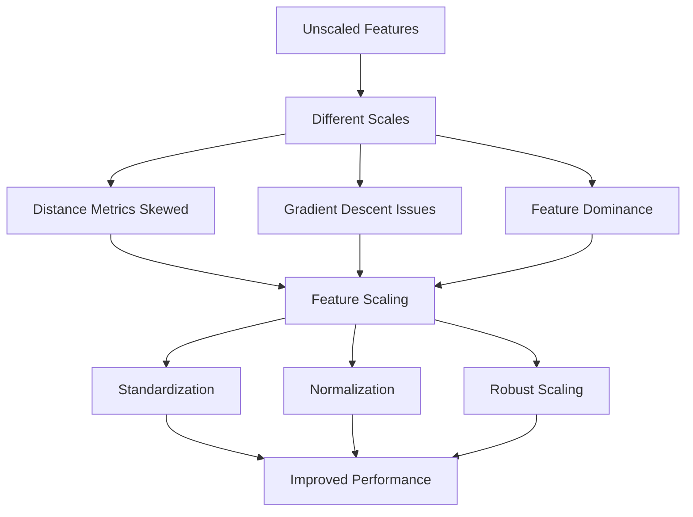
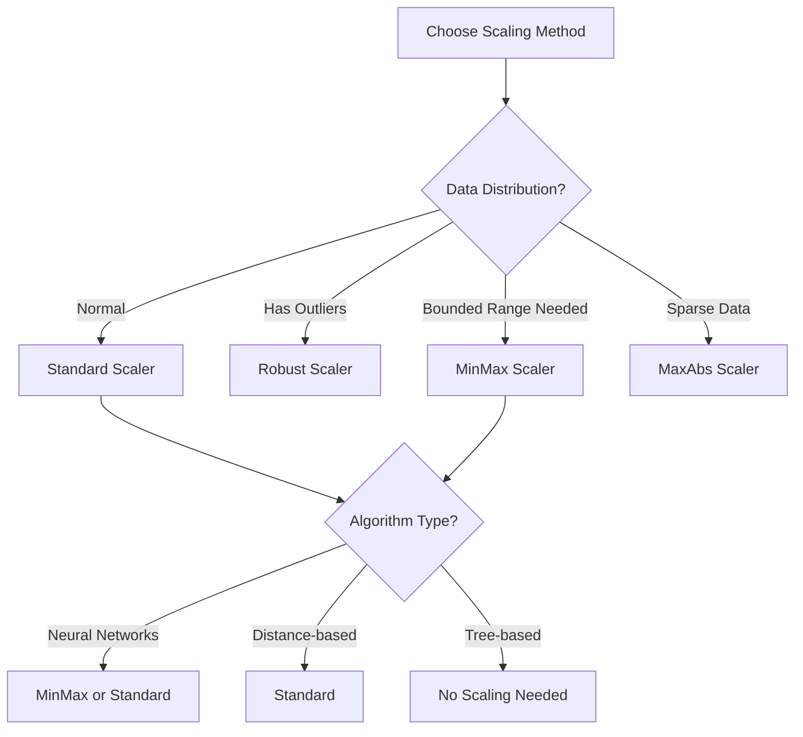

# Feature Scaling

## Introduction

Feature scaling is the process of normalizing or standardizing the range of independent variables in a dataset. Many machine learning algorithms are sensitive to the scale of input features, particularly distance-based algorithms like k-nearest neighbors, support vector machines, and neural networks. Without proper scaling, features with larger magnitudes can dominate the learning process, leading to suboptimal model performance.

The choice of scaling method depends on the distribution of your data, the algorithm you're using, and the presence of outliers. Understanding when and how to apply different scaling techniques is crucial for building robust machine learning models. This lesson explores the most common scaling methods and provides guidance on when to use each one.

## Why Feature Scaling Matters



### Demonstrating the Impact

```python
import numpy as np
import pandas as pd
from sklearn.preprocessing import StandardScaler, MinMaxScaler, RobustScaler
from sklearn.neighbors import KNeighborsClassifier
from sklearn.model_selection import train_test_split
from sklearn.metrics import accuracy_score

# Create dataset with features at different scales
np.random.seed(42)
n_samples = 1000

# Feature 1: Small scale (0-1)
feature1 = np.random.uniform(0, 1, n_samples)

# Feature 2: Medium scale (0-100)
feature2 = np.random.uniform(0, 100, n_samples)

# Feature 3: Large scale (0-10000)
feature3 = np.random.uniform(0, 10000, n_samples)

# Create target based on all features
y = ((feature1 > 0.5).astype(int) +
     (feature2 > 50).astype(int) +
     (feature3 > 5000).astype(int)) >= 2

X = np.column_stack([feature1, feature2, feature3])

print("Feature Statistics (Unscaled):")
df = pd.DataFrame(X, columns=['Feature1', 'Feature2', 'Feature3'])
print(df.describe())

# Train without scaling
X_train, X_test, y_train, y_test = train_test_split(X, y, test_size=0.3, random_state=42)

knn_unscaled = KNeighborsClassifier(n_neighbors=5)
knn_unscaled.fit(X_train, y_train)
y_pred_unscaled = knn_unscaled.predict(X_test)
accuracy_unscaled = accuracy_score(y_test, y_pred_unscaled)

print(f"\nAccuracy without scaling: {accuracy_unscaled:.4f}")

# Train with scaling
scaler = StandardScaler()
X_train_scaled = scaler.fit_transform(X_train)
X_test_scaled = scaler.transform(X_test)

knn_scaled = KNeighborsClassifier(n_neighbors=5)
knn_scaled.fit(X_train_scaled, y_train)
y_pred_scaled = knn_scaled.predict(X_test_scaled)
accuracy_scaled = accuracy_score(y_test, y_pred_scaled)

print(f"Accuracy with scaling: {accuracy_scaled:.4f}")
print(f"Improvement: {(accuracy_scaled - accuracy_unscaled) * 100:.2f}%")
```

## Standardization (Z-Score Normalization)

Standardization transforms features to have zero mean and unit variance. It's the most common scaling method and works well when data follows a roughly normal distribution.

### Mathematical Formula

For each feature:
```
z = (x - μ) / σ
```
where μ is the mean and σ is the standard deviation.

### Implementation

```python
from sklearn.preprocessing import StandardScaler

# Generate sample data with different distributions
np.random.seed(42)
data = {
    'normal': np.random.normal(100, 20, 1000),
    'exponential': np.random.exponential(50, 1000),
    'uniform': np.random.uniform(0, 100, 1000)
}

df = pd.DataFrame(data)

print("Original Data Statistics:")
print(df.describe())

# Apply standardization
scaler = StandardScaler()
df_standardized = pd.DataFrame(
    scaler.fit_transform(df),
    columns=[f'{col}_std' for col in df.columns]
)

print("\nStandardized Data Statistics:")
print(df_standardized.describe())

# Verify properties
print("\nVerification:")
print(f"Mean of standardized features: {df_standardized.mean().values}")
print(f"Std of standardized features: {df_standardized.std().values}")

# Access scaling parameters
print("\nScaling Parameters:")
for i, col in enumerate(df.columns):
    print(f"{col}: mean={scaler.mean_[i]:.2f}, std={scaler.scale_[i]:.2f}")
```

### Manual Standardization

```python
def manual_standardization(X):
    """Manually implement standardization"""
    mean = np.mean(X, axis=0)
    std = np.std(X, axis=0)
    X_standardized = (X - mean) / std
    return X_standardized, mean, std

# Compare with sklearn
X_manual, mean, std = manual_standardization(df.values)
X_sklearn = scaler.transform(df.values)

difference = np.abs(X_manual - X_sklearn).max()
print(f"Maximum difference between manual and sklearn: {difference:.10f}")
```

## Min-Max Normalization

Min-Max scaling transforms features to a fixed range, typically [0, 1]. This method is useful when you need bounded values or when working with neural networks.

### Mathematical Formula

```
x_scaled = (x - x_min) / (x_max - x_min)
```

### Implementation

```python
from sklearn.preprocessing import MinMaxScaler

# Create data with different ranges
data_ranges = {
    'small': np.random.uniform(0, 10, 1000),
    'medium': np.random.uniform(50, 150, 1000),
    'large': np.random.uniform(1000, 5000, 1000)
}

df_ranges = pd.DataFrame(data_ranges)

print("Original Data Ranges:")
print(df_ranges.describe())

# Apply Min-Max scaling
minmax_scaler = MinMaxScaler()
df_minmax = pd.DataFrame(
    minmax_scaler.fit_transform(df_ranges),
    columns=[f'{col}_minmax' for col in df_ranges.columns]
)

print("\nMin-Max Scaled Data:")
print(df_minmax.describe())

# Verify range
print("\nVerification:")
print(f"Min values: {df_minmax.min().values}")
print(f"Max values: {df_minmax.max().values}")

# Custom range scaling [a, b]
minmax_custom = MinMaxScaler(feature_range=(-1, 1))
df_custom = pd.DataFrame(
    minmax_custom.fit_transform(df_ranges),
    columns=[f'{col}_custom' for col in df_ranges.columns]
)

print("\nCustom Range [-1, 1] Scaling:")
print(f"Min values: {df_custom.min().values}")
print(f"Max values: {df_custom.max().values}")
```

### Inverse Transform

```python
# Demonstrate inverse transformation
scaled_data = minmax_scaler.transform(df_ranges)
reconstructed_data = minmax_scaler.inverse_transform(scaled_data)

reconstruction_error = np.abs(df_ranges.values - reconstructed_data).max()
print(f"\nReconstruction error: {reconstruction_error:.10f}")
```

## Robust Scaling

Robust scaling uses the median and interquartile range (IQR) instead of mean and standard deviation, making it robust to outliers.

### Mathematical Formula

```
x_scaled = (x - median) / IQR
```
where IQR = Q3 - Q1 (75th percentile - 25th percentile)

### Implementation

```python
from sklearn.preprocessing import RobustScaler

# Create data with outliers
np.random.seed(42)
n_samples = 1000

data_with_outliers = {
    'normal_data': np.random.normal(50, 10, n_samples),
    'data_with_outliers': np.concatenate([
        np.random.normal(50, 10, 950),
        np.random.uniform(200, 300, 50)  # Outliers
    ])
}

df_outliers = pd.DataFrame(data_with_outliers)

print("Original Data with Outliers:")
print(df_outliers.describe())

# Compare Standard vs Robust Scaling
standard_scaler = StandardScaler()
robust_scaler = RobustScaler()

df_standard = pd.DataFrame(
    standard_scaler.fit_transform(df_outliers),
    columns=[f'{col}_std' for col in df_outliers.columns]
)

df_robust = pd.DataFrame(
    robust_scaler.fit_transform(df_outliers),
    columns=[f'{col}_robust' for col in df_outliers.columns]
)

print("\nStandard Scaling (affected by outliers):")
print(df_standard.describe())

print("\nRobust Scaling (resistant to outliers):")
print(df_robust.describe())

# Compare the effect on non-outlier data
mask = df_outliers['data_with_outliers'] < 100  # Non-outlier mask

print("\nEffect on non-outlier data:")
print(f"Standard scaling range: [{df_standard.loc[mask, 'data_with_outliers_std'].min():.2f}, "
      f"{df_standard.loc[mask, 'data_with_outliers_std'].max():.2f}]")
print(f"Robust scaling range: [{df_robust.loc[mask, 'data_with_outliers_robust'].min():.2f}, "
      f"{df_robust.loc[mask, 'data_with_outliers_robust'].max():.2f}]")
```

## MaxAbs Scaling

MaxAbs scaling scales each feature by its maximum absolute value, preserving sparsity and not shifting/centering the data.

```python
from sklearn.preprocessing import MaxAbsScaler

# Create sparse-like data
data_sparse = {
    'feature1': np.concatenate([np.zeros(800), np.random.uniform(-100, 100, 200)]),
    'feature2': np.concatenate([np.zeros(850), np.random.uniform(-50, 50, 150)]),
    'feature3': np.concatenate([np.zeros(900), np.random.uniform(-200, 200, 100)])
}

df_sparse = pd.DataFrame(data_sparse)

print("Original Sparse Data:")
print(f"Sparsity: {(df_sparse == 0).sum().sum() / df_sparse.size * 100:.1f}%")
print(df_sparse.describe())

# Apply MaxAbs scaling
maxabs_scaler = MaxAbsScaler()
df_maxabs = pd.DataFrame(
    maxabs_scaler.fit_transform(df_sparse),
    columns=[f'{col}_maxabs' for col in df_sparse.columns]
)

print("\nMaxAbs Scaled Data:")
print(f"Sparsity preserved: {(df_maxabs == 0).sum().sum() / df_maxabs.size * 100:.1f}%")
print(df_maxabs.describe())

# Verify scaling
print("\nScaling factors:")
for i, col in enumerate(df_sparse.columns):
    print(f"{col}: max_abs = {maxabs_scaler.max_abs_[i]:.2f}")
```

## Comparing All Scaling Methods

```python
def compare_scalers(data):
    """Compare all scaling methods side by side"""
    scalers = {
        'Original': None,
        'Standard': StandardScaler(),
        'MinMax': MinMaxScaler(),
        'Robust': RobustScaler(),
        'MaxAbs': MaxAbsScaler()
    }

    results = {}

    for name, scaler in scalers.items():
        if scaler is None:
            scaled_data = data
        else:
            scaled_data = scaler.fit_transform(data.values.reshape(-1, 1)).flatten()

        results[name] = {
            'mean': np.mean(scaled_data),
            'std': np.std(scaled_data),
            'min': np.min(scaled_data),
            'max': np.max(scaled_data),
            'median': np.median(scaled_data),
            'q1': np.percentile(scaled_data, 25),
            'q3': np.percentile(scaled_data, 75)
        }

    results_df = pd.DataFrame(results).T
    return results_df

# Test with different data distributions
print("Comparison on Normal Distribution:")
normal_data = np.random.normal(100, 20, 1000)
print(compare_scalers(pd.Series(normal_data)))

print("\nComparison on Data with Outliers:")
outlier_data = np.concatenate([
    np.random.normal(50, 10, 950),
    np.random.uniform(200, 300, 50)
])
print(compare_scalers(pd.Series(outlier_data)))
```

## Choosing the Right Scaler



### Decision Helper Function

```python
def recommend_scaler(X, has_outliers=None, is_sparse=None, algorithm_type=None):
    """Recommend appropriate scaler based on data characteristics"""

    # Auto-detect outliers if not specified
    if has_outliers is None:
        Q1 = np.percentile(X, 25, axis=0)
        Q3 = np.percentile(X, 75, axis=0)
        IQR = Q3 - Q1
        outlier_mask = (X < (Q1 - 1.5 * IQR)) | (X > (Q3 + 1.5 * IQR))
        has_outliers = outlier_mask.sum() > len(X) * 0.05  # >5% outliers

    # Auto-detect sparsity if not specified
    if is_sparse is None:
        is_sparse = (X == 0).sum() / X.size > 0.5  # >50% zeros

    recommendations = []

    # Priority 1: Handle sparsity
    if is_sparse:
        recommendations.append({
            'scaler': 'MaxAbsScaler',
            'reason': 'Data is sparse (preserves zeros)',
            'priority': 1
        })

    # Priority 2: Handle outliers
    if has_outliers:
        recommendations.append({
            'scaler': 'RobustScaler',
            'reason': 'Data contains outliers',
            'priority': 1
        })

    # Priority 3: Algorithm-specific
    if algorithm_type == 'neural_network':
        recommendations.append({
            'scaler': 'MinMaxScaler',
            'reason': 'Neural networks work well with bounded inputs',
            'priority': 2
        })
    elif algorithm_type == 'tree':
        recommendations.append({
            'scaler': None,
            'reason': 'Tree-based models are scale-invariant',
            'priority': 1
        })

    # Default recommendation
    if not recommendations or max(r['priority'] for r in recommendations) > 1:
        recommendations.append({
            'scaler': 'StandardScaler',
            'reason': 'General-purpose scaling method',
            'priority': 3
        })

    # Sort by priority
    recommendations.sort(key=lambda x: x['priority'])

    return recommendations

# Example usage
test_data = np.random.normal(50, 10, (1000, 5))
recs = recommend_scaler(test_data, algorithm_type='neural_network')

print("Scaling Recommendations:")
for i, rec in enumerate(recs, 1):
    print(f"{i}. {rec['scaler']}: {rec['reason']}")
```

## Scaling in Practice: Pipelines

```python
from sklearn.pipeline import Pipeline
from sklearn.linear_model import LogisticRegression
from sklearn.model_selection import cross_val_score

# Create sample dataset
X, y = make_classification(n_samples=1000, n_features=20, random_state=42)

# Add different scales to features
X[:, :10] *= 0.01  # Small scale
X[:, 10:15] *= 1   # Medium scale
X[:, 15:] *= 100   # Large scale

# Create pipelines with different scalers
pipelines = {
    'No Scaling': Pipeline([
        ('classifier', LogisticRegression(max_iter=1000))
    ]),
    'Standard': Pipeline([
        ('scaler', StandardScaler()),
        ('classifier', LogisticRegression(max_iter=1000))
    ]),
    'MinMax': Pipeline([
        ('scaler', MinMaxScaler()),
        ('classifier', LogisticRegression(max_iter=1000))
    ]),
    'Robust': Pipeline([
        ('scaler', RobustScaler()),
        ('classifier', LogisticRegression(max_iter=1000))
    ])
}

# Evaluate each pipeline
print("Cross-Validation Scores:")
for name, pipeline in pipelines.items():
    scores = cross_val_score(pipeline, X, y, cv=5)
    print(f"{name:15s}: {scores.mean():.4f} (+/- {scores.std():.4f})")
```

## Common Pitfalls and Best Practices

### Pitfall 1: Scaling Before Train-Test Split

```python
# WRONG: Scaling before split (causes data leakage)
def wrong_approach(X, y):
    # Don't do this!
    scaler = StandardScaler()
    X_scaled = scaler.fit_transform(X)  # Fit on all data
    X_train, X_test, y_train, y_test = train_test_split(X_scaled, y)
    return X_train, X_test

# CORRECT: Split first, then scale
def correct_approach(X, y):
    # Do this instead
    X_train, X_test, y_train, y_test = train_test_split(X, y)

    scaler = StandardScaler()
    X_train_scaled = scaler.fit_transform(X_train)  # Fit only on train
    X_test_scaled = scaler.transform(X_test)  # Transform test

    return X_train_scaled, X_test_scaled

print("Demonstrating correct scaling approach:")
X_sample, y_sample = make_classification(n_samples=200, random_state=42)
X_train, X_test = correct_approach(X_sample, y_sample)
print(f"Training set shape: {X_train.shape}")
print(f"Test set shape: {X_test.shape}")
```

### Pitfall 2: Not Saving Scaler Parameters

```python
import pickle

# Train and save scaler
X_train_data = np.random.randn(1000, 10)
scaler = StandardScaler()
X_train_scaled = scaler.fit_transform(X_train_data)

# Save the scaler
with open('scaler.pkl', 'wb') as f:
    pickle.dump(scaler, f)

print("Scaler saved successfully")

# Later, load and use for new data
with open('scaler.pkl', 'rb') as f:
    loaded_scaler = pickle.load(f)

X_new = np.random.randn(10, 10)
X_new_scaled = loaded_scaler.transform(X_new)

print(f"New data scaled with saved parameters")
print(f"Original mean: {X_new.mean(axis=0)[0]:.4f}")
print(f"Scaled mean: {X_new_scaled.mean(axis=0)[0]:.4f}")
```

## Best Practices Summary

1. **Always split before scaling** to avoid data leakage
2. **Fit on training data only**, transform both train and test
3. **Save scaler parameters** for production deployment
4. **Choose scaler based on data** and algorithm requirements
5. **Use pipelines** to ensure consistent preprocessing
6. **Document scaling choices** for reproducibility
7. **Validate impact** by comparing model performance

## Key Takeaways

- Feature scaling is essential for distance-based algorithms and neural networks
- StandardScaler works well for normally distributed data
- MinMaxScaler is ideal when you need bounded ranges
- RobustScaler handles outliers effectively
- MaxAbsScaler preserves sparsity in data
- Always fit scalers on training data only
- Tree-based models generally don't require scaling
- Use pipelines to ensure consistent preprocessing
- Different algorithms benefit from different scaling methods
- Proper scaling can significantly improve model performance
- Save scaler parameters for production use
- Inverse transforms allow you to interpret results in original scale
