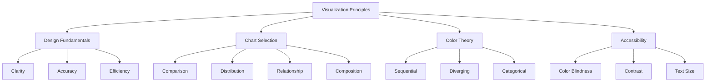

# Visualization Principles

## Introduction

Data visualization is the art and science of representing data graphically to communicate insights effectively. While tools and technologies are important, the fundamental principles of good visualization design are what separate compelling, informative graphics from misleading or confusing ones. Understanding these principles enables you to create visualizations that not only look professional but also communicate your message clearly and accurately.

The goal of data visualization is not to make pretty pictures, but to facilitate understanding. A well-designed visualization should reveal patterns, trends, and relationships in data that would be difficult to discern from raw numbers alone. This requires careful consideration of chart types, colors, layouts, and accessibility to ensure your visualizations serve their intended audience.



## Core Design Principles

```python
import pandas as pd
import numpy as np
import matplotlib.pyplot as plt
import seaborn as sns

class VisualizationPrinciples:
    """Demonstrate fundamental visualization principles"""

    @staticmethod
    def demonstrate_clarity():
        """Show importance of clarity in visualizations"""
        np.random.seed(42)
        data = pd.DataFrame({
            'category': ['Product A', 'Product B', 'Product C', 'Product D'],
            'sales': [45000, 67000, 52000, 71000]
        })

        fig, (ax1, ax2) = plt.subplots(1, 2, figsize=(14, 5))

        # Poor example: cluttered and confusing
        ax1.bar(data['category'], data['sales'], color=['red', 'blue', 'green', 'purple'])
        ax1.set_title('Sales by Product (Poor Design)', fontsize=10)
        ax1.tick_params(axis='x', rotation=45, labelsize=8)
        ax1.grid(True, which='both', linestyle='--', alpha=0.7)
        ax1.set_facecolor('#f0f0f0')

        # Good example: clean and clear
        ax2.bar(data['category'], data['sales'], color='steelblue', alpha=0.8)
        ax2.set_title('Sales by Product', fontsize=14, fontweight='bold')
        ax2.set_ylabel('Sales ($)', fontsize=12)
        ax2.tick_params(axis='x', rotation=0, labelsize=11)
        ax2.spines['top'].set_visible(False)
        ax2.spines['right'].set_visible(False)
        ax2.yaxis.grid(True, alpha=0.3)
        ax2.set_axisbelow(True)

        # Add value labels on good example
        for i, v in enumerate(data['sales']):
            ax2.text(i, v + 1000, f'${v:,.0f}', ha='center', fontsize=10)

        plt.tight_layout()
        print("Clarity Principle:")
        print("- Remove unnecessary elements (chart junk)")
        print("- Use consistent, professional colors")
        print("- Ensure readable text sizes")
        print("- Add helpful labels and titles")
        return fig

    @staticmethod
    def demonstrate_accuracy():
        """Show importance of accurate visual encoding"""
        np.random.seed(42)
        values = [10, 20, 30]
        labels = ['A', 'B', 'C']

        fig, (ax1, ax2) = plt.subplots(1, 2, figsize=(14, 5))

        # Misleading: truncated y-axis
        ax1.bar(labels, values, color='coral')
        ax1.set_ylim(8, 32)  # Truncated axis
        ax1.set_title('Misleading (Truncated Y-Axis)', fontsize=12, fontweight='bold')
        ax1.set_ylabel('Value')

        # Accurate: y-axis starts at zero
        ax2.bar(labels, values, color='steelblue')
        ax2.set_ylim(0, 35)  # Zero baseline
        ax2.set_title('Accurate (Zero Baseline)', fontsize=12, fontweight='bold')
        ax2.set_ylabel('Value')

        plt.tight_layout()
        print("\nAccuracy Principle:")
        print("- Start bar charts at zero")
        print("- Use appropriate scales")
        print("- Avoid misleading visual encodings")
        print("- Represent data proportionally")
        return fig

    @staticmethod
    def demonstrate_data_ink_ratio():
        """Maximize data-ink ratio (Tufte's principle)"""
        np.random.seed(42)
        x = np.linspace(0, 10, 50)
        y = 2 * x + np.random.normal(0, 2, 50)

        fig, (ax1, ax2) = plt.subplots(1, 2, figsize=(14, 5))

        # Low data-ink ratio: excessive decoration
        ax1.scatter(x, y, color='red', s=100, edgecolor='black', linewidth=2)
        ax1.plot(x, 2*x, 'b--', linewidth=3, label='Trend')
        ax1.grid(True, which='both', linestyle='--', linewidth=1.5)
        ax1.set_facecolor('#eeeeee')
        ax1.legend(frameon=True, shadow=True, fontsize=12)
        ax1.set_title('Low Data-Ink Ratio', fontsize=12, fontweight='bold')

        # High data-ink ratio: minimal decoration
        ax2.scatter(x, y, color='steelblue', s=50, alpha=0.6)
        ax2.plot(x, 2*x, 'gray', linewidth=1, alpha=0.5)
        ax2.spines['top'].set_visible(False)
        ax2.spines['right'].set_visible(False)
        ax2.set_title('High Data-Ink Ratio', fontsize=12, fontweight='bold')

        plt.tight_layout()
        print("\nData-Ink Ratio Principle:")
        print("- Maximize the proportion of ink used for data")
        print("- Remove non-essential decorations")
        print("- Simplify gridlines and borders")
        print("- Let the data be the focus")
        return fig

# Demonstrate principles
viz_principles = VisualizationPrinciples()
viz_principles.demonstrate_clarity()
viz_principles.demonstrate_accuracy()
viz_principles.demonstrate_data_ink_ratio()
```

## Choosing the Right Chart Type

```python
class ChartSelector:
    """Help select appropriate chart types for different data"""

    @staticmethod
    def comparison_charts():
        """Charts for comparing values across categories"""
        np.random.seed(42)
        categories = ['Q1', 'Q2', 'Q3', 'Q4']
        product_a = [45, 52, 48, 61]
        product_b = [38, 44, 51, 49]

        fig, axes = plt.subplots(2, 2, figsize=(14, 10))

        # Bar chart
        x = np.arange(len(categories))
        width = 0.35
        axes[0, 0].bar(x - width/2, product_a, width, label='Product A', color='steelblue')
        axes[0, 0].bar(x + width/2, product_b, width, label='Product B', color='coral')
        axes[0, 0].set_xlabel('Quarter')
        axes[0, 0].set_ylabel('Sales (thousands)')
        axes[0, 0].set_title('Grouped Bar Chart - Category Comparison')
        axes[0, 0].set_xticks(x)
        axes[0, 0].set_xticklabels(categories)
        axes[0, 0].legend()

        # Stacked bar chart
        axes[0, 1].bar(categories, product_a, label='Product A', color='steelblue')
        axes[0, 1].bar(categories, product_b, bottom=product_a, label='Product B', color='coral')
        axes[0, 1].set_xlabel('Quarter')
        axes[0, 1].set_ylabel('Sales (thousands)')
        axes[0, 1].set_title('Stacked Bar Chart - Part-to-Whole')
        axes[0, 1].legend()

        # Dot plot
        axes[1, 0].plot(product_a, categories, 'o', markersize=10, label='Product A', color='steelblue')
        axes[1, 0].plot(product_b, categories, 's', markersize=10, label='Product B', color='coral')
        axes[1, 0].set_xlabel('Sales (thousands)')
        axes[1, 0].set_title('Dot Plot - Precise Value Comparison')
        axes[1, 0].legend()
        axes[1, 0].grid(True, alpha=0.3, axis='x')

        # Slope chart
        for i in range(len(categories)-1):
            axes[1, 1].plot([0, 1], [product_a[i], product_a[i+1]], 'o-',
                          color='steelblue', alpha=0.5, linewidth=2)
        axes[1, 1].set_xlim(-0.1, 1.1)
        axes[1, 1].set_xticks([0, 1])
        axes[1, 1].set_xticklabels(['Start', 'End'])
        axes[1, 1].set_ylabel('Sales (thousands)')
        axes[1, 1].set_title('Slope Chart - Change Over Time')

        plt.tight_layout()
        print("\nChart Types for Comparison:")
        print("- Bar Chart: Compare values across categories")
        print("- Grouped Bar: Compare multiple series")
        print("- Stacked Bar: Show part-to-whole relationships")
        print("- Dot Plot: Precise value comparison")
        print("- Slope Chart: Show change between two points")
        return fig

    @staticmethod
    def distribution_charts():
        """Charts for showing data distributions"""
        np.random.seed(42)
        normal_data = np.random.normal(100, 15, 1000)
        skewed_data = np.random.exponential(20, 1000)

        fig, axes = plt.subplots(2, 2, figsize=(14, 10))

        # Histogram
        axes[0, 0].hist(normal_data, bins=30, color='steelblue', alpha=0.7, edgecolor='black')
        axes[0, 0].set_xlabel('Value')
        axes[0, 0].set_ylabel('Frequency')
        axes[0, 0].set_title('Histogram - Distribution Shape')

        # Box plot
        axes[0, 1].boxplot([normal_data, skewed_data], labels=['Normal', 'Skewed'])
        axes[0, 1].set_ylabel('Value')
        axes[0, 1].set_title('Box Plot - Distribution Summary')
        axes[0, 1].grid(True, alpha=0.3, axis='y')

        # Violin plot
        parts = axes[1, 0].violinplot([normal_data, skewed_data], positions=[1, 2],
                                       showmeans=True, showmedians=True)
        axes[1, 0].set_xticks([1, 2])
        axes[1, 0].set_xticklabels(['Normal', 'Skewed'])
        axes[1, 0].set_ylabel('Value')
        axes[1, 0].set_title('Violin Plot - Distribution Density')

        # KDE plot
        axes[1, 1].hist(normal_data, bins=30, density=True, alpha=0.5,
                       color='steelblue', label='Normal')
        axes[1, 1].hist(skewed_data, bins=30, density=True, alpha=0.5,
                       color='coral', label='Skewed')
        axes[1, 1].set_xlabel('Value')
        axes[1, 1].set_ylabel('Density')
        axes[1, 1].set_title('Density Plot - Smooth Distribution')
        axes[1, 1].legend()

        plt.tight_layout()
        print("\nChart Types for Distribution:")
        print("- Histogram: Show frequency distribution")
        print("- Box Plot: Display quartiles and outliers")
        print("- Violin Plot: Combine box plot with density")
        print("- Density Plot: Smooth distribution curve")
        return fig

# Demonstrate chart selection
chart_selector = ChartSelector()
chart_selector.comparison_charts()
chart_selector.distribution_charts()
```

## Color Theory for Data Visualization

```python
class ColorTheory:
    """Demonstrate effective color usage in visualizations"""

    @staticmethod
    def sequential_colors():
        """Sequential color schemes for ordered data"""
        data = pd.DataFrame({
            'month': pd.date_range('2024-01', periods=12, freq='M'),
            'temperature': [32, 35, 45, 58, 68, 77, 82, 80, 72, 61, 48, 36]
        })

        fig, (ax1, ax2) = plt.subplots(1, 2, figsize=(14, 5))

        # Sequential colormap
        colors = plt.cm.YlOrRd(np.linspace(0.3, 0.9, 12))
        ax1.bar(range(12), data['temperature'], color=colors)
        ax1.set_xlabel('Month')
        ax1.set_ylabel('Temperature (°F)')
        ax1.set_title('Sequential Colors - Ordered Data')
        ax1.set_xticks(range(12))
        ax1.set_xticklabels(['Jan', 'Feb', 'Mar', 'Apr', 'May', 'Jun',
                            'Jul', 'Aug', 'Sep', 'Oct', 'Nov', 'Dec'], rotation=45)

        # Single hue progression
        colors_blue = plt.cm.Blues(np.linspace(0.3, 0.9, 12))
        ax2.bar(range(12), data['temperature'], color=colors_blue)
        ax2.set_xlabel('Month')
        ax2.set_ylabel('Temperature (°F)')
        ax2.set_title('Single Hue Sequential - Subtle Progression')
        ax2.set_xticks(range(12))
        ax2.set_xticklabels(['Jan', 'Feb', 'Mar', 'Apr', 'May', 'Jun',
                            'Jul', 'Aug', 'Sep', 'Oct', 'Nov', 'Dec'], rotation=45)

        plt.tight_layout()
        print("\nSequential Color Schemes:")
        print("- Use for ordered/continuous data")
        print("- Light to dark progression")
        print("- Single or multi-hue options")
        return fig

    @staticmethod
    def diverging_colors():
        """Diverging color schemes for data with meaningful midpoint"""
        np.random.seed(42)
        correlation_matrix = np.random.randn(8, 8)
        correlation_matrix = (correlation_matrix + correlation_matrix.T) / 2
        np.fill_diagonal(correlation_matrix, 1)

        fig, (ax1, ax2) = plt.subplots(1, 2, figsize=(14, 6))

        # Diverging colormap (red-blue)
        im1 = ax1.imshow(correlation_matrix, cmap='RdBu_r', vmin=-1, vmax=1)
        ax1.set_title('Diverging Colors - Correlation Matrix')
        plt.colorbar(im1, ax=ax1)

        # Diverging colormap (green-purple)
        im2 = ax2.imshow(correlation_matrix, cmap='PRGn', vmin=-1, vmax=1)
        ax2.set_title('Alternative Diverging Scheme')
        plt.colorbar(im2, ax=ax2)

        plt.tight_layout()
        print("\nDiverging Color Schemes:")
        print("- Use for data with meaningful center")
        print("- Two contrasting colors from a neutral midpoint")
        print("- Common in correlation matrices, difference maps")
        return fig

    @staticmethod
    def categorical_colors():
        """Categorical color schemes for discrete categories"""
        categories = ['Technology', 'Healthcare', 'Finance', 'Energy', 'Consumer']
        values = [42, 38, 29, 23, 31]

        fig, (ax1, ax2) = plt.subplots(1, 2, figsize=(14, 5))

        # Qualitative palette - distinct colors
        colors_qual = sns.color_palette('Set2', len(categories))
        ax1.barh(categories, values, color=colors_qual)
        ax1.set_xlabel('Value')
        ax1.set_title('Qualitative Colors - Distinct Categories')
        ax1.spines['top'].set_visible(False)
        ax1.spines['right'].set_visible(False)

        # Highlight one category
        colors_highlight = ['steelblue' if i != 1 else 'coral' for i in range(len(categories))]
        ax2.barh(categories, values, color=colors_highlight)
        ax2.set_xlabel('Value')
        ax2.set_title('Highlighting Specific Category')
        ax2.spines['top'].set_visible(False)
        ax2.spines['right'].set_visible(False)

        plt.tight_layout()
        print("\nCategorical Color Schemes:")
        print("- Use distinct colors for unordered categories")
        print("- Limit to 5-7 categories for clarity")
        print("- Use highlighting to emphasize specific items")
        return fig

# Demonstrate color theory
color_theory = ColorTheory()
color_theory.sequential_colors()
color_theory.diverging_colors()
color_theory.categorical_colors()
```

## Accessibility in Visualizations

```python
class AccessibilityPractices:
    """Demonstrate accessible visualization design"""

    @staticmethod
    def colorblind_friendly():
        """Create colorblind-friendly visualizations"""
        categories = ['Category A', 'Category B', 'Category C', 'Category D']
        series1 = [45, 38, 52, 41]
        series2 = [32, 48, 39, 55]

        fig, (ax1, ax2) = plt.subplots(1, 2, figsize=(14, 5))

        # Poor: red-green (problematic for colorblind)
        x = np.arange(len(categories))
        width = 0.35
        ax1.bar(x - width/2, series1, width, label='Series 1', color='red')
        ax1.bar(x + width/2, series2, width, label='Series 2', color='green')
        ax1.set_title('Problematic for Colorblind Users')
        ax1.set_xticks(x)
        ax1.set_xticklabels(categories, rotation=45)
        ax1.legend()

        # Good: colorblind-friendly palette
        cb_colors = ['#0173b2', '#de8f05']  # Blue and orange
        ax2.bar(x - width/2, series1, width, label='Series 1', color=cb_colors[0])
        ax2.bar(x + width/2, series2, width, label='Series 2', color=cb_colors[1])
        ax2.set_title('Colorblind-Friendly Palette')
        ax2.set_xticks(x)
        ax2.set_xticklabels(categories, rotation=45)
        ax2.legend()

        plt.tight_layout()
        print("\nColorblind-Friendly Design:")
        print("- Avoid red-green combinations")
        print("- Use blue-orange or purple-orange")
        print("- Add patterns or markers for redundancy")
        print("- Test with colorblind simulators")
        return fig

    @staticmethod
    def contrast_and_text():
        """Demonstrate proper contrast and text sizing"""
        data = {'Category': ['A', 'B', 'C', 'D', 'E'],
                'Value': [23, 45, 56, 34, 67]}
        df = pd.DataFrame(data)

        fig, (ax1, ax2) = plt.subplots(1, 2, figsize=(14, 5))

        # Poor contrast and small text
        ax1.bar(df['Category'], df['Value'], color='lightgray')
        ax1.set_title('Poor Contrast', fontsize=8)
        ax1.tick_params(labelsize=6)
        ax1.set_facecolor('#dddddd')

        # Good contrast and readable text
        ax2.bar(df['Category'], df['Value'], color='steelblue', edgecolor='black', linewidth=1)
        ax2.set_title('Good Contrast and Readable Text', fontsize=14, fontweight='bold')
        ax2.set_xlabel('Category', fontsize=12)
        ax2.set_ylabel('Value', fontsize=12)
        ax2.tick_params(labelsize=11)
        ax2.spines['top'].set_visible(False)
        ax2.spines['right'].set_visible(False)

        plt.tight_layout()
        print("\nContrast and Readability:")
        print("- Ensure sufficient color contrast")
        print("- Use minimum 11pt font size")
        print("- Make text bold for emphasis")
        print("- Avoid light gray text on white backgrounds")
        return fig

# Demonstrate accessibility
accessibility = AccessibilityPractices()
accessibility.colorblind_friendly()
accessibility.contrast_and_text()
```

## Summary

Effective data visualization is built on fundamental principles that ensure clarity, accuracy, and accessibility:

**Core Design Principles:**
- **Clarity**: Remove chart junk and focus on the data
- **Accuracy**: Use appropriate scales and avoid misleading representations
- **Data-Ink Ratio**: Maximize the proportion of ink used for data
- **Efficiency**: Convey maximum information with minimum elements

**Chart Selection Guidelines:**
- **Comparison**: Bar charts, grouped bars, dot plots
- **Distribution**: Histograms, box plots, violin plots
- **Relationship**: Scatter plots, line charts
- **Composition**: Pie charts (use sparingly), stacked bars
- **Trends**: Line charts, area charts

**Color Theory:**
- **Sequential**: For ordered data, light to dark progression
- **Diverging**: For data with meaningful midpoint (e.g., correlations)
- **Categorical**: Distinct colors for unordered categories
- **Limit palette**: Use 5-7 colors maximum for clarity

**Accessibility Best Practices:**
- Avoid red-green color combinations (colorblind-friendly)
- Ensure sufficient contrast (WCAG 2.1 guidelines)
- Use readable font sizes (minimum 11pt)
- Add patterns or markers for redundancy
- Provide text alternatives for complex graphics
- Test visualizations with accessibility tools

**Key Principles to Remember:**
1. Know your audience and their needs
2. Choose the right chart type for your data and message
3. Keep it simple and focused
4. Use color purposefully, not decoratively
5. Ensure accessibility for all users
6. Label clearly and provide context
7. Test your visualizations with real users

By following these principles, you create visualizations that not only look professional but effectively communicate insights to diverse audiences.
