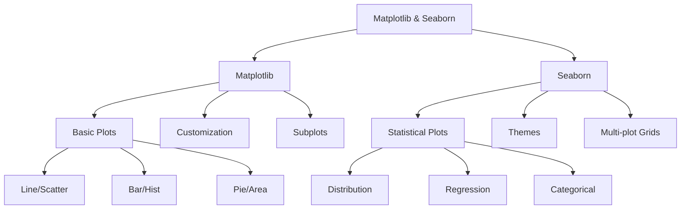

# Matplotlib and Seaborn

## Introduction

Matplotlib and Seaborn are the foundational visualization libraries in Python's data science ecosystem. Matplotlib provides low-level control over every aspect of a plot, making it incredibly flexible but sometimes verbose. Seaborn builds on matplotlib, offering a high-level interface with beautiful default styles and specialized plots for statistical visualization. Together, they form a powerful combination for creating publication-quality static visualizations.

Understanding both libraries is essential because they complement each other perfectly. Use matplotlib when you need precise control over plot elements, custom annotations, or complex multi-panel layouts. Use seaborn for statistical plots, attractive default themes, and quick exploratory data analysis. Most data scientists use both libraries in tandem, leveraging seaborn's convenience while fine-tuning with matplotlib.



## Matplotlib Fundamentals

```python
import pandas as pd
import numpy as np
import matplotlib.pyplot as plt
import seaborn as sns

class MatplotlibBasics:
    """Demonstrate core matplotlib functionality"""

    @staticmethod
    def figure_and_axes():
        """Understanding figure and axes objects"""
        # Create sample data
        np.random.seed(42)
        x = np.linspace(0, 10, 100)
        y1 = np.sin(x)
        y2 = np.cos(x)

        # Method 1: pyplot interface (simple)
        plt.figure(figsize=(12, 5))

        plt.subplot(1, 2, 1)
        plt.plot(x, y1, 'b-', label='sin(x)', linewidth=2)
        plt.title('Pyplot Interface')
        plt.xlabel('x')
        plt.ylabel('y')
        plt.legend()
        plt.grid(True, alpha=0.3)

        plt.subplot(1, 2, 2)
        plt.plot(x, y2, 'r-', label='cos(x)', linewidth=2)
        plt.title('Pyplot Interface')
        plt.xlabel('x')
        plt.ylabel('y')
        plt.legend()
        plt.grid(True, alpha=0.3)

        plt.tight_layout()
        plt.show()

        # Method 2: object-oriented interface (recommended)
        fig, (ax1, ax2) = plt.subplots(1, 2, figsize=(12, 5))

        ax1.plot(x, y1, 'b-', label='sin(x)', linewidth=2)
        ax1.set_title('Object-Oriented Interface', fontweight='bold')
        ax1.set_xlabel('x')
        ax1.set_ylabel('y')
        ax1.legend()
        ax1.grid(True, alpha=0.3)

        ax2.plot(x, y2, 'r-', label='cos(x)', linewidth=2)
        ax2.set_title('Object-Oriented Interface', fontweight='bold')
        ax2.set_xlabel('x')
        ax2.set_ylabel('y')
        ax2.legend()
        ax2.grid(True, alpha=0.3)

        plt.tight_layout()

        print("Figure and Axes:")
        print("- Figure: Container for entire visualization")
        print("- Axes: Individual plot area (subplot)")
        print("- Prefer object-oriented interface for complex plots")
        return fig

    @staticmethod
    def line_and_scatter():
        """Create line and scatter plots"""
        np.random.seed(42)

        # Time series data
        dates = pd.date_range('2024-01-01', periods=100, freq='D')
        values = np.cumsum(np.random.randn(100)) + 100
        trend = np.linspace(100, 110, 100)

        # Scatter data
        x = np.random.randn(200)
        y = 2 * x + np.random.randn(200) * 0.5

        fig, axes = plt.subplots(2, 2, figsize=(14, 10))

        # Simple line plot
        axes[0, 0].plot(dates, values, color='steelblue', linewidth=2)
        axes[0, 0].set_title('Line Plot - Time Series', fontsize=12, fontweight='bold')
        axes[0, 0].set_xlabel('Date')
        axes[0, 0].set_ylabel('Value')
        axes[0, 0].tick_params(axis='x', rotation=45)
        axes[0, 0].grid(True, alpha=0.3)

        # Multiple lines with styling
        axes[0, 1].plot(dates, values, 'o-', label='Actual', color='steelblue',
                       markersize=3, linewidth=1.5, alpha=0.7)
        axes[0, 1].plot(dates, trend, '--', label='Trend', color='coral',
                       linewidth=2)
        axes[0, 1].set_title('Multiple Lines with Styles', fontsize=12, fontweight='bold')
        axes[0, 1].set_xlabel('Date')
        axes[0, 1].set_ylabel('Value')
        axes[0, 1].legend()
        axes[0, 1].tick_params(axis='x', rotation=45)
        axes[0, 1].grid(True, alpha=0.3)

        # Scatter plot
        axes[1, 0].scatter(x, y, c=y, cmap='viridis', s=50, alpha=0.6, edgecolors='black')
        axes[1, 0].set_title('Scatter Plot with Color Map', fontsize=12, fontweight='bold')
        axes[1, 0].set_xlabel('X')
        axes[1, 0].set_ylabel('Y')

        # Scatter with different markers
        mask = y > 0
        axes[1, 1].scatter(x[mask], y[mask], c='green', marker='o',
                          s=60, alpha=0.6, label='Positive')
        axes[1, 1].scatter(x[~mask], y[~mask], c='red', marker='s',
                          s=60, alpha=0.6, label='Negative')
        axes[1, 1].set_title('Scatter with Categories', fontsize=12, fontweight='bold')
        axes[1, 1].set_xlabel('X')
        axes[1, 1].set_ylabel('Y')
        axes[1, 1].legend()
        axes[1, 1].axhline(y=0, color='black', linestyle='--', alpha=0.3)

        plt.tight_layout()

        print("\nLine and Scatter Plots:")
        print("- Line plots: Trends over continuous variables")
        print("- Scatter plots: Relationships between variables")
        print("- Customize with colors, markers, line styles")
        return fig

    @staticmethod
    def bar_and_histogram():
        """Create bar charts and histograms"""
        np.random.seed(42)

        # Categorical data
        categories = ['Product A', 'Product B', 'Product C', 'Product D', 'Product E']
        values = [45, 67, 52, 71, 58]
        errors = [5, 8, 6, 7, 5]

        # Distribution data
        normal_dist = np.random.normal(100, 15, 1000)
        exponential_dist = np.random.exponential(20, 1000)

        fig, axes = plt.subplots(2, 2, figsize=(14, 10))

        # Vertical bar chart
        bars = axes[0, 0].bar(categories, values, color='steelblue',
                              edgecolor='black', linewidth=1.5)
        axes[0, 0].set_title('Bar Chart - Categorical Data', fontsize=12, fontweight='bold')
        axes[0, 0].set_ylabel('Sales (thousands)')
        axes[0, 0].tick_params(axis='x', rotation=45)

        # Add value labels on bars
        for bar in bars:
            height = bar.get_height()
            axes[0, 0].text(bar.get_x() + bar.get_width()/2., height,
                           f'{height:.0f}', ha='center', va='bottom', fontsize=10)

        # Horizontal bar chart with error bars
        axes[0, 1].barh(categories, values, xerr=errors, color='coral',
                       edgecolor='black', linewidth=1.5, alpha=0.7)
        axes[0, 1].set_title('Horizontal Bar with Error Bars', fontsize=12, fontweight='bold')
        axes[0, 1].set_xlabel('Sales (thousands)')

        # Histogram with customization
        axes[1, 0].hist(normal_dist, bins=30, color='steelblue',
                       edgecolor='black', alpha=0.7, density=True)
        axes[1, 0].set_title('Histogram - Normal Distribution', fontsize=12, fontweight='bold')
        axes[1, 0].set_xlabel('Value')
        axes[1, 0].set_ylabel('Density')

        # Overlapping histograms
        axes[1, 1].hist(normal_dist, bins=30, alpha=0.5, label='Normal',
                       color='steelblue', edgecolor='black')
        axes[1, 1].hist(exponential_dist, bins=30, alpha=0.5, label='Exponential',
                       color='coral', edgecolor='black')
        axes[1, 1].set_title('Overlapping Histograms', fontsize=12, fontweight='bold')
        axes[1, 1].set_xlabel('Value')
        axes[1, 1].set_ylabel('Frequency')
        axes[1, 1].legend()

        plt.tight_layout()

        print("\nBar Charts and Histograms:")
        print("- Bar charts: Categorical comparisons")
        print("- Histograms: Distribution of continuous data")
        print("- Add error bars, labels, and annotations")
        return fig

# Demonstrate matplotlib basics
mpl_basics = MatplotlibBasics()
mpl_basics.figure_and_axes()
mpl_basics.line_and_scatter()
mpl_basics.bar_and_histogram()
```

## Advanced Matplotlib Customization

```python
class MatplotlibAdvanced:
    """Advanced matplotlib customization techniques"""

    @staticmethod
    def custom_styling():
        """Customize plot appearance with styles and themes"""
        np.random.seed(42)
        x = np.linspace(0, 10, 100)
        y1 = np.sin(x)
        y2 = np.cos(x)

        # Available styles
        print("Available matplotlib styles:")
        print(plt.style.available[:10])  # Show first 10

        # Create plots with different styles
        fig, axes = plt.subplots(2, 2, figsize=(14, 10))

        # Default style
        axes[0, 0].plot(x, y1, label='sin(x)')
        axes[0, 0].plot(x, y2, label='cos(x)')
        axes[0, 0].set_title('Default Style')
        axes[0, 0].legend()
        axes[0, 0].grid(True)

        # Seaborn style
        with plt.style.context('seaborn-v0_8-darkgrid'):
            axes[0, 1].plot(x, y1, label='sin(x)')
            axes[0, 1].plot(x, y2, label='cos(x)')
            axes[0, 1].set_title('Seaborn Style')
            axes[0, 1].legend()

        # ggplot style
        with plt.style.context('ggplot'):
            axes[1, 0].plot(x, y1, label='sin(x)')
            axes[1, 0].plot(x, y2, label='cos(x)')
            axes[1, 0].set_title('ggplot Style')
            axes[1, 0].legend()

        # Custom style
        axes[1, 1].plot(x, y1, color='#2E86AB', linewidth=2.5, label='sin(x)')
        axes[1, 1].plot(x, y2, color='#A23B72', linewidth=2.5, label='cos(x)')
        axes[1, 1].set_title('Custom Colors', fontsize=14, fontweight='bold')
        axes[1, 1].set_facecolor('#F7F7F7')
        axes[1, 1].legend(frameon=True, shadow=True)
        axes[1, 1].spines['top'].set_visible(False)
        axes[1, 1].spines['right'].set_visible(False)
        axes[1, 1].grid(True, alpha=0.3, linestyle='--')

        plt.tight_layout()

        print("\nStyle Customization:")
        print("- Use built-in styles with plt.style.context()")
        print("- Customize colors, fonts, grid, spines")
        print("- Create consistent themes across plots")
        return fig

    @staticmethod
    def annotations_and_text():
        """Add annotations, arrows, and text to plots"""
        np.random.seed(42)
        x = np.linspace(0, 10, 100)
        y = np.sin(x) * np.exp(-x/10)

        fig, ax = plt.subplots(figsize=(12, 6))

        ax.plot(x, y, 'b-', linewidth=2, label='Damped Sine Wave')

        # Find peaks
        from scipy.signal import find_peaks
        peaks, _ = find_peaks(y, height=0)

        # Annotate peaks
        for peak in peaks[:3]:  # First 3 peaks
            ax.annotate(f'Peak: {y[peak]:.2f}',
                       xy=(x[peak], y[peak]),
                       xytext=(x[peak]+1, y[peak]+0.1),
                       arrowprops=dict(arrowstyle='->', color='red', lw=2),
                       fontsize=11,
                       bbox=dict(boxstyle='round,pad=0.5', facecolor='yellow', alpha=0.7))

        # Add text box
        textstr = 'Damped Oscillation\nDecreasing amplitude'
        props = dict(boxstyle='round', facecolor='wheat', alpha=0.8)
        ax.text(0.7, 0.95, textstr, transform=ax.transAxes,
               fontsize=12, verticalalignment='top', bbox=props)

        # Add horizontal and vertical lines
        ax.axhline(y=0, color='k', linestyle='--', alpha=0.3, label='Zero line')
        ax.axvline(x=5, color='g', linestyle='--', alpha=0.3, label='x=5')

        # Shaded region
        ax.fill_between(x, 0, y, where=(y > 0), alpha=0.2, color='blue', label='Positive region')

        ax.set_title('Annotations and Text Elements', fontsize=14, fontweight='bold')
        ax.set_xlabel('Time (s)', fontsize=12)
        ax.set_ylabel('Amplitude', fontsize=12)
        ax.legend(loc='upper right')
        ax.grid(True, alpha=0.3)

        plt.tight_layout()

        print("\nAnnotations and Text:")
        print("- Use annotate() for arrows and callouts")
        print("- Add text boxes with bbox styling")
        print("- Draw reference lines with axhline/axvline")
        print("- Shade regions with fill_between()")
        return fig

    @staticmethod
    def subplots_and_layout():
        """Create complex subplot layouts"""
        np.random.seed(42)

        fig = plt.figure(figsize=(14, 10))

        # GridSpec for flexible layouts
        import matplotlib.gridspec as gridspec
        gs = gridspec.GridSpec(3, 3, figure=fig, hspace=0.3, wspace=0.3)

        # Large plot spanning 2x2
        ax1 = fig.add_subplot(gs[0:2, 0:2])
        x = np.linspace(0, 10, 100)
        y = np.sin(x)
        ax1.plot(x, y, 'b-', linewidth=2)
        ax1.set_title('Large Plot (2x2)', fontsize=12, fontweight='bold')
        ax1.grid(True, alpha=0.3)

        # Top right plot
        ax2 = fig.add_subplot(gs[0, 2])
        data = np.random.randn(100)
        ax2.hist(data, bins=20, color='steelblue', edgecolor='black')
        ax2.set_title('Histogram', fontsize=10)

        # Middle right plot
        ax3 = fig.add_subplot(gs[1, 2])
        categories = ['A', 'B', 'C']
        values = [25, 40, 30]
        ax3.bar(categories, values, color='coral')
        ax3.set_title('Bar Chart', fontsize=10)

        # Bottom row - 3 small plots
        for i in range(3):
            ax = fig.add_subplot(gs[2, i])
            data = np.random.randn(50)
            ax.boxplot(data)
            ax.set_title(f'Box {i+1}', fontsize=10)

        print("\nSubplot Layouts:")
        print("- Use GridSpec for flexible arrangements")
        print("- Span multiple cells for varied sizes")
        print("- Control spacing with hspace/wspace")
        return fig

# Demonstrate advanced matplotlib
mpl_advanced = MatplotlibAdvanced()
mpl_advanced.custom_styling()
mpl_advanced.annotations_and_text()
mpl_advanced.subplots_and_layout()
```

## Seaborn Statistical Visualizations

```python
class SeabornStatistical:
    """Seaborn for statistical visualizations"""

    @staticmethod
    def distribution_plots():
        """Create distribution visualizations with seaborn"""
        np.random.seed(42)

        # Generate data
        normal_data = np.random.normal(100, 15, 1000)
        df = pd.DataFrame({
            'Category': np.random.choice(['A', 'B', 'C'], 1000),
            'Value': np.random.randn(1000) * 10 + 50,
            'Group': np.random.choice(['X', 'Y'], 1000)
        })

        fig, axes = plt.subplots(2, 2, figsize=(14, 10))

        # Histogram with KDE
        sns.histplot(data=normal_data, kde=True, bins=30, color='steelblue', ax=axes[0, 0])
        axes[0, 0].set_title('Histogram with KDE', fontsize=12, fontweight='bold')
        axes[0, 0].set_xlabel('Value')

        # Distribution plot by category
        sns.violinplot(data=df, x='Category', y='Value', palette='Set2', ax=axes[0, 1])
        axes[0, 1].set_title('Violin Plot by Category', fontsize=12, fontweight='bold')

        # Box plot with groups
        sns.boxplot(data=df, x='Category', y='Value', hue='Group', palette='Set1', ax=axes[1, 0])
        axes[1, 0].set_title('Box Plot with Groups', fontsize=12, fontweight='bold')

        # Kernel Density Estimate
        for category in ['A', 'B', 'C']:
            data_subset = df[df['Category'] == category]['Value']
            sns.kdeplot(data=data_subset, label=category, ax=axes[1, 1])
        axes[1, 1].set_title('KDE by Category', fontsize=12, fontweight='bold')
        axes[1, 1].set_xlabel('Value')
        axes[1, 1].legend()

        plt.tight_layout()

        print("\nSeaborn Distribution Plots:")
        print("- histplot: Histogram with optional KDE")
        print("- violinplot: Distribution shape and density")
        print("- boxplot: Quartiles and outliers")
        print("- kdeplot: Smooth density estimation")
        return fig

    @staticmethod
    def relationship_plots():
        """Visualize relationships between variables"""
        np.random.seed(42)

        # Create dataset
        df = pd.DataFrame({
            'x': np.random.randn(200),
            'y': np.random.randn(200),
            'size': np.random.randint(20, 200, 200),
            'category': np.random.choice(['A', 'B', 'C'], 200)
        })
        df['y'] = df['x'] * 2 + df['y'] * 0.5  # Add correlation

        fig, axes = plt.subplots(2, 2, figsize=(14, 10))

        # Scatter plot with regression
        sns.regplot(data=df, x='x', y='y', ax=axes[0, 0], color='steelblue')
        axes[0, 0].set_title('Scatter with Regression', fontsize=12, fontweight='bold')

        # Scatter plot by category
        sns.scatterplot(data=df, x='x', y='y', hue='category', size='size',
                       sizes=(20, 200), palette='Set2', ax=axes[0, 1])
        axes[0, 1].set_title('Scatter by Category and Size', fontsize=12, fontweight='bold')

        # Joint plot (using different approach for subplot)
        # Create correlation heatmap instead
        correlation_data = df[['x', 'y', 'size']].corr()
        sns.heatmap(correlation_data, annot=True, cmap='coolwarm', center=0,
                   square=True, ax=axes[1, 0])
        axes[1, 0].set_title('Correlation Heatmap', fontsize=12, fontweight='bold')

        # Linear model plot with categories
        sns.lmplot(data=df, x='x', y='y', hue='category', palette='Set1',
                  height=4, aspect=1.2)
        plt.title('Linear Models by Category', fontsize=12, fontweight='bold')

        plt.tight_layout()

        print("\nSeaborn Relationship Plots:")
        print("- regplot: Scatter with regression line")
        print("- scatterplot: Scatter with hue/size encoding")
        print("- heatmap: Correlation matrices")
        print("- lmplot: Linear models by categories")
        return fig

    @staticmethod
    def categorical_plots():
        """Visualize categorical data with seaborn"""
        np.random.seed(42)

        # Create categorical dataset
        df = pd.DataFrame({
            'Product': np.repeat(['A', 'B', 'C', 'D'], 100),
            'Region': np.tile(np.repeat(['North', 'South'], 50), 4),
            'Sales': np.random.gamma(2, 10, 400) + 20
        })

        fig, axes = plt.subplots(2, 2, figsize=(14, 10))

        # Bar plot with error bars
        sns.barplot(data=df, x='Product', y='Sales', hue='Region',
                   palette='Set2', ax=axes[0, 0])
        axes[0, 0].set_title('Bar Plot with Error Bars', fontsize=12, fontweight='bold')

        # Count plot
        sns.countplot(data=df, x='Product', hue='Region', palette='Set1', ax=axes[0, 1])
        axes[0, 1].set_title('Count Plot', fontsize=12, fontweight='bold')

        # Strip plot with jitter
        sns.stripplot(data=df, x='Product', y='Sales', hue='Region',
                     palette='Set2', dodge=True, alpha=0.5, ax=axes[1, 0])
        axes[1, 0].set_title('Strip Plot with Jitter', fontsize=12, fontweight='bold')

        # Swarm plot
        sample_df = df.sample(100)  # Smaller sample for visibility
        sns.swarmplot(data=sample_df, x='Product', y='Sales', hue='Region',
                     palette='Set1', ax=axes[1, 1])
        axes[1, 1].set_title('Swarm Plot (Sample)', fontsize=12, fontweight='bold')

        plt.tight_layout()

        print("\nSeaborn Categorical Plots:")
        print("- barplot: Mean with confidence intervals")
        print("- countplot: Count of observations")
        print("- stripplot: Individual points with jitter")
        print("- swarmplot: Non-overlapping points")
        return fig

# Demonstrate seaborn
sns_stats = SeabornStatistical()
sns_stats.distribution_plots()
sns_stats.relationship_plots()
sns_stats.categorical_plots()
```

## Seaborn Themes and Multi-plot Grids

```python
class SeabornAdvanced:
    """Advanced seaborn features"""

    @staticmethod
    def themes_and_context():
        """Demonstrate seaborn themes and contexts"""
        np.random.seed(42)
        data = pd.DataFrame({
            'x': np.random.randn(100),
            'y': np.random.randn(100)
        })

        # Different themes
        themes = ['darkgrid', 'whitegrid', 'dark', 'white']

        fig, axes = plt.subplots(2, 2, figsize=(14, 10))
        axes = axes.flatten()

        for i, theme in enumerate(themes):
            sns.set_theme(style=theme)
            sns.scatterplot(data=data, x='x', y='y', ax=axes[i])
            axes[i].set_title(f'Theme: {theme}', fontsize=12, fontweight='bold')

        plt.tight_layout()
        sns.set_theme()  # Reset to default

        print("\nSeaborn Themes:")
        print("- darkgrid: Dark background with grid")
        print("- whitegrid: White background with grid")
        print("- dark: Dark background without grid")
        print("- white: White background without grid")
        print("- Set context: paper, notebook, talk, poster")
        return fig

    @staticmethod
    def facet_grids():
        """Create multi-plot grids with FacetGrid"""
        np.random.seed(42)

        # Create dataset
        df = pd.DataFrame({
            'value': np.concatenate([
                np.random.normal(0, 1, 100),
                np.random.normal(2, 1.5, 100),
                np.random.normal(-1, 0.8, 100)
            ]),
            'category': np.repeat(['A', 'B', 'C'], 100),
            'group': np.tile(np.repeat(['X', 'Y'], 50), 3)
        })

        # FacetGrid
        g = sns.FacetGrid(df, col='category', row='group', height=3, aspect=1.2)
        g.map(sns.histplot, 'value', kde=True, color='steelblue')
        g.set_titles(col_template='{col_name}', row_template='{row_name}')
        g.set_axis_labels('Value', 'Count')
        g.tight_layout()

        print("\nFacetGrid:")
        print("- Create grids of plots by categories")
        print("- Use col/row parameters for faceting")
        print("- Map plotting functions to each facet")

        # PairGrid
        iris = sns.load_dataset('iris')
        g2 = sns.pairplot(iris, hue='species', palette='Set2', height=2.5)
        g2.fig.suptitle('Pair Plot - Iris Dataset', y=1.01, fontsize=14, fontweight='bold')

        print("\nPairPlot:")
        print("- Visualize all pairwise relationships")
        print("- Diagonal shows distributions")
        print("- Off-diagonal shows scatter plots")
        return g.fig

# Demonstrate advanced seaborn
sns_advanced = SeabornAdvanced()
sns_advanced.themes_and_context()
sns_advanced.facet_grids()
```

## Summary

Matplotlib and Seaborn are complementary libraries that form the foundation of Python data visualization:

**Matplotlib Strengths:**
- Fine-grained control over all plot elements
- Flexible subplot layouts with GridSpec
- Custom annotations, arrows, and text
- Publication-quality figure output
- Object-oriented and pyplot interfaces

**Key Matplotlib Concepts:**
- **Figure**: Container for entire visualization
- **Axes**: Individual plot area (subplot)
- **Artists**: Everything visible on the plot
- **Customization**: Colors, styles, fonts, themes

**Matplotlib Plot Types:**
- Line plots: Trends and time series
- Scatter plots: Variable relationships
- Bar charts: Categorical comparisons
- Histograms: Distributions
- Custom layouts: GridSpec for complex arrangements

**Seaborn Strengths:**
- Beautiful default themes and color palettes
- Statistical plotting functions
- Easy categorical and distribution plots
- Multi-plot grids (FacetGrid, PairGrid)
- Integration with pandas DataFrames

**Seaborn Plot Types:**
- **Distribution**: histplot, kdeplot, violinplot, boxplot
- **Relationship**: scatterplot, regplot, heatmap
- **Categorical**: barplot, countplot, stripplot, swarmplot
- **Multi-plot**: FacetGrid, PairGrid, pairplot

**Best Practices:**
1. Use seaborn for quick statistical plots and exploration
2. Use matplotlib for precise customization
3. Combine both: seaborn plots with matplotlib adjustments
4. Choose appropriate plot types for your data
5. Apply consistent themes across visualizations
6. Label axes clearly and add informative titles
7. Use color meaningfully, not decoratively
8. Export figures at appropriate resolution (300 DPI for publication)

**Common Workflow:**
```python
# Set seaborn theme
sns.set_theme(style='whitegrid', context='notebook')

# Create seaborn plot
ax = sns.scatterplot(data=df, x='x', y='y', hue='category')

# Customize with matplotlib
ax.set_title('My Plot', fontsize=14, fontweight='bold')
ax.set_xlabel('X Label', fontsize=12)
plt.tight_layout()
```

Mastering both libraries gives you the flexibility to create any visualization, from quick exploratory plots to polished publication figures.
