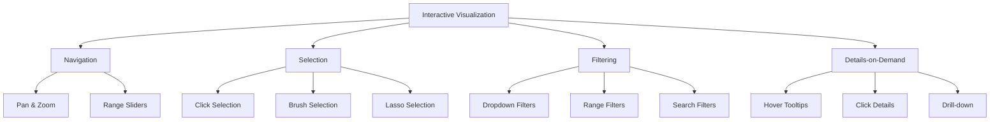
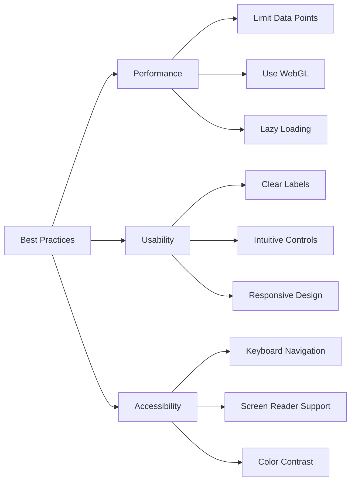

# Interactive Visualizations

## Introduction

Interactive visualizations transform static charts into dynamic, explorable interfaces that enable users to engage directly with data. Unlike traditional static plots, interactive visualizations allow users to zoom, pan, filter, hover for details, and drill down into data points, creating a more immersive analytical experience. This capability is crucial for modern data science, where complex datasets require flexible exploration tools to uncover insights.

Interactive visualizations serve multiple purposes: they facilitate data exploration during analysis, enhance presentations by allowing audiences to investigate findings themselves, and enable self-service analytics where stakeholders can explore data without technical expertise. The rise of web-based visualization libraries has made creating sophisticated interactive charts accessible to data scientists using familiar Python syntax.

## Key Interactive Visualization Libraries

### Plotly

Plotly is a powerful library that creates interactive, publication-quality graphs with minimal code. It supports over 40 chart types and integrates seamlessly with Jupyter notebooks and web applications.

```python
import plotly.graph_objects as go
import plotly.express as px
import pandas as pd
import numpy as np

# Create sample data
np.random.seed(42)
df = pd.DataFrame({
    'date': pd.date_range('2024-01-01', periods=100),
    'sales': np.cumsum(np.random.randn(100) * 10 + 50),
    'costs': np.cumsum(np.random.randn(100) * 8 + 40),
    'region': np.random.choice(['North', 'South', 'East', 'West'], 100),
    'product': np.random.choice(['A', 'B', 'C'], 100)
})

# Create interactive line chart with Plotly Express
fig = px.line(df, x='date', y=['sales', 'costs'],
              title='Sales vs Costs Over Time',
              labels={'value': 'Amount ($)', 'variable': 'Metric'},
              template='plotly_white')

# Customize layout
fig.update_layout(
    hovermode='x unified',
    xaxis=dict(rangeslider=dict(visible=True)),
    yaxis=dict(title='Amount ($)'),
    legend=dict(orientation='h', yanchor='bottom', y=1.02)
)

# Add annotations
fig.add_annotation(
    x=df['date'].iloc[50],
    y=df['sales'].iloc[50],
    text="Mid-point",
    showarrow=True,
    arrowhead=2
)

print("Plotly interactive chart created")
# fig.show()  # Displays in browser or Jupyter
```

### Advanced Plotly Features

```python
# Create interactive scatter plot with custom hover data
fig = go.Figure()

for region in df['region'].unique():
    region_data = df[df['region'] == region]

    fig.add_trace(go.Scatter(
        x=region_data['sales'],
        y=region_data['costs'],
        mode='markers',
        name=region,
        marker=dict(size=10, opacity=0.7),
        customdata=region_data[['date', 'product']],
        hovertemplate='<b>%{fullData.name}</b><br>' +
                      'Sales: $%{x:.2f}<br>' +
                      'Costs: $%{y:.2f}<br>' +
                      'Date: %{customdata[0]|%Y-%m-%d}<br>' +
                      'Product: %{customdata[1]}<br>' +
                      '<extra></extra>'
    ))

fig.update_layout(
    title='Sales vs Costs by Region (Interactive)',
    xaxis_title='Sales ($)',
    yaxis_title='Costs ($)',
    hovermode='closest',
    template='plotly_dark'
)

# Add interactive buttons for filtering
fig.update_layout(
    updatemenus=[
        dict(
            type="buttons",
            direction="left",
            buttons=list([
                dict(
                    args=[{"visible": [True, True, True, True]}],
                    label="All Regions",
                    method="update"
                ),
                dict(
                    args=[{"visible": [True, False, False, False]}],
                    label="North Only",
                    method="update"
                ),
            ]),
            pad={"r": 10, "t": 10},
            showactive=True,
            x=0.11,
            xanchor="left",
            y=1.15,
            yanchor="top"
        ),
    ]
)

print("Advanced Plotly scatter plot with custom interactions")
```

### Bokeh

Bokeh is designed for creating interactive visualizations for modern web browsers, with a focus on elegant, concise construction of novel graphics.

```python
from bokeh.plotting import figure, show, output_file
from bokeh.models import HoverTool, ColumnDataSource
from bokeh.layouts import column, row
from bokeh.models.widgets import Select
import pandas as pd
import numpy as np

# Create sample data
np.random.seed(42)
data = pd.DataFrame({
    'x': np.random.rand(100) * 100,
    'y': np.random.rand(100) * 100,
    'size': np.random.randint(10, 50, 100),
    'color': np.random.choice(['red', 'blue', 'green', 'orange'], 100),
    'category': np.random.choice(['A', 'B', 'C', 'D'], 100),
    'value': np.random.randint(100, 1000, 100)
})

# Create ColumnDataSource for interactivity
source = ColumnDataSource(data)

# Create figure with tools
p = figure(
    title="Interactive Scatter Plot with Bokeh",
    x_axis_label='X Variable',
    y_axis_label='Y Variable',
    width=700,
    height=500,
    tools="pan,wheel_zoom,box_zoom,reset,save,box_select,lasso_select"
)

# Add glyphs
circles = p.circle(
    'x', 'y',
    size='size',
    color='color',
    alpha=0.6,
    source=source,
    legend_field='category'
)

# Add hover tool with custom tooltips
hover = HoverTool(
    tooltips=[
        ("Category", "@category"),
        ("X", "@x{0.00}"),
        ("Y", "@y{0.00}"),
        ("Value", "$@value"),
        ("Size", "@size")
    ]
)
p.add_tools(hover)

# Customize legend
p.legend.location = "top_right"
p.legend.click_policy = "hide"  # Click legend to hide/show series

print("Bokeh interactive scatter plot created")
# output_file("bokeh_scatter.html")
# show(p)
```

### Advanced Bokeh - Linked Plots

```python
from bokeh.layouts import gridplot
from bokeh.models import ColumnDataSource

# Create shared data source for linking
source = ColumnDataSource(data)

# Create first plot
p1 = figure(
    title="Sales Over Time",
    x_axis_type='datetime',
    width=400,
    height=300
)

p1.line('date', 'sales', source=source, line_width=2, color='navy', alpha=0.8)
p1.circle('date', 'sales', source=source, size=5, color='navy')

# Create second plot (linked to first)
p2 = figure(
    title="Costs Over Time",
    x_axis_type='datetime',
    width=400,
    height=300,
    x_range=p1.x_range  # Link x-axis
)

p2.line('date', 'costs', source=source, line_width=2, color='red', alpha=0.8)
p2.circle('date', 'costs', source=source, size=5, color='red')

# Create correlation plot
p3 = figure(
    title="Sales vs Costs Correlation",
    width=400,
    height=300
)

p3.circle('sales', 'costs', source=source, size=8, alpha=0.5)

# Arrange in grid
layout = gridplot([[p1, p2], [p3, None]])

print("Bokeh linked plots created")
# show(layout)
```

### Altair

Altair provides a declarative API based on the Vega-Lite visualization grammar, making it easy to create complex multi-view compositions.

```python
import altair as alt
import pandas as pd
import numpy as np

# Enable data transformer for larger datasets
alt.data_transformers.enable('default', max_rows=None)

# Create sample data
np.random.seed(42)
df = pd.DataFrame({
    'date': pd.date_range('2024-01-01', periods=365),
    'temperature': np.random.randn(365) * 10 + 20,
    'humidity': np.random.rand(365) * 100,
    'rainfall': np.random.exponential(2, 365),
    'season': np.repeat(['Winter', 'Spring', 'Summer', 'Fall'], [90, 92, 92, 91])
})

# Create interactive line chart with selection
brush = alt.selection_interval(encodings=['x'])

base = alt.Chart(df).mark_line().encode(
    x=alt.X('date:T', title='Date'),
    y=alt.Y('temperature:Q', title='Temperature (°C)', scale=alt.Scale(zero=False)),
    color=alt.condition(brush, 'season:N', alt.value('lightgray'))
).properties(
    width=700,
    height=300,
    title='Temperature Over Time (Brush to Select)'
).add_selection(brush)

# Create detail view for selected data
detail = alt.Chart(df).mark_point().encode(
    x=alt.X('humidity:Q', title='Humidity (%)'),
    y=alt.Y('rainfall:Q', title='Rainfall (mm)'),
    color='season:N',
    tooltip=['date:T', 'temperature:Q', 'humidity:Q', 'rainfall:Q']
).properties(
    width=350,
    height=300,
    title='Humidity vs Rainfall (Filtered by Selection)'
).transform_filter(brush)

# Combine charts
chart = base & detail

print("Altair interactive chart with linked views created")
# chart.save('altair_chart.html')
```

## Interactive Visualization Design Patterns



### Creating Comprehensive Interactive Dashboards

```python
import plotly.graph_objects as go
from plotly.subplots import make_subplots
import pandas as pd
import numpy as np

# Generate comprehensive dataset
np.random.seed(42)
dates = pd.date_range('2024-01-01', periods=365)
df_dashboard = pd.DataFrame({
    'date': dates,
    'revenue': np.cumsum(np.random.randn(365) * 1000 + 50000),
    'users': np.cumsum(np.random.randint(-100, 200, 365)) + 10000,
    'conversion_rate': np.random.uniform(2, 8, 365),
    'avg_order_value': np.random.normal(75, 15, 365),
    'category': np.random.choice(['Electronics', 'Clothing', 'Food'], 365)
})

# Create subplots
fig = make_subplots(
    rows=2, cols=2,
    subplot_titles=('Revenue Over Time', 'User Growth',
                   'Conversion Rate Distribution', 'Revenue by Category'),
    specs=[[{'type': 'scatter'}, {'type': 'scatter'}],
           [{'type': 'histogram'}, {'type': 'bar'}]]
)

# Add revenue line chart
fig.add_trace(
    go.Scatter(
        x=df_dashboard['date'],
        y=df_dashboard['revenue'],
        mode='lines',
        name='Revenue',
        line=dict(color='green', width=2),
        hovertemplate='Date: %{x}<br>Revenue: $%{y:,.0f}<extra></extra>'
    ),
    row=1, col=1
)

# Add users line chart
fig.add_trace(
    go.Scatter(
        x=df_dashboard['date'],
        y=df_dashboard['users'],
        mode='lines',
        name='Users',
        line=dict(color='blue', width=2),
        hovertemplate='Date: %{x}<br>Users: %{y:,.0f}<extra></extra>'
    ),
    row=1, col=2
)

# Add conversion rate histogram
fig.add_trace(
    go.Histogram(
        x=df_dashboard['conversion_rate'],
        name='Conversion Rate',
        marker=dict(color='orange'),
        nbinsx=30
    ),
    row=2, col=1
)

# Add revenue by category
category_revenue = df_dashboard.groupby('category')['revenue'].sum().reset_index()
fig.add_trace(
    go.Bar(
        x=category_revenue['category'],
        y=category_revenue['revenue'],
        name='Revenue by Category',
        marker=dict(color=['red', 'blue', 'green']),
        hovertemplate='%{x}: $%{y:,.0f}<extra></extra>'
    ),
    row=2, col=2
)

# Update layout
fig.update_layout(
    height=800,
    showlegend=False,
    title_text="Interactive Business Dashboard",
    title_font_size=20
)

# Add range slider to first subplot
fig.update_xaxes(rangeslider_visible=True, row=1, col=1)

print("Comprehensive interactive dashboard created")
# fig.show()
```

## Performance Optimization for Interactive Visualizations

```python
# Optimize large datasets with data aggregation
class InteractiveVisOptimizer:
    def __init__(self, data, max_points=5000):
        self.data = data
        self.max_points = max_points

    def downsample_time_series(self, time_col, value_col):
        """Downsample time series data for better performance"""
        if len(self.data) <= self.max_points:
            return self.data

        # Use LTTB (Largest-Triangle-Three-Buckets) algorithm concept
        # Simplified version: sample evenly
        indices = np.round(np.linspace(0, len(self.data) - 1, self.max_points)).astype(int)
        return self.data.iloc[indices].copy()

    def aggregate_categorical(self, category_col, value_col, agg_func='mean'):
        """Aggregate data by category"""
        return self.data.groupby(category_col)[value_col].agg(agg_func).reset_index()

    def create_optimized_plot(self, x_col, y_col):
        """Create optimized interactive plot"""
        optimized_data = self.downsample_time_series(x_col, y_col)

        fig = go.Figure()
        fig.add_trace(go.Scattergl(  # Use WebGL for better performance
            x=optimized_data[x_col],
            y=optimized_data[y_col],
            mode='lines+markers',
            marker=dict(size=4),
            name='Optimized Data'
        ))

        fig.update_layout(
            title=f'Optimized Plot ({len(optimized_data)} points from {len(self.data)})',
            template='plotly_white'
        )

        return fig

# Example usage
large_data = pd.DataFrame({
    'timestamp': pd.date_range('2024-01-01', periods=100000, freq='1min'),
    'value': np.cumsum(np.random.randn(100000))
})

optimizer = InteractiveVisOptimizer(large_data, max_points=1000)
optimized_fig = optimizer.create_optimized_plot('timestamp', 'value')
print(f"Optimized visualization from {len(large_data)} to 1000 points")
```

## Best Practices for Interactive Visualizations



### Implementation Example

```python
# Create accessible interactive visualization
def create_accessible_chart(data, x_col, y_col, title):
    """Create an accessible interactive chart following best practices"""

    fig = px.scatter(
        data,
        x=x_col,
        y=y_col,
        title=title,
        template='plotly_white'
    )

    # Add clear labels
    fig.update_xaxes(
        title_text=x_col.replace('_', ' ').title(),
        title_font=dict(size=14),
        showgrid=True,
        gridcolor='lightgray'
    )

    fig.update_yaxes(
        title_text=y_col.replace('_', ' ').title(),
        title_font=dict(size=14),
        showgrid=True,
        gridcolor='lightgray'
    )

    # Use accessible color scheme
    fig.update_traces(
        marker=dict(
            size=10,
            color='rgb(44, 160, 101)',  # Color-blind friendly
            line=dict(width=1, color='white')
        )
    )

    # Add descriptive hover
    fig.update_traces(
        hovertemplate='<b>%{x}</b><br>Value: %{y:.2f}<extra></extra>'
    )

    # Ensure responsive layout
    fig.update_layout(
        font=dict(size=12),
        title_font=dict(size=18),
        hovermode='closest',
        autosize=True
    )

    return fig

# Example usage
sample_data = pd.DataFrame({
    'sales_month': pd.date_range('2024-01-01', periods=12, freq='M'),
    'monthly_revenue': np.random.uniform(50000, 150000, 12)
})

accessible_chart = create_accessible_chart(
    sample_data,
    'sales_month',
    'monthly_revenue',
    'Monthly Revenue Analysis'
)
print("Accessible interactive chart created")
```

## Key Takeaways

Interactive visualizations are essential tools for modern data science, offering numerous advantages over static charts:

1. **Enhanced Exploration**: Interactive features allow users to explore data from multiple angles, discovering patterns and insights that might be missed in static visualizations.

2. **Library Selection**: Choose the right library for your needs - Plotly for versatility and ease of use, Bokeh for web-focused applications, and Altair for declarative grammar and complex compositions.

3. **Performance Matters**: Optimize visualizations for large datasets using downsampling, aggregation, and WebGL rendering to maintain responsiveness.

4. **User Experience**: Design with users in mind by providing clear labels, intuitive controls, and meaningful tooltips. Interactive doesn't mean complicated.

5. **Accessibility**: Ensure visualizations are accessible to all users through proper color choices, keyboard navigation, and screen reader compatibility.

6. **Linked Views**: Create coordinated multiple views where interactions in one chart affect others, enabling multi-dimensional data exploration.

7. **Progressive Disclosure**: Start with overview visualizations and allow users to drill down into details, following the "overview first, zoom and filter, details on demand" paradigm.

8. **Testing**: Always test interactive visualizations with real users to ensure controls are intuitive and interactions add value rather than complexity.

Interactive visualizations transform data from static presentations into dynamic exploration tools, empowering users to engage with data directly and derive their own insights. By mastering these techniques and libraries, data scientists can create compelling, user-friendly analytical experiences that drive better decision-making.
