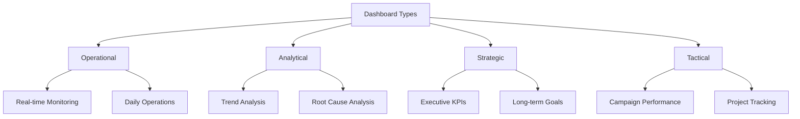
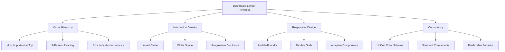

# Dashboard Design

## Introduction

Dashboards are powerful tools that consolidate multiple data visualizations, metrics, and controls into a single, cohesive interface. They serve as command centers for data-driven decision-making, providing at-a-glance visibility into key performance indicators (KPIs) and enabling stakeholders to monitor business health, track progress toward goals, and identify areas requiring attention.

Effective dashboard design goes beyond simply arranging charts on a screen. It requires understanding your audience, prioritizing information, designing intuitive layouts, and ensuring the dashboard tells a clear story. Whether building operational dashboards for daily monitoring, analytical dashboards for deep exploration, or strategic dashboards for executive decision-making, the principles of good dashboard design remain consistent: clarity, relevance, and actionability.

## Dashboard Types and Use Cases



## Streamlit for Rapid Dashboard Development

Streamlit enables creating interactive dashboards with pure Python, eliminating the need for HTML, CSS, or JavaScript knowledge.

```python
import streamlit as st
import pandas as pd
import numpy as np
import plotly.express as px
import plotly.graph_objects as go
from datetime import datetime, timedelta

# Set page configuration
st.set_page_config(
    page_title="Sales Analytics Dashboard",
    page_icon="📊",
    layout="wide",
    initial_sidebar_state="expanded"
)

# Generate sample data
@st.cache_data
def load_data():
    np.random.seed(42)
    dates = pd.date_range(start='2024-01-01', end='2024-12-31', freq='D')

    df = pd.DataFrame({
        'date': dates,
        'revenue': np.random.uniform(10000, 50000, len(dates)),
        'orders': np.random.randint(100, 500, len(dates)),
        'customers': np.random.randint(80, 450, len(dates)),
        'region': np.random.choice(['North', 'South', 'East', 'West'], len(dates)),
        'product_category': np.random.choice(['Electronics', 'Clothing', 'Food', 'Books'], len(dates))
    })

    df['avg_order_value'] = df['revenue'] / df['orders']
    return df

# Load data
data = load_data()

# Dashboard Title
st.title("📊 Sales Analytics Dashboard")
st.markdown("### Real-time Business Intelligence")

# Sidebar filters
st.sidebar.header("Filters")
date_range = st.sidebar.date_input(
    "Select Date Range",
    value=(data['date'].min(), data['date'].max()),
    min_value=data['date'].min().date(),
    max_value=data['date'].max().date()
)

selected_regions = st.sidebar.multiselect(
    "Select Regions",
    options=data['region'].unique(),
    default=data['region'].unique()
)

selected_categories = st.sidebar.multiselect(
    "Select Product Categories",
    options=data['product_category'].unique(),
    default=data['product_category'].unique()
)

# Filter data based on selections
if len(date_range) == 2:
    filtered_data = data[
        (data['date'].dt.date >= date_range[0]) &
        (data['date'].dt.date <= date_range[1]) &
        (data['region'].isin(selected_regions)) &
        (data['product_category'].isin(selected_categories))
    ]
else:
    filtered_data = data

# Key Metrics Row
st.markdown("---")
col1, col2, col3, col4 = st.columns(4)

with col1:
    total_revenue = filtered_data['revenue'].sum()
    st.metric(
        label="Total Revenue",
        value=f"${total_revenue:,.0f}",
        delta=f"{((total_revenue / data['revenue'].sum()) - 1) * 100:.1f}%"
    )

with col2:
    total_orders = filtered_data['orders'].sum()
    st.metric(
        label="Total Orders",
        value=f"{total_orders:,}",
        delta=f"{total_orders - data['orders'].mean():.0f}"
    )

with col3:
    avg_order_val = filtered_data['avg_order_value'].mean()
    st.metric(
        label="Avg Order Value",
        value=f"${avg_order_val:.2f}",
        delta=f"{((avg_order_val / data['avg_order_value'].mean()) - 1) * 100:.1f}%"
    )

with col4:
    total_customers = filtered_data['customers'].sum()
    st.metric(
        label="Total Customers",
        value=f"{total_customers:,}",
        delta=f"{total_customers - data['customers'].mean():.0f}"
    )

# Charts Row 1
st.markdown("---")
col1, col2 = st.columns(2)

with col1:
    st.subheader("Revenue Trend Over Time")
    revenue_trend = filtered_data.groupby('date')['revenue'].sum().reset_index()
    fig1 = px.line(
        revenue_trend,
        x='date',
        y='revenue',
        title='Daily Revenue',
        template='plotly_white'
    )
    fig1.update_traces(line_color='#1f77b4', line_width=2)
    st.plotly_chart(fig1, use_container_width=True)

with col2:
    st.subheader("Revenue by Region")
    region_revenue = filtered_data.groupby('region')['revenue'].sum().reset_index()
    fig2 = px.bar(
        region_revenue,
        x='region',
        y='revenue',
        title='Regional Performance',
        color='revenue',
        color_continuous_scale='Blues',
        template='plotly_white'
    )
    st.plotly_chart(fig2, use_container_width=True)

# Charts Row 2
col3, col4 = st.columns(2)

with col3:
    st.subheader("Product Category Distribution")
    category_dist = filtered_data.groupby('product_category')['revenue'].sum().reset_index()
    fig3 = px.pie(
        category_dist,
        values='revenue',
        names='product_category',
        title='Revenue by Category',
        hole=0.4,
        template='plotly_white'
    )
    st.plotly_chart(fig3, use_container_width=True)

with col4:
    st.subheader("Orders vs Revenue Correlation")
    fig4 = px.scatter(
        filtered_data,
        x='orders',
        y='revenue',
        color='region',
        size='customers',
        title='Orders vs Revenue Analysis',
        template='plotly_white',
        trendline='ols'
    )
    st.plotly_chart(fig4, use_container_width=True)

# Data Table
st.markdown("---")
st.subheader("Detailed Data View")
st.dataframe(
    filtered_data.sort_values('date', ascending=False).head(100),
    use_container_width=True,
    hide_index=True
)

# Export functionality
st.sidebar.markdown("---")
st.sidebar.subheader("Export Options")
if st.sidebar.button("Download Filtered Data"):
    csv = filtered_data.to_csv(index=False)
    st.sidebar.download_button(
        label="Download CSV",
        data=csv,
        file_name=f"sales_data_{datetime.now().strftime('%Y%m%d')}.csv",
        mime="text/csv"
    )

print("Streamlit dashboard code created")
```

## Plotly Dash for Production Dashboards

Dash is built on top of Flask, Plotly.js, and React.js, making it suitable for production-grade applications with custom styling and complex interactions.

```python
import dash
from dash import dcc, html, Input, Output, State
import dash_bootstrap_components as dbc
import plotly.express as px
import plotly.graph_objects as go
import pandas as pd
import numpy as np

# Initialize Dash app with Bootstrap theme
app = dash.Dash(__name__, external_stylesheets=[dbc.themes.BOOTSTRAP])

# Generate sample data
np.random.seed(42)
df = pd.DataFrame({
    'date': pd.date_range('2024-01-01', periods=365),
    'sales': np.cumsum(np.random.randn(365) * 1000 + 50000),
    'profit': np.cumsum(np.random.randn(365) * 800 + 20000),
    'expenses': np.cumsum(np.random.randn(365) * 600 + 30000),
    'product': np.random.choice(['Product A', 'Product B', 'Product C'], 365),
    'region': np.random.choice(['North', 'South', 'East', 'West'], 365)
})

# Define layout
app.layout = dbc.Container([
    # Header
    dbc.Row([
        dbc.Col([
            html.H1("Business Intelligence Dashboard", className="text-center mb-4"),
            html.Hr()
        ])
    ]),

    # Control Panel
    dbc.Row([
        dbc.Col([
            dbc.Card([
                dbc.CardBody([
                    html.H5("Filters", className="card-title"),
                    html.Label("Date Range"),
                    dcc.DatePickerRange(
                        id='date-range',
                        start_date=df['date'].min(),
                        end_date=df['date'].max(),
                        display_format='YYYY-MM-DD',
                        className="mb-3"
                    ),
                    html.Label("Product", className="mt-3"),
                    dcc.Dropdown(
                        id='product-dropdown',
                        options=[{'label': p, 'value': p} for p in df['product'].unique()],
                        value=df['product'].unique().tolist(),
                        multi=True,
                        className="mb-3"
                    ),
                    html.Label("Region", className="mt-3"),
                    dcc.Dropdown(
                        id='region-dropdown',
                        options=[{'label': r, 'value': r} for r in df['region'].unique()],
                        value=df['region'].unique().tolist(),
                        multi=True
                    )
                ])
            ])
        ], width=3),

        # KPI Cards
        dbc.Col([
            dbc.Row([
                dbc.Col([
                    dbc.Card([
                        dbc.CardBody([
                            html.H6("Total Sales", className="card-subtitle"),
                            html.H3(id="total-sales", className="card-title text-success")
                        ])
                    ], className="mb-3")
                ], width=4),
                dbc.Col([
                    dbc.Card([
                        dbc.CardBody([
                            html.H6("Total Profit", className="card-subtitle"),
                            html.H3(id="total-profit", className="card-title text-primary")
                        ])
                    ], className="mb-3")
                ], width=4),
                dbc.Col([
                    dbc.Card([
                        dbc.CardBody([
                            html.H6("Profit Margin", className="card-subtitle"),
                            html.H3(id="profit-margin", className="card-title text-info")
                        ])
                    ], className="mb-3")
                ], width=4)
            ])
        ], width=9)
    ], className="mb-4"),

    # Charts Row 1
    dbc.Row([
        dbc.Col([
            dcc.Graph(id='sales-trend-chart')
        ], width=8),
        dbc.Col([
            dcc.Graph(id='product-distribution')
        ], width=4)
    ], className="mb-4"),

    # Charts Row 2
    dbc.Row([
        dbc.Col([
            dcc.Graph(id='regional-performance')
        ], width=6),
        dbc.Col([
            dcc.Graph(id='expense-breakdown')
        ], width=6)
    ])
], fluid=True)

# Callbacks for interactivity
@app.callback(
    [Output('total-sales', 'children'),
     Output('total-profit', 'children'),
     Output('profit-margin', 'children'),
     Output('sales-trend-chart', 'figure'),
     Output('product-distribution', 'figure'),
     Output('regional-performance', 'figure'),
     Output('expense-breakdown', 'figure')],
    [Input('date-range', 'start_date'),
     Input('date-range', 'end_date'),
     Input('product-dropdown', 'value'),
     Input('region-dropdown', 'value')]
)
def update_dashboard(start_date, end_date, selected_products, selected_regions):
    # Filter data
    filtered_df = df[
        (df['date'] >= start_date) &
        (df['date'] <= end_date) &
        (df['product'].isin(selected_products)) &
        (df['region'].isin(selected_regions))
    ]

    # Calculate KPIs
    total_sales = f"${filtered_df['sales'].sum():,.0f}"
    total_profit = f"${filtered_df['profit'].sum():,.0f}"
    profit_margin = f"{(filtered_df['profit'].sum() / filtered_df['sales'].sum() * 100):.1f}%"

    # Sales trend chart
    sales_trend = px.line(
        filtered_df,
        x='date',
        y='sales',
        title='Sales Trend Over Time',
        template='plotly_white'
    )
    sales_trend.update_traces(line_color='#28a745', line_width=3)

    # Product distribution
    product_dist = filtered_df.groupby('product')['sales'].sum().reset_index()
    product_chart = px.pie(
        product_dist,
        values='sales',
        names='product',
        title='Sales by Product',
        hole=0.4
    )

    # Regional performance
    regional_perf = filtered_df.groupby('region')[['sales', 'profit']].sum().reset_index()
    region_chart = px.bar(
        regional_perf,
        x='region',
        y=['sales', 'profit'],
        title='Regional Performance',
        barmode='group',
        template='plotly_white'
    )

    # Expense breakdown
    expense_chart = go.Figure()
    expense_chart.add_trace(go.Scatter(
        x=filtered_df['date'],
        y=filtered_df['expenses'],
        fill='tonexty',
        name='Expenses',
        line=dict(color='red')
    ))
    expense_chart.update_layout(
        title='Expenses Over Time',
        template='plotly_white'
    )

    return (total_sales, total_profit, profit_margin,
            sales_trend, product_chart, region_chart, expense_chart)

print("Dash dashboard code created")
# To run: app.run_server(debug=True)
```

## Dashboard Layout Principles



## Tableau Concepts in Python

While Tableau is a proprietary tool, we can implement similar concepts using Python:

```python
import pandas as pd
import numpy as np
import plotly.express as px
from plotly.subplots import make_subplots
import plotly.graph_objects as go

class TableauStyleDashboard:
    """Implement Tableau-like dashboard concepts in Python"""

    def __init__(self, data):
        self.data = data
        self.filters = {}

    def add_filter(self, column, values):
        """Add dimension filter (Tableau concept)"""
        self.filters[column] = values

    def apply_filters(self):
        """Apply all filters to data"""
        filtered_data = self.data.copy()

        for column, values in self.filters.items():
            if values:
                filtered_data = filtered_data[filtered_data[column].isin(values)]

        return filtered_data

    def create_calculated_field(self, name, formula):
        """Create calculated field (Tableau concept)"""
        self.data[name] = self.data.eval(formula)

    def create_parameter(self, name, default_value, values):
        """Create parameter for dynamic calculations"""
        return {'name': name, 'value': default_value, 'options': values}

    def create_hierarchy(self, levels):
        """Create drill-down hierarchy"""
        hierarchy = {}
        for i, level in enumerate(levels):
            hierarchy[f'level_{i}'] = level
        return hierarchy

    def build_worksheet(self, chart_type, x, y, color=None, size=None):
        """Create individual worksheet (Tableau concept)"""
        filtered_data = self.apply_filters()

        if chart_type == 'bar':
            fig = px.bar(filtered_data, x=x, y=y, color=color)
        elif chart_type == 'line':
            fig = px.line(filtered_data, x=x, y=y, color=color)
        elif chart_type == 'scatter':
            fig = px.scatter(filtered_data, x=x, y=y, color=color, size=size)
        else:
            raise ValueError(f"Unsupported chart type: {chart_type}")

        return fig

    def create_dashboard(self, worksheets, layout='grid'):
        """Combine worksheets into dashboard"""
        if layout == 'grid':
            rows = int(np.ceil(len(worksheets) / 2))
            fig = make_subplots(
                rows=rows,
                cols=2,
                subplot_titles=[ws['title'] for ws in worksheets]
            )

            for idx, worksheet in enumerate(worksheets):
                row = idx // 2 + 1
                col = idx % 2 + 1

                chart = self.build_worksheet(
                    worksheet['type'],
                    worksheet['x'],
                    worksheet['y'],
                    worksheet.get('color'),
                    worksheet.get('size')
                )

                for trace in chart.data:
                    fig.add_trace(trace, row=row, col=col)

            fig.update_layout(height=800, showlegend=False)
            return fig

# Example usage
np.random.seed(42)
sample_data = pd.DataFrame({
    'date': pd.date_range('2024-01-01', periods=365),
    'sales': np.random.uniform(1000, 5000, 365),
    'profit': np.random.uniform(200, 1000, 365),
    'quantity': np.random.randint(10, 100, 365),
    'category': np.random.choice(['A', 'B', 'C'], 365),
    'region': np.random.choice(['North', 'South', 'East', 'West'], 365)
})

dashboard = TableauStyleDashboard(sample_data)

# Add filters
dashboard.add_filter('category', ['A', 'B'])
dashboard.add_filter('region', ['North', 'South'])

# Create calculated field
dashboard.create_calculated_field('profit_margin', 'profit / sales * 100')

# Define worksheets
worksheets = [
    {'title': 'Sales Trend', 'type': 'line', 'x': 'date', 'y': 'sales', 'color': 'category'},
    {'title': 'Regional Sales', 'type': 'bar', 'x': 'region', 'y': 'sales', 'color': 'category'},
    {'title': 'Sales vs Profit', 'type': 'scatter', 'x': 'sales', 'y': 'profit',
     'color': 'category', 'size': 'quantity'},
    {'title': 'Category Performance', 'type': 'bar', 'x': 'category', 'y': 'profit_margin'}
]

# Create dashboard
dashboard_fig = dashboard.create_dashboard(worksheets)
print("Tableau-style dashboard created")
```

## Dashboard Performance Optimization

```python
class DashboardOptimizer:
    """Optimize dashboard performance"""

    @staticmethod
    def cache_data(func):
        """Decorator for caching expensive data operations"""
        cache = {}

        def wrapper(*args, **kwargs):
            key = str(args) + str(kwargs)
            if key not in cache:
                cache[key] = func(*args, **kwargs)
            return cache[key]

        return wrapper

    @staticmethod
    def aggregate_large_datasets(df, group_cols, agg_dict, threshold=10000):
        """Aggregate data if too large"""
        if len(df) > threshold:
            return df.groupby(group_cols).agg(agg_dict).reset_index()
        return df

    @staticmethod
    def lazy_load_charts(data_chunks):
        """Implement lazy loading for multiple charts"""
        for chunk in data_chunks:
            yield chunk

    @staticmethod
    def optimize_data_types(df):
        """Optimize DataFrame data types for memory efficiency"""
        for col in df.select_dtypes(include=['float64']).columns:
            df[col] = df[col].astype('float32')

        for col in df.select_dtypes(include=['int64']).columns:
            df[col] = df[col].astype('int32')

        for col in df.select_dtypes(include=['object']).columns:
            if df[col].nunique() / len(df) < 0.5:
                df[col] = df[col].astype('category')

        return df

# Example usage
large_data = pd.DataFrame({
    'timestamp': pd.date_range('2024-01-01', periods=1000000, freq='1min'),
    'value': np.random.randn(1000000),
    'category': np.random.choice(['A', 'B', 'C'], 1000000)
})

optimizer = DashboardOptimizer()

# Optimize data types
optimized_data = optimizer.optimize_data_types(large_data)
print(f"Memory usage reduced from {large_data.memory_usage().sum() / 1024**2:.2f} MB "
      f"to {optimized_data.memory_usage().sum() / 1024**2:.2f} MB")

# Aggregate for visualization
aggregated = optimizer.aggregate_large_datasets(
    optimized_data,
    ['category'],
    {'value': ['mean', 'std', 'count']},
    threshold=10000
)
print(f"Aggregated from {len(optimized_data)} to {len(aggregated)} rows")
```

## Dashboard Design Checklist

```python
class DashboardDesignValidator:
    """Validate dashboard against best practices"""

    def __init__(self, dashboard_config):
        self.config = dashboard_config
        self.issues = []

    def validate_layout(self):
        """Check layout best practices"""
        if self.config.get('num_charts', 0) > 8:
            self.issues.append("Too many charts - consider splitting into multiple dashboards")

        if not self.config.get('has_filters'):
            self.issues.append("No filters provided - add interactivity")

    def validate_color_scheme(self):
        """Check color accessibility"""
        colors = self.config.get('colors', [])
        if len(colors) > 7:
            self.issues.append("Too many colors - simplify color palette")

    def validate_kpis(self):
        """Check KPI presentation"""
        if not self.config.get('has_kpis'):
            self.issues.append("Missing key metrics - add KPI cards")

    def validate_responsiveness(self):
        """Check responsive design"""
        if not self.config.get('responsive'):
            self.issues.append("Dashboard not responsive - ensure mobile compatibility")

    def generate_report(self):
        """Generate validation report"""
        self.validate_layout()
        self.validate_color_scheme()
        self.validate_kpis()
        self.validate_responsiveness()

        if not self.issues:
            return "Dashboard design follows best practices!"

        return "Issues found:\n" + "\n".join(f"- {issue}" for issue in self.issues)

# Example usage
dashboard_config = {
    'num_charts': 6,
    'has_filters': True,
    'colors': ['#1f77b4', '#ff7f0e', '#2ca02c'],
    'has_kpis': True,
    'responsive': True
}

validator = DashboardDesignValidator(dashboard_config)
print(validator.generate_report())
```

## Key Takeaways

Dashboard design is both an art and a science, requiring careful attention to user needs, visual design, and technical implementation:

1. **Know Your Audience**: Design dashboards for specific user roles and use cases. Executive dashboards differ significantly from operational monitoring dashboards.

2. **Prioritize Information**: Place the most critical metrics and visualizations prominently. Follow the "three-second rule" - users should grasp the main insights within three seconds.

3. **Choose the Right Tools**: Streamlit excels for rapid prototyping and data science teams, Dash provides production-ready capabilities with custom styling, and understanding Tableau concepts helps design better dashboards in any tool.

4. **Optimize Performance**: Large datasets require aggregation, caching, and efficient data types. A slow dashboard is a useless dashboard.

5. **Enable Interactivity**: Filters, drill-downs, and linked views transform static reports into exploratory tools. But ensure interactions are intuitive and add value.

6. **Design for Clarity**: Use whitespace effectively, limit colors, maintain consistency, and avoid chart junk. Every element should serve a purpose.

7. **Make It Responsive**: Dashboards should work across devices and screen sizes. Test on multiple platforms.

8. **Iterate Based on Feedback**: The best dashboards evolve through user feedback and usage analytics. Monitor which features users actually use.

Effective dashboards empower organizations to make data-driven decisions quickly and confidently, turning raw data into actionable insights at a glance.
