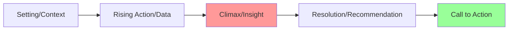
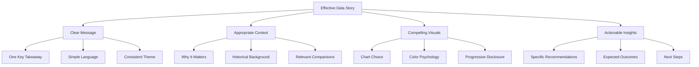

# Data Storytelling

## Introduction

Data storytelling is the art and science of communicating insights from data analysis through compelling narratives that drive action and understanding. While data analysis uncovers patterns and insights, data storytelling translates those findings into narratives that resonate with audiences, influence decisions, and inspire action. It combines three essential elements: data (accurate and relevant), visualizations (clear and appropriate), and narrative (compelling and contextual).

In today's data-driven world, the ability to tell effective data stories is as critical as analytical skills. Technical accuracy alone is insufficient; data scientists must craft narratives that connect with stakeholders emotionally and intellectually, making complex findings accessible and actionable. A well-told data story can transform abstract numbers into meaningful insights that drive organizational change.

## The Narrative Arc in Data Storytelling



### Building the Story Structure

```python
import pandas as pd
import numpy as np
import matplotlib.pyplot as plt
import seaborn as sns
import plotly.graph_objects as go
from plotly.subplots import make_subplots

class DataStory:
    """Framework for creating data-driven narratives"""

    def __init__(self, title, context):
        self.title = title
        self.context = context
        self.data_points = []
        self.insights = []
        self.recommendations = []

    def add_context(self, context_text):
        """Set the scene - why this analysis matters"""
        self.context = context_text

    def add_data_point(self, metric, value, description):
        """Add supporting data points"""
        self.data_points.append({
            'metric': metric,
            'value': value,
            'description': description
        })

    def add_insight(self, insight_text, importance='high'):
        """Add key insights discovered"""
        self.insights.append({
            'text': insight_text,
            'importance': importance
        })

    def add_recommendation(self, action, expected_impact):
        """Add actionable recommendations"""
        self.recommendations.append({
            'action': action,
            'impact': expected_impact
        })

    def generate_narrative(self):
        """Generate complete story narrative"""
        narrative = f"# {self.title}\n\n"
        narrative += f"## Context\n{self.context}\n\n"

        narrative += "## Key Findings\n"
        for dp in self.data_points:
            narrative += f"- {dp['metric']}: {dp['value']} - {dp['description']}\n"

        narrative += "\n## Insights\n"
        for insight in self.insights:
            priority = "🔴" if insight['importance'] == 'high' else "🟡"
            narrative += f"{priority} {insight['text']}\n"

        narrative += "\n## Recommendations\n"
        for i, rec in enumerate(self.recommendations, 1):
            narrative += f"{i}. {rec['action']}\n"
            narrative += f"   Expected Impact: {rec['impact']}\n"

        return narrative

# Example: Customer Churn Analysis Story
story = DataStory(
    title="Customer Churn Analysis: Q4 2024",
    context="Our customer retention rate has declined 15% over the past quarter, "
            "impacting revenue projections and long-term growth targets."
)

# Add data points
story.add_data_point("Churn Rate", "23%", "Up from 18% in Q3")
story.add_data_point("Revenue Impact", "$2.3M", "Lost annual recurring revenue")
story.add_data_point("Customer Lifetime Value", "$12,500", "Average across churned customers")

# Add insights
story.add_insight(
    "Customers who haven't engaged with support in 60 days are 3x more likely to churn",
    importance='high'
)
story.add_insight(
    "Price increases correlate with 40% of churn cases",
    importance='high'
)
story.add_insight(
    "Customers using fewer than 3 features churn at 2x the rate",
    importance='medium'
)

# Add recommendations
story.add_recommendation(
    "Implement proactive outreach program for at-risk customers",
    "Estimated 5-7% reduction in churn"
)
story.add_recommendation(
    "Create feature adoption campaign with onboarding improvements",
    "Increase feature usage by 30%, reduce churn by 3-4%"
)
story.add_recommendation(
    "Develop granular pricing tiers for price-sensitive segments",
    "Retain 25% of price-related churn"
)

print(story.generate_narrative())
```

## Audience Analysis and Adaptation

Understanding your audience is crucial for effective data storytelling:

```python
class AudienceProfile:
    """Analyze and adapt to different audience types"""

    AUDIENCE_TYPES = {
        'executive': {
            'focus': 'high-level insights and business impact',
            'detail_level': 'minimal',
            'preferred_viz': ['KPI cards', 'trend lines', 'simple bars'],
            'time_available': '5-10 minutes',
            'decision_focus': 'strategic'
        },
        'technical': {
            'focus': 'methodology and statistical rigor',
            'detail_level': 'comprehensive',
            'preferred_viz': ['scatter plots', 'distributions', 'correlation matrices'],
            'time_available': '30-60 minutes',
            'decision_focus': 'implementation'
        },
        'operational': {
            'focus': 'actionable insights and processes',
            'detail_level': 'moderate',
            'preferred_viz': ['dashboards', 'bar charts', 'time series'],
            'time_available': '15-20 minutes',
            'decision_focus': 'tactical'
        },
        'general': {
            'focus': 'clear takeaways and relevance',
            'detail_level': 'basic',
            'preferred_viz': ['simple charts', 'infographics', 'annotations'],
            'time_available': '10-15 minutes',
            'decision_focus': 'awareness'
        }
    }

    def __init__(self, audience_type):
        if audience_type not in self.AUDIENCE_TYPES:
            raise ValueError(f"Unknown audience type. Choose from: {list(self.AUDIENCE_TYPES.keys())}")

        self.profile = self.AUDIENCE_TYPES[audience_type]
        self.audience_type = audience_type

    def get_recommendations(self):
        """Get recommendations for this audience"""
        return {
            'opening': self._get_opening_strategy(),
            'structure': self._get_structure_strategy(),
            'visualization': self._get_viz_strategy(),
            'language': self._get_language_strategy()
        }

    def _get_opening_strategy(self):
        if self.audience_type == 'executive':
            return "Start with the bottom line - impact and recommendations first"
        elif self.audience_type == 'technical':
            return "Begin with the problem statement and methodology overview"
        elif self.audience_type == 'operational':
            return "Open with current challenges and how insights address them"
        else:
            return "Start with a relatable scenario or question"

    def _get_structure_strategy(self):
        if self.audience_type == 'executive':
            return "Inverted pyramid: conclusions first, supporting details if needed"
        elif self.audience_type == 'technical':
            return "Linear progression: hypothesis → method → results → interpretation"
        else:
            return "Problem → insight → solution flow"

    def _get_viz_strategy(self):
        return f"Prefer: {', '.join(self.profile['preferred_viz'])}"

    def _get_language_strategy(self):
        if self.audience_type == 'executive':
            return "Business-focused language, avoid technical jargon"
        elif self.audience_type == 'technical':
            return "Precise technical terminology, include statistical measures"
        else:
            return "Clear, accessible language with minimal jargon"

# Example usage
for audience in ['executive', 'technical', 'operational', 'general']:
    profile = AudienceProfile(audience)
    print(f"\n=== {audience.upper()} AUDIENCE ===")
    recommendations = profile.get_recommendations()
    for key, value in recommendations.items():
        print(f"{key.title()}: {value}")
```

## Visual Storytelling Techniques

```python
# Create a progressive disclosure story with visualizations
class VisualStoryBuilder:
    """Build visual narratives that reveal insights progressively"""

    def __init__(self, data):
        self.data = data
        self.story_frames = []

    def create_overview(self, title):
        """Frame 1: Show the big picture"""
        fig, ax = plt.subplots(figsize=(12, 6))

        # Aggregate view
        monthly_data = self.data.groupby(
            self.data['date'].dt.to_period('M')
        )['revenue'].sum()

        ax.plot(monthly_data.index.astype(str), monthly_data.values,
                linewidth=3, color='steelblue', marker='o', markersize=8)
        ax.set_title(title, fontsize=16, fontweight='bold', pad=20)
        ax.set_xlabel('Month', fontsize=12)
        ax.set_ylabel('Revenue ($)', fontsize=12)
        ax.grid(True, alpha=0.3)

        # Annotate overall trend
        trend = (monthly_data.iloc[-1] - monthly_data.iloc[0]) / monthly_data.iloc[0] * 100
        ax.annotate(f'Overall: {trend:+.1f}%',
                   xy=(0.7, 0.95), xycoords='axes fraction',
                   fontsize=14, fontweight='bold',
                   bbox=dict(boxstyle='round', facecolor='wheat', alpha=0.5))

        plt.tight_layout()
        return fig

    def create_detail_view(self, title, focus_segment):
        """Frame 2: Zoom into specific segments"""
        fig, ax = plt.subplots(figsize=(12, 6))

        # Segment comparison
        for segment in self.data['segment'].unique():
            segment_data = self.data[self.data['segment'] == segment]
            monthly = segment_data.groupby(
                segment_data['date'].dt.to_period('M')
            )['revenue'].sum()

            alpha = 1.0 if segment == focus_segment else 0.3
            linewidth = 3 if segment == focus_segment else 1

            ax.plot(monthly.index.astype(str), monthly.values,
                   label=segment, alpha=alpha, linewidth=linewidth, marker='o')

        ax.set_title(title, fontsize=16, fontweight='bold', pad=20)
        ax.set_xlabel('Month', fontsize=12)
        ax.set_ylabel('Revenue ($)', fontsize=12)
        ax.legend(loc='best')
        ax.grid(True, alpha=0.3)

        plt.tight_layout()
        return fig

    def create_insight_highlight(self, title, insight_points):
        """Frame 3: Highlight specific insights"""
        fig, ax = plt.subplots(figsize=(12, 6))

        # Main data
        monthly_data = self.data.groupby(
            self.data['date'].dt.to_period('M')
        )['revenue'].sum()

        ax.plot(monthly_data.index.astype(str), monthly_data.values,
                linewidth=2, color='gray', alpha=0.5, label='Revenue')

        # Highlight insight points
        for point in insight_points:
            idx = point['index']
            ax.scatter(monthly_data.index.astype(str)[idx],
                      monthly_data.values[idx],
                      s=300, color='red', zorder=5, alpha=0.7)
            ax.annotate(point['label'],
                       xy=(idx, monthly_data.values[idx]),
                       xytext=(idx, monthly_data.values[idx] * 1.1),
                       fontsize=10, fontweight='bold',
                       arrowprops=dict(arrowstyle='->', color='red', lw=2))

        ax.set_title(title, fontsize=16, fontweight='bold', pad=20)
        ax.set_xlabel('Month', fontsize=12)
        ax.set_ylabel('Revenue ($)', fontsize=12)
        ax.grid(True, alpha=0.3)

        plt.tight_layout()
        return fig

# Generate sample data
np.random.seed(42)
dates = pd.date_range('2024-01-01', periods=365, freq='D')
df_story = pd.DataFrame({
    'date': dates,
    'revenue': np.random.normal(10000, 2000, 365) + np.linspace(0, 5000, 365),
    'segment': np.random.choice(['Enterprise', 'SMB', 'Consumer'], 365)
})

# Build visual story
story_builder = VisualStoryBuilder(df_story)

# Frame 1: Overview
fig1 = story_builder.create_overview("Revenue Growth: 2024 Overview")
print("Frame 1: Overview created")

# Frame 2: Detail
fig2 = story_builder.create_detail_view(
    "Revenue by Customer Segment",
    focus_segment='Enterprise'
)
print("Frame 2: Segment detail created")

# Frame 3: Insights
insights = [
    {'index': 3, 'label': 'Q1 Spike:\nProduct Launch'},
    {'index': 6, 'label': 'Q2 Dip:\nSeasonal Effect'},
    {'index': 9, 'label': 'Q3 Recovery:\nNew Campaign'}
]
fig3 = story_builder.create_insight_highlight(
    "Key Events and Their Impact",
    insights
)
print("Frame 3: Insight highlights created")

# plt.show()
```

## Emotion and Persuasion in Data Stories

```python
class PersuasiveDataStory:
    """Create emotionally resonant data narratives"""

    @staticmethod
    def humanize_numbers(value, context='generic'):
        """Convert abstract numbers into relatable comparisons"""
        comparisons = {
            'money': {
                1000000: "equivalent to 50 employee salaries",
                100000: "cost of a new hire",
                10000: "monthly marketing budget"
            },
            'time': {
                365: "a full year",
                168: "a week of round-the-clock work",
                40: "a standard work week"
            },
            'people': {
                1000000: "population of a small city",
                10000: "stadium capacity",
                100: "typical company size"
            }
        }

        if context in comparisons:
            for threshold, description in sorted(comparisons[context].items(), reverse=True):
                if value >= threshold:
                    ratio = value / threshold
                    return f"{ratio:.1f} × {description}"

        return f"{value:,}"

    @staticmethod
    def create_before_after_viz(before_data, after_data, metric_name):
        """Create powerful before/after comparison"""
        fig = go.Figure()

        # Before state
        fig.add_trace(go.Bar(
            name='Before',
            x=['Before'],
            y=[before_data],
            marker_color='lightcoral',
            text=[f'${before_data:,.0f}'],
            textposition='auto',
        ))

        # After state
        fig.add_trace(go.Bar(
            name='After',
            x=['After'],
            y=[after_data],
            marker_color='lightgreen',
            text=[f'${after_data:,.0f}'],
            textposition='auto',
        ))

        # Calculate improvement
        improvement = ((after_data - before_data) / before_data) * 100

        fig.update_layout(
            title=f'{metric_name}: {improvement:+.1f}% Improvement',
            yaxis_title=metric_name,
            barmode='group',
            template='plotly_white',
            font=dict(size=14)
        )

        return fig

    @staticmethod
    def create_impact_visualization(current, potential, goal):
        """Show gap between current state, potential, and goal"""
        fig = go.Figure()

        fig.add_trace(go.Indicator(
            mode="gauge+number+delta",
            value=current,
            delta={'reference': goal, 'increasing': {'color': "green"}},
            gauge={
                'axis': {'range': [None, goal * 1.2]},
                'bar': {'color': "darkblue"},
                'steps': [
                    {'range': [0, current], 'color': "lightgray"},
                    {'range': [current, potential], 'color': "lightyellow"},
                    {'range': [potential, goal], 'color': "lightgreen"}
                ],
                'threshold': {
                    'line': {'color': "red", 'width': 4},
                    'thickness': 0.75,
                    'value': goal
                }
            },
            title={'text': "Progress to Goal"}
        ))

        fig.update_layout(
            height=400,
            annotations=[
                dict(text=f"Current: {current:,.0f}", x=0.5, y=0.3, showarrow=False),
                dict(text=f"Potential: {potential:,.0f}", x=0.5, y=0.2, showarrow=False),
                dict(text=f"Goal: {goal:,.0f}", x=0.5, y=0.1, showarrow=False)
            ]
        )

        return fig

# Example usage
persuasive = PersuasiveDataStory()

# Humanize numbers
print("Lost Revenue:", persuasive.humanize_numbers(2300000, 'money'))
print("Customers Affected:", persuasive.humanize_numbers(15000, 'people'))
print("Hours Wasted:", persuasive.humanize_numbers(200, 'time'))

# Create before/after
fig_ba = persuasive.create_before_after_viz(
    before_data=450000,
    after_data=620000,
    metric_name='Monthly Revenue'
)

# Create impact gauge
fig_impact = persuasive.create_impact_visualization(
    current=450000,
    potential=620000,
    goal=750000
)

print("\nPersuasive visualizations created")
```

## Storytelling Best Practices Framework



## Presentation Delivery Techniques

```python
class PresentationPlanner:
    """Plan and structure data story presentations"""

    def __init__(self, duration_minutes):
        self.duration = duration_minutes
        self.sections = []

    def add_section(self, title, time_minutes, content_type, key_points):
        """Add presentation section"""
        self.sections.append({
            'title': title,
            'duration': time_minutes,
            'type': content_type,
            'points': key_points
        })

    def validate_timing(self):
        """Check if sections fit in duration"""
        total_time = sum(s['duration'] for s in self.sections)
        buffer = self.duration * 0.1  # 10% buffer for questions

        if total_time > (self.duration - buffer):
            return f"Warning: Presentation is {total_time - self.duration:.0f} minutes over time"

        return f"Good: {self.duration - total_time:.0f} minutes buffer remaining"

    def generate_script_outline(self):
        """Generate presentation script outline"""
        outline = f"PRESENTATION OUTLINE ({self.duration} minutes)\n"
        outline += "=" * 50 + "\n\n"

        cumulative_time = 0
        for section in self.sections:
            cumulative_time += section['duration']
            outline += f"[{cumulative_time}min] {section['title']} ({section['duration']}min)\n"
            outline += f"Type: {section['type']}\n"
            outline += "Key Points:\n"
            for point in section['points']:
                outline += f"  - {point}\n"
            outline += "\n"

        outline += self.validate_timing()
        return outline

    def create_slide_plan(self):
        """Create slide-by-slide plan"""
        slides = []
        slide_num = 1

        # Title slide
        slides.append({
            'number': slide_num,
            'type': 'title',
            'content': 'Title and presenter information'
        })
        slide_num += 1

        # Agenda
        slides.append({
            'number': slide_num,
            'type': 'agenda',
            'content': [s['title'] for s in self.sections]
        })
        slide_num += 1

        # Content slides
        for section in self.sections:
            slides_needed = max(1, section['duration'] // 2)  # ~2 min per slide

            for i in range(slides_needed):
                slides.append({
                    'number': slide_num,
                    'type': section['type'],
                    'section': section['title'],
                    'content': section['points'][i] if i < len(section['points']) else ''
                })
                slide_num += 1

        # Conclusion
        slides.append({
            'number': slide_num,
            'type': 'conclusion',
            'content': 'Summary and call to action'
        })

        return slides

# Example: 20-minute executive presentation
presentation = PresentationPlanner(duration_minutes=20)

presentation.add_section(
    title="The Challenge",
    time_minutes=2,
    content_type='context',
    key_points=[
        "Customer churn increased 15% in Q4",
        "$2.3M in lost annual recurring revenue",
        "Threat to growth targets and investor confidence"
    ]
)

presentation.add_section(
    title="What We Discovered",
    time_minutes=5,
    content_type='data_visualization',
    key_points=[
        "3 key drivers identified through analysis",
        "Support engagement gap correlates with churn",
        "Feature adoption critical to retention",
        "Price sensitivity in specific segments"
    ]
)

presentation.add_section(
    title="Business Impact",
    time_minutes=3,
    content_type='impact_analysis',
    key_points=[
        "Projected revenue impact: $5M annually",
        "Customer lifetime value at risk: $187M",
        "Competitive positioning implications"
    ]
)

presentation.add_section(
    title="Recommended Actions",
    time_minutes=6,
    content_type='recommendations',
    key_points=[
        "Proactive customer success program",
        "Feature adoption initiative",
        "Pricing tier optimization",
        "Expected outcomes and timeline"
    ]
)

presentation.add_section(
    title="Next Steps",
    time_minutes=2,
    content_type='call_to_action',
    key_points=[
        "Decision needed on budget allocation",
        "Implementation roadmap",
        "Success metrics and tracking"
    ]
)

presentation.add_section(
    title="Q&A",
    time_minutes=2,
    content_type='discussion',
    key_points=["Open for questions and discussion"]
)

print(presentation.generate_script_outline())
print("\n" + "=" * 50)
print(f"\nTotal slides needed: {len(presentation.create_slide_plan())}")
```

## Key Takeaways

Data storytelling transforms analytical findings into compelling narratives that drive action and understanding:

1. **Structure Matters**: Follow the classic narrative arc - context, rising tension (data), climax (insight), resolution (recommendation), and call to action. This structure resonates with how humans process information.

2. **Know Your Audience**: Adapt your story based on audience expertise, interests, and decision-making authority. Executives need different stories than technical teams.

3. **Show, Don't Just Tell**: Use visualizations strategically to reveal insights progressively. Each chart should advance the narrative, not just display data.

4. **Humanize the Numbers**: Connect abstract statistics to relatable concepts. "$2.3M lost" becomes more impactful as "equivalent to 50 employee salaries for a year."

5. **One Core Message**: Every data story should have one clear, memorable takeaway. Supporting points should reinforce this central message.

6. **Emotion and Logic**: Effective stories engage both emotion and reason. Data provides logical support while narrative creates emotional connection.

7. **Make It Actionable**: Always conclude with clear, specific recommendations and next steps. Insights without action are merely interesting observations.

8. **Practice and Refine**: Great data stories are crafted through iteration. Test your narrative with colleagues and refine based on feedback.

The difference between a data analyst and a data storyteller is the ability to create meaning and drive action from numbers. Master this skill to amplify your impact as a data scientist.
