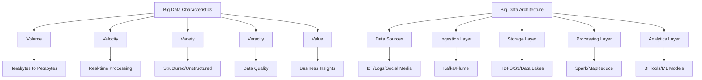

# Big Data Introduction

## Introduction

Big data has transformed how organizations collect, store, and analyze information. The term refers not just to large datasets, but to data that exceeds traditional database capabilities in volume, velocity, and variety. Understanding big data fundamentals is essential for modern data scientists who work with datasets ranging from terabytes to petabytes.

The explosion of digital devices, social media, IoT sensors, and web applications has created unprecedented amounts of data. Traditional relational databases and processing tools struggle to handle this scale efficiently. Big data technologies provide distributed, scalable solutions that can process massive datasets across clusters of commodity hardware.



## The 3Vs of Big Data

The traditional framework for understanding big data centers on three key characteristics, often called the "3Vs":

**Volume** refers to the sheer scale of data. Organizations now collect terabytes or petabytes of information daily. For example, Facebook processes over 4 petabytes of data daily, while the Large Hadron Collider generates 1 petabyte per second during experiments. Traditional databases cannot efficiently store or query data at this scale.

**Velocity** describes the speed at which data is generated and must be processed. Social media posts, financial transactions, sensor readings, and clickstream data flow continuously in real-time. Systems must ingest, process, and analyze data streams at high speeds to deliver timely insights.

**Variety** encompasses the different types and formats of data. Modern datasets include structured data (database tables), semi-structured data (JSON, XML), and unstructured data (text, images, videos). A single analytics pipeline might combine customer database records, web logs, social media posts, and sensor readings.

Many practitioners now add two additional Vs:

**Veracity** addresses data quality and trustworthiness. With data from diverse sources, ensuring accuracy, completeness, and consistency becomes challenging but critical.

**Value** represents the ultimate goal: extracting meaningful insights and business value from raw data.

## Big Data Architecture Patterns

```python
import pandas as pd
import numpy as np
from datetime import datetime, timedelta

class BigDataArchitectureSimulator:
    """Simulate components of a big data architecture"""

    def __init__(self):
        self.data_sources = []
        self.ingestion_buffer = []
        self.storage = {}

    def add_data_source(self, source_name, data_rate_mb_sec):
        """Add a data source with specified generation rate"""
        self.data_sources.append({
            'name': source_name,
            'rate': data_rate_mb_sec,
            'total_generated': 0
        })

    def simulate_ingestion(self, duration_hours=1):
        """Simulate data ingestion over time"""
        results = []

        for source in self.data_sources:
            mb_generated = source['rate'] * duration_hours * 3600
            source['total_generated'] += mb_generated

            results.append({
                'source': source['name'],
                'rate_mb_sec': source['rate'],
                'duration_hours': duration_hours,
                'total_mb': mb_generated,
                'total_gb': mb_generated / 1024
            })

        return pd.DataFrame(results)

    def estimate_storage_requirements(self, days=30, replication_factor=3):
        """Estimate storage needs with replication"""
        total_storage = {}

        for source in self.data_sources:
            daily_mb = source['rate'] * 86400  # seconds in a day
            total_mb = daily_mb * days * replication_factor

            total_storage[source['name']] = {
                'daily_gb': daily_mb / 1024,
                'monthly_gb': (daily_mb * 30) / 1024,
                'total_gb_with_replication': total_mb / 1024,
                'replication_factor': replication_factor
            }

        return total_storage

    def calculate_processing_requirements(self, processing_ratio=0.1):
        """
        Estimate processing capacity needed
        processing_ratio: fraction of ingestion rate needed for processing
        """
        total_rate = sum(s['rate'] for s in self.data_sources)
        processing_capacity = total_rate * processing_ratio

        return {
            'ingestion_rate_mb_sec': total_rate,
            'processing_capacity_mb_sec': processing_capacity,
            'processing_ratio': processing_ratio,
            'nodes_needed_estimate': int(np.ceil(processing_capacity / 10))  # Assume 10 MB/s per node
        }

# Example: E-commerce platform big data architecture
architecture = BigDataArchitectureSimulator()

# Add data sources
architecture.add_data_source('Web Clickstream', 5.0)  # 5 MB/sec
architecture.add_data_source('Transaction Logs', 2.0)  # 2 MB/sec
architecture.add_data_source('Product Catalog Updates', 0.5)  # 0.5 MB/sec
architecture.add_data_source('Customer Activity Events', 3.0)  # 3 MB/sec
architecture.add_data_source('IoT Sensor Data', 1.5)  # 1.5 MB/sec

print("BIG DATA ARCHITECTURE PLANNING")
print("="*80)

# Simulate 24 hour ingestion
print("\n24-Hour Data Ingestion Summary:")
ingestion_df = architecture.simulate_ingestion(duration_hours=24)
print(ingestion_df.to_string(index=False))

# Calculate storage requirements
print("\n\nStorage Requirements (30 days, 3x replication):")
storage_reqs = architecture.estimate_storage_requirements(days=30, replication_factor=3)
for source, requirements in storage_reqs.items():
    print(f"\n{source}:")
    print(f"  Daily: {requirements['daily_gb']:.2f} GB")
    print(f"  Monthly: {requirements['monthly_gb']:.2f} GB")
    print(f"  With Replication: {requirements['total_gb_with_replication']:.2f} GB")

# Calculate processing requirements
print("\n\nProcessing Cluster Requirements:")
processing = architecture.calculate_processing_requirements(processing_ratio=0.15)
print(f"  Total Ingestion Rate: {processing['ingestion_rate_mb_sec']:.1f} MB/sec")
print(f"  Processing Capacity Needed: {processing['processing_capacity_mb_sec']:.1f} MB/sec")
print(f"  Estimated Nodes Required: {processing['nodes_needed_estimate']}")
```

## Big Data Technology Stack

A typical big data architecture includes multiple layers:

**Data Sources**: IoT devices, web servers, mobile apps, databases, APIs, social media feeds

**Ingestion Layer**: Tools like Apache Kafka, Flume, or AWS Kinesis stream data into the system in real-time or batch mode

**Storage Layer**: Distributed file systems (HDFS), object storage (S3), NoSQL databases (Cassandra, HBase), or data lakes store raw and processed data

**Processing Layer**: Batch processing (MapReduce, Spark) or stream processing (Flink, Storm) frameworks transform and analyze data

**Analytics Layer**: SQL engines (Presto, Hive), machine learning frameworks (MLlib, TensorFlow), and BI tools extract insights

**Orchestration**: Workflow managers (Airflow, Oozie) coordinate complex data pipelines

## Real-World Use Cases

```python
class BigDataUseCase:
    """Framework for analyzing big data use cases"""

    def __init__(self, name, industry):
        self.name = name
        self.industry = industry
        self.characteristics = {}
        self.technologies = []
        self.benefits = []

    def add_characteristics(self, volume_tb, velocity_events_sec, variety_types):
        """Define data characteristics"""
        self.characteristics = {
            'volume_tb': volume_tb,
            'velocity_events_sec': velocity_events_sec,
            'variety_types': variety_types
        }

    def add_technology(self, tech):
        """Add technology to stack"""
        self.technologies.append(tech)

    def add_benefit(self, benefit):
        """Add business benefit"""
        self.benefits.append(benefit)

    def summary(self):
        """Generate use case summary"""
        print(f"\nUse Case: {self.name}")
        print(f"Industry: {self.industry}")
        print(f"\nData Characteristics:")
        print(f"  Volume: {self.characteristics.get('volume_tb', 0)} TB")
        print(f"  Velocity: {self.characteristics.get('velocity_events_sec', 0):,} events/sec")
        print(f"  Variety: {', '.join(self.characteristics.get('variety_types', []))}")
        print(f"\nTechnology Stack:")
        for tech in self.technologies:
            print(f"  - {tech}")
        print(f"\nBusiness Benefits:")
        for benefit in self.benefits:
            print(f"  - {benefit}")

# Use Case 1: Netflix Recommendation Engine
netflix = BigDataUseCase("Recommendation Engine", "Streaming Media")
netflix.add_characteristics(
    volume_tb=100,
    velocity_events_sec=1000000,
    variety_types=['viewing history', 'clickstream', 'ratings', 'metadata']
)
netflix.add_technology("S3 for data lake storage")
netflix.add_technology("Spark for batch processing")
netflix.add_technology("Kafka for real-time event streaming")
netflix.add_technology("Cassandra for user profile storage")
netflix.add_benefit("Personalized recommendations increase engagement by 80%")
netflix.add_benefit("Reduced churn through better content discovery")
netflix.summary()

# Use Case 2: Fraud Detection System
fraud = BigDataUseCase("Real-Time Fraud Detection", "Financial Services")
fraud.add_characteristics(
    volume_tb=50,
    velocity_events_sec=500000,
    variety_types=['transactions', 'user behavior', 'device data', 'geolocation']
)
fraud.add_technology("Kafka for transaction streaming")
fraud.add_technology("Flink for real-time fraud detection")
fraud.add_technology("Elasticsearch for alert indexing")
fraud.add_technology("PostgreSQL for case management")
fraud.add_benefit("Detect fraud within 100ms of transaction")
fraud.add_benefit("Reduce false positives by 60%")
fraud.summary()

# Use Case 3: Smart City Traffic Management
traffic = BigDataUseCase("Traffic Optimization", "Smart City")
traffic.add_characteristics(
    volume_tb=200,
    velocity_events_sec=2000000,
    variety_types=['GPS data', 'traffic cameras', 'weather', 'events']
)
traffic.add_technology("IoT edge devices for data collection")
traffic.add_technology("HDFS for historical data storage")
traffic.add_technology("Spark Streaming for real-time analysis")
traffic.add_technology("MapReduce for pattern analysis")
traffic.add_benefit("Reduce average commute time by 25%")
traffic.add_benefit("Optimize traffic light timing dynamically")
traffic.summary()
```

## Challenges in Big Data

Working with big data introduces unique challenges:

**Scalability**: Systems must handle growing data volumes without performance degradation. Horizontal scaling across distributed clusters is essential.

**Data Quality**: With diverse sources and high velocity, ensuring data accuracy and consistency requires robust validation and cleansing pipelines.

**Security and Privacy**: Large datasets often contain sensitive information. Encryption, access controls, and compliance with regulations (GDPR, CCPA) are critical.

**Complexity**: Building and maintaining distributed systems requires specialized expertise in multiple technologies.

**Cost**: Storage, processing, and network bandwidth costs can escalate quickly. Efficient data lifecycle management is essential.

## Summary

Big data represents a paradigm shift in how organizations handle information. The three fundamental characteristics - volume, velocity, and variety - drive the need for specialized distributed systems and processing frameworks.

Key concepts covered:
- The 3Vs (Volume, Velocity, Variety) plus Veracity and Value
- Big data architecture layers: ingestion, storage, processing, analytics
- Technology stack components for different use cases
- Real-world applications in streaming media, finance, and smart cities
- Challenges including scalability, quality, and security

Understanding these fundamentals prepares you for working with Hadoop, Spark, data lakes, and other big data technologies. Modern data science increasingly requires the ability to work with data at scale, making big data literacy essential for practitioners.

The following topics will dive deeper into specific technologies and patterns for implementing big data solutions in production environments.
