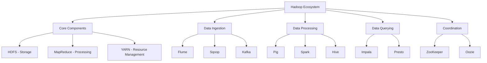

# Hadoop Ecosystem

## Introduction

Apache Hadoop revolutionized big data processing by providing an open-source framework for distributed storage and processing across clusters of commodity hardware. Hadoop enables organizations to store and analyze petabytes of data cost-effectively by distributing workloads across hundreds or thousands of machines.

The Hadoop ecosystem consists of core components (HDFS and MapReduce) plus a rich set of complementary tools for data ingestion, querying, workflow management, and more. Understanding Hadoop provides the foundation for modern big data architectures, even as newer technologies like Spark build upon its principles.

Hadoop's key innovation was bringing computation to the data rather than moving massive datasets to centralized processors. This approach minimizes network bottlenecks and enables horizontal scaling simply by adding more nodes to the cluster.



## HDFS: Hadoop Distributed File System

HDFS is Hadoop's storage layer, designed to reliably store very large files across clusters of commodity machines. Unlike traditional file systems that store entire files on single disks, HDFS splits files into blocks (typically 128MB or 256MB) and distributes them across multiple nodes with replication for fault tolerance.

**HDFS Architecture Components:**

**NameNode**: The master server that manages the file system namespace and regulates client access to files. It maintains metadata about all files and blocks but doesn't store actual data.

**DataNodes**: Worker nodes that store actual data blocks and serve read/write requests. They report block inventories to the NameNode periodically via heartbeats.

**Secondary NameNode**: Performs periodic checkpoints of the NameNode's metadata to prevent the edit log from growing too large.

```python
from datetime import datetime
import random

class HDFSSimulator:
    """Simulate HDFS block distribution and replication"""

    def __init__(self, num_datanodes=10, block_size_mb=128, replication_factor=3):
        self.num_datanodes = num_datanodes
        self.block_size_mb = block_size_mb
        self.replication_factor = replication_factor
        self.datanodes = {i: {'blocks': [], 'capacity_gb': 1000, 'used_gb': 0}
                         for i in range(num_datanodes)}
        self.namenode_metadata = {}

    def upload_file(self, filename, size_mb):
        """Simulate uploading a file to HDFS"""
        num_blocks = int(np.ceil(size_mb / self.block_size_mb))
        blocks = []

        for block_id in range(num_blocks):
            block_size = min(self.block_size_mb, size_mb - (block_id * self.block_size_mb))

            # Select random datanodes for replicas
            replica_nodes = random.sample(range(self.num_datanodes), self.replication_factor)

            block_info = {
                'block_id': f"{filename}_block_{block_id}",
                'size_mb': block_size,
                'replicas': replica_nodes
            }

            # Store block on each replica
            for node_id in replica_nodes:
                self.datanodes[node_id]['blocks'].append(block_info['block_id'])
                self.datanodes[node_id]['used_gb'] += block_size / 1024

            blocks.append(block_info)

        # Store metadata in namenode
        self.namenode_metadata[filename] = {
            'size_mb': size_mb,
            'num_blocks': num_blocks,
            'blocks': blocks,
            'upload_time': datetime.now()
        }

        return blocks

    def get_file_locations(self, filename):
        """Get block locations for a file"""
        if filename not in self.namenode_metadata:
            return None

        metadata = self.namenode_metadata[filename]
        return {
            'filename': filename,
            'total_size_mb': metadata['size_mb'],
            'num_blocks': metadata['num_blocks'],
            'block_details': metadata['blocks']
        }

    def cluster_status(self):
        """Get cluster utilization status"""
        total_capacity = sum(node['capacity_gb'] for node in self.datanodes.values())
        total_used = sum(node['used_gb'] for node in self.datanodes.values())

        node_stats = []
        for node_id, node in self.datanodes.items():
            node_stats.append({
                'node_id': node_id,
                'num_blocks': len(node['blocks']),
                'used_gb': round(node['used_gb'], 2),
                'capacity_gb': node['capacity_gb'],
                'utilization_pct': round((node['used_gb'] / node['capacity_gb']) * 100, 2)
            })

        return {
            'total_capacity_gb': total_capacity,
            'total_used_gb': round(total_used, 2),
            'utilization_pct': round((total_used / total_capacity) * 100, 2),
            'num_files': len(self.namenode_metadata),
            'nodes': node_stats
        }

    def simulate_node_failure(self, node_id):
        """Simulate datanode failure and replication recovery"""
        if node_id not in self.datanodes:
            return None

        failed_blocks = self.datanodes[node_id]['blocks'].copy()
        under_replicated = []

        # Identify blocks that need re-replication
        for filename, metadata in self.namenode_metadata.items():
            for block in metadata['blocks']:
                if node_id in block['replicas']:
                    # Remove failed node from replicas
                    block['replicas'].remove(node_id)

                    # If under-replicated, select new node
                    if len(block['replicas']) < self.replication_factor:
                        available_nodes = [n for n in range(self.num_datanodes)
                                         if n != node_id and n not in block['replicas']]
                        if available_nodes:
                            new_node = random.choice(available_nodes)
                            block['replicas'].append(new_node)
                            self.datanodes[new_node]['blocks'].append(block['block_id'])
                            self.datanodes[new_node]['used_gb'] += block['size_mb'] / 1024

                        under_replicated.append(block['block_id'])

        # Clear failed node
        self.datanodes[node_id]['blocks'] = []
        self.datanodes[node_id]['used_gb'] = 0

        return {
            'failed_node': node_id,
            'blocks_lost': len(failed_blocks),
            'blocks_re_replicated': len(under_replicated),
            'under_replicated_blocks': under_replicated
        }

# Example HDFS simulation
print("HDFS CLUSTER SIMULATION")
print("="*80)

hdfs = HDFSSimulator(num_datanodes=5, block_size_mb=128, replication_factor=3)

# Upload files
print("\nUploading files to HDFS:")
files = [
    ('user_logs_2024.csv', 450),    # 450 MB
    ('sales_data.parquet', 1200),   # 1.2 GB
    ('images_archive.tar', 850)     # 850 MB
]

for filename, size_mb in files:
    blocks = hdfs.upload_file(filename, size_mb)
    print(f"  {filename} ({size_mb} MB): {len(blocks)} blocks created")

# Check cluster status
print("\n\nCluster Status:")
status = hdfs.cluster_status()
print(f"  Total Capacity: {status['total_capacity_gb']:,} GB")
print(f"  Used: {status['total_used_gb']:.2f} GB ({status['utilization_pct']:.1f}%)")
print(f"  Files Stored: {status['num_files']}")

print("\n  Node Utilization:")
for node in status['nodes']:
    print(f"    Node {node['node_id']}: {node['num_blocks']} blocks, "
          f"{node['used_gb']:.2f} GB ({node['utilization_pct']:.1f}%)")

# Get file locations
print("\n\nFile Block Distribution:")
locations = hdfs.get_file_locations('sales_data.parquet')
print(f"  File: {locations['filename']}")
print(f"  Total Size: {locations['total_size_mb']} MB")
print(f"  Blocks: {locations['num_blocks']}")
print(f"  Block Details (first 3):")
for block in locations['block_details'][:3]:
    print(f"    {block['block_id']}: {block['size_mb']} MB on nodes {block['replicas']}")

# Simulate node failure
print("\n\nSimulating Node 2 Failure:")
failure_result = hdfs.simulate_node_failure(2)
print(f"  Blocks on failed node: {failure_result['blocks_lost']}")
print(f"  Blocks re-replicated: {failure_result['blocks_re_replicated']}")

# Check status after recovery
status_after = hdfs.cluster_status()
print(f"\n  Cluster utilization after recovery: {status_after['utilization_pct']:.1f}%")
```

## MapReduce Programming Model

MapReduce is Hadoop's processing framework based on two key functions: Map and Reduce. This programming model enables parallel processing of large datasets by breaking work into independent tasks that can run across a cluster.

**Map Phase**: Processes input data and produces key-value pairs. Each mapper works on a subset of the data independently.

**Shuffle and Sort**: The framework groups all values by key and sorts them.

**Reduce Phase**: Processes each key and its associated values to produce final output.

```python
from collections import defaultdict
from functools import reduce

class MapReduceFramework:
    """Simple MapReduce framework implementation"""

    def __init__(self):
        self.intermediate_data = defaultdict(list)

    def map_function(self, map_func, input_data):
        """
        Apply map function to input data
        map_func should return list of (key, value) tuples
        """
        mapped_results = []
        for item in input_data:
            results = map_func(item)
            mapped_results.extend(results)
        return mapped_results

    def shuffle_sort(self, mapped_data):
        """Group values by key and sort"""
        shuffled = defaultdict(list)
        for key, value in mapped_data:
            shuffled[key].append(value)
        return dict(sorted(shuffled.items()))

    def reduce_function(self, reduce_func, shuffled_data):
        """Apply reduce function to grouped data"""
        reduced_results = {}
        for key, values in shuffled_data.items():
            reduced_results[key] = reduce_func(key, values)
        return reduced_results

    def run_job(self, map_func, reduce_func, input_data):
        """Execute complete MapReduce job"""
        print("Starting MapReduce job...")

        # Map phase
        print(f"  Map phase: Processing {len(input_data)} input records")
        mapped = self.map_function(map_func, input_data)
        print(f"  Map output: {len(mapped)} key-value pairs")

        # Shuffle and sort
        print("  Shuffle and sort phase")
        shuffled = self.shuffle_sort(mapped)
        print(f"  Shuffled: {len(shuffled)} unique keys")

        # Reduce phase
        print("  Reduce phase")
        reduced = self.reduce_function(reduce_func, shuffled)
        print(f"  Final output: {len(reduced)} results")

        return reduced

# Example 1: Word Count (Classic MapReduce example)
print("\nExample 1: Word Count")
print("="*80)

documents = [
    "hadoop is a distributed computing framework",
    "mapreduce is part of hadoop ecosystem",
    "hadoop enables big data processing",
    "distributed systems scale horizontally"
]

def word_count_mapper(document):
    """Emit (word, 1) for each word"""
    words = document.lower().split()
    return [(word, 1) for word in words]

def word_count_reducer(word, counts):
    """Sum all counts for a word"""
    return sum(counts)

mr = MapReduceFramework()
word_counts = mr.run_job(word_count_mapper, word_count_reducer, documents)

print("\nWord Count Results:")
for word, count in sorted(word_counts.items(), key=lambda x: x[1], reverse=True)[:10]:
    print(f"  {word}: {count}")

# Example 2: Log Analysis
print("\n\nExample 2: Web Server Log Analysis")
print("="*80)

log_entries = [
    {'ip': '192.168.1.1', 'status': 200, 'bytes': 1024, 'endpoint': '/home'},
    {'ip': '192.168.1.2', 'status': 404, 'bytes': 512, 'endpoint': '/missing'},
    {'ip': '192.168.1.1', 'status': 200, 'bytes': 2048, 'endpoint': '/products'},
    {'ip': '192.168.1.3', 'status': 500, 'bytes': 256, 'endpoint': '/api'},
    {'ip': '192.168.1.2', 'status': 200, 'bytes': 4096, 'endpoint': '/home'},
    {'ip': '192.168.1.1', 'status': 200, 'bytes': 1536, 'endpoint': '/about'},
]

def traffic_by_ip_mapper(log_entry):
    """Emit (ip, bytes_transferred)"""
    return [(log_entry['ip'], log_entry['bytes'])]

def traffic_sum_reducer(ip, bytes_list):
    """Sum total bytes per IP"""
    return sum(bytes_list)

mr2 = MapReduceFramework()
traffic_by_ip = mr2.run_job(traffic_by_ip_mapper, traffic_sum_reducer, log_entries)

print("\nTraffic by IP Address:")
for ip, total_bytes in sorted(traffic_by_ip.items(), key=lambda x: x[1], reverse=True):
    print(f"  {ip}: {total_bytes:,} bytes ({total_bytes/1024:.1f} KB)")

# Example 3: Status code distribution
def status_mapper(log_entry):
    """Emit (status_code, 1)"""
    return [(log_entry['status'], 1)]

def count_reducer(status, counts):
    """Count occurrences"""
    return sum(counts)

mr3 = MapReduceFramework()
status_distribution = mr3.run_job(status_mapper, count_reducer, log_entries)

print("\nHTTP Status Code Distribution:")
for status, count in sorted(status_distribution.items()):
    print(f"  {status}: {count} requests")
```

## Hadoop Ecosystem Components

Beyond the core HDFS and MapReduce, the Hadoop ecosystem includes specialized tools for different tasks:

**Apache Hive**: SQL-like query language (HiveQL) that compiles to MapReduce or Spark jobs. Enables analysts to query Hadoop data using familiar SQL syntax.

**Apache Pig**: High-level scripting language for data flows. Pig Latin scripts compile to MapReduce jobs, providing abstraction over low-level Java code.

**Apache HBase**: NoSQL column-family database built on HDFS. Provides random read/write access to big data with real-time queries.

**Apache Sqoop**: Tool for transferring data between Hadoop and relational databases. Supports bulk imports and exports.

**Apache Flume**: Distributed service for collecting, aggregating, and moving large amounts of streaming data into HDFS.

**Apache Oozie**: Workflow scheduler for managing Hadoop jobs. Coordinates complex data pipelines with dependencies.

**Apache ZooKeeper**: Coordination service for distributed applications. Provides configuration management, synchronization, and group services.

## YARN: Resource Management

YARN (Yet Another Resource Negotiator) replaced the original MapReduce resource manager in Hadoop 2.0. It decouples resource management from application execution, allowing multiple processing frameworks to share the same cluster.

**ResourceManager**: Manages cluster resources and schedules applications

**NodeManager**: Manages resources on individual nodes

**ApplicationMaster**: Coordinates execution of a specific application

**Container**: Allocation of resources (CPU, memory) on a node

YARN enables running Spark, Flink, or other frameworks alongside MapReduce on the same Hadoop cluster, improving resource utilization.

## Summary

The Hadoop ecosystem provides a comprehensive platform for distributed big data processing:

Key components covered:
- HDFS architecture: NameNode, DataNodes, block storage, and replication
- MapReduce programming model: Map, Shuffle/Sort, Reduce phases
- Ecosystem tools: Hive, Pig, HBase, Sqoop, Flume, Oozie
- YARN resource management for multi-framework clusters
- Fault tolerance through replication and job re-execution

Best practices:
- Use 3x replication for production data
- Choose appropriate block sizes (128-256 MB)
- Leverage higher-level tools (Hive, Pig) over raw MapReduce when possible
- Monitor cluster health and balance data distribution
- Consider Spark for iterative workloads instead of MapReduce

While Spark has become more popular for new projects, understanding Hadoop provides essential knowledge about distributed computing principles. Many production systems still run on Hadoop, and HDFS remains widely used for big data storage even in Spark-centric architectures.
