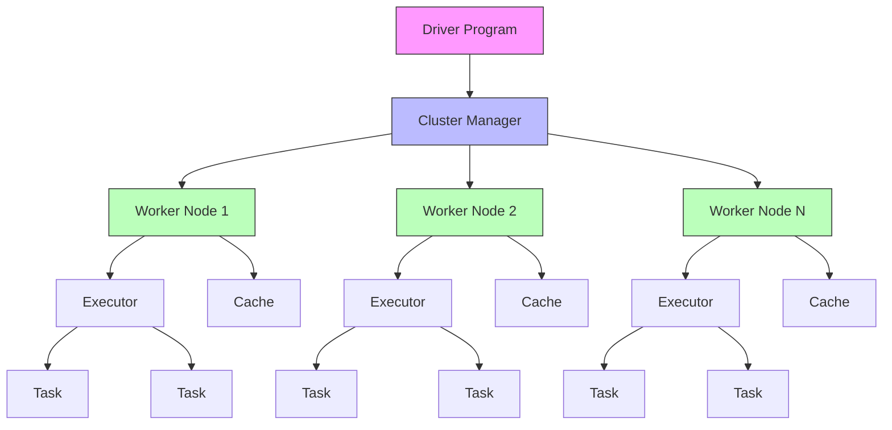

# Apache Spark for Data Science

## Introduction

Apache Spark is a unified analytics engine for large-scale data processing that has become the de facto standard for big data analytics. Spark provides high-level APIs in multiple languages (Python, Scala, Java, R) and supports SQL queries, streaming data, machine learning, and graph processing. Its in-memory computing capabilities make it significantly faster than traditional MapReduce systems.

Spark's popularity in data science stems from its ability to handle massive datasets while providing a familiar DataFrame API similar to pandas, making it accessible to data scientists while delivering the performance needed for production workloads.

## Spark Architecture



The Spark architecture consists of:

- **Driver Program**: Coordinates the execution and maintains application state
- **Cluster Manager**: Allocates resources across applications (YARN, Mesos, Kubernetes, or standalone)
- **Executors**: Processes that run computations and store data on worker nodes
- **Tasks**: Units of work sent to executors

## Resilient Distributed Datasets (RDDs)

RDDs are Spark's fundamental data structure - an immutable, distributed collection of objects that can be processed in parallel.

```python
from pyspark import SparkContext, SparkConf

# Initialize Spark Context
conf = SparkConf().setAppName("RDD Examples").setMaster("local[*]")
sc = SparkContext(conf=conf)

# Create RDD from a list
data = [1, 2, 3, 4, 5, 6, 7, 8, 9, 10]
rdd = sc.parallelize(data)

# Transformations (lazy evaluation)
squared_rdd = rdd.map(lambda x: x ** 2)
filtered_rdd = squared_rdd.filter(lambda x: x > 25)

# Actions (trigger computation)
result = filtered_rdd.collect()
print(f"Squared values > 25: {result}")

# Word count example
text_data = [
    "Apache Spark is fast",
    "Spark provides unified analytics",
    "Big data processing with Spark"
]

text_rdd = sc.parallelize(text_data)
word_counts = (text_rdd
               .flatMap(lambda line: line.lower().split())
               .map(lambda word: (word, 1))
               .reduceByKey(lambda a, b: a + b)
               .sortBy(lambda x: x[1], ascending=False))

print("\nWord Counts:")
for word, count in word_counts.collect():
    print(f"{word}: {count}")

# Key-value pair operations
pairs_rdd = sc.parallelize([("a", 1), ("b", 2), ("a", 3), ("b", 4), ("c", 5)])

# Group by key
grouped = pairs_rdd.groupByKey().mapValues(list)
print("\nGrouped by key:")
for key, values in grouped.collect():
    print(f"{key}: {values}")

# Reduce by key
summed = pairs_rdd.reduceByKey(lambda a, b: a + b)
print("\nSummed by key:")
for key, total in summed.collect():
    print(f"{key}: {total}")
```

### RDD Transformations vs Actions

```python
# Transformations (lazy - don't execute immediately)
# map, filter, flatMap, groupByKey, reduceByKey, join, distinct, union

# Create sample RDD
numbers_rdd = sc.parallelize(range(1, 101))

# Chain transformations
result_rdd = (numbers_rdd
              .filter(lambda x: x % 2 == 0)      # Keep even numbers
              .map(lambda x: (x, x ** 2))         # Create (number, square) pairs
              .filter(lambda pair: pair[1] > 100)) # Keep squares > 100

# Actions (eager - trigger execution)
# collect, count, first, take, reduce, saveAsTextFile

print(f"\nTotal even numbers with square > 100: {result_rdd.count()}")
print(f"First 5 results: {result_rdd.take(5)}")

# Reduce action
sum_of_squares = result_rdd.map(lambda pair: pair[1]).reduce(lambda a, b: a + b)
print(f"Sum of all squares: {sum_of_squares}")
```

## Spark DataFrames

DataFrames provide a higher-level API with optimization through Catalyst query optimizer and Tungsten execution engine.

```python
from pyspark.sql import SparkSession
from pyspark.sql.functions import col, avg, sum, count, when, lit
from pyspark.sql.types import StructType, StructField, StringType, IntegerType, DoubleType

# Initialize Spark Session
spark = SparkSession.builder \
    .appName("DataFrame Examples") \
    .master("local[*]") \
    .getOrCreate()

# Create DataFrame from data
data = [
    ("Alice", 25, "Engineering", 85000),
    ("Bob", 30, "Sales", 65000),
    ("Charlie", 35, "Engineering", 95000),
    ("Diana", 28, "Marketing", 70000),
    ("Eve", 32, "Engineering", 90000),
    ("Frank", 29, "Sales", 68000),
    ("Grace", 26, "Marketing", 72000),
    ("Henry", 31, "Engineering", 88000)
]

schema = StructType([
    StructField("name", StringType(), False),
    StructField("age", IntegerType(), False),
    StructField("department", StringType(), False),
    StructField("salary", DoubleType(), False)
])

df = spark.createDataFrame(data, schema=schema)

# Display DataFrame
print("Employee DataFrame:")
df.show()

# Select columns
print("\nNames and Salaries:")
df.select("name", "salary").show()

# Filter rows
print("\nEngineering Department:")
df.filter(col("department") == "Engineering").show()

# Group by and aggregate
print("\nAverage Salary by Department:")
dept_stats = df.groupBy("department").agg(
    count("*").alias("employee_count"),
    avg("salary").alias("avg_salary"),
    sum("salary").alias("total_salary")
)
dept_stats.show()

# Add computed columns
df_with_bonus = df.withColumn(
    "bonus",
    when(col("salary") > 80000, col("salary") * 0.15)
    .otherwise(col("salary") * 0.10)
)

df_with_bonus = df_with_bonus.withColumn(
    "total_compensation",
    col("salary") + col("bonus")
)

print("\nWith Bonus Calculations:")
df_with_bonus.show()

# Sort data
print("\nTop Earners:")
df.orderBy(col("salary").desc()).show(5)
```

### DataFrame Operations

```python
# Join operations
departments = [
    ("Engineering", "Building A"),
    ("Sales", "Building B"),
    ("Marketing", "Building C")
]

dept_df = spark.createDataFrame(departments, ["department", "location"])

# Inner join
joined_df = df.join(dept_df, "department", "inner")
print("\nEmployee Locations:")
joined_df.select("name", "department", "location").show()

# Window functions
from pyspark.sql.window import Window
from pyspark.sql.functions import rank, row_number, dense_rank

window_spec = Window.partitionBy("department").orderBy(col("salary").desc())

df_ranked = df.withColumn("salary_rank", rank().over(window_spec))
print("\nSalary Rankings by Department:")
df_ranked.show()

# Aggregations
from pyspark.sql.functions import max, min, stddev

print("\nSalary Statistics:")
df.select(
    avg("salary").alias("mean_salary"),
    stddev("salary").alias("std_salary"),
    min("salary").alias("min_salary"),
    max("salary").alias("max_salary")
).show()
```

## Spark SQL

Spark SQL allows querying DataFrames using SQL syntax.

```python
# Register DataFrame as temporary view
df.createOrReplaceTempView("employees")

# Execute SQL queries
result = spark.sql("""
    SELECT
        department,
        COUNT(*) as employee_count,
        AVG(salary) as avg_salary,
        MAX(salary) as max_salary,
        MIN(salary) as min_salary
    FROM employees
    GROUP BY department
    ORDER BY avg_salary DESC
""")

print("\nDepartment Analysis via SQL:")
result.show()

# Complex SQL query
complex_result = spark.sql("""
    SELECT
        name,
        age,
        salary,
        department,
        CASE
            WHEN salary > 85000 THEN 'High'
            WHEN salary > 70000 THEN 'Medium'
            ELSE 'Low'
        END as salary_category
    FROM employees
    WHERE age >= 28
    ORDER BY salary DESC
""")

print("\nEmployee Categories:")
complex_result.show()

# Subqueries
subquery_result = spark.sql("""
    SELECT
        e.name,
        e.salary,
        e.department,
        dept_avg.avg_salary
    FROM employees e
    JOIN (
        SELECT department, AVG(salary) as avg_salary
        FROM employees
        GROUP BY department
    ) dept_avg ON e.department = dept_avg.department
    WHERE e.salary > dept_avg.avg_salary
""")

print("\nEmployees Above Department Average:")
subquery_result.show()
```

## PySpark Data Processing Examples

### Reading and Writing Data

```python
# Read CSV file
# df_csv = spark.read.csv("data.csv", header=True, inferSchema=True)

# Read with explicit schema
from pyspark.sql.types import *

sales_schema = StructType([
    StructField("transaction_id", IntegerType(), False),
    StructField("date", StringType(), False),
    StructField("product", StringType(), False),
    StructField("quantity", IntegerType(), False),
    StructField("price", DoubleType(), False),
    StructField("customer_id", IntegerType(), False)
])

# Simulated sales data
sales_data = [
    (1, "2024-01-15", "Laptop", 2, 999.99, 101),
    (2, "2024-01-16", "Mouse", 5, 25.50, 102),
    (3, "2024-01-17", "Keyboard", 3, 75.00, 101),
    (4, "2024-01-18", "Monitor", 1, 299.99, 103),
    (5, "2024-01-19", "Laptop", 1, 999.99, 104),
    (6, "2024-01-20", "Mouse", 10, 25.50, 102),
    (7, "2024-01-21", "Keyboard", 2, 75.00, 105)
]

sales_df = spark.createDataFrame(sales_data, schema=sales_schema)

# Data transformations
from pyspark.sql.functions import to_date, year, month, dayofmonth

sales_df = sales_df.withColumn("date_parsed", to_date(col("date")))
sales_df = sales_df.withColumn("total_amount", col("quantity") * col("price"))
sales_df = sales_df.withColumn("year", year(col("date_parsed")))
sales_df = sales_df.withColumn("month", month(col("date_parsed")))

print("\nSales Data with Calculations:")
sales_df.show()

# Aggregations
product_summary = sales_df.groupBy("product").agg(
    sum("quantity").alias("total_quantity"),
    sum("total_amount").alias("total_revenue"),
    count("*").alias("transaction_count"),
    avg("price").alias("avg_price")
)

print("\nProduct Summary:")
product_summary.orderBy(col("total_revenue").desc()).show()

# Write data in various formats
# sales_df.write.parquet("output/sales.parquet", mode="overwrite")
# sales_df.write.csv("output/sales.csv", header=True, mode="overwrite")
# sales_df.write.json("output/sales.json", mode="overwrite")

print("\nData would be written to files (commented out for demo)")
```

### Advanced Analytics with PySpark

```python
from pyspark.sql.functions import collect_list, array_contains, explode

# Customer purchase patterns
customer_products = sales_df.groupBy("customer_id").agg(
    collect_list("product").alias("products_purchased"),
    sum("total_amount").alias("total_spent"),
    count("*").alias("transaction_count")
)

print("\nCustomer Purchase Patterns:")
customer_products.show(truncate=False)

# Find customers who bought laptops
laptop_customers = customer_products.filter(
    array_contains(col("products_purchased"), "Laptop")
)

print("\nCustomers Who Purchased Laptops:")
laptop_customers.show(truncate=False)

# Explode array to individual rows
products_exploded = customer_products.select(
    "customer_id",
    "total_spent",
    explode("products_purchased").alias("product")
)

print("\nExploded Product List:")
products_exploded.show()
```

## Performance Optimization

```python
# Caching for iterative algorithms
df_cached = df.cache()
df_cached.count()  # Materialize the cache

# Broadcast joins for small tables
from pyspark.sql.functions import broadcast

# When one DataFrame is small (< 10MB), broadcast it
result = df.join(broadcast(dept_df), "department")

# Repartitioning
# Increase partitions for better parallelism
df_repartitioned = df.repartition(10)

# Coalesce to reduce partitions (more efficient than repartition)
df_coalesced = df_repartitioned.coalesce(2)

print(f"\nOriginal partitions: {df.rdd.getNumPartitions()}")
print(f"After repartition: {df_repartitioned.rdd.getNumPartitions()}")
print(f"After coalesce: {df_coalesced.rdd.getNumPartitions()}")

# Partition by column for better query performance
df_partitioned = df.repartition("department")

# Explain query plan
print("\nQuery Execution Plan:")
df.filter(col("salary") > 80000).explain(mode="simple")
```

## Machine Learning with Spark MLlib

```python
from pyspark.ml.feature import VectorAssembler
from pyspark.ml.regression import LinearRegression
from pyspark.ml.evaluation import RegressionEvaluator

# Prepare features
feature_cols = ["age"]
assembler = VectorAssembler(inputCols=feature_cols, outputCol="features")

ml_df = assembler.transform(df)
ml_df = ml_df.select("features", col("salary").alias("label"))

# Split data
train_data, test_data = ml_df.randomSplit([0.8, 0.2], seed=42)

# Train model
lr = LinearRegression(featuresCol="features", labelCol="label")
lr_model = lr.fit(train_data)

# Make predictions
predictions = lr_model.transform(test_data)

print("\nPredictions:")
predictions.select("features", "label", "prediction").show()

# Evaluate model
evaluator = RegressionEvaluator(labelCol="label", predictionCol="prediction", metricName="rmse")
rmse = evaluator.evaluate(predictions)
print(f"\nRoot Mean Squared Error: ${rmse:,.2f}")

# Model coefficients
print(f"Coefficient: {lr_model.coefficients[0]:.2f}")
print(f"Intercept: {lr_model.intercept:.2f}")
```

## Best Practices

1. **Use DataFrames over RDDs** - Better optimization and performance
2. **Avoid collect() on large datasets** - Brings all data to driver
3. **Cache wisely** - Only cache DataFrames used multiple times
4. **Partition appropriately** - Balance parallelism and overhead
5. **Use broadcast joins** - For small reference tables
6. **Leverage Spark SQL** - Catalyst optimizer provides better performance
7. **Monitor Spark UI** - Understand execution plans and bottlenecks
8. **Handle skew** - Repartition skewed keys for better distribution

## Key Takeaways

- Apache Spark provides a unified platform for distributed data processing with in-memory computing capabilities
- RDDs are the fundamental abstraction, offering fault-tolerant distributed collections with lazy evaluation
- DataFrames provide a higher-level API with automatic optimization through Catalyst and Tungsten engines
- Spark SQL enables familiar SQL syntax while maintaining distributed processing benefits
- PySpark makes Spark accessible to Python developers with a pandas-like API
- Understanding transformations (lazy) vs actions (eager) is crucial for optimization
- Proper partitioning, caching, and broadcast joins significantly improve performance
- Spark's ecosystem includes MLlib for machine learning, Spark Streaming for real-time processing, and GraphX for graph analytics
- The Spark UI provides invaluable insights into query execution and performance bottlenecks

Spark has revolutionized big data processing by making distributed computing accessible while delivering exceptional performance. Its ability to handle batch and streaming workloads, combined with rich libraries for machine learning and graph processing, makes it an essential tool for modern data science.
