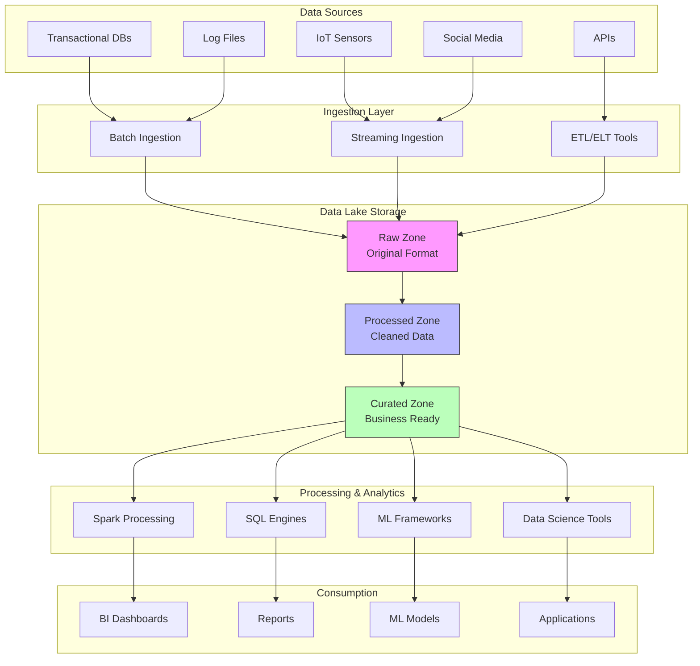
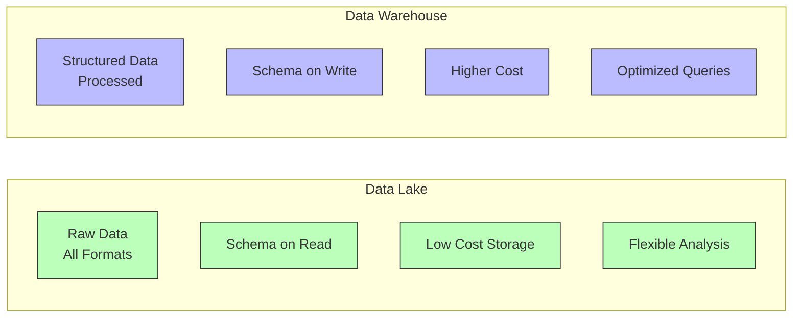

# Data Lakes

## Introduction

A data lake is a centralized repository that allows you to store all your structured, semi-structured, and unstructured data at any scale. Unlike traditional data warehouses that require you to structure data before storage, data lakes embrace schema-on-read, storing raw data in its native format and applying structure only when needed for analysis.

Data lakes have become essential in modern data architectures, enabling organizations to store vast amounts of diverse data cost-effectively while maintaining flexibility for various analytics, machine learning, and data science workloads.

## Data Lake Architecture



## Data Lake Zones

### Raw Zone (Bronze Layer)

The raw zone stores data exactly as it arrives from source systems.

```python
import pandas as pd
import json
from datetime import datetime, timedelta
import numpy as np

class DataLakeRawZone:
    def __init__(self, base_path="/data-lake/raw"):
        self.base_path = base_path
        self.metadata = {}

    def ingest_raw_data(self, data, source_name, data_format="json"):
        """Ingest data into raw zone with minimal transformation"""
        ingestion_time = datetime.now()

        # Create partition path based on date
        partition_path = f"{self.base_path}/{source_name}/year={ingestion_time.year}/month={ingestion_time.month:02d}/day={ingestion_time.day:02d}"

        # Store metadata
        self.metadata[source_name] = {
            'ingestion_time': ingestion_time,
            'record_count': len(data) if isinstance(data, (list, pd.DataFrame)) else 1,
            'format': data_format,
            'path': partition_path,
            'schema_version': '1.0'
        }

        print(f"Ingested {source_name} to {partition_path}")
        return partition_path

    def get_metadata(self, source_name=None):
        """Retrieve ingestion metadata"""
        if source_name:
            return self.metadata.get(source_name, {})
        return self.metadata

# Example usage
raw_zone = DataLakeRawZone()

# Ingest transaction data
transactions = [
    {"transaction_id": 1, "amount": 150.50, "customer_id": 101, "timestamp": "2024-01-15T10:30:00"},
    {"transaction_id": 2, "amount": 200.00, "customer_id": 102, "timestamp": "2024-01-15T11:15:00"},
    {"transaction_id": 3, "amount": 175.25, "customer_id": 101, "timestamp": "2024-01-15T14:20:00"}
]

raw_zone.ingest_raw_data(transactions, "customer_transactions", "json")

# Ingest clickstream data
clickstream = [
    {"user_id": 501, "page": "/home", "timestamp": "2024-01-15T09:00:00", "duration": 45},
    {"user_id": 502, "page": "/products", "timestamp": "2024-01-15T09:05:00", "duration": 120},
    {"user_id": 501, "page": "/checkout", "timestamp": "2024-01-15T09:10:00", "duration": 200}
]

raw_zone.ingest_raw_data(clickstream, "website_clickstream", "json")

print("\nRaw Zone Metadata:")
print(json.dumps(raw_zone.get_metadata(), indent=2, default=str))
```

### Processed Zone (Silver Layer)

The processed zone contains cleaned and validated data.

```python
class DataLakeProcessedZone:
    def __init__(self, base_path="/data-lake/processed"):
        self.base_path = base_path

    def clean_transaction_data(self, raw_transactions):
        """Clean and validate transaction data"""
        df = pd.DataFrame(raw_transactions)

        # Parse timestamps
        df['timestamp'] = pd.to_datetime(df['timestamp'])

        # Add derived fields
        df['date'] = df['timestamp'].dt.date
        df['hour'] = df['timestamp'].dt.hour

        # Data quality checks
        df = df[df['amount'] > 0]  # Remove invalid amounts
        df = df.dropna(subset=['customer_id'])  # Remove missing customer IDs

        # Add processing metadata
        df['processed_at'] = datetime.now()
        df['data_quality_score'] = 1.0  # Simplified scoring

        return df

    def enrich_customer_data(self, transactions_df, customer_reference):
        """Enrich with customer reference data"""
        enriched_df = transactions_df.merge(
            customer_reference,
            on='customer_id',
            how='left'
        )
        return enriched_df

    def write_processed_data(self, df, dataset_name):
        """Write processed data with partitioning"""
        process_path = f"{self.base_path}/{dataset_name}"

        print(f"Writing {len(df)} processed records to {process_path}")
        print(f"Data quality score: {df['data_quality_score'].mean():.2f}")

        return process_path

# Example usage
processed_zone = DataLakeProcessedZone()

# Clean transaction data
cleaned_transactions = processed_zone.clean_transaction_data(transactions)

print("\nCleaned Transactions:")
print(cleaned_transactions)

# Customer reference data
customer_reference = pd.DataFrame({
    'customer_id': [101, 102, 103],
    'customer_name': ['Alice', 'Bob', 'Charlie'],
    'customer_segment': ['Premium', 'Standard', 'Premium'],
    'region': ['North', 'South', 'North']
})

# Enrich data
enriched_transactions = processed_zone.enrich_customer_data(
    cleaned_transactions,
    customer_reference
)

print("\nEnriched Transactions:")
print(enriched_transactions)

processed_zone.write_processed_data(enriched_transactions, "transactions_processed")
```

### Curated Zone (Gold Layer)

The curated zone contains business-ready, aggregated data.

```python
class DataLakeCuratedZone:
    def __init__(self, base_path="/data-lake/curated"):
        self.base_path = base_path

    def create_customer_analytics(self, enriched_transactions):
        """Create customer analytics dataset"""
        customer_analytics = enriched_transactions.groupby('customer_id').agg({
            'transaction_id': 'count',
            'amount': ['sum', 'mean', 'max'],
            'timestamp': ['min', 'max'],
            'customer_name': 'first',
            'customer_segment': 'first',
            'region': 'first'
        }).reset_index()

        # Flatten column names
        customer_analytics.columns = [
            'customer_id', 'transaction_count', 'total_spent',
            'avg_transaction', 'max_transaction', 'first_transaction',
            'last_transaction', 'customer_name', 'customer_segment', 'region'
        ]

        # Calculate customer lifetime value (simplified)
        customer_analytics['customer_ltv'] = customer_analytics['total_spent'] * 1.5

        # Assign customer tier
        customer_analytics['customer_tier'] = pd.cut(
            customer_analytics['total_spent'],
            bins=[0, 100, 300, float('inf')],
            labels=['Bronze', 'Silver', 'Gold']
        )

        return customer_analytics

    def create_daily_summary(self, enriched_transactions):
        """Create daily summary metrics"""
        daily_summary = enriched_transactions.groupby('date').agg({
            'transaction_id': 'count',
            'amount': ['sum', 'mean'],
            'customer_id': 'nunique'
        }).reset_index()

        daily_summary.columns = [
            'date', 'transaction_count', 'total_revenue',
            'avg_transaction_value', 'unique_customers'
        ]

        # Calculate revenue per customer
        daily_summary['revenue_per_customer'] = (
            daily_summary['total_revenue'] / daily_summary['unique_customers']
        )

        return daily_summary

    def write_curated_dataset(self, df, dataset_name):
        """Write curated dataset"""
        curated_path = f"{self.base_path}/{dataset_name}"

        print(f"Writing {len(df)} curated records to {curated_path}")
        print(f"Dataset: {dataset_name}")

        return curated_path

# Example usage
curated_zone = DataLakeCuratedZone()

# Create customer analytics
customer_analytics = curated_zone.create_customer_analytics(enriched_transactions)

print("\nCustomer Analytics:")
print(customer_analytics)

# Create daily summary
daily_summary = curated_zone.create_daily_summary(enriched_transactions)

print("\nDaily Summary:")
print(daily_summary)

curated_zone.write_curated_dataset(customer_analytics, "customer_360")
curated_zone.write_curated_dataset(daily_summary, "daily_metrics")
```

## Delta Lake

Delta Lake is an open-source storage layer that brings ACID transactions to data lakes.

```python
class DeltaLakeManager:
    def __init__(self, base_path="/delta-lake"):
        self.base_path = base_path
        self.tables = {}

    def create_delta_table(self, df, table_name, partition_by=None):
        """Create Delta table with versioning"""
        table_path = f"{self.base_path}/{table_name}"

        # Simulate Delta Lake features
        version = {
            'version': 0,
            'timestamp': datetime.now(),
            'operation': 'CREATE',
            'record_count': len(df),
            'partition_by': partition_by
        }

        self.tables[table_name] = {
            'path': table_path,
            'data': df.copy(),
            'versions': [version],
            'current_version': 0
        }

        print(f"Created Delta table: {table_name}")
        print(f"Version: {version['version']}")
        print(f"Records: {version['record_count']}")

        return table_path

    def upsert_data(self, table_name, new_data, merge_keys):
        """Upsert data (merge update/insert)"""
        if table_name not in self.tables:
            raise ValueError(f"Table {table_name} does not exist")

        current_df = self.tables[table_name]['data']
        new_df = pd.DataFrame(new_data)

        # Merge logic: update existing, insert new
        merged_df = pd.concat([current_df, new_df]).drop_duplicates(
            subset=merge_keys,
            keep='last'
        )

        # Create new version
        version = {
            'version': self.tables[table_name]['current_version'] + 1,
            'timestamp': datetime.now(),
            'operation': 'UPSERT',
            'record_count': len(merged_df),
            'records_inserted': len(new_df),
            'records_updated': len(current_df) - len(merged_df) + len(new_df)
        }

        self.tables[table_name]['data'] = merged_df
        self.tables[table_name]['versions'].append(version)
        self.tables[table_name]['current_version'] = version['version']

        print(f"Upserted data to {table_name}")
        print(f"New version: {version['version']}")
        print(f"Records inserted: {version['records_inserted']}")

        return merged_df

    def time_travel(self, table_name, version=None, timestamp=None):
        """Query historical version of data"""
        if table_name not in self.tables:
            raise ValueError(f"Table {table_name} does not exist")

        if version is not None:
            print(f"Time traveling to version {version}")
            return self.tables[table_name]['versions'][version]

        # In real Delta Lake, you could query by timestamp
        return self.tables[table_name]['data']

    def get_table_history(self, table_name):
        """Get version history"""
        if table_name not in self.tables:
            raise ValueError(f"Table {table_name} does not exist")

        return pd.DataFrame(self.tables[table_name]['versions'])

# Example usage
delta_manager = DeltaLakeManager()

# Create initial Delta table
initial_data = pd.DataFrame({
    'product_id': [1, 2, 3],
    'product_name': ['Laptop', 'Mouse', 'Keyboard'],
    'price': [999.99, 25.50, 75.00],
    'stock': [50, 200, 150]
})

delta_manager.create_delta_table(initial_data, "products", partition_by="product_id")

# Upsert new data (update product 2, insert product 4)
new_data = [
    {'product_id': 2, 'product_name': 'Mouse', 'price': 29.99, 'stock': 250},
    {'product_id': 4, 'product_name': 'Monitor', 'price': 299.99, 'stock': 75}
]

updated_df = delta_manager.upsert_data("products", new_data, merge_keys=['product_id'])

print("\nUpdated Products Table:")
print(updated_df)

# View table history
history = delta_manager.get_table_history("products")
print("\nTable Version History:")
print(history)
```

## Data Lake vs Data Warehouse



**Data Lake Advantages:**
- Store all data types (structured, semi-structured, unstructured)
- Cost-effective storage for large volumes
- Flexibility for exploratory analysis
- Supports machine learning and AI workloads
- Schema flexibility

**Data Warehouse Advantages:**
- Optimized for SQL queries
- Better performance for BI tools
- Data quality and consistency
- Simpler for business users
- Mature ecosystem

## Best Practices

```python
class DataLakeBestPractices:
    """Demonstrates data lake best practices"""

    @staticmethod
    def implement_data_governance():
        """Data governance framework"""
        governance_policy = {
            'data_classification': {
                'public': 'No restrictions',
                'internal': 'Employee access only',
                'confidential': 'Restricted access',
                'pii': 'Strict controls, encryption required'
            },
            'retention_policies': {
                'transactional': '7 years',
                'logs': '90 days',
                'analytics': '3 years'
            },
            'access_control': {
                'role_based': True,
                'attribute_based': True,
                'data_masking': True
            }
        }

        return governance_policy

    @staticmethod
    def implement_data_catalog():
        """Metadata catalog for data discovery"""
        catalog = {
            'datasets': [
                {
                    'name': 'customer_transactions',
                    'description': 'Customer purchase transactions',
                    'owner': 'Sales Analytics Team',
                    'location': '/data-lake/curated/transactions',
                    'format': 'parquet',
                    'partitioned_by': ['year', 'month'],
                    'schema': {
                        'transaction_id': 'integer',
                        'customer_id': 'integer',
                        'amount': 'decimal',
                        'timestamp': 'timestamp'
                    },
                    'tags': ['sales', 'customer', 'transaction'],
                    'last_updated': '2024-01-15',
                    'update_frequency': 'daily',
                    'data_quality_score': 0.98
                }
            ]
        }

        return catalog

    @staticmethod
    def implement_data_quality_checks(df):
        """Automated data quality validation"""
        quality_checks = {
            'completeness': (1 - df.isnull().sum() / len(df)).mean(),
            'uniqueness': df.drop_duplicates().shape[0] / df.shape[0],
            'validity': 1.0,  # Placeholder for custom validation rules
            'timeliness': 1.0  # Check data freshness
        }

        overall_score = sum(quality_checks.values()) / len(quality_checks)

        print("Data Quality Report:")
        for metric, score in quality_checks.items():
            print(f"{metric.capitalize()}: {score:.2%}")
        print(f"\nOverall Score: {overall_score:.2%}")

        return quality_checks

# Example usage
practices = DataLakeBestPractices()

# Governance
governance = practices.implement_data_governance()
print("Data Governance Policy:")
print(json.dumps(governance, indent=2))

# Catalog
catalog = practices.implement_data_catalog()
print("\nData Catalog:")
print(json.dumps(catalog, indent=2))

# Quality checks
sample_data = pd.DataFrame({
    'id': [1, 2, 3, 4, 5],
    'value': [100, 200, None, 400, 500],
    'category': ['A', 'B', 'A', 'B', 'C']
})

quality_results = practices.implement_data_quality_checks(sample_data)
```

## Data Lake Security

```python
class DataLakeSecurity:
    def __init__(self):
        self.access_logs = []
        self.encryption_enabled = True

    def encrypt_sensitive_data(self, df, sensitive_columns):
        """Encrypt sensitive columns"""
        encrypted_df = df.copy()

        for col in sensitive_columns:
            if col in encrypted_df.columns:
                # Simplified encryption (in production, use proper encryption)
                encrypted_df[col] = encrypted_df[col].apply(
                    lambda x: f"ENCRYPTED_{hash(str(x)) % 10000:04d}"
                )

        print(f"Encrypted {len(sensitive_columns)} columns")
        return encrypted_df

    def implement_access_control(self, user, resource, action):
        """Role-based access control"""
        access_policy = {
            'data_scientist': ['read', 'write'],
            'analyst': ['read'],
            'admin': ['read', 'write', 'delete']
        }

        user_role = user.get('role', 'analyst')
        allowed_actions = access_policy.get(user_role, [])

        if action in allowed_actions:
            self.log_access(user, resource, action, 'GRANTED')
            return True
        else:
            self.log_access(user, resource, action, 'DENIED')
            return False

    def log_access(self, user, resource, action, status):
        """Audit logging"""
        log_entry = {
            'timestamp': datetime.now(),
            'user': user.get('name'),
            'role': user.get('role'),
            'resource': resource,
            'action': action,
            'status': status
        }
        self.access_logs.append(log_entry)

    def get_audit_trail(self):
        """Retrieve audit logs"""
        return pd.DataFrame(self.access_logs)

# Example usage
security = DataLakeSecurity()

# Encrypt sensitive data
sensitive_df = pd.DataFrame({
    'customer_id': [1, 2, 3],
    'name': ['Alice', 'Bob', 'Charlie'],
    'ssn': ['123-45-6789', '987-65-4321', '555-55-5555'],
    'credit_card': ['4111-1111-1111-1111', '5555-5555-5555-4444', '3782-822463-10005']
})

encrypted_df = security.encrypt_sensitive_data(
    sensitive_df,
    sensitive_columns=['ssn', 'credit_card']
)

print("\nEncrypted Data:")
print(encrypted_df)

# Access control
users = [
    {'name': 'Alice', 'role': 'data_scientist'},
    {'name': 'Bob', 'role': 'analyst'},
    {'name': 'Charlie', 'role': 'admin'}
]

for user in users:
    can_write = security.implement_access_control(user, 'customer_data', 'write')
    print(f"{user['name']} ({user['role']}) write access: {'Granted' if can_write else 'Denied'}")

# Audit trail
print("\nAudit Trail:")
print(security.get_audit_trail())
```

## Key Takeaways

- Data lakes provide centralized storage for all data types at any scale using schema-on-read architecture
- The medallion architecture (Bronze/Silver/Gold or Raw/Processed/Curated) organizes data by quality level
- Delta Lake adds ACID transactions, schema enforcement, and time travel to data lakes
- Data lakes excel at storing raw data cost-effectively while maintaining flexibility for various use cases
- Proper governance, cataloging, and security are essential for successful data lake implementations
- Data quality checks should be implemented at each zone to ensure reliability
- Unlike data warehouses, data lakes don't require upfront schema definition, enabling exploratory analysis
- Partitioning strategies improve query performance and reduce costs
- Metadata management and data cataloging enable data discovery and understanding
- Security through encryption, access control, and audit logging protects sensitive information
- Data lakes work best in conjunction with data warehouses in a modern data architecture

Data lakes have become the foundation of modern data architectures, enabling organizations to store and analyze massive amounts of diverse data while maintaining the flexibility needed for advanced analytics and machine learning.
