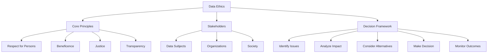

# Data Ethics

## Introduction

Data ethics forms the moral foundation of data science practice, guiding professionals in making responsible decisions about data collection, analysis, and application. As data becomes increasingly central to business, government, and social systems, the ethical implications of how we use it have profound impacts on individuals and society. Data ethics encompasses questions about privacy, fairness, transparency, accountability, and the social consequences of data-driven decisions.

The rise of big data and artificial intelligence has amplified ethical concerns. Algorithms can perpetuate historical biases, privacy violations can occur at unprecedented scale, and automated decisions can affect millions of people without human oversight. Understanding and applying ethical principles is no longer optional for data professionals—it is a core competency that protects both individuals and organizations from harm.



## Core Ethical Principles

### Respect for Persons (Autonomy)

This principle recognizes individuals' right to make informed decisions about their own data. It requires obtaining meaningful consent, protecting privacy, and allowing people control over how their information is used. Respect for persons means treating individuals as autonomous agents rather than mere data points.

In practice, this involves clear communication about data collection, giving users genuine choice rather than coercive "agree or leave" options, and honoring preferences about data use and deletion.

### Beneficence (Do Good)

Data science should aim to benefit individuals and society. This principle asks: Who benefits from this data use? Are we maximizing positive outcomes? Applications should be designed to improve lives, advance knowledge, or solve meaningful problems rather than simply extract value.

Beneficence requires considering not just immediate benefits but long-term social good, and ensuring that value creation is distributed fairly rather than concentrated among a few stakeholders.

### Non-Maleficence (Do No Harm)

Perhaps the most fundamental principle: avoid causing harm through data practices. This includes obvious harms like privacy breaches and identity theft, but also subtler harms like psychological manipulation, discrimination, or social exclusion.

Data professionals must actively identify potential harms, including indirect and downstream effects. Algorithmic decisions about credit, employment, or criminal justice can profoundly impact lives, making harm prevention critical.

### Justice (Fairness)

Justice requires distributing benefits and burdens fairly across different groups. It asks: Who bears the risks? Who reaps the rewards? Are vulnerable populations being exploited or disadvantaged?

This principle demands attention to power imbalances in data relationships, fair representation in datasets, and equitable outcomes across demographic groups.

### Transparency and Accountability

Openness about data practices builds trust and enables scrutiny. Transparency involves clear communication about what data is collected, how it's used, and how decisions are made. Accountability means organizations and individuals can be held responsible for their data practices.

These principles support the others—transparency enables informed consent (autonomy), accountability ensures harm prevention, and openness allows verification of fairness.

## Ethical Frameworks for Decision-Making

```python
import pandas as pd
import numpy as np

class EthicalFrameworkAnalysis:
    """Framework for analyzing ethical dimensions of data projects"""

    def __init__(self, project_name):
        self.project_name = project_name
        self.assessments = []

    def assess_principle(self, principle, score, evidence, mitigations=None):
        """
        Score ethical principle on 1-5 scale
        1 = Major concerns, 5 = Well addressed
        """
        self.assessments.append({
            'principle': principle,
            'score': score,
            'evidence': evidence,
            'mitigations': mitigations or []
        })

    def calculate_risk_score(self):
        """Calculate overall ethical risk (inverse of average score)"""
        if not self.assessments:
            return None

        avg_score = np.mean([a['score'] for a in self.assessments])
        risk_score = 6 - avg_score  # Inverse: 1=low risk, 5=high risk

        return {
            'average_score': avg_score,
            'risk_level': risk_score,
            'risk_category': self._categorize_risk(risk_score)
        }

    def _categorize_risk(self, risk_score):
        """Categorize risk level"""
        if risk_score <= 2:
            return 'Low'
        elif risk_score <= 3:
            return 'Medium'
        elif risk_score <= 4:
            return 'High'
        else:
            return 'Critical'

    def generate_report(self):
        """Generate ethical assessment report"""
        risk_analysis = self.calculate_risk_score()

        report = {
            'project': self.project_name,
            'risk_level': risk_analysis['risk_category'],
            'overall_score': risk_analysis['average_score'],
            'assessments': self.assessments,
            'red_flags': [a for a in self.assessments if a['score'] <= 2]
        }

        return report

# Example: Assess a predictive policing system
policing_ethics = EthicalFrameworkAnalysis("Predictive Policing System")

policing_ethics.assess_principle(
    principle="Respect for Persons",
    score=2,
    evidence="System uses data without individual consent; people cannot opt out",
    mitigations=["Implement community oversight", "Create transparency reports"]
)

policing_ethics.assess_principle(
    principle="Beneficence",
    score=3,
    evidence="May reduce crime but benefits unclear; could increase surveillance",
    mitigations=["Conduct impact studies", "Define success metrics beyond arrests"]
)

policing_ethics.assess_principle(
    principle="Non-Maleficence",
    score=2,
    evidence="Risk of over-policing minority communities; potential for wrongful targeting",
    mitigations=["Bias audits", "Human oversight of predictions", "Appeal process"]
)

policing_ethics.assess_principle(
    principle="Justice",
    score=1,
    evidence="Historical crime data reflects biased enforcement patterns; risk of feedback loops",
    mitigations=["Adjust for historical bias", "Monitor disparate impact", "Community input"]
)

policing_ethics.assess_principle(
    principle="Transparency",
    score=2,
    evidence="Algorithm details often proprietary; affected communities lack visibility",
    mitigations=["Public documentation", "External audits", "Explainable predictions"]
)

# Generate report
report = policing_ethics.generate_report()

print("ETHICAL ASSESSMENT REPORT")
print("="*60)
print(f"Project: {report['project']}")
print(f"Risk Level: {report['risk_level']}")
print(f"Overall Score: {report['overall_score']:.2f}/5.00")
print(f"\nRed Flags: {len(report['red_flags'])} critical issues identified")

for flag in report['red_flags']:
    print(f"\n⚠ {flag['principle']}")
    print(f"  Score: {flag['score']}/5")
    print(f"  Evidence: {flag['evidence']}")
```

## Stakeholder Analysis

Understanding who is affected by data practices is essential for ethical analysis. Different stakeholders have different interests, power levels, and vulnerabilities.

```python
class StakeholderAnalysis:
    """Analyze stakeholder impacts of data projects"""

    def __init__(self):
        self.stakeholders = []

    def add_stakeholder(self, name, role, power_level, interest_level,
                        potential_benefits, potential_harms):
        """
        Add stakeholder with analysis
        power_level: 1-5 (ability to influence project)
        interest_level: 1-5 (stake in outcomes)
        """
        self.stakeholders.append({
            'name': name,
            'role': role,
            'power': power_level,
            'interest': interest_level,
            'benefits': potential_benefits,
            'harms': potential_harms
        })

    def identify_vulnerable_groups(self):
        """Find stakeholders with high impact but low power"""
        vulnerable = [
            s for s in self.stakeholders
            if s['interest'] >= 4 and s['power'] <= 2
        ]
        return vulnerable

    def generate_matrix(self):
        """Create power-interest matrix"""
        df = pd.DataFrame(self.stakeholders)

        print("\nSTAKEHOLDER POWER-INTEREST MATRIX")
        print("="*60)

        for _, stake in df.iterrows():
            quadrant = self._classify_quadrant(stake['power'], stake['interest'])
            print(f"\n{stake['name']} ({stake['role']})")
            print(f"  Power: {stake['power']}/5, Interest: {stake['interest']}/5")
            print(f"  Quadrant: {quadrant}")
            print(f"  Strategy: {self._get_strategy(quadrant)}")

    def _classify_quadrant(self, power, interest):
        """Classify stakeholder into management quadrant"""
        if power >= 3 and interest >= 3:
            return "Manage Closely"
        elif power >= 3 and interest < 3:
            return "Keep Satisfied"
        elif power < 3 and interest >= 3:
            return "Keep Informed"
        else:
            return "Monitor"

    def _get_strategy(self, quadrant):
        """Get engagement strategy for quadrant"""
        strategies = {
            "Manage Closely": "Full engagement, frequent communication",
            "Keep Satisfied": "Meet their needs, but don't overwhelm with detail",
            "Keep Informed": "Ensure interests are protected, provide information",
            "Monitor": "Observe, minimal effort"
        }
        return strategies.get(quadrant, "Unknown")

# Example: Healthcare AI stakeholder analysis
healthcare_analysis = StakeholderAnalysis()

healthcare_analysis.add_stakeholder(
    name="Patients",
    role="Data subjects / Service recipients",
    power_level=1,
    interest_level=5,
    potential_benefits=["Better diagnoses", "Personalized treatment"],
    potential_harms=["Privacy breach", "Misdiagnosis", "Discrimination"]
)

healthcare_analysis.add_stakeholder(
    name="Healthcare Providers",
    role="System users",
    power_level=3,
    interest_level=4,
    potential_benefits=["Decision support", "Efficiency gains"],
    potential_harms=["Liability concerns", "Loss of autonomy", "Workflow disruption"]
)

healthcare_analysis.add_stakeholder(
    name="Hospital Administrators",
    role="Decision makers",
    power_level=5,
    interest_level=4,
    potential_benefits=["Cost savings", "Competitive advantage"],
    potential_harms=["Implementation costs", "Reputation risk"]
)

healthcare_analysis.add_stakeholder(
    name="Insurance Companies",
    role="Third-party users",
    power_level=4,
    interest_level=3,
    potential_benefits=["Risk assessment", "Cost reduction"],
    potential_harms=["Regulatory scrutiny", "Customer backlash"]
)

healthcare_analysis.generate_matrix()

vulnerable = healthcare_analysis.identify_vulnerable_groups()
print(f"\n\nVULNERABLE STAKEHOLDERS (High interest, Low power):")
print("="*60)
for v in vulnerable:
    print(f"\n{v['name']}")
    print(f"  Potential harms: {', '.join(v['harms'])}")
    print("  → Requires special protection and advocacy")
```

## Ethical Decision-Making Process

A structured approach helps navigate complex ethical dilemmas:

1. **Identify the Issue**: What ethical concerns arise? Which principles are in tension?

2. **Gather Facts**: Who is affected? What are the consequences? What alternatives exist?

3. **Identify Stakeholders**: Who has a stake in this decision? What are their interests and vulnerabilities?

4. **Consider Principles**: How do core ethical principles apply? Are there conflicts between principles?

5. **Evaluate Alternatives**: What are different courses of action? What are their ethical implications?

6. **Make a Decision**: Choose the option that best balances ethical principles and stakeholder interests.

7. **Implement with Safeguards**: Build in protections, monitoring, and accountability.

8. **Review and Reflect**: Monitor outcomes, learn from the experience, adjust as needed.

This iterative process recognizes that ethical practice requires ongoing attention, not just one-time analysis.

## Summary

Data ethics provides the moral compass for responsible data science practice. The core principles of respect for persons, beneficence, non-maleficence, justice, and transparency guide ethical decision-making across diverse contexts. Understanding these principles is only the first step—applying them requires careful stakeholder analysis, structured decision-making frameworks, and ongoing vigilance.

Ethical data practice is not about avoiding all risks or pleasing everyone. It's about making thoughtful, principled decisions that balance competing interests while protecting the vulnerable and serving the broader social good. As data becomes more powerful and pervasive, the ethical responsibilities of data professionals only grow more significant.

The frameworks and approaches presented here provide starting points for ethical analysis, but ultimately, ethical practice requires judgment, humility, and commitment to doing what's right even when it's difficult or costly. Data ethics is not a checklist to complete but a continuous practice of reflection and improvement.
