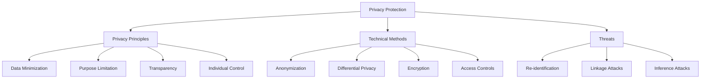

# Privacy Protection

## Introduction

Privacy protection is a cornerstone of ethical data science, addressing how we collect, store, share, and use personal information while respecting individuals' rights to control their data. In an era where data collection is ubiquitous and data breaches are common, protecting privacy has become both a legal obligation and a moral imperative. Privacy violations can lead to identity theft, discrimination, surveillance, and erosion of trust in data-driven systems.

Privacy is not simply about secrecy—it's about appropriate information flow. The same medical information that should be accessible to your doctor should not be visible to your employer or insurance company without consent. Privacy protection requires understanding the context of data use, implementing technical safeguards, and respecting individual autonomy over personal information.

Modern privacy techniques go beyond basic data security to include sophisticated approaches like differential privacy, which allows statistical analysis while protecting individual records, and anonymization methods that remove identifying information while preserving analytical value.



## Core Privacy Principles

### Data Minimization

Collect only the data necessary for the specified purpose. Every additional data point increases privacy risk without necessarily adding value. This principle asks: Do we really need this information? Can we achieve our goals with less data?

In practice, data minimization means limiting collection scope, reducing retention periods, and regularly purging unnecessary data. It's the privacy equivalent of "less is more."

### Purpose Limitation

Use data only for the purposes for which it was collected. Don't repurpose health data for marketing, or educational data for credit decisions. Purpose limitation builds trust and prevents mission creep where data collection expands beyond original intentions.

This requires clear documentation of data purposes, technical controls to prevent unauthorized use, and organizational policies that enforce purpose boundaries.

### Transparency

Be open about data practices. Privacy policies should be comprehensible, not legalese designed to obscure. People should understand what data is collected, how it's used, who has access, and how long it's retained.

Transparency enables informed consent and accountability. It's the foundation of trust in data relationships.

### Individual Control

Give people meaningful control over their data. This includes rights to access their data, correct errors, delete information, and port data to other services. Control also means genuine choice about data sharing, not coercive take-it-or-leave-it ultimatums.

## Anonymization Techniques

```python
import pandas as pd
import numpy as np
from hashlib import sha256

class DataAnonymization:
    """Techniques for anonymizing datasets"""

    @staticmethod
    def remove_direct_identifiers(df, identifier_columns):
        """
        Remove or suppress direct identifiers
        (names, SSN, email, phone, etc.)
        """
        df_anon = df.copy()
        df_anon = df_anon.drop(columns=identifier_columns)
        return df_anon

    @staticmethod
    def generalize_attribute(values, bins=None, labels=None):
        """
        Generalize specific values to broader categories
        Example: Age 34 → Age range 30-40
        """
        if bins is None:
            # Auto-create bins
            min_val, max_val = values.min(), values.max()
            bins = np.linspace(min_val, max_val, 6)  # 5 bins

        generalized = pd.cut(values, bins=bins, labels=labels, include_lowest=True)
        return generalized

    @staticmethod
    def suppress_rare_values(series, min_frequency=5, suppression_value='*'):
        """
        Suppress values that appear fewer than min_frequency times
        to prevent identification of rare cases
        """
        value_counts = series.value_counts()
        rare_values = value_counts[value_counts < min_frequency].index

        suppressed = series.copy()
        suppressed[suppressed.isin(rare_values)] = suppression_value

        return suppressed

    @staticmethod
    def pseudonymize(values, salt='random_salt_12345'):
        """
        Replace identifiers with pseudonyms (one-way hash)
        Consistent mapping but not reversible
        """
        def hash_value(val):
            combined = f"{val}{salt}"
            return sha256(combined.encode()).hexdigest()[:16]

        return values.apply(hash_value)

    @staticmethod
    def add_noise(values, noise_level=0.05):
        """
        Add random noise to numerical values
        noise_level: proportion of standard deviation to add
        """
        std = values.std()
        noise = np.random.normal(0, std * noise_level, size=len(values))
        return values + noise

# Create sample patient dataset
np.random.seed(42)
patients = pd.DataFrame({
    'patient_id': [f'P{i:04d}' for i in range(1000)],
    'name': [f'Patient{i}' for i in range(1000)],
    'age': np.random.randint(18, 90, 1000),
    'zipcode': np.random.choice(['02138', '02139', '02140', '94301', '94305'], 1000),
    'diagnosis': np.random.choice(['Type 2 Diabetes', 'Hypertension', 'Asthma', 'None'], 1000),
    'salary': np.random.normal(65000, 25000, 1000)
})

print("ORIGINAL DATASET (First 5 rows)")
print("="*60)
print(patients.head())
print(f"\nTotal records: {len(patients)}")

# Apply anonymization
anonymizer = DataAnonymization()

# Step 1: Remove direct identifiers
patients_anon = anonymizer.remove_direct_identifiers(
    patients,
    identifier_columns=['patient_id', 'name']
)

# Step 2: Generalize age to ranges
age_bins = [0, 30, 40, 50, 60, 70, 100]
age_labels = ['<30', '30-40', '40-50', '50-60', '60-70', '70+']
patients_anon['age'] = anonymizer.generalize_attribute(
    patients_anon['age'],
    bins=age_bins,
    labels=age_labels
)

# Step 3: Generalize zipcode to first 3 digits
patients_anon['zipcode'] = patients_anon['zipcode'].str[:3] + 'XX'

# Step 4: Suppress rare diagnoses
patients_anon['diagnosis'] = anonymizer.suppress_rare_values(
    patients_anon['diagnosis'],
    min_frequency=50
)

# Step 5: Add noise to salary
patients_anon['salary'] = anonymizer.add_noise(
    patients_anon['salary'],
    noise_level=0.1
)

print("\n\nANONYMIZED DATASET (First 5 rows)")
print("="*60)
print(patients_anon.head())

# Assess re-identification risk
print("\n\nRE-IDENTIFICATION RISK ASSESSMENT")
print("="*60)

# Check for unique combinations (quasi-identifiers)
quasi_identifiers = ['age', 'zipcode', 'diagnosis']
combinations = patients_anon.groupby(quasi_identifiers).size()

unique_combos = combinations[combinations == 1]
print(f"Unique combinations of {quasi_identifiers}: {len(unique_combos)}")
print(f"Re-identification risk: {len(unique_combos)/len(patients_anon)*100:.2f}%")

# k-anonymity check
min_group_size = combinations.min()
print(f"\nMinimum group size (k): {min_group_size}")
if min_group_size >= 5:
    print("✓ Dataset meets k=5 anonymity")
else:
    print(f"✗ Dataset does NOT meet k=5 anonymity (min k={min_group_size})")
```

## Differential Privacy

Differential privacy provides mathematical guarantees that the presence or absence of any individual in a dataset doesn't significantly affect analysis results. This allows meaningful statistical queries while protecting individual privacy.

```python
class DifferentialPrivacy:
    """
    Implement basic differential privacy mechanisms
    ε (epsilon) controls privacy level: smaller = more private
    """

    @staticmethod
    def laplace_mechanism(true_value, sensitivity, epsilon):
        """
        Add Laplace noise to achieve epsilon-differential privacy

        sensitivity: maximum change in output from adding/removing one record
        epsilon: privacy budget (smaller = more privacy, more noise)
        """
        scale = sensitivity / epsilon
        noise = np.random.laplace(0, scale)
        return true_value + noise

    @staticmethod
    def private_count(data, epsilon=1.0):
        """
        Count with differential privacy
        Sensitivity = 1 (one person changes count by at most 1)
        """
        true_count = len(data)
        private_count = DifferentialPrivacy.laplace_mechanism(
            true_count,
            sensitivity=1,
            epsilon=epsilon
        )
        return max(0, private_count)  # Count can't be negative

    @staticmethod
    def private_mean(data, value_range, epsilon=1.0):
        """
        Calculate mean with differential privacy

        value_range: (min, max) possible values
        """
        true_mean = data.mean()
        n = len(data)

        # Sensitivity: (max - min) / n
        sensitivity = (value_range[1] - value_range[0]) / n

        private_mean = DifferentialPrivacy.laplace_mechanism(
            true_mean,
            sensitivity=sensitivity,
            epsilon=epsilon
        )

        # Clip to valid range
        return np.clip(private_mean, value_range[0], value_range[1])

    @staticmethod
    def private_histogram(data, bins, epsilon=1.0):
        """
        Create histogram with differential privacy
        Each bin count has sensitivity = 1
        """
        hist, bin_edges = np.histogram(data, bins=bins)

        # Add noise to each bin
        epsilon_per_bin = epsilon / len(hist)  # Split privacy budget
        private_hist = []

        for count in hist:
            private_count = DifferentialPrivacy.laplace_mechanism(
                count,
                sensitivity=1,
                epsilon=epsilon_per_bin
            )
            private_hist.append(max(0, private_count))

        return np.array(private_hist), bin_edges

# Example: Private statistics on patient ages
dp = DifferentialPrivacy()

ages = patients['age'].values

print("\n\nDIFFERENTIAL PRIVACY DEMO")
print("="*60)

# True statistics
true_count = len(ages)
true_mean = ages.mean()

print(f"True count: {true_count}")
print(f"True mean age: {true_mean:.2f}")

# Private statistics with different epsilon values
epsilons = [0.1, 1.0, 10.0]

print("\nPrivate statistics with varying privacy levels:")
for eps in epsilons:
    private_cnt = dp.private_count(ages, epsilon=eps)
    private_avg = dp.private_mean(ages, value_range=(18, 90), epsilon=eps)

    count_error = abs(private_cnt - true_count)
    mean_error = abs(private_avg - true_mean)

    print(f"\nε = {eps} ({'high privacy' if eps < 1 else 'low privacy'}):")
    print(f"  Private count: {private_cnt:.0f} (error: {count_error:.0f})")
    print(f"  Private mean: {private_avg:.2f} (error: {mean_error:.2f})")

# Private histogram
bins = [18, 30, 40, 50, 60, 70, 90]
true_hist, bin_edges = np.histogram(ages, bins=bins)
private_hist, _ = dp.private_histogram(ages, bins=bins, epsilon=1.0)

print("\n\nAge distribution (True vs Private, ε=1.0):")
print("-"*60)
for i, (true, private) in enumerate(zip(true_hist, private_hist)):
    bin_label = f"{bins[i]}-{bins[i+1]}"
    print(f"{bin_label:8s}: True={true:4.0f}, Private={private:6.1f}, Error={abs(true-private):5.1f}")
```

## Privacy Attacks and Vulnerabilities

Understanding how privacy can be compromised helps build better protections.

```python
class PrivacyAttackDemo:
    """Demonstrate privacy vulnerabilities"""

    @staticmethod
    def linkage_attack_demo():
        """
        Demonstrate linkage attack where anonymized data
        is linked to external data sources
        """
        # Anonymized medical dataset (removed names)
        medical_anon = pd.DataFrame({
            'age': [34, 45, 29, 52, 67],
            'zipcode': ['02138', '94301', '02139', '10001', '90210'],
            'diagnosis': ['Diabetes', 'Hypertension', 'Asthma', 'Diabetes', 'None']
        })

        # Public voter registration data
        voter_data = pd.DataFrame({
            'name': ['Alice Smith', 'Bob Jones', 'Carol White', 'David Brown', 'Eve Davis'],
            'age': [34, 45, 29, 52, 67],
            'zipcode': ['02138', '94301', '02139', '10001', '90210']
        })

        print("LINKAGE ATTACK DEMONSTRATION")
        print("="*60)
        print("\nAnonymized medical records:")
        print(medical_anon)

        print("\n\nPublic voter records:")
        print(voter_data)

        # Linkage attack: join on quasi-identifiers
        linked = medical_anon.merge(
            voter_data,
            on=['age', 'zipcode'],
            how='inner'
        )

        print("\n\nRe-identified records:")
        print(linked[['name', 'age', 'zipcode', 'diagnosis']])
        print(f"\nRe-identification rate: {len(linked)/len(medical_anon)*100:.0f}%")

        return linked

    @staticmethod
    def inference_attack_demo():
        """
        Demonstrate inference attack where aggregate data
        reveals individual information
        """
        # Hospital data: average salary by department
        dept_salaries = pd.DataFrame({
            'department': ['Cardiology', 'Oncology', 'Pediatrics'],
            'avg_salary': [185000, 195000, 165000],
            'employee_count': [10, 8, 12]
        })

        print("\n\nINFERENCE ATTACK DEMONSTRATION")
        print("="*60)
        print("\nPublished aggregate data:")
        print(dept_salaries)

        # Attacker knows all salaries in Cardiology except one person
        known_cardio_salaries = [180000, 190000, 175000, 185000, 200000,
                                 170000, 195000, 188000, 192000]

        avg_salary = 185000
        total_employees = 10

        # Infer unknown salary
        total_salary = avg_salary * total_employees
        known_total = sum(known_cardio_salaries)
        inferred_salary = total_salary - known_total

        print(f"\nAttacker knows {len(known_cardio_salaries)} of {total_employees} salaries")
        print(f"Inferred unknown employee's salary: ${inferred_salary:,.0f}")
        print("\n⚠ Aggregate statistics can reveal individual information!")

attack_demo = PrivacyAttackDemo()
attack_demo.linkage_attack_demo()
attack_demo.inference_attack_demo()
```

## Privacy-Preserving Data Sharing

```python
class PrivacyPreservingSharing:
    """Techniques for sharing data while preserving privacy"""

    @staticmethod
    def k_anonymity(df, quasi_identifiers, k=5):
        """
        Check if dataset satisfies k-anonymity
        Each combination of quasi-identifiers appears at least k times
        """
        group_sizes = df.groupby(quasi_identifiers).size()
        min_group_size = group_sizes.min()

        satisfies_k = min_group_size >= k

        return {
            'satisfies_k_anonymity': satisfies_k,
            'k_value': min_group_size,
            'required_k': k,
            'unique_combinations': len(group_sizes),
            'smallest_groups': group_sizes.nsmallest(5).to_dict()
        }

    @staticmethod
    def l_diversity(df, quasi_identifiers, sensitive_attribute, l=2):
        """
        Check if dataset satisfies l-diversity
        Each group has at least l distinct values for sensitive attribute
        """
        diversity = df.groupby(quasi_identifiers)[sensitive_attribute].nunique()
        min_diversity = diversity.min()

        satisfies_l = min_diversity >= l

        return {
            'satisfies_l_diversity': satisfies_l,
            'l_value': min_diversity,
            'required_l': l,
            'low_diversity_groups': diversity[diversity < l].to_dict()
        }

# Test k-anonymity and l-diversity
pps = PrivacyPreservingSharing()

# Use anonymized patient data
k_anon_result = pps.k_anonymity(
    patients_anon,
    quasi_identifiers=['age', 'zipcode'],
    k=5
)

print("\n\nK-ANONYMITY ASSESSMENT")
print("="*60)
print(f"Satisfies k=5 anonymity: {k_anon_result['satisfies_k_anonymity']}")
print(f"Actual k value: {k_anon_result['k_value']}")
print(f"Unique combinations: {k_anon_result['unique_combinations']}")

l_div_result = pps.l_diversity(
    patients_anon,
    quasi_identifiers=['age', 'zipcode'],
    sensitive_attribute='diagnosis',
    l=2
)

print("\n\nL-DIVERSITY ASSESSMENT")
print("="*60)
print(f"Satisfies l=2 diversity: {l_div_result['satisfies_l_diversity']}")
print(f"Actual l value: {l_div_result['l_value']}")
```

## Best Practices for Privacy Protection

1. **Privacy by Design**: Build privacy into systems from the start, not as an afterthought

2. **Data Minimization**: Collect and retain only necessary data

3. **Purpose Limitation**: Use data only for stated purposes

4. **Access Controls**: Implement role-based access to limit who can see sensitive data

5. **Encryption**: Protect data in transit and at rest

6. **Regular Audits**: Monitor data access and use patterns

7. **Privacy Impact Assessments**: Evaluate privacy risks before new projects

8. **Transparency**: Be clear about data practices

9. **Individual Rights**: Enable access, correction, deletion requests

10. **Incident Response**: Have plans for privacy breaches

## Summary

Privacy protection is essential for ethical data science and legal compliance. Modern privacy techniques go beyond simple data security to include sophisticated methods like differential privacy, k-anonymity, and privacy-preserving computation. Understanding privacy attacks like linkage and inference helps build robust protections.

Key privacy principles—data minimization, purpose limitation, transparency, and individual control—guide responsible data practices. Technical methods like anonymization, generalization, and noise addition provide practical tools for privacy protection, while frameworks like k-anonymity and l-diversity offer measurable privacy guarantees.

Privacy is not a binary state but a spectrum requiring ongoing attention and adaptation. As data collection expands and analytical techniques advance, privacy protections must evolve to meet new challenges. The goal is not to eliminate all data use but to enable responsible data science that respects individual rights while delivering social value.

Effective privacy protection requires combining technical safeguards, organizational policies, legal compliance, and ethical commitment. It's a shared responsibility across data collectors, processors, analysts, and decision-makers, all working to maintain the delicate balance between data utility and individual privacy.
