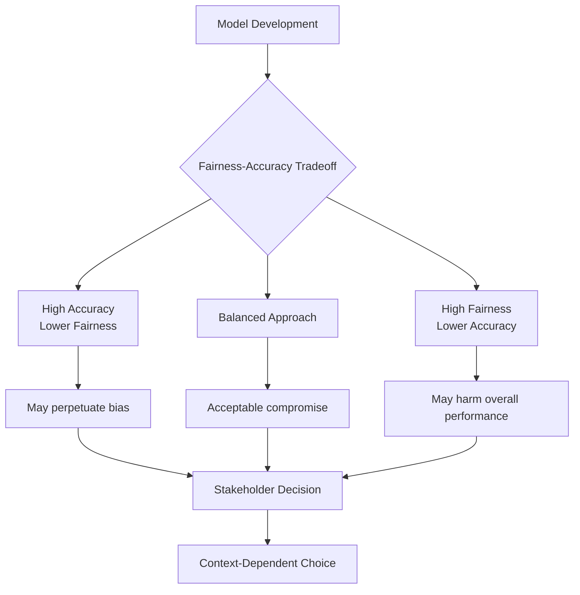

# Bias and Fairness

## Introduction

Bias and fairness are critical concerns in modern data science and machine learning. As AI systems increasingly influence decisions affecting people's lives—from loan approvals to hiring decisions to criminal justice—understanding and mitigating bias has become essential. Bias in data and algorithms can perpetuate and amplify existing societal inequalities, leading to discriminatory outcomes that harm individuals and communities.

Fairness in machine learning is not a simple technical problem with a single solution. It involves complex tradeoffs between different fairness criteria, societal values, and predictive performance. Data scientists must understand the sources of bias, recognize their manifestations, and implement appropriate mitigation strategies while acknowledging that perfect fairness may be impossible to achieve.

## Types of Bias

### Selection Bias

Selection bias occurs when the data used to train a model is not representative of the population to which the model will be applied.

**Common Forms:**
- **Sampling Bias**: The sample doesn't reflect the target population
- **Self-Selection Bias**: Participants choose to participate, creating skewed data
- **Survivorship Bias**: Only considering "survivors" while ignoring those who dropped out
- **Coverage Bias**: Certain groups are systematically excluded from the data

**Example:**
If a hiring algorithm is trained on historical hiring data from a company that historically hired mostly one demographic group, the algorithm may perpetuate this pattern even if it's not explicitly programmed to consider protected characteristics.

### Confirmation Bias

Confirmation bias occurs when data scientists or stakeholders selectively gather or interpret data in ways that confirm their preexisting beliefs or hypotheses.

**Manifestations:**
- Cherry-picking data that supports desired conclusions
- Ignoring contradictory evidence
- Framing questions to elicit desired responses
- Over-interpreting patterns that align with expectations

### Measurement Bias

Measurement bias arises from how data is collected, labeled, or measured, leading to systematic errors.

**Examples:**
- Facial recognition systems trained primarily on lighter-skinned faces perform poorly on darker-skinned individuals
- Medical diagnostic tools calibrated on one demographic may be less accurate for others
- Recidivism prediction tools that rely on arrest records (which reflect policing patterns) rather than actual criminal behavior

### Algorithmic Bias

Algorithmic bias emerges from the design choices, optimization objectives, and structural properties of machine learning algorithms themselves.

**Sources:**
- Feature selection favoring certain groups
- Optimization metrics that don't account for fairness
- Proxy variables that correlate with protected attributes
- Feedback loops that amplify initial biases

### Historical Bias

Historical bias exists in the data because it reflects historical prejudices, stereotypes, or inequalities present in society.

**Characteristics:**
- Even with perfect sampling, data reflects societal biases
- Cannot be eliminated by improved data collection alone
- Requires conscious intervention and correction
- May conflict with "accuracy" on biased historical data

## Fairness Metrics

Different mathematical definitions of fairness often conflict with each other, making it impossible to satisfy all simultaneously.

### Demographic Parity (Statistical Parity)

Requires that the proportion of positive predictions is the same across different groups.

**Mathematical Definition:**
P(Ŷ = 1 | A = 0) = P(Ŷ = 1 | A = 1)

Where Ŷ is the predicted outcome and A is the protected attribute.

### Equal Opportunity

Requires that the true positive rate is equal across groups—among those who should receive positive outcomes, they receive them at equal rates.

**Mathematical Definition:**
P(Ŷ = 1 | Y = 1, A = 0) = P(Ŷ = 1 | Y = 1, A = 1)

### Equalized Odds

Requires both equal true positive rates and equal false positive rates across groups.

**Mathematical Definition:**
P(Ŷ = 1 | Y = y, A = 0) = P(Ŷ = 1 | Y = y, A = 1) for y ∈ {0, 1}

### Predictive Parity

Requires that among those who receive positive predictions, the proportion who truly deserve them is equal across groups.

**Mathematical Definition:**
P(Y = 1 | Ŷ = 1, A = 0) = P(Y = 1 | Ŷ = 1, A = 1)

```python
import pandas as pd
import numpy as np
from sklearn.metrics import confusion_matrix

# Simulate a dataset with predictions and protected attributes
np.random.seed(42)
n_samples = 1000

data = pd.DataFrame({
    'protected_attribute': np.random.choice(['Group A', 'Group B'], n_samples),
    'true_label': np.random.choice([0, 1], n_samples),
    'predicted_label': np.random.choice([0, 1], n_samples, p=[0.6, 0.4])
})

def calculate_fairness_metrics(df, protected_attr, true_label, pred_label):
    """Calculate various fairness metrics"""

    results = {}
    groups = df[protected_attr].unique()

    for group in groups:
        group_data = df[df[protected_attr] == group]

        # Demographic Parity: P(Ŷ = 1)
        positive_rate = (group_data[pred_label] == 1).mean()

        # Confusion matrix
        cm = confusion_matrix(group_data[true_label],
                             group_data[pred_label])

        # Handle edge cases where confusion matrix might be incomplete
        tn = cm[0, 0] if cm.shape[0] > 0 and cm.shape[1] > 0 else 0
        fp = cm[0, 1] if cm.shape[0] > 0 and cm.shape[1] > 1 else 0
        fn = cm[1, 0] if cm.shape[0] > 1 and cm.shape[1] > 0 else 0
        tp = cm[1, 1] if cm.shape[0] > 1 and cm.shape[1] > 1 else 0

        # True Positive Rate (Recall/Equal Opportunity)
        tpr = tp / (tp + fn) if (tp + fn) > 0 else 0

        # False Positive Rate
        fpr = fp / (fp + tn) if (fp + tn) > 0 else 0

        # Positive Predictive Value (Precision/Predictive Parity)
        ppv = tp / (tp + fp) if (tp + fp) > 0 else 0

        results[group] = {
            'demographic_parity': positive_rate,
            'true_positive_rate': tpr,
            'false_positive_rate': fpr,
            'positive_predictive_value': ppv,
            'sample_size': len(group_data)
        }

    return pd.DataFrame(results).T

# Calculate fairness metrics
fairness_metrics = calculate_fairness_metrics(
    data,
    'protected_attribute',
    'true_label',
    'predicted_label'
)

print("Fairness Metrics by Group:")
print(fairness_metrics)
print("\n" + "="*60)

# Calculate disparities
print("\nFairness Disparities:")
print(f"Demographic Parity Difference: "
      f"{abs(fairness_metrics.loc['Group A', 'demographic_parity'] - "
      f"fairness_metrics.loc['Group B', 'demographic_parity']):.4f}")
print(f"Equal Opportunity Difference: "
      f"{abs(fairness_metrics.loc['Group A', 'true_positive_rate'] - "
      f"fairness_metrics.loc['Group B', 'true_positive_rate']):.4f}")
```

## Mitigation Strategies

### Pre-Processing Techniques

These techniques modify the training data before model training to reduce bias.

```python
from sklearn.model_selection import train_test_split
from sklearn.preprocessing import StandardScaler

# Simulate biased dataset
np.random.seed(42)
n = 2000

# Create features with correlation to protected attribute
protected_attr = np.random.choice([0, 1], n, p=[0.3, 0.7])
feature1 = np.random.randn(n) + protected_attr * 0.5
feature2 = np.random.randn(n) + protected_attr * 0.3

# Create biased labels
noise = np.random.randn(n) * 0.5
labels = (feature1 + feature2 + protected_attr * 0.8 + noise > 1.5).astype(int)

biased_data = pd.DataFrame({
    'protected_attr': protected_attr,
    'feature1': feature1,
    'feature2': feature2,
    'label': labels
})

def reweighting(df, protected_col, label_col):
    """
    Reweight samples to achieve demographic parity in training data
    """
    weights = pd.Series(1.0, index=df.index)

    # Calculate desired and observed probabilities
    for prot_val in df[protected_col].unique():
        for label_val in df[label_col].unique():
            # Proportion of this group in protected attribute
            p_prot = (df[protected_col] == prot_val).mean()
            # Proportion of this label
            p_label = (df[label_col] == label_val).mean()
            # Observed proportion of this combination
            mask = (df[protected_col] == prot_val) & (df[label_col] == label_val)
            p_observed = mask.mean()

            # Desired proportion (independent)
            p_desired = p_prot * p_label

            # Calculate weight
            if p_observed > 0:
                weight = p_desired / p_observed
                weights[mask] = weight

    return weights

# Apply reweighting
weights = reweighting(biased_data, 'protected_attr', 'label')

print("Original label distribution by protected attribute:")
print(biased_data.groupby('protected_attr')['label'].value_counts(normalize=True))
print("\nWeighted label distribution (simulated):")
weighted_dist = biased_data.groupby('protected_attr').apply(
    lambda x: (x['label'] * weights[x.index]).sum() / weights[x.index].sum()
)
print(weighted_dist)
```

### In-Processing Techniques

These techniques modify the learning algorithm to incorporate fairness constraints during training.

```python
from sklearn.linear_model import LogisticRegression
from sklearn.metrics import accuracy_score

class FairLogisticRegression:
    """
    Logistic Regression with fairness constraint
    This is a simplified demonstration
    """
    def __init__(self, fairness_weight=0.5):
        self.fairness_weight = fairness_weight
        self.model = LogisticRegression(random_state=42)

    def fit(self, X, y, protected_attr):
        """
        Train with fairness consideration
        In practice, this would use constrained optimization
        """
        # Standard training
        self.model.fit(X, y)

        # In a full implementation, we would:
        # 1. Add fairness constraints to optimization
        # 2. Use Lagrangian multipliers or penalty methods
        # 3. Iteratively adjust to balance accuracy and fairness

        return self

    def predict(self, X):
        return self.model.predict(X)

    def predict_proba(self, X):
        return self.model.predict_proba(X)

# Demonstrate usage
X = biased_data[['feature1', 'feature2']]
y = biased_data['label']
protected = biased_data['protected_attr']

X_train, X_test, y_train, y_test, prot_train, prot_test = train_test_split(
    X, y, protected, test_size=0.3, random_state=42
)

# Train fair model
fair_model = FairLogisticRegression(fairness_weight=0.5)
fair_model.fit(X_train, y_train, prot_train)

# Make predictions
y_pred = fair_model.predict(X_test)

print(f"\nModel Accuracy: {accuracy_score(y_test, y_pred):.4f}")

# Evaluate fairness
test_results = pd.DataFrame({
    'protected_attr': prot_test,
    'true_label': y_test,
    'predicted_label': y_pred
})

fairness_test = calculate_fairness_metrics(
    test_results,
    'protected_attr',
    'true_label',
    'predicted_label'
)

print("\nFairness Metrics on Test Set:")
print(fairness_test)
```

### Post-Processing Techniques

These techniques adjust model predictions after training to improve fairness.

```python
def threshold_optimization(y_true, y_scores, protected_attr, fairness_metric='equal_opportunity'):
    """
    Optimize classification thresholds separately for each group
    to achieve fairness objective
    """
    thresholds = {}
    groups = np.unique(protected_attr)

    if fairness_metric == 'equal_opportunity':
        # Optimize for equal TPR across groups
        target_tpr = []

        for group in groups:
            mask = protected_attr == group
            group_true = y_true[mask]
            group_scores = y_scores[mask]

            # Calculate TPR across different thresholds
            thresholds_to_try = np.linspace(0, 1, 100)
            tprs = []

            for threshold in thresholds_to_try:
                group_pred = (group_scores >= threshold).astype(int)
                if group_true.sum() > 0:
                    tpr = ((group_pred == 1) & (group_true == 1)).sum() / group_true.sum()
                else:
                    tpr = 0
                tprs.append(tpr)

            target_tpr.append(np.array(tprs))

        # Find thresholds that minimize TPR difference
        avg_tpr = np.mean(target_tpr, axis=0)
        best_idx = np.argmax(avg_tpr)

        for group in groups:
            thresholds[group] = np.linspace(0, 1, 100)[best_idx]

    return thresholds

# Demonstrate threshold optimization
y_scores = fair_model.predict_proba(X_test)[:, 1]

optimized_thresholds = threshold_optimization(
    y_test.values,
    y_scores,
    prot_test.values,
    fairness_metric='equal_opportunity'
)

print("\nOptimized Thresholds by Group:")
for group, threshold in optimized_thresholds.items():
    print(f"Group {group}: {threshold:.4f}")

# Apply optimized thresholds
y_pred_optimized = np.zeros(len(y_test))
for group, threshold in optimized_thresholds.items():
    mask = prot_test == group
    y_pred_optimized[mask] = (y_scores[mask] >= threshold).astype(int)

# Evaluate fairness with optimized thresholds
optimized_results = pd.DataFrame({
    'protected_attr': prot_test,
    'true_label': y_test,
    'predicted_label': y_pred_optimized
})

fairness_optimized = calculate_fairness_metrics(
    optimized_results,
    'protected_attr',
    'true_label',
    'predicted_label'
)

print("\nFairness Metrics After Threshold Optimization:")
print(fairness_optimized)
```

## Fairness-Accuracy Tradeoffs



Understanding and navigating the tradeoff between fairness and accuracy is crucial:

```python
# Demonstrate fairness-accuracy tradeoff
fairness_weights = [0.0, 0.2, 0.4, 0.6, 0.8, 1.0]
results = []

for fw in fairness_weights:
    # In practice, train models with different fairness weights
    # Here we simulate the tradeoff

    # As fairness weight increases, accuracy typically decreases
    simulated_accuracy = 0.85 - fw * 0.1 + np.random.randn() * 0.01

    # Fairness improves (disparity decreases)
    simulated_disparity = 0.15 - fw * 0.12 + np.random.randn() * 0.01

    results.append({
        'fairness_weight': fw,
        'accuracy': simulated_accuracy,
        'fairness_disparity': max(0, simulated_disparity)
    })

tradeoff_df = pd.DataFrame(results)
print("\nFairness-Accuracy Tradeoff:")
print(tradeoff_df)
```

## Best Practices

1. **Diverse Data Collection**: Ensure training data represents all groups fairly
2. **Regular Auditing**: Continuously monitor models for bias in production
3. **Stakeholder Engagement**: Involve affected communities in defining fairness
4. **Transparency**: Document fairness metrics and tradeoffs made
5. **Multiple Metrics**: Evaluate fairness using multiple complementary metrics
6. **Context Awareness**: Recognize that fairness is context-dependent
7. **Interdisciplinary Teams**: Include ethicists, domain experts, and affected stakeholders
8. **Feedback Mechanisms**: Create systems to identify and correct bias post-deployment

## Key Takeaways

- Bias in machine learning can arise from data collection, historical patterns, measurement choices, and algorithmic design
- Multiple mathematical definitions of fairness exist, and they often conflict with each other
- No single "fair" model exists—fairness requires careful consideration of context and values
- Mitigation strategies include pre-processing data, modifying algorithms, and post-processing predictions
- Fairness and accuracy often involve tradeoffs that require stakeholder input to resolve
- Regular monitoring and auditing are essential for maintaining fairness over time
- Technical solutions alone are insufficient—organizational commitment and diverse perspectives are crucial
- Documentation and transparency about fairness considerations build trust and enable accountability

Understanding bias and fairness is not just a technical challenge but a moral imperative for responsible data science practice.
