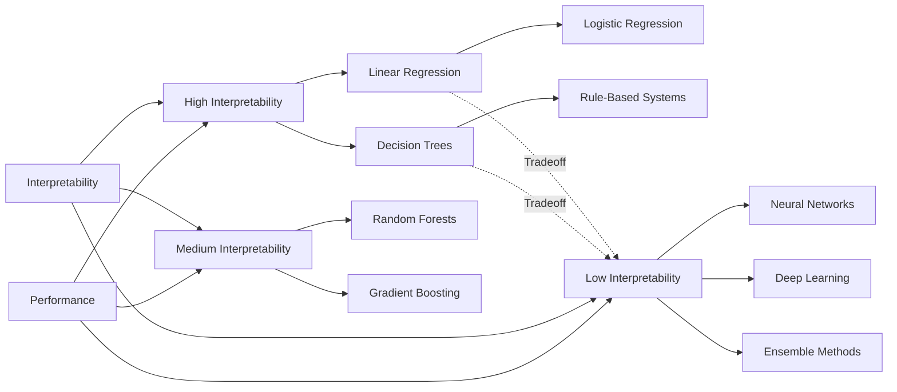
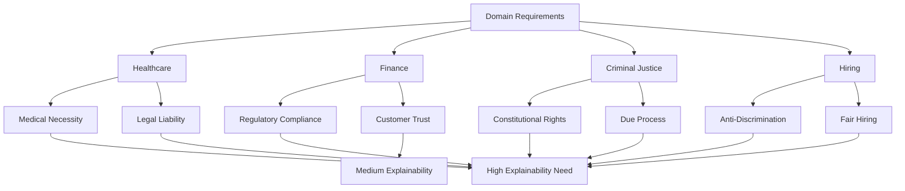

# Transparency and Explainability

## Introduction

As machine learning models become increasingly complex and influential in high-stakes decisions, the need for transparency and explainability has become paramount. A model that makes accurate predictions but cannot explain its reasoning is problematic in domains like healthcare, finance, criminal justice, and hiring, where decisions must be justified and understood.

Transparency refers to the openness about how a model works, what data it uses, and how it makes decisions. Explainability (or interpretability) refers to the degree to which a human can understand the cause of a decision made by the model. These concepts are critical for building trust, ensuring accountability, detecting bias, and meeting regulatory requirements.

The challenge lies in balancing model performance with interpretability. While simpler models like linear regression are inherently interpretable, more complex models like deep neural networks often achieve better performance at the cost of being "black boxes."

## The Interpretability Spectrum



## Intrinsically Interpretable Models

Some models are inherently interpretable due to their simple structure and transparent decision-making process.

### Linear Models

```python
import pandas as pd
import numpy as np
from sklearn.linear_model import LinearRegression, LogisticRegression
from sklearn.preprocessing import StandardScaler
from sklearn.model_selection import train_test_split

# Generate sample data for loan approval
np.random.seed(42)
n_samples = 1000

data = pd.DataFrame({
    'income': np.random.normal(60000, 20000, n_samples),
    'credit_score': np.random.normal(700, 50, n_samples),
    'debt_to_income': np.random.uniform(0.1, 0.6, n_samples),
    'employment_years': np.random.uniform(0, 30, n_samples)
})

# Create target variable (loan approval)
loan_score = (
    0.3 * (data['income'] / 1000) +
    0.5 * (data['credit_score'] / 10) -
    100 * data['debt_to_income'] +
    2 * data['employment_years'] +
    np.random.normal(0, 10, n_samples)
)
data['approved'] = (loan_score > 100).astype(int)

# Train interpretable logistic regression
X = data[['income', 'credit_score', 'debt_to_income', 'employment_years']]
y = data['approved']

X_train, X_test, y_train, y_test = train_test_split(
    X, y, test_size=0.3, random_state=42
)

# Standardize for better coefficient interpretation
scaler = StandardScaler()
X_train_scaled = scaler.fit_transform(X_train)
X_test_scaled = scaler.transform(X_test)

model = LogisticRegression(random_state=42)
model.fit(X_train_scaled, y_train)

# Interpret coefficients
feature_importance = pd.DataFrame({
    'feature': X.columns,
    'coefficient': model.coef_[0],
    'abs_coefficient': np.abs(model.coef_[0])
}).sort_values('abs_coefficient', ascending=False)

print("Logistic Regression Coefficients (Interpretable Model):")
print(feature_importance)
print(f"\nIntercept: {model.intercept_[0]:.4f}")
print(f"\nAccuracy: {model.score(X_test_scaled, y_test):.4f}")

# Explain a single prediction
sample_idx = 0
sample = X_test_scaled[sample_idx:sample_idx+1]
prediction = model.predict(sample)[0]
probability = model.predict_proba(sample)[0]

print(f"\nSample Prediction Explanation:")
print(f"Predicted: {'Approved' if prediction == 1 else 'Denied'}")
print(f"Probability: {probability[1]:.4f}")
print("\nContribution of each feature:")
for i, feature in enumerate(X.columns):
    contribution = model.coef_[0][i] * sample[0][i]
    print(f"{feature}: {contribution:.4f}")
```

### Decision Trees

```python
from sklearn.tree import DecisionTreeClassifier, export_text, plot_tree
import matplotlib.pyplot as plt

# Train interpretable decision tree
tree_model = DecisionTreeClassifier(max_depth=4, random_state=42)
tree_model.fit(X_train, y_train)

print(f"\nDecision Tree Accuracy: {tree_model.score(X_test, y_test):.4f}")

# Export tree rules (text format)
tree_rules = export_text(tree_model, feature_names=list(X.columns))
print("\nDecision Tree Rules:")
print(tree_rules[:500] + "...")  # Show first 500 characters

# Feature importance
tree_importance = pd.DataFrame({
    'feature': X.columns,
    'importance': tree_model.feature_importances_
}).sort_values('importance', ascending=False)

print("\nDecision Tree Feature Importance:")
print(tree_importance)
```

## Model-Agnostic Explanation Methods

These techniques can explain any model, regardless of its internal structure.

### LIME (Local Interpretable Model-agnostic Explanations)

LIME explains individual predictions by fitting an interpretable model locally around the prediction.

```python
# Simulated LIME implementation (simplified)
class SimpleLIME:
    """
    Simplified LIME implementation for educational purposes
    Real implementation should use the lime package
    """
    def __init__(self, model, X_train):
        self.model = model
        self.X_train = X_train

    def explain_instance(self, instance, n_samples=1000, n_features=4):
        """
        Explain a single prediction by fitting local linear model
        """
        # Generate perturbed samples around the instance
        perturbations = instance + np.random.randn(n_samples, len(instance)) * 0.1

        # Get predictions for perturbed samples
        predictions = self.model.predict_proba(perturbations)[:, 1]

        # Calculate distances (weights)
        distances = np.sqrt(np.sum((perturbations - instance) ** 2, axis=1))
        weights = np.exp(-distances / 0.5)

        # Fit weighted linear regression
        from sklearn.linear_model import Ridge
        local_model = Ridge(alpha=0.1)
        local_model.fit(perturbations, predictions, sample_weight=weights)

        # Get feature contributions
        contributions = local_model.coef_ * instance

        return contributions, local_model.coef_

# Train a more complex model to explain
from sklearn.ensemble import RandomForestClassifier

rf_model = RandomForestClassifier(n_estimators=100, random_state=42)
rf_model.fit(X_train_scaled, y_train)

print(f"\nRandom Forest Accuracy: {rf_model.score(X_test_scaled, y_test):.4f}")

# Explain a prediction with LIME
lime = SimpleLIME(rf_model, X_train_scaled)
sample_idx = 0
sample = X_test_scaled[sample_idx]

contributions, coefficients = lime.explain_instance(sample)

print("\nLIME Explanation for Sample Prediction:")
print(f"Prediction: {rf_model.predict([sample])[0]}")
print(f"Probability: {rf_model.predict_proba([sample])[0][1]:.4f}")
print("\nFeature Contributions:")
for i, feature in enumerate(X.columns):
    print(f"{feature}: {contributions[i]:.4f} (weight: {coefficients[i]:.4f})")
```

### SHAP (SHapley Additive exPlanations)

SHAP values are based on game theory and provide a unified measure of feature importance.

```python
# Simplified SHAP implementation concept
class SimpleSHAP:
    """
    Simplified SHAP concept for educational purposes
    Real implementation should use the shap package
    """
    def __init__(self, model, X_background):
        self.model = model
        self.X_background = X_background

    def explain_instance(self, instance, n_samples=100):
        """
        Calculate approximate SHAP values
        """
        n_features = len(instance)
        shap_values = np.zeros(n_features)

        # Base prediction (average over background)
        base_prediction = np.mean(
            self.model.predict_proba(self.X_background)[:, 1]
        )

        # Instance prediction
        instance_prediction = self.model.predict_proba([instance])[0][1]

        # Calculate marginal contribution of each feature
        for i in range(n_features):
            # Sample random subsets
            contributions = []

            for _ in range(n_samples):
                # Random background sample
                background_idx = np.random.randint(len(self.X_background))
                background = self.X_background[background_idx].copy()

                # Prediction without feature i (use background value)
                sample_without = instance.copy()
                sample_without[i] = background[i]
                pred_without = self.model.predict_proba([sample_without])[0][1]

                # Prediction with feature i
                pred_with = self.model.predict_proba([instance])[0][1]

                # Marginal contribution
                contributions.append(pred_with - pred_without)

            shap_values[i] = np.mean(contributions)

        return shap_values, base_prediction, instance_prediction

# Calculate SHAP values
shap = SimpleSHAP(rf_model, X_train_scaled[:100])
sample_idx = 0
sample = X_test_scaled[sample_idx]

shap_values, base_pred, instance_pred = shap.explain_instance(sample)

print("\nSHAP Explanation for Sample Prediction:")
print(f"Base prediction (average): {base_pred:.4f}")
print(f"Instance prediction: {instance_pred:.4f}")
print(f"Difference: {instance_pred - base_pred:.4f}")
print("\nSHAP Values (feature contributions):")

shap_df = pd.DataFrame({
    'feature': X.columns,
    'shap_value': shap_values,
    'feature_value': X_test.iloc[sample_idx].values
}).sort_values('shap_value', key=abs, ascending=False)

print(shap_df)

# Verify SHAP values sum to difference
print(f"\nSum of SHAP values: {shap_values.sum():.4f}")
print(f"Expected (instance - base): {instance_pred - base_pred:.4f}")
```

### Partial Dependence Plots

Partial dependence plots show the marginal effect of a feature on the model's predictions.

```python
def partial_dependence(model, X, feature_idx, feature_name, n_points=50):
    """
    Calculate partial dependence for a single feature
    """
    # Create grid of values for the feature
    feature_values = np.linspace(
        X[:, feature_idx].min(),
        X[:, feature_idx].max(),
        n_points
    )

    # Calculate average prediction for each feature value
    predictions = []

    for value in feature_values:
        # Create copies of X with the feature set to value
        X_temp = X.copy()
        X_temp[:, feature_idx] = value

        # Average predictions
        pred = model.predict_proba(X_temp)[:, 1].mean()
        predictions.append(pred)

    return feature_values, np.array(predictions)

# Calculate partial dependence for credit score
feature_idx = 1  # credit_score
feature_values, pd_values = partial_dependence(
    rf_model,
    X_test_scaled,
    feature_idx,
    'credit_score'
)

print("\nPartial Dependence - Credit Score:")
print("Feature Value | Predicted Probability")
print("-" * 40)
for val, pred in zip(feature_values[::10], pd_values[::10]):
    # Transform back to original scale for interpretation
    original_val = val * scaler.scale_[feature_idx] + scaler.mean_[feature_idx]
    print(f"{original_val:13.2f} | {pred:.4f}")
```

## Model Cards

Model cards provide standardized documentation for machine learning models.

```python
class ModelCard:
    """
    Template for documenting model details
    """
    def __init__(self):
        self.model_details = {}
        self.intended_use = {}
        self.factors = {}
        self.metrics = {}
        self.evaluation_data = {}
        self.training_data = {}
        self.ethical_considerations = {}
        self.caveats_recommendations = {}

    def set_model_details(self, name, version, type_info, training_date, owner):
        self.model_details = {
            'name': name,
            'version': version,
            'type': type_info,
            'training_date': training_date,
            'owner': owner
        }

    def set_intended_use(self, primary_use, primary_users, out_of_scope):
        self.intended_use = {
            'primary_use': primary_use,
            'primary_users': primary_users,
            'out_of_scope_uses': out_of_scope
        }

    def set_metrics(self, metrics_dict):
        self.metrics = metrics_dict

    def generate_card(self):
        """Generate formatted model card"""
        card = "=" * 60 + "\n"
        card += "MODEL CARD\n"
        card += "=" * 60 + "\n\n"

        card += "MODEL DETAILS\n"
        card += "-" * 60 + "\n"
        for key, value in self.model_details.items():
            card += f"{key.replace('_', ' ').title()}: {value}\n"

        card += "\nINTENDED USE\n"
        card += "-" * 60 + "\n"
        for key, value in self.intended_use.items():
            card += f"{key.replace('_', ' ').title()}: {value}\n"

        card += "\nPERFORMANCE METRICS\n"
        card += "-" * 60 + "\n"
        for key, value in self.metrics.items():
            card += f"{key.replace('_', ' ').title()}: {value}\n"

        return card

# Create model card for our loan approval model
model_card = ModelCard()

model_card.set_model_details(
    name="Loan Approval Classifier",
    version="1.0.0",
    type_info="Random Forest Classifier",
    training_date="2024-01-15",
    owner="Data Science Team"
)

model_card.set_intended_use(
    primary_use="Predict loan approval probability for risk assessment",
    primary_users="Loan officers and risk analysts",
    out_of_scope="Should not be the sole basis for loan decisions"
)

model_card.set_metrics({
    'accuracy': f"{rf_model.score(X_test_scaled, y_test):.4f}",
    'training_samples': len(X_train),
    'test_samples': len(X_test),
    'features': ', '.join(X.columns)
})

print("\n" + model_card.generate_card())
```

## Explainability in Different Domains



Different domains have varying requirements for explainability:

```python
# Domain-specific explainability requirements
explainability_requirements = pd.DataFrame({
    'Domain': ['Healthcare', 'Finance', 'Criminal Justice', 'Marketing', 'Hiring'],
    'Explainability_Need': ['Critical', 'High', 'Critical', 'Medium', 'High'],
    'Regulatory': ['HIPAA', 'GDPR/FCRA', 'Constitutional', 'GDPR', 'EEOC'],
    'Stakeholders': [
        'Doctors/Patients',
        'Customers/Regulators',
        'Defendants/Judges',
        'Consumers',
        'Candidates/HR'
    ],
    'Recommended_Approach': [
        'Interpretable models or detailed SHAP',
        'Model cards + LIME',
        'Interpretable models only',
        'Feature importance',
        'Detailed explanations + auditing'
    ]
})

print("\nDomain-Specific Explainability Requirements:")
print(explainability_requirements.to_string(index=False))
```

## Global vs. Local Explanations

```python
def compare_explanations(model, X_test, X_train, sample_idx=0):
    """
    Compare global (overall) and local (instance-specific) explanations
    """
    print("GLOBAL EXPLANATION (Feature Importance)")
    print("-" * 60)

    # Global: Feature importance from Random Forest
    global_importance = pd.DataFrame({
        'feature': X.columns,
        'importance': model.feature_importances_
    }).sort_values('importance', ascending=False)

    print(global_importance.to_string(index=False))

    print("\n" + "=" * 60)
    print("LOCAL EXPLANATION (Single Prediction)")
    print("-" * 60)

    # Local: SHAP-like explanation for specific instance
    sample = X_test[sample_idx]
    shap = SimpleSHAP(model, X_train[:100])
    shap_values, base_pred, instance_pred = shap.explain_instance(sample)

    local_importance = pd.DataFrame({
        'feature': X.columns,
        'contribution': shap_values
    }).sort_values('contribution', key=abs, ascending=False)

    print(f"Prediction: {instance_pred:.4f}")
    print(f"Base rate: {base_pred:.4f}")
    print("\nFeature Contributions:")
    print(local_importance.to_string(index=False))

    print("\n" + "=" * 60)
    print("COMPARISON")
    print("-" * 60)
    print("Global importance shows which features matter most overall.")
    print("Local importance shows which features matter for THIS prediction.")
    print("They may differ significantly!")

compare_explanations(rf_model, X_test_scaled, X_train_scaled, sample_idx=0)
```

## Challenges and Limitations

1. **Complexity-Performance Tradeoff**: More accurate models are often less interpretable
2. **Explanation Fidelity**: Simplified explanations may not fully represent model behavior
3. **Computational Cost**: Generating explanations can be expensive for complex models
4. **User Understanding**: Technical explanations may not be accessible to non-experts
5. **Gaming Risk**: Transparent models may be more vulnerable to adversarial attacks
6. **Multiple Valid Explanations**: Different methods may provide different explanations

## Best Practices

1. **Choose Appropriate Complexity**: Use the simplest model that meets performance requirements
2. **Multiple Explanation Methods**: Use complementary techniques (LIME + SHAP + feature importance)
3. **Audience-Appropriate**: Tailor explanations to the expertise level of stakeholders
4. **Document Everything**: Maintain comprehensive model cards and documentation
5. **Regular Auditing**: Continuously validate that explanations remain accurate
6. **Human-in-the-Loop**: Combine model predictions with human expertise
7. **Test Explanations**: Verify that explanations are faithful to model behavior
8. **Consider Context**: Different use cases require different levels of explainability

## Key Takeaways

- Transparency and explainability are essential for trust, accountability, and regulatory compliance
- Interpretable models (linear models, decision trees) are inherently explainable but may sacrifice performance
- Model-agnostic methods like LIME and SHAP can explain complex "black box" models
- LIME provides local explanations by fitting simple models around individual predictions
- SHAP values offer theoretically grounded feature importance based on game theory
- Model cards provide standardized documentation for ML models
- Different domains have varying explainability requirements based on stakes and regulations
- Global explanations show overall model behavior; local explanations show instance-specific reasoning
- There is often a tradeoff between model performance and interpretability
- Effective explainability requires combining multiple techniques and considering the audience

Understanding how and why models make decisions is not just a technical challenge but a fundamental requirement for responsible AI deployment.
