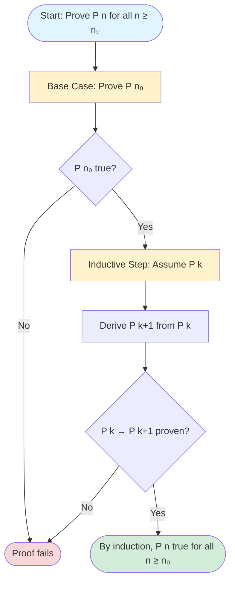

# Mathematical Induction

## The Domino Effect

Mathematical induction is a proof technique for establishing that a statement $P(n)$ is true for all natural numbers $n \geq n_0$ (usually $n_0 = 0$ or $1$).

Think of it like dominoes falling:
1. **Base Case:** The first domino falls ($P(n_0)$ is true)
2. **Inductive Step:** Each falling domino knocks over the next ($P(k) \to P(k+1)$)
3. **Conclusion:** All dominoes fall ($P(n)$ is true for all $n \geq n_0$)



## The Principle of Mathematical Induction

To prove $\forall n \geq n_0, P(n)$:

1. **Base Case:** Prove $P(n_0)$ is true
2. **Inductive Step:** Prove that for any $k \geq n_0$, if $P(k)$ is true, then $P(k+1)$ is true

If both steps succeed, then $P(n)$ is true for all $n \geq n_0$.

## The Structure

```
Theorem: For all n ≥ n₀, P(n).

Proof: (by induction on n)

Base Case (n = n₀):
[Show P(n₀) is true]

Inductive Step:
Assume P(k) is true for some arbitrary k ≥ n₀.  [This is the Inductive Hypothesis]
[Show P(k+1) is true using the assumption]

By the principle of mathematical induction, P(n) is true for all n ≥ n₀. □
```

## Example 1: Sum of First n Integers

**Theorem:** For all $n \geq 1$, $\displaystyle\sum_{i=1}^{n} i = \frac{n(n+1)}{2}$.

**Proof:** (by induction)

**Base Case ($n = 1$):**
$$\text{LHS: } 1$$
$$\text{RHS: } \frac{1(1+1)}{2} = \frac{1 \cdot 2}{2} = 1$$
$$\text{LHS} = \text{RHS} \,\checkmark$$

**Inductive Step:**
Assume $\displaystyle\sum_{i=1}^{k} i = \frac{k(k+1)}{2}$ for some $k \geq 1$. [Inductive Hypothesis]

We need to show: $\displaystyle\sum_{i=1}^{k+1} i = \frac{(k+1)(k+2)}{2}$.

Starting from the LHS:
$$\sum_{i=1}^{k+1} i = \sum_{i=1}^{k} i + (k+1)$$
$$= \frac{k(k+1)}{2} + (k+1) \quad \text{[by IH]}$$
$$= \frac{k(k+1)}{2} + \frac{2(k+1)}{2}$$
$$= \frac{k(k+1) + 2(k+1)}{2}$$
$$= \frac{(k+1)(k + 2)}{2}$$
$$= \frac{(k+1)((k+1)+1)}{2} \,\checkmark$$

By induction, the formula holds for all $n \geq 1$. $\square$

## Example 2: Sum of First n Odd Numbers

**Theorem:** For all $n \geq 1$, $\displaystyle\sum_{i=1}^{n} (2i-1) = n^2$.

**Proof:** (by induction)

**Base Case ($n = 1$):**
$$\text{LHS: } 1 \text{ (the first odd number)}$$
$$\text{RHS: } 1^2 = 1$$
$$\text{LHS} = \text{RHS} \,\checkmark$$

**Inductive Step:**
Assume $1 + 3 + 5 + \cdots + (2k-1) = k^2$ for some $k \geq 1$.

Show: $1 + 3 + 5 + \cdots + (2k-1) + (2(k+1)-1) = (k+1)^2$

$$\text{LHS} = k^2 + (2(k+1) - 1) \quad \text{[by IH]}$$
$$= k^2 + (2k + 2 - 1)$$
$$= k^2 + 2k + 1$$
$$= (k + 1)^2 \,\checkmark$$

By induction, the formula holds for all $n \geq 1$. $\square$

## Example 3: Divisibility

**Theorem:** For all $n \geq 0$, $3 \mid (n^3 - n)$.

**Proof:** (by induction)

**Base Case ($n = 0$):**
$$0^3 - 0 = 0, \text{ and } 3 \mid 0 \,\checkmark$$

**Inductive Step:**
Assume $3 \mid (k^3 - k)$ for some $k \geq 0$.

Show: $3 \mid ((k+1)^3 - (k+1))$

$$(k+1)^3 - (k+1)$$
$$= k^3 + 3k^2 + 3k + 1 - k - 1$$
$$= k^3 - k + 3k^2 + 3k$$
$$= (k^3 - k) + 3(k^2 + k)$$

Now:
- $3 \mid (k^3 - k)$ by Inductive Hypothesis
- $3 \mid 3(k^2 + k)$ since $3$ is a factor

Therefore $3 \mid ((k^3 - k) + 3(k^2 + k)) = (k+1)^3 - (k+1)$ $\checkmark$

By induction, $3 \mid (n^3 - n)$ for all $n \geq 0$. $\square$

## Example 4: Inequality

**Theorem:** For all $n \geq 1$, $2^n > n$.

**Proof:** (by induction)

**Base Case ($n = 1$):**
$$2^1 = 2 > 1 \,\checkmark$$

**Inductive Step:**
Assume $2^k > k$ for some $k \geq 1$.

Show: $2^{k+1} > k + 1$

$$2^{k+1} = 2 \cdot 2^k$$
$$> 2 \cdot k \quad \text{[by IH]}$$
$$= k + k$$
$$\geq k + 1 \quad \text{[since } k \geq 1\text{]}$$

By induction, $2^n > n$ for all $n \geq 1$. $\square$

## Example 5: Geometric Series

**Theorem:** For all $n \geq 0$ and $r \neq 1$, $\displaystyle\sum_{i=0}^{n} r^i = \frac{r^{n+1} - 1}{r - 1}$.

**Proof:** (by induction)

**Base Case ($n = 0$):**
$$\text{LHS: } r^0 = 1$$
$$\text{RHS: } \frac{r^1 - 1}{r - 1} = \frac{r - 1}{r - 1} = 1 \,\checkmark$$

**Inductive Step:**
Assume $\displaystyle\sum_{i=0}^{k} r^i = \frac{r^{k+1} - 1}{r - 1}$ for some $k \geq 0$.

Show: $\displaystyle\sum_{i=0}^{k+1} r^i = \frac{r^{k+2} - 1}{r - 1}$

$$\sum_{i=0}^{k+1} r^i = \sum_{i=0}^{k} r^i + r^{k+1}$$
$$= \frac{r^{k+1} - 1}{r - 1} + r^{k+1} \quad \text{[by IH]}$$
$$= \frac{r^{k+1} - 1}{r - 1} + \frac{r^{k+1}(r - 1)}{r - 1}$$
$$= \frac{r^{k+1} - 1 + r^{k+2} - r^{k+1}}{r - 1}$$
$$= \frac{r^{k+2} - 1}{r - 1} \,\checkmark$$

By induction, the formula holds for all $n \geq 0$. $\square$

## Common Mistakes

### Mistake 1: Forgetting the Base Case
Without the base case, the inductive step proves nothing. The chain of implications needs a starting point.

### Mistake 2: Not Using the Inductive Hypothesis
If your proof of P(k+1) doesn't use P(k), something is wrong. The whole point is to build on the previous case.

### Mistake 3: Wrong Base Case
If P(1) is what you need but you prove P(0), or vice versa, the proof is incomplete.

### Mistake 4: Assuming Too Much
You assume P(k), not P(k+1). The goal is to *derive* P(k+1) from P(k).

## Tips for Induction Proofs

1. **Write the formula for n = k and n = k+1**
   Seeing both forms helps you spot how to connect them.

2. **Isolate the extra term**
   Usually P(k+1) = P(k) + (something). Use the IH on P(k) and simplify.

3. **Verify with examples**
   Before proving, check the formula for small values like n = 1, 2, 3.

4. **Be explicit about using IH**
   Label where you apply the inductive hypothesis.

5. **Check the algebra**
   Most errors in induction proofs are algebraic.

## Summary

Mathematical induction proves $P(n)$ for all $n \geq n_0$:

1. **Base Case:** Prove $P(n_0)$
2. **Inductive Step:** Prove $P(k) \to P(k+1)$ for arbitrary $k \geq n_0$

The key insight: you don't prove $P(k+1)$ in isolation. You prove it **assuming** $P(k)$, which is what makes the chain work.

Induction is essential for:
- Summation formulas: $\displaystyle\sum_{i=1}^{n} f(i)$
- Divisibility results: $a \mid f(n)$
- Inequality chains: $f(n) \geq g(n)$
- Properties of recursively defined sequences
