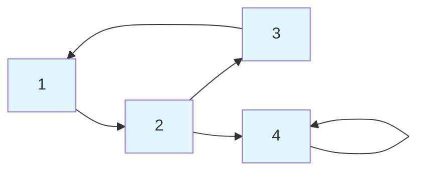
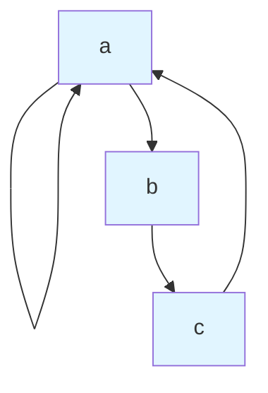

# Representing Relations

## Why Representations Matter

Relations can be represented in multiple ways, each with advantages:
- **Set of pairs**: Precise, good for proofs
- **Matrix**: Easy to check properties, good for computation
- **Directed graph**: Visual, good for intuition

## Set of Ordered Pairs

The most direct representation: list all pairs (a, b) where aRb.

### Example

A = {1, 2, 3}, R defined by "less than"

R = {(1, 2), (1, 3), (2, 3)}

### Advantages
- Precise and unambiguous
- Easy to check membership: is (a, b) ∈ R?

### Disadvantages
- Can be large (up to |A|² pairs)
- Hard to visualize patterns

## Matrix Representation

Represent $R$ as a **Boolean matrix** (0-1 matrix) $M_R$ where:

$$M_R[i][j] = \begin{cases} 1 & \text{if } (a_i, a_j) \in R \\ 0 & \text{otherwise} \end{cases}$$

### Example

$A = \{1, 2, 3\}$, $R = \{(1, 1), (1, 2), (2, 3), (3, 3)\}$

Label rows and columns with elements of A:

```
    1  2  3
  ┌─────────┐
1 │ 1  1  0 │
2 │ 0  0  1 │
3 │ 0  0  1 │
  └─────────┘
```

Row i, column j has 1 if (i, j) ∈ R.

### Reading Properties from Matrix

**Reflexive:** Main diagonal is all 1s
```
    1  2  3
  ┌─────────┐
1 │[1] .  . │
2 │ . [1] . │
3 │ .  . [1]│
  └─────────┘
```

**Irreflexive:** Main diagonal is all 0s

**Symmetric:** Matrix equals its transpose $(M = M^T)$
```
    1  2  3        1  2  3
  ┌─────────┐    ┌─────────┐
1 │ 1  1  0 │ =  │ 1  1  0 │
2 │ 1  0  1 │    │ 1  0  1 │
3 │ 0  1  1 │    │ 0  1  1 │
  └─────────┘    └─────────┘
```

**Antisymmetric:** If $M[i][j] = 1$ and $M[j][i] = 1$, then $i = j$
(No symmetric 1s off the diagonal)

**Transitive:** More complex—requires matrix multiplication

### Matrix Operations

**Union:** $M_{R\cup S} = M_R \lor M_S$ (element-wise OR)

**Intersection:** $M_{R\cap S} = M_R \land M_S$ (element-wise AND)

**Complement:** $M_{\overline{R}}$ has 1s where $M_R$ has 0s and vice versa

**Composition:** $M_{S\circ R} = M_R \cdot M_S$ (Boolean matrix multiplication)
- Use OR instead of addition
- Use AND instead of multiplication

## Directed Graph (Digraph) Representation

Represent $R$ as a **directed graph**:
- **Vertices**: Elements of $A$
- **Edges**: Directed edge from $a$ to $b$ if $(a, b) \in R$

### Example

$A = \{1, 2, 3, 4\}$, $R = \{(1, 2), (2, 3), (3, 1), (2, 4), (4, 4)\}$



### Reading Properties from Digraph

**Reflexive:** Every vertex has a self-loop

**Irreflexive:** No vertex has a self-loop

**Symmetric:** Every edge has a reverse edge (bidirectional)

**Antisymmetric:** No bidirectional edges (except possibly self-loops)

**Transitive:** If there's a path from a to b to c, there's a direct edge from a to c

## Converting Between Representations

### Pairs → Matrix

For each (a, b) ∈ R, set M[a][b] = 1.

### Matrix → Pairs

For each M[i][j] = 1, add (a_i, a_j) to R.

### Pairs → Digraph

For each (a, b) ∈ R, draw an edge from a to b.

### Digraph → Pairs

For each edge from a to b, add (a, b) to R.

## Example: Complete Conversion

Let $A = \{a, b, c\}$ and $R = \{(a, a), (a, b), (b, c), (c, a)\}$

**As pairs:** $R = \{(a, a), (a, b), (b, c), (c, a)\}$

**As matrix:**
```
      a  b  c
    ┌─────────┐
  a │ 1  1  0 │
  b │ 0  0  1 │
  c │ 1  0  0 │
    └─────────┘
```

**As digraph:**


**Properties analysis:**
- Reflexive? No ($(b,b)$ and $(c,c)$ missing)
- Irreflexive? No ($(a,a)$ exists)
- Symmetric? No ($(a,b)$ exists but not $(b,a)$)
- Antisymmetric? $(a,a)$ is only case where both directions exist, and $a=a$ $\checkmark$
- Transitive? $(a,b)$ and $(b,c)$ but $(a,c)$ missing $\to$ No

## Adjacency List Representation

For each element $a \in A$, list all elements $b$ where $(a, b) \in R$.

### Example

$R = \{(1, 2), (1, 3), (2, 3), (3, 1)\}$

```
1 → [2, 3]
2 → [3]
3 → [1]
```

### Advantages
- Space-efficient for sparse relations
- Easy to find all elements related to a given element
- Common in programming implementations

## Choosing a Representation

| Representation | Best For |
|----------------|----------|
| Pairs | Proofs, small relations |
| Matrix | Checking properties, composition |
| Digraph | Visualization, intuition |
| Adjacency list | Programming, sparse relations |

## Summary

Three main representations:
1. **Set of pairs**: $R = \{(a_1, b_1), (a_2, b_2), \ldots\}$
2. **Matrix**: $M[i][j] = 1$ iff $(a_i, a_j) \in R$
3. **Digraph**: Vertices for elements, directed edges for pairs

Property indicators:
- Reflexive: diagonal 1s / self-loops
- Symmetric: $M = M^T$ / bidirectional edges
- Transitive: paths imply direct edges

Each representation offers different insights and is suited to different tasks.
