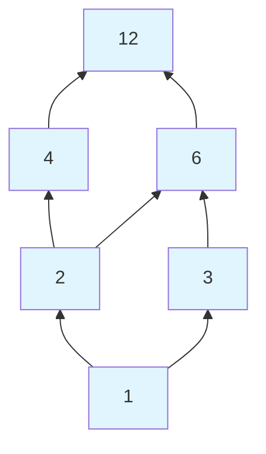
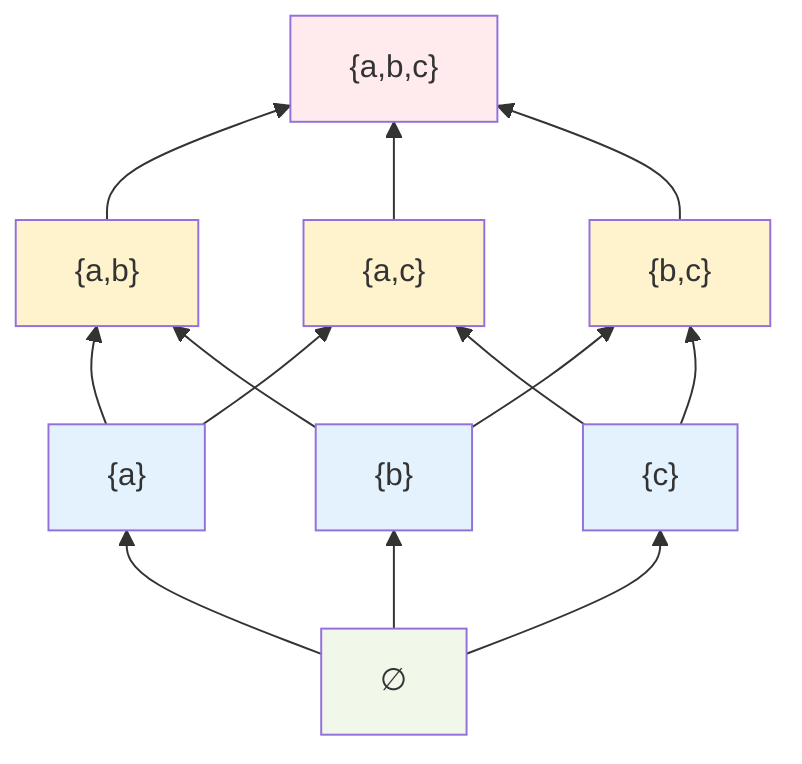

# Partial Orders

## Definition

A **partial order** (or **partial ordering**) on a set $A$ is a relation that is:
- **Reflexive**: $a \leq a$ for all $a \in A$
- **Antisymmetric**: $a \leq b$ and $b \leq a$ implies $a = b$
- **Transitive**: $a \leq b$ and $b \leq c$ implies $a \leq c$

A set with a partial order is called a **partially ordered set** or **poset**, written $(A, \leq)$.

## Partial vs. Total Orders

In a **partial order**, some elements may be **incomparable**—neither $a \leq b$ nor $b \leq a$ holds.

A **total order** (or linear order) is a partial order where every pair is comparable:
$$\forall a, b \in A: a \leq b \text{ or } b \leq a$$

## Examples

### Example 1: $\leq$ on Numbers (Total Order)

The usual $\leq$ on $\mathbb{R}$ (or $\mathbb{Z}$, $\mathbb{Q}$):
- Reflexive: $5 \leq 5$ $\checkmark$
- Antisymmetric: $3 \leq 5$ and $5 \leq 3$ is false, so no violation $\checkmark$
- Transitive: $2 \leq 4$ and $4 \leq 7$ implies $2 \leq 7$ $\checkmark$

This is a **total order**—any two numbers are comparable.

### Example 2: $\subseteq$ on Sets (Partial Order)

Subset relation on $\mathcal{P}(S)$ for some set $S$:
- Reflexive: $A \subseteq A$ $\checkmark$
- Antisymmetric: $A \subseteq B$ and $B \subseteq A$ implies $A = B$ $\checkmark$
- Transitive: $A \subseteq B$ and $B \subseteq C$ implies $A \subseteq C$ $\checkmark$

This is **not** a total order: $\{1, 2\}$ and $\{2, 3\}$ are incomparable.

### Example 3: Divisibility on $\mathbb{Z}^+$ (Partial Order)

$a \mid b$ means $a$ divides $b$:
- Reflexive: $a \mid a$ $\checkmark$
- Antisymmetric: $a \mid b$ and $b \mid a$ implies $a = b$ (for positive integers) $\checkmark$
- Transitive: $a \mid b$ and $b \mid c$ implies $a \mid c$ $\checkmark$

Incomparable pairs: $2$ and $3$ (neither divides the other)

### Example 4: Lexicographic Order (Total Order)

Dictionary order on strings:
- "apple" < "banana" < "cherry"
- "ab" < "abc" < "abd"

This is a total order on strings over a finite alphabet.

## Strict Orders

A **strict partial order** is:
- **Irreflexive**: a ≮ a for all a
- **Antisymmetric**: (equivalent to asymmetric here)
- **Transitive**: a < b and b < c implies a < c

Examples: < on numbers, ⊂ (proper subset) on sets

**Relationship:** Given partial order ≤:
- Define < by: a < b if a ≤ b and a ≠ b
- Conversely, define ≤ from <: a ≤ b if a < b or a = b

## Terminology for Posets

Given poset (A, ≤):

### Comparable and Incomparable

- a and b are **comparable** if a ≤ b or b ≤ a
- a and b are **incomparable** if neither a ≤ b nor b ≤ a

### Covers

b **covers** a (written a ⋖ b) if:
- a < b, and
- There's no c with a < c < b

Covers are "immediate predecessors" in the order.

### Special Elements

**Minimal element:** m is minimal if there's no a with a < m
- Nothing is strictly below m

**Maximal element:** M is maximal if there's no a with M < a
- Nothing is strictly above M

**Minimum (least):** m is minimum if m ≤ a for all a ∈ A
- m is below everything (unique if exists)

**Maximum (greatest):** M is maximum if a ≤ M for all a ∈ A
- M is above everything (unique if exists)

### Example

Divisibility on {2, 3, 4, 6, 8, 12, 24}:

- Minimal: 2, 3 (nothing divides them except 1, which isn't in the set)
- Maximal: 24 (nothing in the set is divisible by 24 except 24)
- Minimum: none (2 and 3 are incomparable)
- Maximum: 24 (everything divides 24)

## Hasse Diagrams

A **Hasse diagram** visualizes a finite poset:
1. Draw elements as points
2. Draw a line upward from $a$ to $b$ if $b$ covers $a$
3. Omit reflexive loops and transitive edges

### Example: Divisibility on $\{1, 2, 3, 4, 6, 12\}$

Read: $2$ covers $1$, $6$ covers $2$ and $3$, $12$ covers $4$ and $6$, etc.

Transitivity is implied: $1 \to 2 \to 4$ shows $1 \leq 4$ without a direct line.

### Example: Power Set $\mathcal{P}(\{a, b, c\})$

Eight elements, ordered by $\subseteq$.

## Chains and Antichains

**Chain:** A subset where every pair is comparable (totally ordered subset)

**Antichain:** A subset where no two elements are comparable

### Example

In $\mathcal{P}(\{a, b, c\})$:
- Chain: $\{\emptyset, \{a\}, \{a, b\}, \{a, b, c\}\}$ ($\subseteq$-ordered)
- Antichain: $\{\{a\}, \{b\}, \{c\}\}$ (none is subset of another)

## Lattices

A poset is a **lattice** if every pair of elements has:
- A **least upper bound** (join, $\lor$)
- A **greatest lower bound** (meet, $\land$)

### Example: $\mathcal{P}(S)$ is a Lattice

For any sets $A, B \subseteq S$:
- $A \lor B = A \cup B$ (least upper bound)
- $A \land B = A \cap B$ (greatest lower bound)

### Example: Divisibility Lattice on $\{1, 2, 3, 6\}$

- $\text{lcm}(2, 3) = 6$ (join)
- $\gcd(2, 3) = 1$ (meet)

## Summary

**Partial order:** Reflexive + Antisymmetric + Transitive

**Total order:** Partial order where all pairs are comparable

**Key concepts:**
- Comparable vs. incomparable elements
- Minimal/maximal vs. minimum/maximum
- Covers and Hasse diagrams
- Chains and antichains

**Examples:**
- $\leq$ on numbers (total order)
- $\subseteq$ on sets (partial order)
- Divisibility $\mid$ (partial order)

Partial orders formalize hierarchical relationships and are essential in many areas of computer science (scheduling, dependencies) and mathematics.
