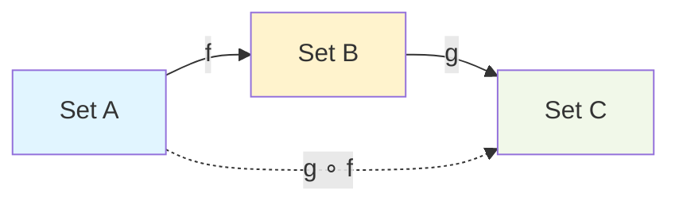
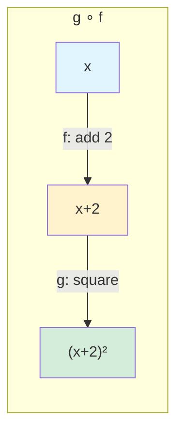
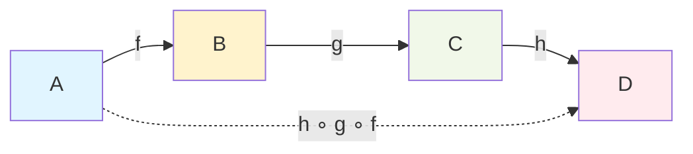
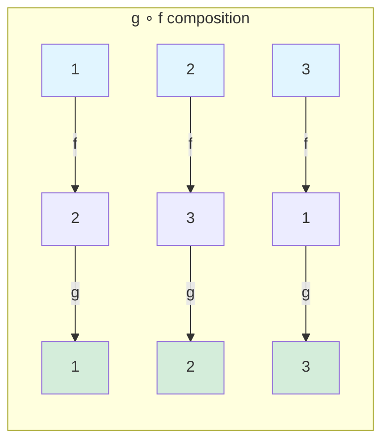
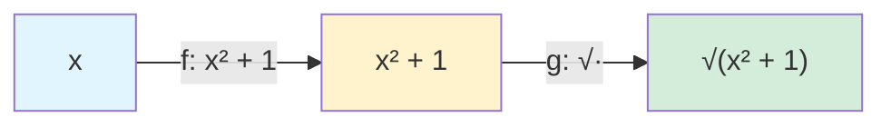
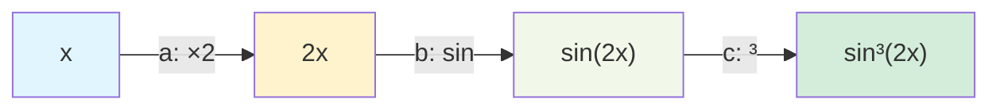

# Function Composition

## Definition

Given functions $f: A \to B$ and $g: B \to C$, the **composition** $g \circ f$ is a function from $A$ to $C$ defined by:

$$(g \circ f)(x) = g(f(x))$$

"Apply $f$ first, then apply $g$ to the result."



## Order of Operations

**Important:** $g \circ f$ means "f first, then g"—right to left!

Think of it as nested function calls: $g(f(x))$.

### Example

$f: \mathbb{R} \to \mathbb{R}$, $f(x) = x + 2$
$g: \mathbb{R} \to \mathbb{R}$, $g(x) = x^2$

$$(g \circ f)(x) = g(f(x)) = g(x + 2) = (x + 2)^2$$

$$(f \circ g)(x) = f(g(x)) = f(x^2) = x^2 + 2$$

Note: $g \circ f \neq f \circ g$ in general! Composition is NOT commutative.



## When Composition is Defined

$g \circ f$ is defined when the codomain of $f$ matches the domain of $g$:

$$f: A \to B \quad g: B \to C \quad \Rightarrow \quad g \circ f: A \to C$$

If $f: A \to B$ and $g: D \to C$ with $B \neq D$, then $g \circ f$ is not defined.

## Properties of Composition

### Associativity

For $f: A \to B$, $g: B \to C$, $h: C \to D$:

$$(h \circ g) \circ f = h \circ (g \circ f)$$

Both equal $h(g(f(x)))$.

So we can write $h \circ g \circ f$ without ambiguity.



### Identity Element

For the identity function $\text{id}_A: A \to A$, $\text{id}_A(x) = x$:

- $f \circ \text{id}_A = f$
- $\text{id}_B \circ f = f$

The identity function is neutral for composition.

### Non-Commutativity

In general, $f \circ g \neq g \circ f$.

Composition is NOT commutative (order matters!).

## Examples

### Linear Functions

$f(x) = 2x + 1$, $g(x) = 3x - 4$

$$(g \circ f)(x) = g(2x + 1) = 3(2x + 1) - 4 = 6x + 3 - 4 = 6x - 1$$

$$(f \circ g)(x) = f(3x - 4) = 2(3x - 4) + 1 = 6x - 8 + 1 = 6x - 7$$

### Trigonometric Functions

$f(x) = \sin(x)$, $g(x) = x^2$

$$(g \circ f)(x) = (\sin(x))^2 = \sin^2(x)$$

$$(f \circ g)(x) = \sin(x^2)$$

### Finite Functions

$A = \{1, 2, 3\}$, $f$ and $g$ defined by tables:

$f: f(1) = 2, f(2) = 3, f(3) = 1$
$g: g(1) = 3, g(2) = 1, g(3) = 2$

$(g \circ f)$:
- $(g \circ f)(1) = g(f(1)) = g(2) = 1$
- $(g \circ f)(2) = g(f(2)) = g(3) = 2$
- $(g \circ f)(3) = g(f(3)) = g(1) = 3$



## Composition and Function Properties

### Composition Preserves Injectivity

If f and g are both injective, then g ∘ f is injective.

**Proof:** Suppose (g ∘ f)(a) = (g ∘ f)(b).
Then g(f(a)) = g(f(b)).
Since g is injective, f(a) = f(b).
Since f is injective, a = b. ✓

### Composition Preserves Surjectivity

If f and g are both surjective, then g ∘ f is surjective.

**Proof:** Let c ∈ C.
Since g is surjective, ∃b ∈ B: g(b) = c.
Since f is surjective, ∃a ∈ A: f(a) = b.
Then (g ∘ f)(a) = g(f(a)) = g(b) = c. ✓

### Composition Preserves Bijectivity

If f and g are both bijective, then g ∘ f is bijective.

(Follows from the above two results.)

### Partial Converses

- If g ∘ f is injective, then f is injective (but g might not be)
- If g ∘ f is surjective, then g is surjective (but f might not be)

## Decomposing Functions

Many functions can be viewed as compositions of simpler functions.

### Example

$h(x) = \sqrt{x^2 + 1}$

Decompose: Let $f(x) = x^2 + 1$ and $g(x) = \sqrt{x}$.
Then $h = g \circ f$.



### Example

$h(x) = \sin^3(2x)$

Decompose:
- $a(x) = 2x$
- $b(x) = \sin(x)$
- $c(x) = x^3$

Then $h = c \circ b \circ a = c(b(a(x))) = (\sin(2x))^3$.



## Composition in Programming

Function composition is fundamental in functional programming:

```python
# Manual composition
def compose(g, f):
    return lambda x: g(f(x))

# Example
def double(x): return 2 * x
def add_one(x): return x + 1

double_then_add = compose(add_one, double)
print(double_then_add(3))  # add_one(double(3)) = add_one(6) = 7

# Chain of compositions
def square(x): return x * x
chain = compose(square, compose(add_one, double))
print(chain(3))  # square(add_one(double(3))) = square(7) = 49
```

### Pipe/Flow Pattern

Some languages reverse the order to be more readable:

```javascript
// With pipe: left to right
const result = pipe(3)
  .then(double)
  .then(addOne)
  .then(square);
// 3 → 6 → 7 → 49
```

## Iteration (Repeated Composition)

$f \circ f \circ f \circ \ldots$ ($n$ times) is denoted $f^n$.

### Example

$f(x) = x + 1$
- $f^1(x) = x + 1$
- $f^2(x) = f(f(x)) = (x + 1) + 1 = x + 2$
- $f^3(x) = x + 3$
- $f^n(x) = x + n$

### Example

$f(x) = 2x$
- $f^n(x) = 2^n x$

## Summary

**Composition:** $(g \circ f)(x) = g(f(x))$

**Key properties:**
- Associative: $(h \circ g) \circ f = h \circ (g \circ f)$
- NOT commutative: $g \circ f \neq f \circ g$ generally
- Identity is neutral: $f \circ \text{id} = \text{id} \circ f = f$

**Preserves properties:**
- Injective $\circ$ Injective = Injective
- Surjective $\circ$ Surjective = Surjective
- Bijective $\circ$ Bijective = Bijective

**Applications:**
- Decomposing complex functions
- Functional programming
- Understanding inverse: $(g \circ f)^{-1} = f^{-1} \circ g^{-1}$
