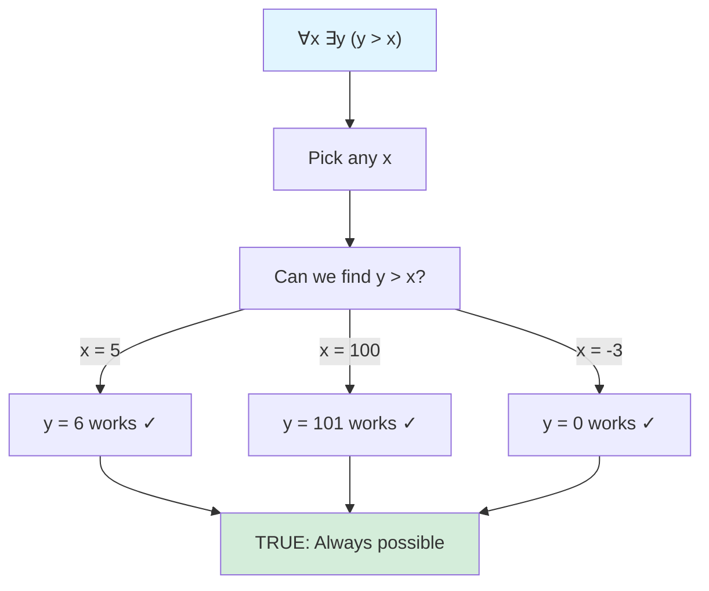
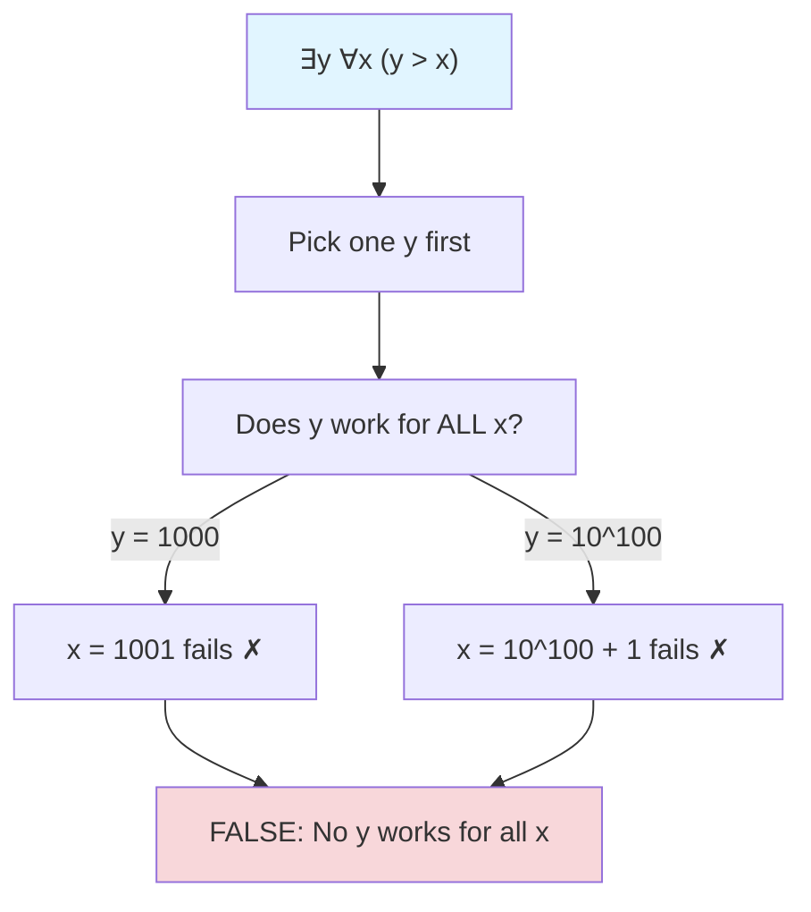
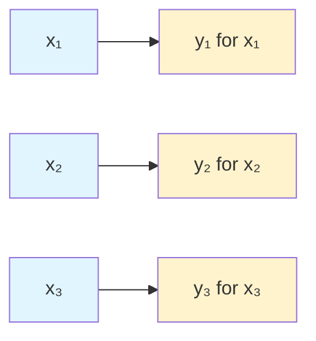
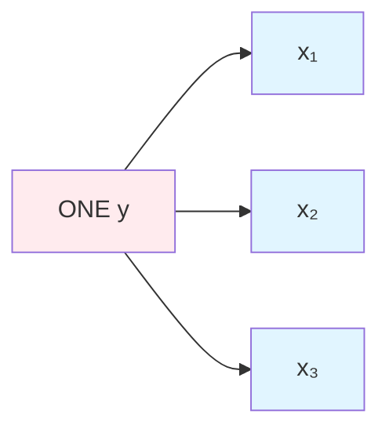
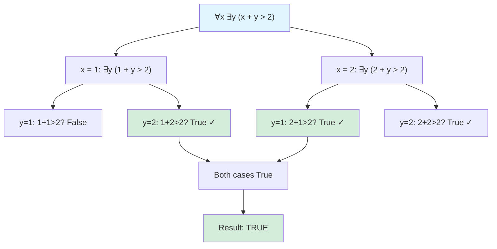
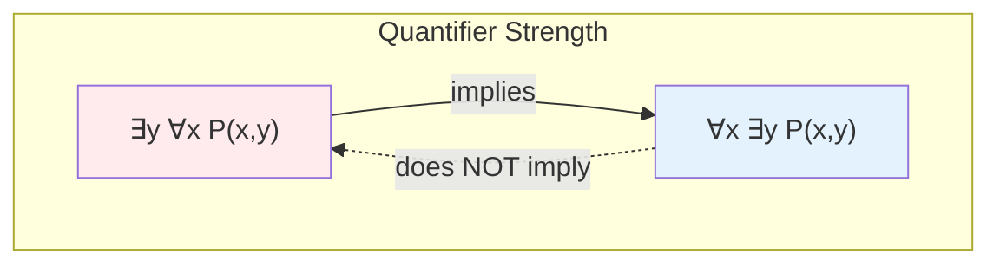

# Nested Quantifiers

## When One Quantifier Isn't Enough

Many mathematical statements require multiple quantifiers. These are called **nested quantifiers**.

$$\forall x \, \exists y \, P(x, y)$$

$$\exists y \, \forall x \, P(x, y)$$

## Order Matters!

The order of quantifiers fundamentally changes the meaning:

$$\forall x \, \exists y \, P(x, y) \quad \not\equiv \quad \exists y \, \forall x \, P(x, y)$$

### Example: "$y$ is greater than $x$"

Let $P(x, y)$ mean "$y > x$" over real numbers.

**$\forall x \, \exists y \, (y > x)$**: "For every $x$, there exists a $y$ greater than $x$."
- TRUE: Given any number, we can find a larger one.
- The $y$ depends on which $x$ we pick.

**$\exists y \, \forall x \, (y > x)$**: "There exists a $y$ greater than all $x$."
- FALSE: No single number is larger than every real number.
- One fixed $y$ must work for all $x$ simultaneously.

## Reading Nested Quantifiers

Read from left to right, treating outer quantifiers first:

$$\forall x \, \exists y \, P(x, y)$$

1. "For all x..." (pick any x)
2. "...there exists y..." (we can find a y, possibly depending on x)
3. "...such that P(x, y)" (the predicate holds)

The inner quantifier's choice can depend on outer variables.

## Same Quantifier Types

### All Universal: ∀x ∀y

$$\forall x \, \forall y \, P(x, y)$$

P must hold for ALL combinations of x and y.

**Order doesn't matter**: ∀x ∀y P(x,y) ≡ ∀y ∀x P(x,y)

Example: "Addition is commutative"
$$\forall x \, \forall y \, (x + y = y + x)$$

### All Existential: ∃x ∃y

$$\exists x \, \exists y \, P(x, y)$$

There exist SOME x and SOME y making P true.

**Order doesn't matter**: ∃x ∃y P(x,y) ≡ ∃y ∃x P(x,y)

Example: "Some numbers sum to 10"
$$\exists x \, \exists y \, (x + y = 10)$$

## Mixed Quantifiers: Order Critical

### ∀x ∃y vs ∃y ∀x

These are fundamentally different:

| Statement | Meaning | Dependency |
|-----------|---------|------------|
| ∀x ∃y P(x,y) | For each x, some y works | y can depend on x |
| ∃y ∀x P(x,y) | One y works for all x | y is fixed first |

**∃y ∀x implies ∀x ∃y** (but not conversely):
- If one y works for all x, then for each x, that y works.
- But having different y's for different x's doesn't give one universal y.

### Dependency Diagrams

$\forall x \, \exists y \, P(x,y)$:

Each $x$ can have its own $y$.

$\exists y \, \forall x \, P(x,y)$:

One fixed $y$ must work for ALL $x$.

## Classic Examples

### "Everyone has a mother" vs "Someone is everyone's mother"

Let M(x, y) mean "y is x's mother"

**∀x ∃y M(x, y)**: "Everyone has a mother."
- TRUE: Each person has some mother (different mothers for different people).

**∃y ∀x M(x, y)**: "Someone is everyone's mother."
- FALSE: No one person is mother to all humans.

### "Every lock has a key" vs "A master key exists"

Let Opens(k, l) mean "key k opens lock l"

**∀l ∃k Opens(k, l)**: "Every lock has a key that opens it."
- Different keys for different locks.

**∃k ∀l Opens(k, l)**: "Some key opens all locks."
- A single master key.

### Function Properties

**∀x ∃y (f(x) = y)**: "f is defined everywhere" (total function)

**∃y ∀x (f(x) = y)**: "f is constant" (same output for all inputs)

## Three or More Quantifiers

The same principles extend:

$$\forall x \, \exists y \, \forall z \, P(x, y, z)$$

Read: "For all x, there exists y (depending on x), such that for all z, P(x,y,z) holds."

### Example: Limits

The ε-δ definition of limit involves multiple quantifiers:

$$\forall \epsilon > 0 \, \exists \delta > 0 \, \forall x \, (0 < |x-a| < \delta \to |f(x)-L| < \epsilon)$$

- For any tolerance ε we want...
- We can find a window δ (depending on ε)...
- Such that all x in that window give f(x) within ε of L.

## Evaluating Over Finite Domains

For finite domains, nested quantifiers can be expanded:

Domain: $\{1, 2\}$

$$\forall x \, \exists y \, (x + y > 2)$$

Expands to:
$$[\exists y \, (1 + y > 2)] \land [\exists y \, (2 + y > 2)]$$
$$[(1+1>2) \lor (1+2>2)] \land [(2+1>2) \lor (2+2>2)]$$
$$[\text{False} \lor \text{True}] \land [\text{True} \lor \text{True}]$$
$$\text{True} \land \text{True} = \text{True}$$

## Negating Nested Quantifiers

Apply negation rules from left to right:

$$\neg(\forall x \, \exists y \, P(x,y)) \equiv \exists x \, \forall y \, \neg P(x,y)$$

$$\neg(\exists x \, \forall y \, P(x,y)) \equiv \forall x \, \exists y \, \neg P(x,y)$$

### Example

Original: "Every student passed some exam"
$$\forall s \, \exists e \, \text{Passed}(s, e)$$

Negation: "Some student failed all exams"
$$\exists s \, \forall e \, \neg\text{Passed}(s, e)$$

## Scope and Free Variables

In ∀x ∃y P(x, y), both x and y are **bound** (captured by quantifiers).

The scope of each quantifier extends to its right:
- ∀x binds x in the expression "∃y P(x, y)"
- ∃y binds y in P(x, y)

### Variable Independence

When quantifiers don't share variables, they can often be reordered:

$$\forall x \, P(x) \land \exists y \, Q(y) \equiv \exists y \, Q(y) \land \forall x \, P(x)$$

But when the inner formula involves both variables, order matters!

## Summary

**Key principle:** Quantifier order matters for mixed quantifiers.

**$\forall x \, \exists y \, P(x,y)$:**
- "For each $x$, some $y$ works"
- $y$ can depend on $x$
- Generally weaker claim

**$\exists y \, \forall x \, P(x,y)$:**
- "One $y$ works for all $x$"
- $y$ is chosen first, independently
- Generally stronger claim

**Same quantifier types can swap:**
- $\forall x \, \forall y \equiv \forall y \, \forall x$
- $\exists x \, \exists y \equiv \exists y \, \exists x$

**Reading strategy:**
- Parse left to right
- Inner choices can depend on outer choices
- Think about who gets to choose first

