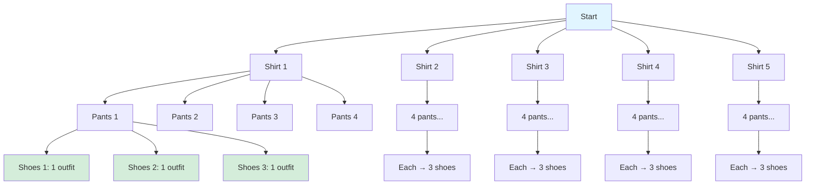
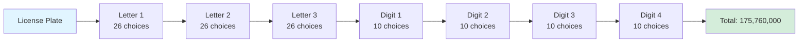

# Fundamental Counting Principles

The foundation of combinatorics rests on two fundamental principles that govern how we count arrangements and selections. These principles are deceptively simple yet form the basis for solving complex counting problems.

## The Addition Principle (Rule of Sum)

If task A can be done in m ways and task B can be done in n ways, and these tasks cannot be done simultaneously, then doing either A or B can be done in m + n ways.

**Key insight**: The addition principle applies when we have mutually exclusive choices—we're choosing one option OR another.

### Example: Restaurant Menu

A menu offers:
- 4 appetizers
- 6 main courses
- 3 desserts

If you can only order one item, you have 4 + 6 + 3 = 13 choices.

### Formal Statement

For finite disjoint sets A₁, A₂, ..., Aₙ:

|A₁ ∪ A₂ ∪ ... ∪ Aₙ| = |A₁| + |A₂| + ... + |Aₙ|

This only works when the sets don't overlap (disjoint). If sets overlap, we need inclusion-exclusion.

## The Multiplication Principle (Rule of Product)

If task A can be done in $m$ ways and task B can be done in $n$ ways, then doing both A and B can be done in $m \times n$ ways.

**Key insight**: The multiplication principle applies when we're making a sequence of independent choices—doing one thing AND another.

### Example: Outfit Selection

You have:
- 5 shirts
- 4 pants
- 3 pairs of shoes

Total outfit combinations: $5 \times 4 \times 3 = 60$

### Sequential Decisions

The multiplication principle extends naturally to any sequence of decisions:

$$\text{Total outcomes} = (\text{choices}_1) \times (\text{choices}_2) \times \cdots \times (\text{choices}_n)$$

**License plate example**: 3 letters followed by 4 digits
- Letters: $26 \times 26 \times 26 = 17,576$
- Digits: $10 \times 10 \times 10 \times 10 = 10,000$
- Total: $17,576 \times 10,000 = 175,760,000$ plates

## Combining the Principles

Real problems often require both principles together.

### Example: Computer Passwords

A password must be either:
- 6 lowercase letters, OR
- 4 digits followed by 2 uppercase letters

**Case 1**: 6 lowercase letters
$$26^6 = 308,915,776$$

**Case 2**: 4 digits + 2 uppercase
$$10^4 \times 26^2 = 6,760,000$$

**Total** (addition principle): $308,915,776 + 6,760,000 = 315,675,776$

## The Subtraction Principle

Sometimes it's easier to count what we don't want and subtract from the total.

$$|A| = |U| - |\overline{A}|$$

Where $U$ is the universal set and $\overline{A}$ is the complement of $A$.

### Example: Non-zero Digits

How many 4-digit numbers have at least one zero?

**Direct counting**: Complex (zero in position 1, 2, 3, or 4 with overlaps)

**Subtraction approach**:
- Total 4-digit numbers: $9 \times 10 \times 10 \times 10 = 9,000$ (first digit can't be 0)
- Numbers with no zeros: $9 \times 9 \times 9 \times 9 = 6,561$
- At least one zero: $9,000 - 6,561 = 2,439$

## The Division Principle

When counting arrangements that have been overcounted by some factor k, divide by k.

### Example: Circular Arrangements

How many ways to arrange 5 people around a circular table?

Linear arrangements: 5! = 120

But in a circle, rotating everyone by one position gives the "same" arrangement.
Each unique circular arrangement was counted 5 times (one for each starting position).

Circular arrangements: 5!/5 = 4! = 24

**General formula**: (n-1)! circular arrangements of n objects

## Bijection Principle

If there's a one-to-one correspondence between sets A and B, then |A| = |B|.

This allows us to count a complicated set by finding a simpler set with the same size.

### Example: Binary Strings and Subsets

The number of n-bit binary strings equals the number of subsets of an n-element set.

- 3-bit strings: 000, 001, 010, 011, 100, 101, 110, 111 → 8 strings
- Subsets of {a,b,c}: ∅, {c}, {b}, {b,c}, {a}, {a,c}, {a,b}, {a,b,c} → 8 subsets

Each bit position i corresponds to whether element i is in the subset.

Both equal 2ⁿ.

## Problem-Solving Strategy

1. **Identify the structure**: Is it OR (addition) or AND (multiplication)?
2. **Check for independence**: Can choices be made independently?
3. **Look for overcounting**: Will some arrangements be counted multiple times?
4. **Consider complement**: Is "not X" easier to count than "X"?
5. **Find bijections**: Is there a simpler equivalent problem?

## Common Pitfalls

**Dependent choices**: The multiplication principle requires independence. If shirt color affects available pants (matching constraints), simple multiplication fails.

**Overlapping cases**: The addition principle requires disjoint sets. "Ends with 0 OR is divisible by 5" overcounts numbers ending in 0.

**Order matters vs. doesn't**: Choosing 3 toppings for a pizza (order doesn't matter) differs from ranking 3 contestants (order matters).
