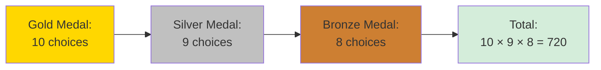
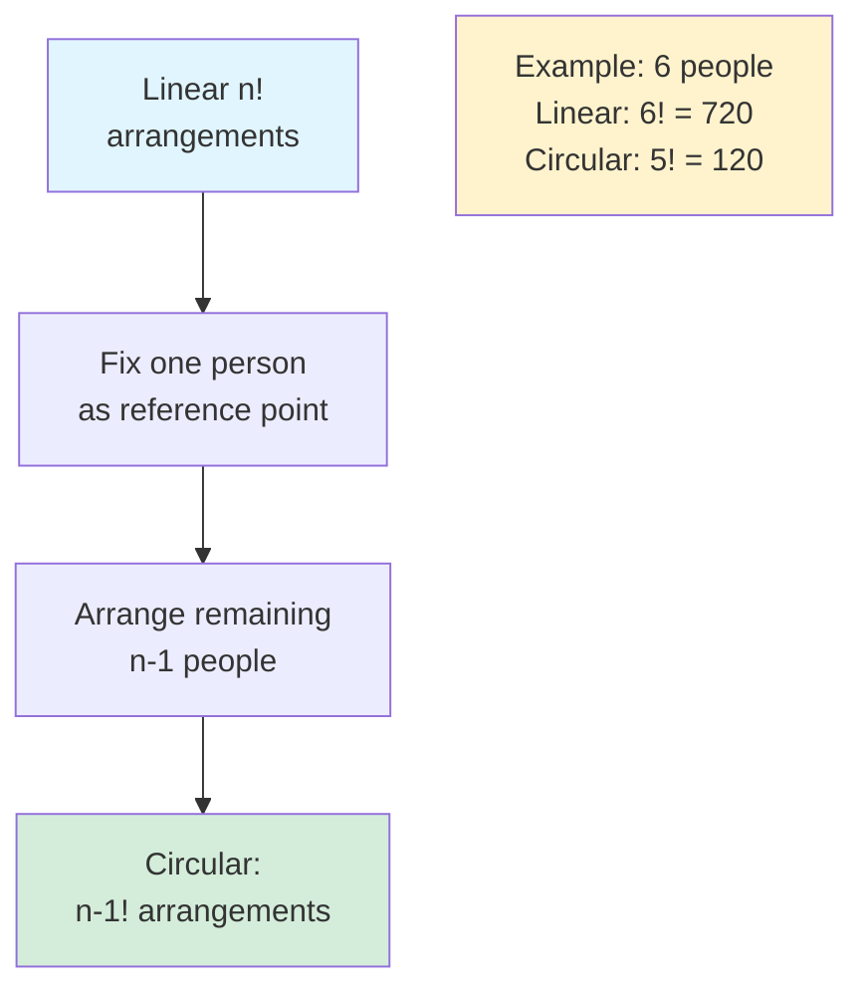

# Permutations

A permutation is an arrangement of objects where order matters. Permutations answer questions like "How many ways can we arrange, order, or sequence items?"

## Permutations of n Distinct Objects

The number of ways to arrange $n$ distinct objects in a line is $n!$ (n factorial).

$$n! = n \times (n-1) \times (n-2) \times \cdots \times 2 \times 1$$

**Why?** For the first position, we have $n$ choices. For the second, $n-1$ remain. And so on.


### Example: Book Arrangement

How many ways to arrange 5 different books on a shelf?

$$5! = 5 \times 4 \times 3 \times 2 \times 1 = 120 \text{ arrangements}$$

### Important Factorial Values

| n | n! |
|---|-----|
| 0 | 1 |
| 1 | 1 |
| 5 | 120 |
| 10 | 3,628,800 |
| 20 | ≈ 2.4 × 10¹⁸ |

Note: 0! = 1 by convention (there's exactly one way to arrange nothing).

## k-Permutations: Arranging k Objects from n

When selecting and arranging $k$ objects from $n$ distinct objects, we use $P(n,k)$ or $_nP_k$:

$$P(n,k) = \frac{n!}{(n-k)!} = n \times (n-1) \times \cdots \times (n-k+1)$$

This is "n falling factorial to k terms."

### Example: Race Medals

10 runners compete. How many ways to award gold, silver, bronze?

$$P(10,3) = 10 \times 9 \times 8 = 720$$

We're choosing 3 from 10 AND the order (1st, 2nd, 3rd) matters.



### Derivation

- Position 1: $n$ choices
- Position 2: $n-1$ choices
- ...
- Position $k$: $n-k+1$ choices

Total: $n \times (n-1) \times \cdots \times (n-k+1) = \frac{n!}{(n-k)!}$

## Permutations with Repetition

When we can reuse objects (repetition allowed), each of k positions has n choices:

```
n^k = n × n × ... × n (k times)
```

### Example: PIN Codes

A 4-digit PIN using digits 0-9 (repetition allowed):

10⁴ = 10,000 possible PINs

### Example: DNA Sequences

A DNA strand of length 8 using bases {A, T, G, C}:

4⁸ = 65,536 possible sequences

## Permutations with Indistinguishable Objects

When some objects are identical, we divide to avoid overcounting.

For $n$ objects where there are $n_1$ of type 1, $n_2$ of type 2, etc.:

$$\frac{n!}{n_1! \times n_2! \times \cdots \times n_k!}$$

This is called a **multinomial coefficient**.

### Example: MISSISSIPPI

How many distinct arrangements of MISSISSIPPI?

Letters: M(1), I(4), S(4), P(2)
Total: 11 letters

$$\text{Arrangements} = \frac{11!}{1! \times 4! \times 4! \times 2!} = \frac{39,916,800}{1,152} = 34,650$$

### Why Divide?

If all S's were distinct ($S_1, S_2, S_3, S_4$), we'd have $4! = 24$ arrangements that look identical when S's are indistinguishable. Same logic for I's ($4!$) and P's ($2!$).

## Circular Permutations

Arrangements around a circle where only relative positions matter.

For $n$ distinct objects in a circle:

$$(n-1)!$$



### Example: Round Table

Seating 6 people around a circular table:

$$(6-1)! = 5! = 120 \text{ arrangements}$$

**Why $n-1$?** We can "fix" one person's position as a reference point. The remaining $n-1$ people can be arranged in $(n-1)!$ ways.

### Circular with Reflections

If the table can be flipped (like a bracelet vs. a necklace), arrangements that are mirror images count as one:

$$\frac{(n-1)!}{2}$$

## Restricted Permutations

### Objects Must Be Together

Treat the group as a single "super-object."

**Example**: Arrange ABCDE so that A and B are adjacent.

1. Treat AB as one unit: {AB, C, D, E} → 4! = 24 arrangements
2. A and B can swap within the unit: 2! = 2 ways
3. Total: 24 × 2 = 48

### Objects Must Not Be Adjacent

Use complement: Total - (together arrangements)

**Example**: Arrange ABCDE so A and B are NOT adjacent.

- Total arrangements: 5! = 120
- A and B adjacent: 48 (from above)
- Not adjacent: 120 - 48 = 72

### Fixed Position Constraints

**Example**: Arrange 1,2,3,4,5 so that 1 is not first and 5 is not last.

Using inclusion-exclusion:
- Total: 5! = 120
- 1 is first: 4! = 24
- 5 is last: 4! = 24
- 1 first AND 5 last: 3! = 6
- Neither: 120 - 24 - 24 + 6 = 78

## Derangements

A derangement is a permutation where no object appears in its original position.

The number of derangements of n objects is:

```
D(n) = n! × (1 - 1/1! + 1/2! - 1/3! + ... + (-1)ⁿ/n!)
```

Or recursively: D(n) = (n-1)(D(n-1) + D(n-2)) with D(1) = 0, D(2) = 1

### Example Values

| n | D(n) | D(n)/n! |
|---|------|---------|
| 2 | 1 | 0.5 |
| 3 | 2 | 0.333 |
| 4 | 9 | 0.375 |
| 5 | 44 | 0.367 |

As n → ∞, D(n)/n! → 1/e ≈ 0.368

**Classic problem**: n people put hats in a pile. Each randomly picks one. Probability no one gets their own hat ≈ 1/e.
