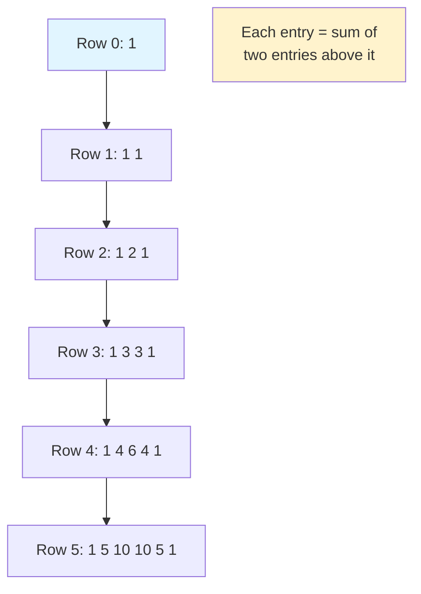
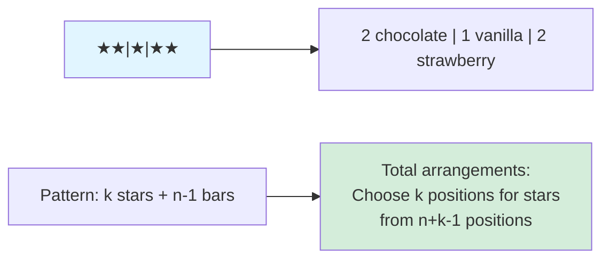

# Combinations

A combination is a selection of objects where order does not matter. While permutations count arrangements, combinations count groups or subsets.

## Basic Combinations

The number of ways to choose $k$ objects from $n$ distinct objects (order doesn't matter) is:

$$\binom{n}{k} = C(n,k) = \frac{n!}{k!(n-k)!}$$

Also written as $_nC_k$ or "n choose k."

### Derivation from Permutations

$P(n,k)$ counts ordered selections: pick $k$ from $n$ AND arrange them.
$C(n,k)$ counts unordered selections: just pick $k$ from $n$.

Since $k$ objects can be arranged in $k!$ ways:

$$P(n,k) = C(n,k) \times k!$$
$$C(n,k) = \frac{P(n,k)}{k!} = \frac{n!}{k!(n-k)!}$$

### Example: Committee Selection

Choose a 3-person committee from 10 candidates.

$$C(10,3) = \frac{10!}{3! \times 7!} = \frac{10 \times 9 \times 8}{3 \times 2 \times 1} = \frac{720}{6} = 120 \text{ committees}$$

Order doesn't matter: $\{\text{Alice, Bob, Carol}\}$ is the same committee as $\{\text{Carol, Alice, Bob}\}$.

## Properties of Binomial Coefficients

### Symmetry

$$\binom{n}{k} = \binom{n}{n-k}$$

Choosing $k$ items to include is equivalent to choosing $n-k$ items to exclude.

Example: $\binom{10}{3} = \binom{10}{7} = 120$

### Pascal's Identity

$$\binom{n}{k} = \binom{n-1}{k-1} + \binom{n-1}{k}$$

**Interpretation**: Consider a specific element. Either:
- Include it: choose remaining $k-1$ from $n-1$ others → $\binom{n-1}{k-1}$
- Exclude it: choose all $k$ from $n-1$ others → $\binom{n-1}{k}$

**Pascal's Triangle visualization:**


### Sum of Row

$$\sum_{k=0}^{n} \binom{n}{k} = 2^n$$

The total number of subsets of an $n$-element set is $2^n$.

### Hockey Stick Identity

$$\sum_{i=r}^{n} \binom{i}{r} = \binom{n+1}{r+1}$$

Useful for summing diagonals in Pascal's triangle.

## Pascal's Triangle

```
          1
         1 1
        1 2 1
       1 3 3 1
      1 4 6 4 1
     1 5 10 10 5 1
```

Row n contains C(n,0), C(n,1), ..., C(n,n).

Each entry is the sum of the two entries above it (Pascal's identity).

## Combinations with Repetition

When choosing $k$ items from $n$ types where repetition is allowed (multisets):

$$\binom{n+k-1}{k} = \binom{n+k-1}{n-1}$$

Also called "stars and bars" or "multichoose."

### Example: Distributing Donuts

Choose 5 donuts from 3 flavors (chocolate, vanilla, strawberry).

This is choosing with repetition: $\binom{3+5-1}{5} = \binom{7}{5} = 21$ ways.

### Stars and Bars Visualization

Represent $k$ items as stars ($\star$) and use $n-1$ bars ($|$) to separate types.

**Example:** 5 donuts from 3 flavors



Total arrangements of 5 stars and 2 bars: $\binom{7}{2} = \binom{7}{5} = 21$.

## Restricted Combinations

### At Least / At Most Constraints

**Example**: From 10 men and 8 women, form a committee of 5 with at least 2 women.

Cases:
- 2 women, 3 men: C(8,2) × C(10,3) = 28 × 120 = 3,360
- 3 women, 2 men: C(8,3) × C(10,2) = 56 × 45 = 2,520
- 4 women, 1 man: C(8,4) × C(10,1) = 70 × 10 = 700
- 5 women, 0 men: C(8,5) × C(10,0) = 56 × 1 = 56

Total: 3,360 + 2,520 + 700 + 56 = 6,636

### Specific Element Inclusion/Exclusion

**Must include Alice**:
- Fix Alice in the group
- Choose remaining k-1 from n-1 others
- Answer: C(n-1, k-1)

**Must exclude Bob**:
- Choose all k from n-1 remaining
- Answer: C(n-1, k)

## The Binomial Theorem

The binomial coefficients appear in polynomial expansion:

$$(x + y)^n = \sum_{k=0}^{n} \binom{n}{k} x^{n-k} y^k$$

### Example: $(x + y)^4$

$$= \binom{4}{0}x^4 + \binom{4}{1}x^3y + \binom{4}{2}x^2y^2 + \binom{4}{3}xy^3 + \binom{4}{4}y^4$$

$$= x^4 + 4x^3y + 6x^2y^2 + 4xy^3 + y^4$$

### Applications

**Counting**: Set $x = y = 1$:

$$(1+1)^n = \sum_{k=0}^{n} \binom{n}{k} = 2^n$$

**Alternating sum**: Set $x = 1, y = -1$:

$$(1-1)^n = 0 = \sum_{k=0}^{n} (-1)^k \binom{n}{k}$$

So: $\binom{n}{0} + \binom{n}{2} + \binom{n}{4} + \cdots = \binom{n}{1} + \binom{n}{3} + \binom{n}{5} + \cdots$

Even subsets equal odd subsets: each $= 2^{n-1}$.

## Multinomial Coefficients

Generalization to dividing n objects into groups of sizes k₁, k₂, ..., kᵣ:

```
(n; k₁,k₂,...,kᵣ) = n! / (k₁! × k₂! × ... × kᵣ!)
```

where k₁ + k₂ + ... + kᵣ = n.

### Example: Team Division

Divide 12 players into teams of 5, 4, and 3.

12!/(5!×4!×3!) = 479,001,600/(120×24×6) = 27,720 ways

### Multinomial Theorem

```
(x₁ + x₂ + ... + xᵣ)ⁿ = Σ (n; k₁,...,kᵣ) × x₁^k₁ × ... × xᵣ^kᵣ
```

Sum is over all non-negative integer solutions to k₁ + ... + kᵣ = n.

## Computational Tips

**Avoid overflow**: Compute C(n,k) iteratively:

```
C(n,k) = (n/1) × ((n-1)/2) × ... × ((n-k+1)/k)
```

**Use symmetry**: C(100,98) = C(100,2) = 4,950 (much easier).

**Cancellation**: C(20,3) = (20×19×18)/(3×2×1). Cancel before multiplying.
