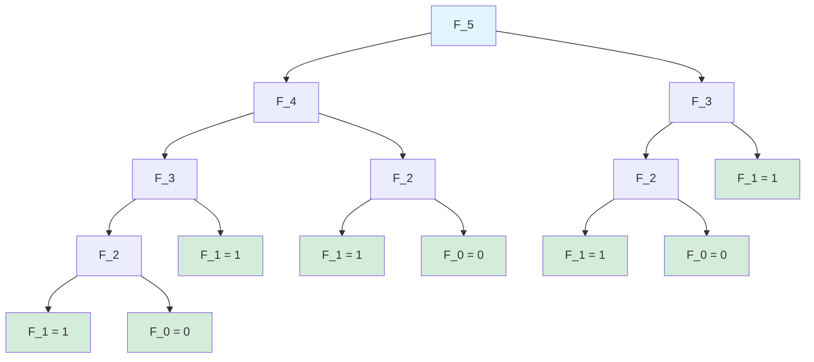
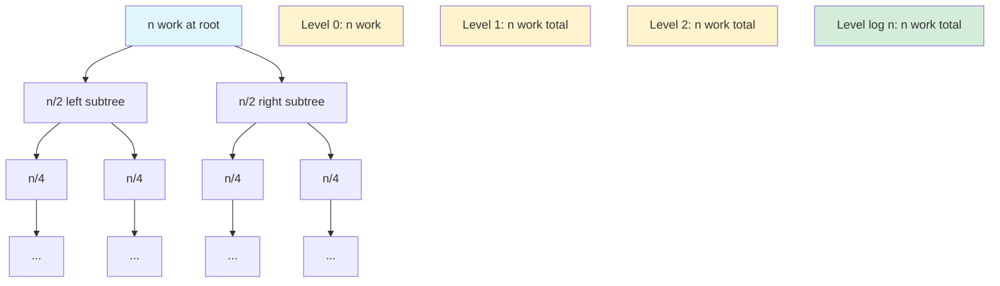

# Introduction to Recurrence Relations

A recurrence relation defines a sequence where each term is expressed in terms of previous terms. They appear throughout computer science in algorithm analysis, combinatorics, and modeling recursive processes.

## What is a Recurrence Relation?

A recurrence relation consists of:
1. **A rule** expressing $a_n$ in terms of earlier terms $a_0, a_1, \ldots, a_{n-1}$
2. **Initial conditions** specifying enough early terms to start the sequence

### Example: Factorial

$$n! = n \times (n-1)!$$
$$0! = 1$$

This defines: $1, 1, 2, 6, 24, 120, \ldots$

### Example: Fibonacci

$$F_n = F_{n-1} + F_{n-2}$$
$$F_0 = 0, F_1 = 1$$

This defines: $0, 1, 1, 2, 3, 5, 8, 13, 21, \ldots$

**Dependency tree for $F_5$:**


Notice the exponential growth - this is why naive recursive Fibonacci is $O(2^n)$!

## Terminology

**Order**: The "gap" between the highest and lowest index terms.
- Fₙ = Fₙ₋₁ + Fₙ₋₂ is order 2 (uses n-1 and n-2)
- aₙ = 3aₙ₋₁ is order 1

**Linear**: Each term appears with degree 1 (no products like aₙ₋₁ × aₙ₋₂).

**Homogeneous**: No constant or non-recurrence terms.
- aₙ = 2aₙ₋₁ + 3aₙ₋₂ (homogeneous)
- aₙ = 2aₙ₋₁ + 5 (non-homogeneous)

**Constant coefficients**: Coefficients don't depend on n.
- aₙ = 3aₙ₋₁ + 2aₙ₋₂ (constant coefficients)
- aₙ = naₙ₋₁ (variable coefficient)

## Solving by Iteration (Unrolling)

For simple recurrences, repeatedly substitute until a pattern emerges.

### Example: aₙ = 2aₙ₋₁, a₀ = 3

```
a₁ = 2a₀ = 2·3 = 6
a₂ = 2a₁ = 2·6 = 2²·3
a₃ = 2a₂ = 2·2²·3 = 2³·3
...
aₙ = 2ⁿ·3
```

**Closed form**: aₙ = 3·2ⁿ

### Example: aₙ = aₙ₋₁ + n, a₀ = 0

```
a₁ = a₀ + 1 = 1
a₂ = a₁ + 2 = 1 + 2
a₃ = a₂ + 3 = 1 + 2 + 3
...
aₙ = 1 + 2 + ... + n = n(n+1)/2
```

## Common Recurrences in Computer Science

### Merge Sort

$$T(n) = 2T(n/2) + n, \quad T(1) = 1$$

This counts comparisons: split into two halves ($2T(n/2)$), merge results ($n$).

**Recursion tree:**


Each level does $n$ work, with $\log n$ levels.

**Solution**: $T(n) = O(n \log n)$

### Binary Search

$$T(n) = T(n/2) + 1, \quad T(1) = 1$$

Each step halves the search space with one comparison.

**Solution**: $T(n) = O(\log n)$

### Tower of Hanoi

$$H_n = 2H_{n-1} + 1, \quad H_1 = 1$$

Move $n$ disks: move $n-1$ disks, move largest, move $n-1$ disks again.

**Solution**: $H_n = 2^n - 1$

## Setting Up Recurrences

### From Word Problems

**Problem**: How many ways to tile a 2×n board with 1×2 dominoes?

**Setup**: Let Tₙ = number of tilings.
- Either place a vertical domino (leaves 2×(n-1) board): Tₙ₋₁ ways
- Or place two horizontal dominoes (leaves 2×(n-2) board): Tₙ₋₂ ways

**Recurrence**: Tₙ = Tₙ₋₁ + Tₙ₋₂, T₁ = 1, T₂ = 2

This is Fibonacci! Tₙ = Fₙ₊₁

### From Algorithms

```python
def mystery(n):
    if n <= 1:
        return 1
    return 3 * mystery(n-1) + mystery(n-2)
```

This defines: T(n) = 3T(n-1) + T(n-2), T(0) = T(1) = 1

### From Counting

**Problem**: Sequences of length n using {a, b} with no two consecutive a's.

Let Sₙ = count.
- Sequences ending in b: Sₙ₋₁ (any valid sequence + b)
- Sequences ending in a: must be preceded by b, so Sₙ₋₂ ways

**Recurrence**: Sₙ = Sₙ₋₁ + Sₙ₋₂, S₁ = 2, S₂ = 3

Again Fibonacci-like: Sₙ = Fₙ₊₂

## Verification

Always verify your closed form satisfies:
1. The recurrence relation
2. All initial conditions

### Example: Verify aₙ = 3·2ⁿ solves aₙ = 2aₙ₋₁, a₀ = 3

**Check recurrence**:
3·2ⁿ = 2(3·2ⁿ⁻¹) = 3·2ⁿ ✓

**Check initial condition**:
a₀ = 3·2⁰ = 3 ✓

## Why Closed Forms Matter

**Computation**: aₙ = 3·2ⁿ computes in O(log n) time (fast exponentiation).
Recursive computation would take O(n) or worse.

**Analysis**: Closed forms reveal growth rates. aₙ = 3·2ⁿ grows exponentially.

**Comparison**: Easy to compare algorithms: O(n²) vs O(n log n) clear from closed forms.

## Telescoping

When terms cancel, the recurrence "collapses."

### Example: aₙ - aₙ₋₁ = 2n

Write out equations:
```
a₁ - a₀ = 2
a₂ - a₁ = 4
a₃ - a₂ = 6
...
aₙ - aₙ₋₁ = 2n
```

Add all equations (terms telescope):
```
aₙ - a₀ = 2 + 4 + 6 + ... + 2n = 2(1 + 2 + ... + n) = n(n+1)
```

So: aₙ = a₀ + n(n+1)

With a₀ = 0: aₙ = n² + n
