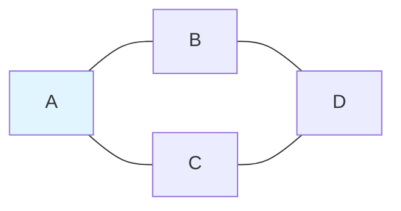
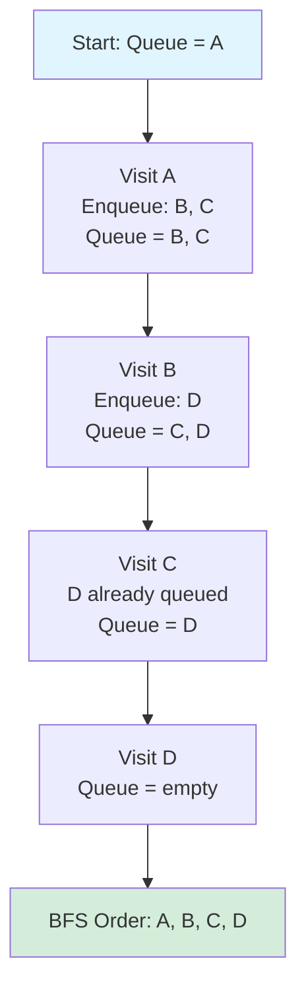
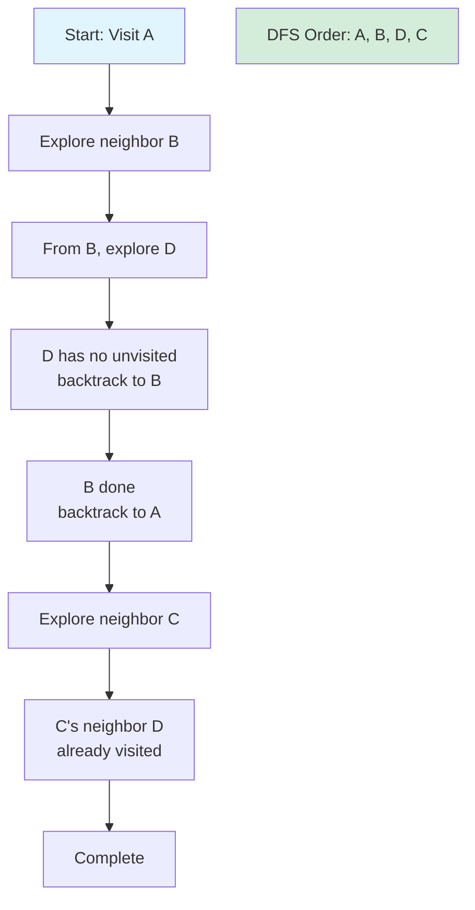

# Breadth-First and Depth-First Search

BFS and DFS are fundamental graph traversal algorithms. They explore graphs systematically, forming the basis for many advanced algorithms.

## Breadth-First Search (BFS)

BFS explores vertices in order of their distance from the source. It uses a queue to process vertices level by level.

### Algorithm

```python
from collections import deque

def bfs(graph, start):
    visited = {start}
    queue = deque([start])
    order = []

    while queue:
        vertex = queue.popleft()
        order.append(vertex)

        for neighbor in graph[vertex]:
            if neighbor not in visited:
                visited.add(neighbor)
                queue.append(neighbor)

    return order
```

### Example Trace

**Graph structure:**


**BFS traversal from A:**


**Traversal order**: $A \to B \to C \to D$

**Time complexity**: $O(V + E)$ where $V$ is vertices and $E$ is edges

### Properties

- **Time**: O(V + E)
- **Space**: O(V) for queue and visited set
- **Output**: Vertices in order of distance from start
- **Shortest paths**: BFS naturally finds shortest paths in unweighted graphs

### BFS Tree and Shortest Paths

```python
def bfs_shortest_paths(graph, start):
    dist = {start: 0}
    parent = {start: None}
    queue = deque([start])

    while queue:
        vertex = queue.popleft()
        for neighbor in graph[vertex]:
            if neighbor not in dist:
                dist[neighbor] = dist[vertex] + 1
                parent[neighbor] = vertex
                queue.append(neighbor)

    return dist, parent

def reconstruct_path(parent, target):
    path = []
    current = target
    while current is not None:
        path.append(current)
        current = parent[current]
    return path[::-1]
```

## Depth-First Search (DFS)

DFS explores as far as possible along each branch before backtracking. It uses a stack (explicit or via recursion).

### Recursive Implementation

```python
def dfs_recursive(graph, start, visited=None):
    if visited is None:
        visited = set()

    visited.add(start)
    order = [start]

    for neighbor in graph[start]:
        if neighbor not in visited:
            order.extend(dfs_recursive(graph, neighbor, visited))

    return order
```

### Iterative Implementation

```python
def dfs_iterative(graph, start):
    visited = set()
    stack = [start]
    order = []

    while stack:
        vertex = stack.pop()
        if vertex not in visited:
            visited.add(vertex)
            order.append(vertex)
            # Add neighbors in reverse for consistent ordering
            for neighbor in reversed(graph[vertex]):
                if neighbor not in visited:
                    stack.append(neighbor)

    return order
```

### Example Trace

**DFS traversal from A (recursive):**


**Traversal order**: $A \to B \to D \to C$ (may vary with neighbor ordering)

**Key difference from BFS**: Explores depth-first before breadth

### Properties

- **Time**: O(V + E)
- **Space**: O(V) for recursion stack and visited
- **Output**: Depends on graph structure and neighbor ordering
- **Not shortest paths**: DFS may find longer paths first

## Comparison

| Aspect | BFS | DFS |
|--------|-----|-----|
| Data structure | Queue | Stack |
| Explores | Level by level | Branch by branch |
| Shortest paths | Yes (unweighted) | No |
| Memory | O(width) | O(height) |
| Complete? | Yes | Yes |

## DFS Edge Classification

During DFS, edges fall into four categories:

```python
def dfs_classify(graph):
    WHITE, GRAY, BLACK = 0, 1, 2
    color = {v: WHITE for v in graph}
    discovery = {}
    finish = {}
    time = [0]
    edges = {'tree': [], 'back': [], 'forward': [], 'cross': []}

    def dfs(v):
        time[0] += 1
        discovery[v] = time[0]
        color[v] = GRAY

        for u in graph[v]:
            if color[u] == WHITE:
                edges['tree'].append((v, u))
                dfs(u)
            elif color[u] == GRAY:
                edges['back'].append((v, u))
            elif discovery[v] < discovery[u]:
                edges['forward'].append((v, u))
            else:
                edges['cross'].append((v, u))

        color[v] = BLACK
        time[0] += 1
        finish[v] = time[0]

    for v in graph:
        if color[v] == WHITE:
            dfs(v)

    return edges
```

**Tree edges**: Part of DFS forest

**Back edges**: To ancestor (indicate cycles in directed graphs)

**Forward edges**: To descendant via non-tree path

**Cross edges**: Between unrelated vertices

**Note**: In undirected graphs, only tree and back edges exist.

## Applications of BFS

1. **Shortest path** in unweighted graphs
2. **Level-order traversal** of trees
3. **Finding connected components**
4. **Testing bipartiteness**
5. **Finding minimum spanning tree** (in unweighted graphs)

## Applications of DFS

1. **Cycle detection**: Back edge indicates cycle
2. **Topological sort**: Reverse of finish times
3. **Strongly connected components**: Kosaraju's or Tarjan's algorithm
4. **Finding bridges and articulation points**
5. **Solving mazes**: Natural backtracking behavior

## Connected Components (Undirected)

```python
def connected_components(graph):
    visited = set()
    components = []

    for vertex in graph:
        if vertex not in visited:
            component = []
            stack = [vertex]
            while stack:
                v = stack.pop()
                if v not in visited:
                    visited.add(v)
                    component.append(v)
                    stack.extend(graph[v])
            components.append(component)

    return components
```

## Cycle Detection

### Undirected Graph

```python
def has_cycle_undirected(graph):
    visited = set()

    def dfs(v, parent):
        visited.add(v)
        for neighbor in graph[v]:
            if neighbor not in visited:
                if dfs(neighbor, v):
                    return True
            elif neighbor != parent:
                return True
        return False

    for v in graph:
        if v not in visited and dfs(v, None):
            return True
    return False
```

### Directed Graph

```python
def has_cycle_directed(graph):
    WHITE, GRAY, BLACK = 0, 1, 2
    color = {v: WHITE for v in graph}

    def dfs(v):
        color[v] = GRAY
        for neighbor in graph[v]:
            if color[neighbor] == GRAY:
                return True
            if color[neighbor] == WHITE and dfs(neighbor):
                return True
        color[v] = BLACK
        return False

    return any(color[v] == WHITE and dfs(v) for v in graph)
```
