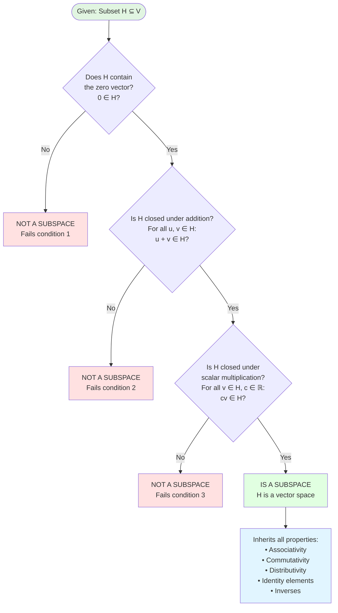
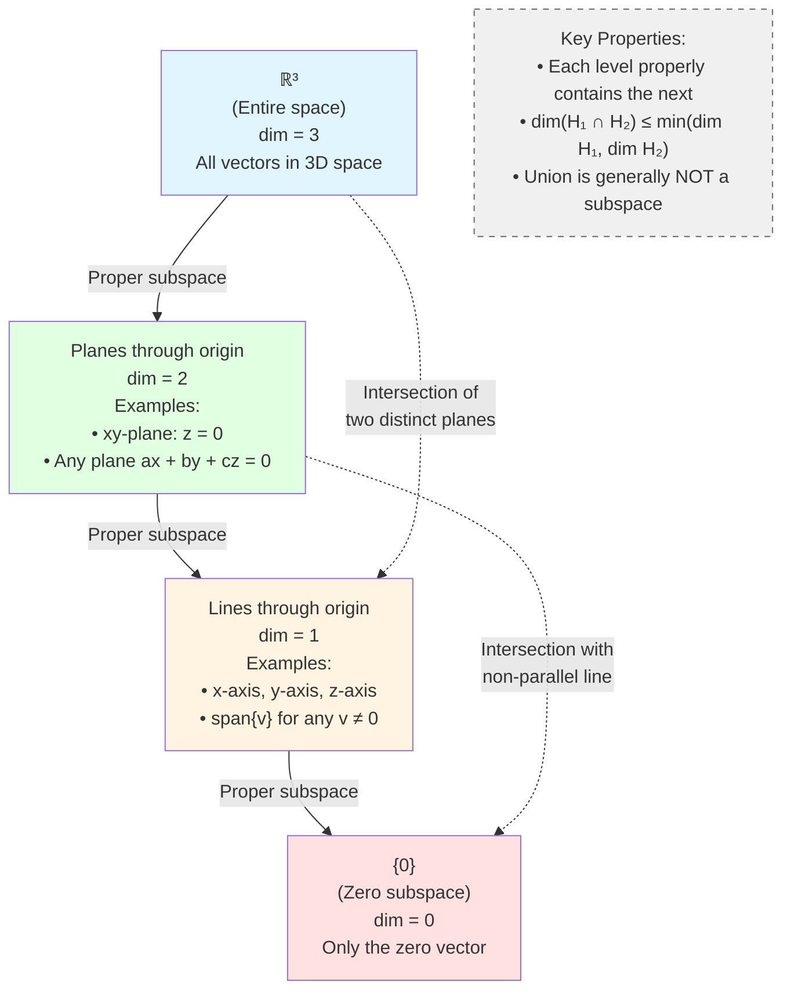

# Subspaces

Subspaces are the "sub-structures" within vector spaces—they are subsets that are themselves vector spaces. Just as lines and planes through the origin are natural geometric objects in $\mathbb{R}^3$, subspaces are the natural algebraic objects within any vector space. Understanding subspaces is essential for decomposing complex spaces into simpler components and for analyzing solutions to linear systems.

## Definition of a Subspace

A **subspace** of a vector space $V$ is a subset $H \subseteq V$ that is itself a vector space using the same addition and scalar multiplication operations as $V$.

Formally: $H$ is a subspace of $V$ if:
1. $H \subseteq V$ (every element of $H$ is in $V$)
2. $H$ satisfies all ten vector space axioms

**Key insight:** We don't need to check all ten axioms. Since $H$ inherits the operations from $V$, properties like commutativity and associativity are automatic. We only need to verify three conditions.

## The Subspace Test

**Theorem (Subspace Test):** A subset $H$ of vector space $V$ is a subspace if and only if:

1. **Zero vector:** $\mathbf{0} \in H$
2. **Closed under addition:** If $\mathbf{u}, \mathbf{v} \in H$, then $\mathbf{u} + \mathbf{v} \in H$
3. **Closed under scalar multiplication:** If $\mathbf{v} \in H$ and $c \in \mathbb{R}$, then $c\mathbf{v} \in H$

These three conditions ensure all ten axioms hold:
- Condition 1 gives Axiom 5
- Condition 2 gives Axioms 1, 3, and 4
- Condition 3 gives Axioms 2, 7, 8, 9, and 10
- Condition 3 with $c = -1$ gives Axiom 6 (since $(-1)\mathbf{v} = -\mathbf{v}$)

**Shortcut:** Conditions 2 and 3 can be combined: $H$ is a subspace if $\mathbf{0} \in H$ and for all $\mathbf{u}, \mathbf{v} \in H$ and scalars $c, d$:

$$c\mathbf{u} + d\mathbf{v} \in H$$

This is called closure under linear combinations.

### Visual Guide: Subspace Verification Flowchart

## Examples in $\mathbb{R}^2$

### Example 1: Lines Through the Origin

Let $H$ be the line $y = 2x$ in $\mathbb{R}^2$:

$$H = \left\{\begin{bmatrix} x \\ 2x \end{bmatrix} : x \in \mathbb{R}\right\} = \left\{x\begin{bmatrix} 1 \\ 2 \end{bmatrix} : x \in \mathbb{R}\right\} = \text{span}\left\{\begin{bmatrix} 1 \\ 2 \end{bmatrix}\right\}$$

**Verification:**

1. **Zero vector:** Setting $x = 0$ gives $\begin{bmatrix} 0 \\ 0 \end{bmatrix} \in H$. ✓

2. **Closed under addition:** If $\mathbf{u} = \begin{bmatrix} x_1 \\ 2x_1 \end{bmatrix}$ and $\mathbf{v} = \begin{bmatrix} x_2 \\ 2x_2 \end{bmatrix}$ are in $H$, then:

$$\mathbf{u} + \mathbf{v} = \begin{bmatrix} x_1 + x_2 \\ 2x_1 + 2x_2 \end{bmatrix} = \begin{bmatrix} x_1 + x_2 \\ 2(x_1 + x_2) \end{bmatrix}$$

This has the form $\begin{bmatrix} x \\ 2x \end{bmatrix}$ with $x = x_1 + x_2$, so it's in $H$. ✓

3. **Closed under scalar multiplication:** If $\mathbf{v} = \begin{bmatrix} x \\ 2x \end{bmatrix} \in H$ and $c \in \mathbb{R}$:

$$c\mathbf{v} = \begin{bmatrix} cx \\ 2cx \end{bmatrix} = \begin{bmatrix} cx \\ 2(cx) \end{bmatrix}$$

This is in $H$ with parameter $cx$. ✓

Therefore, $H$ is a subspace of $\mathbb{R}^2$.

**Geometric interpretation:** Any line through the origin in $\mathbb{R}^2$ is a subspace. Scaling a point on the line keeps you on the line, and adding two points on the line gives another point on the line.

### Example 2: Lines NOT Through the Origin

Let $K$ be the line $y = 2x + 1$ in $\mathbb{R}^2$:

$$K = \left\{\begin{bmatrix} x \\ 2x + 1 \end{bmatrix} : x \in \mathbb{R}\right\}$$

**Not a subspace:** The zero vector $\begin{bmatrix} 0 \\ 0 \end{bmatrix}$ is not in $K$ because when $x = 0$, we get $\begin{bmatrix} 0 \\ 1 \end{bmatrix} \neq \begin{bmatrix} 0 \\ 0 \end{bmatrix}$.

**Key principle:** In $\mathbb{R}^n$, a line is a subspace if and only if it passes through the origin.

### Example 3: The Zero Subspace

The set $\{\mathbf{0}\}$ containing only the zero vector is always a subspace of any vector space $V$. All three conditions hold trivially:
- $\mathbf{0} \in \{\mathbf{0}\}$ ✓
- $\mathbf{0} + \mathbf{0} = \mathbf{0} \in \{\mathbf{0}\}$ ✓
- $c\mathbf{0} = \mathbf{0} \in \{\mathbf{0}\}$ ✓

This is called the **zero subspace** or **trivial subspace**.

### Example 4: The Whole Space

Every vector space $V$ is a subspace of itself. This is called the **improper subspace**. All other subspaces are called **proper subspaces**.

## Examples in $\mathbb{R}^3$

### Example 5: Planes Through the Origin

Let $H$ be the $xy$-plane in $\mathbb{R}^3$:

$$H = \left\{\begin{bmatrix} x \\ y \\ 0 \end{bmatrix} : x, y \in \mathbb{R}\right\} = \text{span}\left\{\begin{bmatrix} 1 \\ 0 \\ 0 \end{bmatrix}, \begin{bmatrix} 0 \\ 1 \\ 0 \end{bmatrix}\right\}$$

Equivalently, $H = \{\mathbf{v} \in \mathbb{R}^3 : \mathbf{v} \cdot \mathbf{e}_3 = 0\}$ where $\mathbf{e}_3 = \begin{bmatrix} 0 \\ 0 \\ 1 \end{bmatrix}$ is the normal vector to the plane.

**Verification:**

1. $\mathbf{0} = \begin{bmatrix} 0 \\ 0 \\ 0 \end{bmatrix} \in H$ ✓

2. If $\mathbf{u} = \begin{bmatrix} x_1 \\ y_1 \\ 0 \end{bmatrix}$ and $\mathbf{v} = \begin{bmatrix} x_2 \\ y_2 \\ 0 \end{bmatrix}$ are in $H$:

$$\mathbf{u} + \mathbf{v} = \begin{bmatrix} x_1 + x_2 \\ y_1 + y_2 \\ 0 \end{bmatrix} \in H$$ ✓

3. If $\mathbf{v} = \begin{bmatrix} x \\ y \\ 0 \end{bmatrix} \in H$:

$$c\mathbf{v} = \begin{bmatrix} cx \\ cy \\ 0 \end{bmatrix} \in H$$ ✓

Any plane through the origin in $\mathbb{R}^3$ is a subspace.

### Example 6: The Span of a Vector

Let $\mathbf{v} = \begin{bmatrix} 1 \\ 2 \\ 3 \end{bmatrix}$. The set of all scalar multiples of $\mathbf{v}$ is:

$$H = \left\{c\begin{bmatrix} 1 \\ 2 \\ 3 \end{bmatrix} : c \in \mathbb{R}\right\} = \left\{\begin{bmatrix} c \\ 2c \\ 3c \end{bmatrix} : c \in \mathbb{R}\right\}$$

This is a line through the origin, hence a subspace. Geometrically, it's the line in the direction of $\mathbf{v}$.

## Examples in Other Vector Spaces

### Example 7: Symmetric Matrices

Let $V = M_{3 \times 3}$ (all $3 \times 3$ matrices) and $H = \{A \in M_{3 \times 3} : A^T = A\}$ (symmetric matrices).

**Verification:**

1. **Zero vector:** The zero matrix is symmetric: $\mathbf{0}^T = \mathbf{0}$. ✓

2. **Closed under addition:** If $A^T = A$ and $B^T = B$, then:

$$(A + B)^T = A^T + B^T = A + B$$

So $A + B$ is symmetric. ✓

3. **Closed under scalar multiplication:** If $A^T = A$:

$$(cA)^T = cA^T = cA$$

So $cA$ is symmetric. ✓

Therefore, symmetric matrices form a subspace of $M_{3 \times 3}$.

### Example 8: Polynomials with Specific Properties

In $\mathcal{P}_3$ (polynomials of degree at most 3), let:

$$H = \{p \in \mathcal{P}_3 : p(0) = 0\}$$

A polynomial $p(x) = a_0 + a_1x + a_2x^2 + a_3x^3$ is in $H$ if and only if $p(0) = a_0 = 0$.

So $H = \{a_1x + a_2x^2 + a_3x^3 : a_i \in \mathbb{R}\}$ (polynomials with no constant term).

**Verification:**

1. The zero polynomial satisfies $p(0) = 0$. ✓

2. If $p(0) = 0$ and $q(0) = 0$, then $(p + q)(0) = p(0) + q(0) = 0 + 0 = 0$. ✓

3. If $p(0) = 0$, then $(cp)(0) = c \cdot p(0) = c \cdot 0 = 0$. ✓

This is a subspace.

### Example 9: Continuous Functions Vanishing at Endpoints

In $C[0, 1]$, let:

$$H = \{f \in C[0, 1] : f(0) = 0 \text{ and } f(1) = 0\}$$

This is a subspace (verification similar to Example 8).

## Non-Examples

### Non-Example 1: First Quadrant

In $\mathbb{R}^2$, the first quadrant $Q = \{(x, y) : x \geq 0, y \geq 0\}$ is NOT a subspace.

**Why?** Take $\mathbf{v} = \begin{bmatrix} 1 \\ 1 \end{bmatrix} \in Q$. Then $(-1)\mathbf{v} = \begin{bmatrix} -1 \\ -1 \end{bmatrix} \notin Q$.

Fails closure under scalar multiplication. ✗

### Non-Example 2: Invertible Matrices

In $M_{n \times n}$, the set of invertible matrices is NOT a subspace.

**Why?** The zero matrix is not invertible, so it's not in the set. Fails condition 1. ✗

Also, the sum of invertible matrices need not be invertible. For example:

$$A = \begin{bmatrix} 1 & 0 \\ 0 & 1 \end{bmatrix}, \quad B = \begin{bmatrix} -1 & 0 \\ 0 & -1 \end{bmatrix}$$

Both are invertible, but $A + B = \mathbf{0}$ is not invertible. Fails closure under addition. ✗

### Non-Example 3: Polynomials with $p(1) = 1$

In $\mathcal{P}$, let $K = \{p : p(1) = 1\}$.

**Why not a subspace?** The zero polynomial satisfies $0(1) = 0 \neq 1$, so $\mathbf{0} \notin K$. ✗

Also, if $p(1) = 1$ and $q(1) = 1$, then $(p + q)(1) = 2 \neq 1$. Not closed under addition. ✗

## Intersection of Subspaces

**Theorem:** If $H_1$ and $H_2$ are subspaces of $V$, then $H_1 \cap H_2$ (the set of vectors in both $H_1$ and $H_2$) is also a subspace.

**Proof:**

1. Since $\mathbf{0} \in H_1$ and $\mathbf{0} \in H_2$, we have $\mathbf{0} \in H_1 \cap H_2$. ✓

2. If $\mathbf{u}, \mathbf{v} \in H_1 \cap H_2$, then:
   - $\mathbf{u}, \mathbf{v} \in H_1$ implies $\mathbf{u} + \mathbf{v} \in H_1$ (since $H_1$ is a subspace)
   - $\mathbf{u}, \mathbf{v} \in H_2$ implies $\mathbf{u} + \mathbf{v} \in H_2$ (since $H_2$ is a subspace)
   - Therefore $\mathbf{u} + \mathbf{v} \in H_1 \cap H_2$. ✓

3. Similarly, if $\mathbf{v} \in H_1 \cap H_2$ and $c \in \mathbb{R}$, then $c\mathbf{v} \in H_1$ and $c\mathbf{v} \in H_2$, so $c\mathbf{v} \in H_1 \cap H_2$. ✓

∎

**Example:** In $\mathbb{R}^3$, the intersection of two planes through the origin is a line through the origin (or the zero vector if the planes coincide). Both are subspaces.

**Important:** The **union** $H_1 \cup H_2$ is generally NOT a subspace. For example, the union of the $x$-axis and $y$-axis in $\mathbb{R}^2$ is not closed under addition: $(1, 0) + (0, 1) = (1, 1)$ is not on either axis.

### Hierarchy of Subspaces in $\mathbb{R}^3$

The following diagram illustrates the relationships between different types of subspaces and their dimensions:

**Dimensional Hierarchy:**
- **Dimension 3**: The entire space $\mathbb{R}^3$ (improper subspace)
- **Dimension 2**: Planes through the origin (e.g., $ax + by + cz = 0$)
- **Dimension 1**: Lines through the origin (e.g., $\text{span}\{\mathbf{v}\}$ for $\mathbf{v} \neq \mathbf{0}$)
- **Dimension 0**: The zero subspace $\{\mathbf{0}\}$ (trivial subspace)

**Key Relationships:**
1. Every subspace contains $\{\mathbf{0}\}$
2. Intersection of subspaces yields a lower-dimensional (or equal) subspace
3. Two distinct planes intersect in a line (or just $\{\mathbf{0}\}$ if parallel through origin)
4. A plane and a non-parallel line intersect at $\{\mathbf{0}\}$ (if the line isn't in the plane)

## Subspace Criterion in Practice

When checking if a set $H$ is a subspace:

**Step 1:** Check if $\mathbf{0} \in H$. If not, stop—it's not a subspace.

**Step 2:** Take arbitrary elements $\mathbf{u}, \mathbf{v} \in H$. Show $\mathbf{u} + \mathbf{v} \in H$ using the defining property of $H$.

**Step 3:** Take arbitrary $\mathbf{v} \in H$ and scalar $c$. Show $c\mathbf{v} \in H$ using the defining property of $H$.

**Pro tip:** Use the combined criterion: show that $c\mathbf{u} + d\mathbf{v} \in H$ for all $\mathbf{u}, \mathbf{v} \in H$ and all scalars $c, d$. This checks conditions 2 and 3 simultaneously.

## Summary

- A **subspace** is a subset of a vector space that is itself a vector space
- **Subspace test:** To verify $H$ is a subspace, check:
  1. $\mathbf{0} \in H$
  2. Closed under addition
  3. Closed under scalar multiplication
- In $\mathbb{R}^n$: lines and planes through the origin are subspaces; those not through the origin are not
- Every vector space has at least two subspaces: $\{\mathbf{0}\}$ and $V$ itself
- **Intersection** of subspaces is a subspace; **union** typically is not
- Common subspaces: symmetric matrices, polynomials with specific properties, functions satisfying boundary conditions
