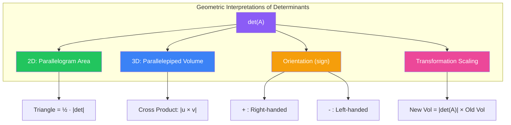
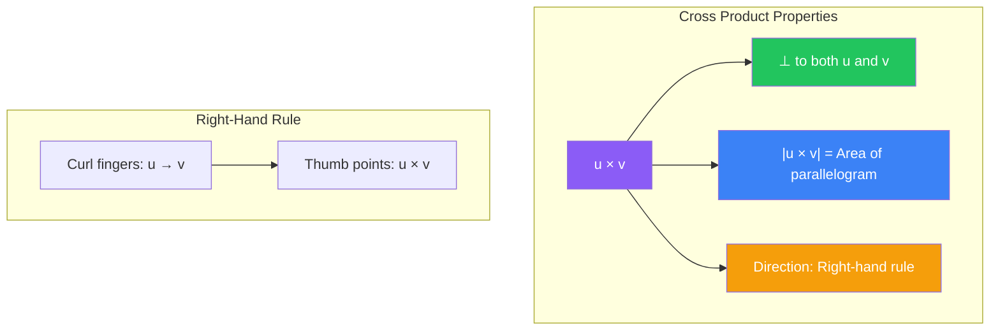

# Geometric Applications of Determinants

Determinants have profound geometric interpretations that connect linear algebra with geometry. They measure volumes, compute cross products, determine orientations, and solve geometric problems elegantly.

## Volume of a Parallelepiped

The absolute value of the determinant of a matrix whose columns are vectors in $\mathbb{R}^3$ gives the volume of the parallelepiped spanned by those vectors.

For vectors $\mathbf{u}$, $\mathbf{v}$, and $\mathbf{w}$ in $\mathbb{R}^3$:

$$\text{Volume} = |\det[\mathbf{u} \; \mathbf{v} \; \mathbf{w}]|$$

### Example: Computing Volume

Find the volume of the parallelepiped spanned by:
$$\mathbf{u} = \begin{bmatrix} 2 \\ 1 \\ 0 \end{bmatrix}, \quad \mathbf{v} = \begin{bmatrix} 1 \\ 3 \\ 1 \end{bmatrix}, \quad \mathbf{w} = \begin{bmatrix} 0 \\ 2 \\ 4 \end{bmatrix}$$

Form the matrix and compute its determinant:
$$A = \begin{bmatrix} 2 & 1 & 0 \\ 1 & 3 & 2 \\ 0 & 1 & 4 \end{bmatrix}$$

Expanding along row 1:
$$\det(A) = 2\det\begin{bmatrix} 3 & 2 \\ 1 & 4 \end{bmatrix} - 1\det\begin{bmatrix} 1 & 2 \\ 0 & 4 \end{bmatrix} + 0$$

$$= 2(12-2) - 1(4-0) = 2(10) - 4 = 16$$

**Volume** = $|\det(A)| = 16$ cubic units

### Special Case: Rectangular Box

If the vectors are orthogonal (perpendicular), the parallelepiped is a rectangular box. The volume is simply the product of the lengths.

$$\mathbf{u} = \begin{bmatrix} a \\ 0 \\ 0 \end{bmatrix}, \quad \mathbf{v} = \begin{bmatrix} 0 \\ b \\ 0 \end{bmatrix}, \quad \mathbf{w} = \begin{bmatrix} 0 \\ 0 \\ c \end{bmatrix}$$

$$\det\begin{bmatrix} a & 0 & 0 \\ 0 & b & 0 \\ 0 & 0 & c \end{bmatrix} = abc$$

This confirms our intuition: volume = length × width × height.

## Area of a Parallelogram in 2D

For two vectors in $\mathbb{R}^2$, the determinant gives the signed area of the parallelogram they span.

$$\mathbf{u} = \begin{bmatrix} u_1 \\ u_2 \end{bmatrix}, \quad \mathbf{v} = \begin{bmatrix} v_1 \\ v_2 \end{bmatrix}$$

$$\text{Signed Area} = \det\begin{bmatrix} u_1 & v_1 \\ u_2 & v_2 \end{bmatrix}$$

$$\text{Area} = \left|\det\begin{bmatrix} u_1 & v_1 \\ u_2 & v_2 \end{bmatrix}\right|$$

### Example: Parallelogram Area

Find the area of the parallelogram with sides $\mathbf{u} = \begin{bmatrix} 3 \\ 1 \end{bmatrix}$ and $\mathbf{v} = \begin{bmatrix} 2 \\ 4 \end{bmatrix}$.

$$\det\begin{bmatrix} 3 & 2 \\ 1 & 4 \end{bmatrix} = (3)(4) - (2)(1) = 12 - 2 = 10$$

**Area** = $|10| = 10$ square units

### Triangle Area

The area of a triangle with vertices at the origin, $\mathbf{u}$, and $\mathbf{v}$ is half the parallelogram area:

$$\text{Triangle Area} = \frac{1}{2}\left|\det\begin{bmatrix} u_1 & v_1 \\ u_2 & v_2 \end{bmatrix}\right|$$

For a triangle with vertices $(x_1, y_1)$, $(x_2, y_2)$, $(x_3, y_3)$ not necessarily at the origin:

$$\text{Area} = \frac{1}{2}\left|\det\begin{bmatrix} x_1 & y_1 & 1 \\ x_2 & y_2 & 1 \\ x_3 & y_3 & 1 \end{bmatrix}\right|$$

### Example: Triangle Area

Find the area of the triangle with vertices $(1, 2)$, $(4, 5)$, and $(3, 1)$.

$$\text{Area} = \frac{1}{2}\left|\det\begin{bmatrix} 1 & 2 & 1 \\ 4 & 5 & 1 \\ 3 & 1 & 1 \end{bmatrix}\right|$$

Expand along column 3:
$$\det = 1\det\begin{bmatrix} 4 & 5 \\ 3 & 1 \end{bmatrix} - 1\det\begin{bmatrix} 1 & 2 \\ 3 & 1 \end{bmatrix} + 1\det\begin{bmatrix} 1 & 2 \\ 4 & 5 \end{bmatrix}$$

$$= 1(4-15) - 1(1-6) + 1(5-8) = -11 + 5 - 3 = -9$$

$$\text{Area} = \frac{1}{2}|-9| = 4.5 \text{ square units}$$

## The Cross Product

The cross product of two vectors in $\mathbb{R}^3$ can be computed using a determinant.

For $\mathbf{u} = \begin{bmatrix} u_1 \\ u_2 \\ u_3 \end{bmatrix}$ and $\mathbf{v} = \begin{bmatrix} v_1 \\ v_2 \\ v_3 \end{bmatrix}$:

$$\mathbf{u} \times \mathbf{v} = \det\begin{bmatrix} \mathbf{i} & \mathbf{j} & \mathbf{k} \\ u_1 & u_2 & u_3 \\ v_1 & v_2 & v_3 \end{bmatrix}$$

Expanding along row 1:
$$\mathbf{u} \times \mathbf{v} = \mathbf{i}\det\begin{bmatrix} u_2 & u_3 \\ v_2 & v_3 \end{bmatrix} - \mathbf{j}\det\begin{bmatrix} u_1 & u_3 \\ v_1 & v_3 \end{bmatrix} + \mathbf{k}\det\begin{bmatrix} u_1 & u_2 \\ v_1 & v_2 \end{bmatrix}$$

$$= \begin{bmatrix} u_2v_3 - u_3v_2 \\ u_3v_1 - u_1v_3 \\ u_1v_2 - u_2v_1 \end{bmatrix}$$

### Example: Cross Product Calculation

Compute $\mathbf{u} \times \mathbf{v}$ for $\mathbf{u} = \begin{bmatrix} 1 \\ 2 \\ 3 \end{bmatrix}$ and $\mathbf{v} = \begin{bmatrix} 4 \\ 5 \\ 6 \end{bmatrix}$.

$$\mathbf{u} \times \mathbf{v} = \det\begin{bmatrix} \mathbf{i} & \mathbf{j} & \mathbf{k} \\ 1 & 2 & 3 \\ 4 & 5 & 6 \end{bmatrix}$$

$$= \mathbf{i}(12-15) - \mathbf{j}(6-12) + \mathbf{k}(5-8)$$

$$= -3\mathbf{i} + 6\mathbf{j} - 3\mathbf{k} = \begin{bmatrix} -3 \\ 6 \\ -3 \end{bmatrix}$$

**Properties**:
- $\mathbf{u} \times \mathbf{v}$ is perpendicular to both $\mathbf{u}$ and $\mathbf{v}$
- $|\mathbf{u} \times \mathbf{v}|$ equals the area of the parallelogram spanned by $\mathbf{u}$ and $\mathbf{v}$
- Direction follows the right-hand rule

### Cross Product Magnitude and Area

The magnitude of the cross product gives the parallelogram area:

$$\text{Area} = |\mathbf{u} \times \mathbf{v}|$$

For our example:
$$|\mathbf{u} \times \mathbf{v}| = \sqrt{(-3)^2 + 6^2 + (-3)^2} = \sqrt{9 + 36 + 9} = \sqrt{54} = 3\sqrt{6}$$

This is the area of the parallelogram spanned by $\mathbf{u}$ and $\mathbf{v}$.

## Scalar Triple Product

The scalar triple product combines dot product and cross product to compute volumes:

$$\mathbf{u} \cdot (\mathbf{v} \times \mathbf{w}) = \det[\mathbf{u} \; \mathbf{v} \; \mathbf{w}]$$

This gives the signed volume of the parallelepiped spanned by $\mathbf{u}$, $\mathbf{v}$, and $\mathbf{w}$.

### Example: Scalar Triple Product

For $\mathbf{u} = \begin{bmatrix} 1 \\ 0 \\ 0 \end{bmatrix}$, $\mathbf{v} = \begin{bmatrix} 0 \\ 2 \\ 0 \end{bmatrix}$, $\mathbf{w} = \begin{bmatrix} 0 \\ 0 \\ 3 \end{bmatrix}$:

$$\mathbf{u} \cdot (\mathbf{v} \times \mathbf{w}) = \det\begin{bmatrix} 1 & 0 & 0 \\ 0 & 2 & 0 \\ 0 & 0 & 3 \end{bmatrix} = (1)(2)(3) = 6$$

The volume is 6 cubic units (a rectangular box 1 × 2 × 3).

## Orientation and Signed Volume

The sign of the determinant indicates orientation:

- **Positive determinant**: Right-handed orientation (vectors form a right-handed coordinate system)
- **Negative determinant**: Left-handed orientation
- **Zero determinant**: Vectors are coplanar (no volume)

### Example: Testing Coplanarity

Are the vectors $\mathbf{u} = \begin{bmatrix} 1 \\ 2 \\ 3 \end{bmatrix}$, $\mathbf{v} = \begin{bmatrix} 2 \\ 4 \\ 6 \end{bmatrix}$, $\mathbf{w} = \begin{bmatrix} 1 \\ 1 \\ 1 \end{bmatrix}$ coplanar?

$$\det\begin{bmatrix} 1 & 2 & 1 \\ 2 & 4 & 1 \\ 3 & 6 & 1 \end{bmatrix}$$

Row 2 is exactly twice row 1 in the first two columns, suggesting linear dependence:

$$= 1\det\begin{bmatrix} 4 & 1 \\ 6 & 1 \end{bmatrix} - 2\det\begin{bmatrix} 2 & 1 \\ 3 & 1 \end{bmatrix} + 1\det\begin{bmatrix} 2 & 4 \\ 3 & 6 \end{bmatrix}$$

$$= 1(4-6) - 2(2-3) + 1(12-12) = -2 + 2 + 0 = 0$$

Yes, the vectors are coplanar. Indeed, $\mathbf{v} = 2\mathbf{u}$.

## Linear Transformations and Scaling Factors

When a linear transformation $T: \mathbb{R}^n \to \mathbb{R}^n$ is represented by matrix $A$, the determinant tells us how $T$ scales volumes:

$$\text{Volume after transformation} = |\det(A)| \times \text{Volume before transformation}$$

### Example: Transformation Scaling

The transformation $T\begin{bmatrix} x \\ y \end{bmatrix} = \begin{bmatrix} 2 & 0 \\ 0 & 3 \end{bmatrix}\begin{bmatrix} x \\ y \end{bmatrix}$ stretches by factor 2 in the $x$-direction and factor 3 in the $y$-direction.

$$\det\begin{bmatrix} 2 & 0 \\ 0 & 3 \end{bmatrix} = 6$$

Any region's area is multiplied by 6 under this transformation.

If a square with area 4 is transformed:
$$\text{New area} = 6 \times 4 = 24$$

## Distance from Point to Plane

The distance from a point $P_0 = (x_0, y_0, z_0)$ to the plane through points $P_1$, $P_2$, $P_3$ can be computed using determinants.

The volume formula for a parallelepiped gives:
$$\text{Volume} = \text{Base Area} \times \text{Height}$$

Rearranging:
$$\text{Distance} = \frac{\text{Volume}}{\text{Base Area}} = \frac{|\det[\overrightarrow{P_0P_1} \; \overrightarrow{P_0P_2} \; \overrightarrow{P_0P_3}]|}{|\overrightarrow{P_0P_2} \times \overrightarrow{P_0P_3}|}$$

## Collinearity in 2D

Three points $(x_1, y_1)$, $(x_2, y_2)$, $(x_3, y_3)$ are collinear (on the same line) if and only if:

$$\det\begin{bmatrix} x_1 & y_1 & 1 \\ x_2 & y_2 & 1 \\ x_3 & y_3 & 1 \end{bmatrix} = 0$$

This is because collinear points form a degenerate triangle with zero area.

### Example: Testing Collinearity

Are the points $(1, 2)$, $(2, 4)$, and $(3, 6)$ collinear?

$$\det\begin{bmatrix} 1 & 2 & 1 \\ 2 & 4 & 1 \\ 3 & 6 & 1 \end{bmatrix}$$

Expand along column 3:
$$= 1\det\begin{bmatrix} 2 & 4 \\ 3 & 6 \end{bmatrix} - 1\det\begin{bmatrix} 1 & 2 \\ 3 & 6 \end{bmatrix} + 1\det\begin{bmatrix} 1 & 2 \\ 2 & 4 \end{bmatrix}$$

$$= 1(12-12) - 1(6-6) + 1(4-4) = 0$$

Yes, the points are collinear. They lie on the line $y = 2x$.

## Summary

Determinants provide elegant solutions to geometric problems:

- **Parallelogram area (2D)**: $|\det[\mathbf{u} \; \mathbf{v}]|$
- **Parallelepiped volume (3D)**: $|\det[\mathbf{u} \; \mathbf{v} \; \mathbf{w}]|$
- **Triangle area**: $\frac{1}{2}|\det[\text{vertex coordinates}]|$
- **Cross product**: $\mathbf{u} \times \mathbf{v} = \det[\mathbf{i}, \mathbf{j}, \mathbf{k}; u_1, u_2, u_3; v_1, v_2, v_3]$
- **Scalar triple product**: $\mathbf{u} \cdot (\mathbf{v} \times \mathbf{w}) = \det[\mathbf{u} \; \mathbf{v} \; \mathbf{w}]$
- **Volume scaling**: Transformations scale volumes by $|\det(A)|$
- **Orientation**: Sign of determinant indicates handedness
- **Collinearity/Coplanarity**: Zero determinant indicates degeneracy
- **Perpendicularity**: Cross product gives perpendicular vector

These applications demonstrate that determinants are not just algebraic tools—they encode fundamental geometric information about space, volume, and orientation.
