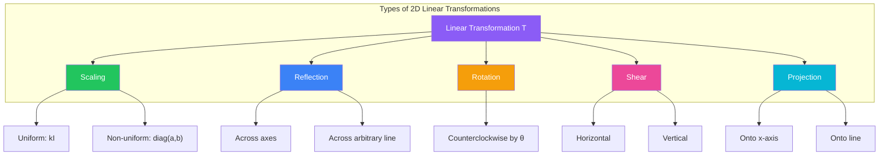
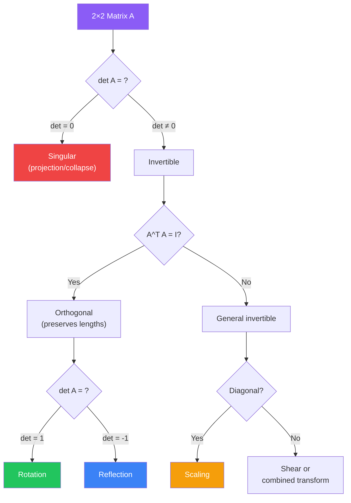

# Geometric Transformations in R² and R³

## Introduction

Linear transformations have concrete geometric interpretations in $\mathbb{R}^2$ and $\mathbb{R}^3$. Understanding these geometric perspectives helps build intuition about abstract linear algebra concepts and provides tools for computer graphics, robotics, and physics applications.



## Transformations in R²

### Scaling

**Uniform Scaling**: Multiplies all coordinates by the same factor $k$.

$$S_k(x, y) = (kx, ky)$$

Matrix:
$$S_k = \begin{bmatrix} k & 0 \\ 0 & k \end{bmatrix} = kI$$

**Non-Uniform Scaling**: Different factors for different coordinates.

$$S_{a,b}(x, y) = (ax, by)$$

Matrix:
$$S_{a,b} = \begin{bmatrix} a & 0 \\ 0 & b \end{bmatrix}$$

#### Example 1: Scaling

Find the image of the unit square under $S_{2,3}$.

**Solution**:

Vertices of unit square: $(0,0), (1,0), (0,1), (1,1)$

Apply transformation:
- $(0, 0) \to (0, 0)$
- $(1, 0) \to (2, 0)$
- $(0, 1) \to (0, 3)$
- $(1, 1) \to (2, 3)$

The result is a rectangle with width 2 and height 3.

### Reflections

**Reflection across the x-axis**: $(x, y) \to (x, -y)$

$$R_x = \begin{bmatrix} 1 & 0 \\ 0 & -1 \end{bmatrix}$$

**Reflection across the y-axis**: $(x, y) \to (-x, y)$

$$R_y = \begin{bmatrix} -1 & 0 \\ 0 & 1 \end{bmatrix}$$

**Reflection across the line $y = x$**: $(x, y) \to (y, x)$

$$R_{y=x} = \begin{bmatrix} 0 & 1 \\ 1 & 0 \end{bmatrix}$$

**Reflection across the line $y = -x$**: $(x, y) \to (-y, -x)$

$$R_{y=-x} = \begin{bmatrix} 0 & -1 \\ -1 & 0 \end{bmatrix}$$

**Reflection across a general line through the origin**: For a line making angle $\theta$ with the positive $x$-axis:

$$R_\theta = \begin{bmatrix} \cos 2\theta & \sin 2\theta \\ \sin 2\theta & -\cos 2\theta \end{bmatrix}$$

#### Example 2: Reflection

Reflect the point $(3, 1)$ across the line $y = 2x$.

**Solution**:

The line $y = 2x$ has slope $m = 2$, so $\tan\theta = 2$, giving $\theta = \arctan(2) \approx 63.43°$.

We need $2\theta \approx 126.86°$:
- $\cos(2\theta) \approx -0.6$
- $\sin(2\theta) \approx 0.8$

$$R_{2\theta} = \begin{bmatrix} -0.6 & 0.8 \\ 0.8 & 0.6 \end{bmatrix}$$

Apply to $(3, 1)$:
$$\begin{bmatrix} -0.6 & 0.8 \\ 0.8 & 0.6 \end{bmatrix}\begin{bmatrix} 3 \\ 1 \end{bmatrix} = \begin{bmatrix} -1.8 + 0.8 \\ 2.4 + 0.6 \end{bmatrix} = \begin{bmatrix} -1 \\ 3 \end{bmatrix}$$

The reflected point is approximately $(-1, 3)$.

**Exact calculation**: Using $\theta = \arctan(2)$, we have $\sin\theta = \frac{2}{\sqrt{5}}$ and $\cos\theta = \frac{1}{\sqrt{5}}$.

Then: $\cos 2\theta = \cos^2\theta - \sin^2\theta = \frac{1}{5} - \frac{4}{5} = -\frac{3}{5}$

And: $\sin 2\theta = 2\sin\theta\cos\theta = 2 \cdot \frac{2}{\sqrt{5}} \cdot \frac{1}{\sqrt{5}} = \frac{4}{5}$

$$R = \begin{bmatrix} -3/5 & 4/5 \\ 4/5 & 3/5 \end{bmatrix}, \quad \begin{bmatrix} -3/5 & 4/5 \\ 4/5 & 3/5 \end{bmatrix}\begin{bmatrix} 3 \\ 1 \end{bmatrix} = \begin{bmatrix} -9/5 + 4/5 \\ 12/5 + 3/5 \end{bmatrix} = \begin{bmatrix} -1 \\ 3 \end{bmatrix}$$

### Rotations

**Counterclockwise rotation by angle $\theta$**:

$$R_\theta = \begin{bmatrix} \cos\theta & -\sin\theta \\ \sin\theta & \cos\theta \end{bmatrix}$$

The rotation matrix transforms points by rotating them around the origin. The following plot shows the sine and cosine functions that form the basis of rotation transformations:

```plot
{
  "xAxis": { "domain": [0, 6.28] },
  "yAxis": { "domain": [-1.5, 1.5] },
  "data": [
    { "fn": "cos(x)", "color": "#8b5cf6", "title": "cos θ" },
    { "fn": "sin(x)", "color": "#22c55e", "title": "sin θ" }
  ]
}
```

The rotation matrix uses these trigonometric functions: $\cos\theta$ appears on the diagonal (determining how much of the original $x$ and $y$ components are preserved), while $\sin\theta$ appears off-diagonal (determining how much the components mix).

**Clockwise rotation by angle $\theta$**: This is $R_{-\theta}$:

$$R_{-\theta} = \begin{bmatrix} \cos\theta & \sin\theta \\ -\sin\theta & \cos\theta \end{bmatrix}$$

#### Example 3: Rotation

Rotate the point $(1, 0)$ counterclockwise by $45°$.

**Solution**:

$$R_{45°} = \begin{bmatrix} \cos 45° & -\sin 45° \\ \sin 45° & \cos 45° \end{bmatrix} = \begin{bmatrix} \frac{\sqrt{2}}{2} & -\frac{\sqrt{2}}{2} \\ \frac{\sqrt{2}}{2} & \frac{\sqrt{2}}{2} \end{bmatrix}$$

$$R_{45°}\begin{bmatrix} 1 \\ 0 \end{bmatrix} = \begin{bmatrix} \frac{\sqrt{2}}{2} \\ \frac{\sqrt{2}}{2} \end{bmatrix} \approx \begin{bmatrix} 0.707 \\ 0.707 \end{bmatrix}$$

This makes geometric sense: $(1, 0)$ lies on the positive $x$-axis, and rotating $45°$ places it on the line $y = x$ at distance 1 from the origin.

### Projections

**Projection onto the x-axis**: $(x, y) \to (x, 0)$

$$P_x = \begin{bmatrix} 1 & 0 \\ 0 & 0 \end{bmatrix}$$

**Projection onto the y-axis**: $(x, y) \to (0, y)$

$$P_y = \begin{bmatrix} 0 & 0 \\ 0 & 1 \end{bmatrix}$$

**Projection onto a line through the origin**: For a line with direction vector $\mathbf{u} = (a, b)$:

$$P_{\mathbf{u}} = \frac{1}{a^2 + b^2}\begin{bmatrix} a^2 & ab \\ ab & b^2 \end{bmatrix}$$

This comes from the formula: $\text{proj}_{\mathbf{u}}(\mathbf{v}) = \frac{\mathbf{v} \cdot \mathbf{u}}{\mathbf{u} \cdot \mathbf{u}}\mathbf{u}$

#### Example 4: Projection

Project the point $(4, 2)$ onto the line $y = x$.

**Solution**:

The line $y = x$ has direction vector $\mathbf{u} = (1, 1)$, so $a = b = 1$ and $a^2 + b^2 = 2$.

$$P_{\mathbf{u}} = \frac{1}{2}\begin{bmatrix} 1 & 1 \\ 1 & 1 \end{bmatrix} = \begin{bmatrix} 1/2 & 1/2 \\ 1/2 & 1/2 \end{bmatrix}$$

$$P_{\mathbf{u}}\begin{bmatrix} 4 \\ 2 \end{bmatrix} = \begin{bmatrix} 1/2 & 1/2 \\ 1/2 & 1/2 \end{bmatrix}\begin{bmatrix} 4 \\ 2 \end{bmatrix} = \begin{bmatrix} 2 + 1 \\ 2 + 1 \end{bmatrix} = \begin{bmatrix} 3 \\ 3 \end{bmatrix}$$

The projected point is $(3, 3)$, which lies on the line $y = x$.

### Shear Transformations

**Horizontal shear**: $(x, y) \to (x + ky, y)$

$$H_k = \begin{bmatrix} 1 & k \\ 0 & 1 \end{bmatrix}$$

**Vertical shear**: $(x, y) \to (x, y + kx)$

$$V_k = \begin{bmatrix} 1 & 0 \\ k & 1 \end{bmatrix}$$

#### Example 5: Shear

Apply a horizontal shear with $k = 2$ to the unit square.

**Solution**:

Vertices transform as:
- $(0, 0) \to (0, 0)$
- $(1, 0) \to (1, 0)$
- $(0, 1) \to (2, 1)$
- $(1, 1) \to (3, 1)$

The square becomes a parallelogram. The base remains on the $x$-axis, but the top shifts right by 2 units.

## Transformations in R³

### Scaling in R³

$$S_{a,b,c} = \begin{bmatrix} a & 0 & 0 \\ 0 & b & 0 \\ 0 & 0 & c \end{bmatrix}$$

Scales by factor $a$ along $x$-axis, $b$ along $y$-axis, and $c$ along $z$-axis.

### Reflections in R³

**Reflection across the xy-plane**: $(x, y, z) \to (x, y, -z)$

$$R_{xy} = \begin{bmatrix} 1 & 0 & 0 \\ 0 & 1 & 0 \\ 0 & 0 & -1 \end{bmatrix}$$

**Reflection across the xz-plane**: $(x, y, z) \to (x, -y, z)$

$$R_{xz} = \begin{bmatrix} 1 & 0 & 0 \\ 0 & -1 & 0 \\ 0 & 0 & 1 \end{bmatrix}$$

**Reflection across the yz-plane**: $(x, y, z) \to (-x, y, z)$

$$R_{yz} = \begin{bmatrix} -1 & 0 & 0 \\ 0 & 1 & 0 \\ 0 & 0 & 1 \end{bmatrix}$$

### Rotations in R³

**Rotation about the z-axis by angle $\theta$** (counterclockwise when viewed from positive $z$-axis):

$$R_z(\theta) = \begin{bmatrix} \cos\theta & -\sin\theta & 0 \\ \sin\theta & \cos\theta & 0 \\ 0 & 0 & 1 \end{bmatrix}$$

**Rotation about the x-axis by angle $\theta$**:

$$R_x(\theta) = \begin{bmatrix} 1 & 0 & 0 \\ 0 & \cos\theta & -\sin\theta \\ 0 & \sin\theta & \cos\theta \end{bmatrix}$$

**Rotation about the y-axis by angle $\theta$**:

$$R_y(\theta) = \begin{bmatrix} \cos\theta & 0 & \sin\theta \\ 0 & 1 & 0 \\ -\sin\theta & 0 & \cos\theta \end{bmatrix}$$

Note: The $y$-axis rotation has a different sign pattern due to right-hand rule conventions.

#### Example 6: 3D Rotation

Rotate the point $(1, 0, 0)$ by $90°$ about the $z$-axis.

**Solution**:

$$R_z(90°) = \begin{bmatrix} 0 & -1 & 0 \\ 1 & 0 & 0 \\ 0 & 0 & 1 \end{bmatrix}$$

$$R_z(90°)\begin{bmatrix} 1 \\ 0 \\ 0 \end{bmatrix} = \begin{bmatrix} 0 \\ 1 \\ 0 \end{bmatrix}$$

The point moves from the positive $x$-axis to the positive $y$-axis, as expected.

### Projections in R³

**Projection onto the xy-plane**: $(x, y, z) \to (x, y, 0)$

$$P_{xy} = \begin{bmatrix} 1 & 0 & 0 \\ 0 & 1 & 0 \\ 0 & 0 & 0 \end{bmatrix}$$

**Projection onto the xz-plane**: $(x, y, z) \to (x, 0, z)$

$$P_{xz} = \begin{bmatrix} 1 & 0 & 0 \\ 0 & 0 & 0 \\ 0 & 0 & 1 \end{bmatrix}$$

**Projection onto the yz-plane**: $(x, y, z) \to (0, y, z)$

$$P_{yz} = \begin{bmatrix} 0 & 0 & 0 \\ 0 & 1 & 0 \\ 0 & 0 & 1 \end{bmatrix}$$

## Composition of Geometric Transformations

Combining transformations creates more complex effects.

#### Example 7: Rotate then Reflect

In $\mathbb{R}^2$, first rotate by $90°$ counterclockwise, then reflect across the $x$-axis. Find the combined transformation.

**Solution**:

Rotation matrix:
$$R = \begin{bmatrix} 0 & -1 \\ 1 & 0 \end{bmatrix}$$

Reflection matrix:
$$S = \begin{bmatrix} 1 & 0 \\ 0 & -1 \end{bmatrix}$$

Combined (reflection after rotation):
$$SR = \begin{bmatrix} 1 & 0 \\ 0 & -1 \end{bmatrix}\begin{bmatrix} 0 & -1 \\ 1 & 0 \end{bmatrix} = \begin{bmatrix} 0 & -1 \\ -1 & 0 \end{bmatrix}$$

This is reflection across the line $y = -x$!

**Test**: Apply to $(1, 0)$:
- Rotate $90°$: $(1, 0) \to (0, 1)$
- Reflect across $x$-axis: $(0, 1) \to (0, -1)$
- Direct application: $\begin{bmatrix} 0 & -1 \\ -1 & 0 \end{bmatrix}\begin{bmatrix} 1 \\ 0 \end{bmatrix} = \begin{bmatrix} 0 \\ -1 \end{bmatrix}$ ✓

## Properties of Geometric Transformations

1. **Orthogonal transformations** (rotations and reflections) preserve:
   - Distances: $\|\mathbf{v}\| = \|T(\mathbf{v})\|$
   - Angles: The angle between $\mathbf{u}$ and $\mathbf{v}$ equals the angle between $T(\mathbf{u})$ and $T(\mathbf{v})$
   - Areas/volumes (except reflections multiply by -1)

2. **Projections** are idempotent: $P^2 = P$

3. **Scaling** by factor $k$ multiplies:
   - Lengths by $|k|$
   - Areas by $|k|^2$ (in $\mathbb{R}^2$)
   - Volumes by $|k|^3$ (in $\mathbb{R}^3$)

#### Example 8: Area Scaling

Find how the transformation $T(x, y) = (2x, 3y)$ affects the area of the unit circle.

**Solution**:

The unit circle has area $\pi$.

The determinant of the transformation matrix is:
$$\det\begin{bmatrix} 2 & 0 \\ 0 & 3 \end{bmatrix} = 6$$

The image is an ellipse with area $6\pi$.

This demonstrates that $|\det(A)|$ gives the area scaling factor.

## Transformation Matrix Classification

The following diagram summarizes how to identify transformation types from their matrix properties:



## Summary

Geometric transformations in $\mathbb{R}^2$ and $\mathbb{R}^3$ provide concrete visualizations of abstract linear algebra concepts. Scaling, reflection, rotation, projection, and shear transformations are the building blocks of computer graphics and geometric modeling. Understanding their matrix representations enables efficient computation and composition of complex geometric operations, forming the foundation for applications in animation, robotics, computer vision, and scientific visualization.
