# Bernoulli Trials and Binomial Distribution

## Introduction

The Bernoulli and binomial distributions form the foundation of discrete probability theory. Named after Swiss mathematician Jacob Bernoulli, these distributions model scenarios involving repeated independent trials with binary outcomes, making them essential for understanding more complex probability concepts.

## Bernoulli Trials

A **Bernoulli trial** is a random experiment with exactly two possible outcomes: success (with probability $p$) or failure (with probability $1-p$ or $q$). The trial must satisfy three conditions:

1. There are exactly two possible outcomes
2. The probability of success remains constant across trials
3. Each trial is independent of all others

### Bernoulli Distribution

A random variable $X$ follows a **Bernoulli distribution** with parameter $p$ if:

$$P(X = x) = \begin{cases} p & \text{if } x = 1 \\ 1-p & \text{if } x = 0 \\ 0 & \text{otherwise} \end{cases}$$

Alternatively, we can write this compactly as:

$$P(X = x) = p^x(1-p)^{1-x}, \quad x \in \{0,1\}$$

We denote this as $X \sim \text{Bernoulli}(p)$.

**Expected Value:**
$$E[X] = 0 \cdot (1-p) + 1 \cdot p = p$$

**Variance:**
$$\text{Var}(X) = E[X^2] - (E[X])^2 = p - p^2 = p(1-p)$$

### Example: Single Coin Flip

Consider flipping a fair coin where heads is success. Here $p = 0.5$, and the random variable $X$ representing the outcome follows $X \sim \text{Bernoulli}(0.5)$.

- $P(X = 1) = 0.5$ (probability of heads)
- $P(X = 0) = 0.5$ (probability of tails)
- $E[X] = 0.5$
- $\text{Var}(X) = 0.5(1-0.5) = 0.25$

## Binomial Distribution

When we perform $n$ independent Bernoulli trials, each with success probability $p$, and count the total number of successes, we obtain a **binomial distribution**.

### From Bernoulli to Binomial

```mermaid
graph TB
    subgraph Single["Single Trial"]
        B1["Bernoulli Trial<br/>X ~ Bernoulli&#40;p&#41;<br/>Outcome: 0 or 1"]
    end

    subgraph Multiple["n Independent Trials"]
        T1["Trial 1<br/>X₁ ~ Bern&#40;p&#41;"]
        T2["Trial 2<br/>X₂ ~ Bern&#40;p&#41;"]
        T3["Trial 3<br/>X₃ ~ Bern&#40;p&#41;"]
        Tdots["..."]
        Tn["Trial n<br/>Xₙ ~ Bern&#40;p&#41;"]
    end

    subgraph Count["Count Successes"]
        Sum["Y = X₁ + X₂ + ... + Xₙ"]
    end

    subgraph Result["Binomial Distribution"]
        Binom["Y ~ Binomial&#40;n, p&#41;<br/>P&#40;Y = k&#41; = &#40;n choose k&#41;p^k&#40;1-p&#41;^&#40;n-k&#41;<br/>E[Y] = np<br/>Var&#40;Y&#41; = np&#40;1-p&#41;"]
    end

    B1 -.Repeat n times.-> T1
    T1 --> Sum
    T2 --> Sum
    T3 --> Sum
    Tdots --> Sum
    Tn --> Sum
    Sum --> Binom

    style B1 fill:#e1f5ff
    style Sum fill:#fff3e0
    style Binom fill:#e8f5e9
```

### Probability Mass Function

If $X$ represents the number of successes in $n$ Bernoulli trials, then:

$$P(X = k) = \binom{n}{k}p^k(1-p)^{n-k}, \quad k = 0, 1, 2, \ldots, n$$

where $\binom{n}{k} = \frac{n!}{k!(n-k)!}$ is the binomial coefficient.

We write $X \sim \text{Binomial}(n, p)$ or $X \sim B(n, p)$.

**Interpretation:** The binomial coefficient $\binom{n}{k}$ counts the number of ways to arrange $k$ successes among $n$ trials, while $p^k$ is the probability of $k$ successes and $(1-p)^{n-k}$ is the probability of $n-k$ failures.

### Properties of the Binomial Distribution

**Expected Value:**
$$E[X] = np$$

**Variance:**
$$\text{Var}(X) = np(1-p)$$

**Standard Deviation:**
$$\sigma_X = \sqrt{np(1-p)}$$

**Derivation of Expected Value:**

If $X = X_1 + X_2 + \cdots + X_n$ where each $X_i \sim \text{Bernoulli}(p)$, then by linearity of expectation:

$$E[X] = E[X_1 + X_2 + \cdots + X_n] = E[X_1] + E[X_2] + \cdots + E[X_n] = np$$

**Mode:** The most likely value is $\lfloor (n+1)p \rfloor$ (the largest integer less than or equal to $(n+1)p$).

### Worked Example 1: Quality Control

A factory produces widgets with a 5% defect rate. If we randomly select 20 widgets, what is the probability that exactly 2 are defective?

**Solution:**

Let $X$ = number of defective widgets. Then $X \sim B(20, 0.05)$.

$$P(X = 2) = \binom{20}{2}(0.05)^2(0.95)^{18}$$

$$= \frac{20!}{2! \cdot 18!} \cdot 0.0025 \cdot 0.3972$$

$$= 190 \cdot 0.0025 \cdot 0.3972 = 0.1887$$

The probability is approximately 18.87%.

**Expected number of defects:**
$$E[X] = 20 \cdot 0.05 = 1$$

**Variance:**
$$\text{Var}(X) = 20 \cdot 0.05 \cdot 0.95 = 0.95$$

### Worked Example 2: Multiple Choice Test

A student takes a 10-question multiple choice test where each question has 4 options. If the student guesses randomly on all questions, what is the probability of passing (getting at least 6 correct)?

**Solution:**

Let $X$ = number of correct answers. Then $X \sim B(10, 0.25)$.

$$P(X \geq 6) = \sum_{k=6}^{10} \binom{10}{k}(0.25)^k(0.75)^{10-k}$$

Computing each term:
- $P(X = 6) = \binom{10}{6}(0.25)^6(0.75)^4 = 210 \cdot 0.000244 \cdot 0.316 = 0.0162$
- $P(X = 7) = \binom{10}{7}(0.25)^7(0.75)^3 = 120 \cdot 0.000061 \cdot 0.422 = 0.0031$
- $P(X = 8) = \binom{10}{8}(0.25)^8(0.75)^2 = 45 \cdot 0.000015 \cdot 0.563 = 0.0004$
- $P(X = 9) \approx 0.00003$
- $P(X = 10) \approx 0.000001$

$$P(X \geq 6) \approx 0.0197$$

The probability of passing by guessing is about 2%, which is very low!

## Sum of Independent Binomial Variables

If $X_1 \sim B(n_1, p)$ and $X_2 \sim B(n_2, p)$ are independent binomial random variables with the same success probability $p$, then:

$$X_1 + X_2 \sim B(n_1 + n_2, p)$$

This property is useful for combining data from multiple experiments.

## Conditions for Using the Binomial Distribution

The binomial model is appropriate when:

1. There are a fixed number of trials ($n$)
2. Each trial has only two outcomes (success/failure)
3. The probability of success ($p$) is constant across trials
4. All trials are independent
5. We're counting the number of successes

## Approximations

For large $n$ and appropriate values of $p$:

- **Normal approximation:** When $np > 5$ and $n(1-p) > 5$, we can approximate $B(n,p)$ with $N(np, np(1-p))$
- **Poisson approximation:** When $n$ is large, $p$ is small, and $np$ is moderate, we can approximate $B(n,p)$ with $\text{Poisson}(np)$

## Applications

Binomial distributions appear in:

- Quality control and acceptance sampling
- Medical trials (success/failure of treatments)
- Survey analysis (yes/no responses)
- Genetics (inheritance of traits)
- Sports statistics (wins/losses)
- Marketing (conversion rates)

## Summary

The Bernoulli distribution models single binary trials, while the binomial distribution extends this to count successes in multiple independent trials. Understanding these distributions is crucial for statistical inference, hypothesis testing, and modeling real-world phenomena involving repeated binary outcomes.
