# Central Limit Theorem

## Introduction

The **Central Limit Theorem (CLT)** is one of the most profound and important results in probability and statistics. It explains why the normal distribution appears so frequently in nature and forms the theoretical foundation for much of statistical inference. The theorem states that, under broad conditions, the sum or average of many independent random variables tends toward a normal distribution, regardless of the original distribution of those variables.

## Statement of the Central Limit Theorem

### Classical Central Limit Theorem

Let $X_1, X_2, \ldots, X_n$ be independent and identically distributed (i.i.d.) random variables with:
- Mean: $E[X_i] = \mu$
- Variance: $\text{Var}(X_i) = \sigma^2 < \infty$

Define the sample mean:
$$\bar{X}_n = \frac{X_1 + X_2 + \cdots + X_n}{n} = \frac{1}{n}\sum_{i=1}^n X_i$$

Then, as $n \to \infty$, the **standardized sample mean** converges in distribution to the standard normal:

$$Z_n = \frac{\bar{X}_n - \mu}{\sigma/\sqrt{n}} = \frac{\sum_{i=1}^n X_i - n\mu}{\sigma\sqrt{n}} \xrightarrow{d} N(0, 1)$$

**Equivalently**, for large $n$:

$$\bar{X}_n \approx N\left(\mu, \frac{\sigma^2}{n}\right)$$

or

$$\sum_{i=1}^n X_i \approx N(n\mu, n\sigma^2)$$

The notation $\xrightarrow{d}$ means "converges in distribution."

### What This Means

No matter what distribution the $X_i$ follow (uniform, exponential, binomial, etc.), as long as they have finite mean and variance, their average becomes approximately normally distributed for sufficiently large $n$. This is remarkable because the original variables can have **any shape**—skewed, multimodal, discrete—yet their average approaches the bell curve.

## Why It's Called "Central"

The CLT is called "central" because:
1. It is **central to statistical theory**, providing the foundation for confidence intervals, hypothesis tests, and regression analysis
2. It holds for a **central class** of distributions (those with finite variance)
3. The normal distribution is **centrally important** in probability theory

## Conditions for the CLT

For the CLT to apply, we need:

1. **Independence:** The random variables must be independent (or weakly dependent)
2. **Identical distribution:** Variables should have the same distribution (can be relaxed)
3. **Finite variance:** $\sigma^2 < \infty$ (this is crucial)

There are generalizations that relax these conditions, but the classical version requires all three.

## Rule of Thumb: How Large is "Large Enough"?

The required sample size $n$ depends on the shape of the original distribution:

- **Symmetric, unimodal distributions:** $n \geq 15$ often sufficient
- **Moderately skewed distributions:** $n \geq 30$ typically adequate
- **Highly skewed or heavy-tailed distributions:** $n \geq 50$ or larger may be needed
- **Normal distribution:** CLT holds exactly for any $n$ (normal is closed under summation)

The standard rule of thumb is **$n \geq 30$** for most practical applications.

## Visual Intuition

Imagine rolling a die:
- Single roll: Uniform on $\{1, 2, 3, 4, 5, 6\}$ (rectangular histogram)
- Average of 2 rolls: Distribution has 11 possible values, peaks in middle
- Average of 10 rolls: Distribution is nearly bell-shaped
- Average of 100 rolls: Distribution is almost perfectly normal

The original uniform distribution transforms into a normal distribution through averaging!

```mermaid
graph LR
    subgraph Original["Original Distribution<br/>&#40;Any Shape&#41;"]
        Pop["Population<br/>X ~ any distribution<br/>E[X] = μ<br/>Var&#40;X&#41; = σ²"]
    end

    subgraph Sampling["Take Samples"]
        S1["Sample 1: X₁, X₂, ..., Xₙ<br/>Calculate X̄₁"]
        S2["Sample 2: X₁, X₂, ..., Xₙ<br/>Calculate X̄₂"]
        S3["Sample 3: X₁, X₂, ..., Xₙ<br/>Calculate X̄₃"]
        Sdots["..."]
        Sk["Sample k: X₁, X₂, ..., Xₙ<br/>Calculate X̄ₖ"]
    end

    subgraph CLT["Central Limit Theorem"]
        Magic["<b>As n → ∞</b><br/><br/>The distribution of X̄<br/>becomes approximately<br/>Normal"]
    end

    subgraph Result["Sampling Distribution<br/>of the Mean"]
        Normal["X̄ ~ N&#40;μ, σ²/n&#41;<br/><br/>• Mean: μ<br/>• Variance: σ²/n<br/>• Std Dev: σ/√n<br/><br/><b>Bell-shaped!</b>"]
    end

    Pop --> S1
    Pop --> S2
    Pop --> S3
    Pop --> Sdots
    Pop --> Sk

    S1 --> Magic
    S2 --> Magic
    S3 --> Magic
    Sdots --> Magic
    Sk --> Magic

    Magic --> Normal

    style Pop fill:#fff3e0
    style Magic fill:#e1f5ff,stroke:#0277bd,stroke-width:3px
    style Normal fill:#e8f5e9,stroke:#2e7d32,stroke-width:3px
```

## Worked Example 1: Dice Rolling

Roll a fair die 36 times and compute the average. What is the probability the average is between 3 and 4?

**Solution:**

For a single die roll: $\mu = 3.5$, $\sigma^2 = \frac{35}{12} \approx 2.917$, $\sigma \approx 1.708$

Let $\bar{X}_{36}$ = average of 36 rolls.

By CLT: $\bar{X}_{36} \approx N\left(3.5, \frac{2.917}{36}\right) = N(3.5, 0.0810)$

Standard deviation: $\sigma_{\bar{X}} = \sqrt{0.0810} \approx 0.285$

**Standardize:**
$$z_1 = \frac{3 - 3.5}{0.285} = \frac{-0.5}{0.285} \approx -1.75$$
$$z_2 = \frac{4 - 3.5}{0.285} = \frac{0.5}{0.285} \approx 1.75$$

$$P(3 \leq \bar{X}_{36} \leq 4) = P(-1.75 \leq Z \leq 1.75) = \Phi(1.75) - \Phi(-1.75)$$
$$\approx 0.9599 - 0.0401 = 0.9198$$

The probability is approximately **92%**.

## Worked Example 2: Manufacturing

A factory produces widgets with weights that are right-skewed, with mean 50 g and standard deviation 10 g. If we randomly select 100 widgets, what is the probability their total weight exceeds 5,100 g?

**Solution:**

Let $X_i$ = weight of widget $i$. We have $\mu = 50$, $\sigma = 10$, $n = 100$.

Let $S_{100} = \sum_{i=1}^{100} X_i$ = total weight.

By CLT: $S_{100} \approx N(100 \cdot 50, 100 \cdot 10^2) = N(5000, 10000)$

Standard deviation: $\sigma_S = \sqrt{10000} = 100$

**Standardize:**
$$z = \frac{5100 - 5000}{100} = \frac{100}{100} = 1$$

$$P(S_{100} > 5100) = P(Z > 1) = 1 - \Phi(1) = 1 - 0.8413 = 0.1587$$

The probability is approximately **15.87%**.

Note: Even though the original distribution is skewed, with $n = 100$, the CLT provides an excellent approximation.

## Worked Example 3: Bernoulli Trials

A coin with $P(\text{Heads}) = 0.6$ is flipped 100 times. What is the probability of getting between 55 and 65 heads (inclusive)?

**Solution:**

Let $X$ = number of heads. Exactly, $X \sim \text{Binomial}(100, 0.6)$.

Using CLT: Each flip is Bernoulli(0.6) with $\mu = 0.6$, $\sigma^2 = 0.6(0.4) = 0.24$.

Sum of 100 flips: $X \approx N(100 \cdot 0.6, 100 \cdot 0.24) = N(60, 24)$

Standard deviation: $\sigma_X = \sqrt{24} \approx 4.899$

**With continuity correction** (for discrete to continuous approximation):
$$P(55 \leq X \leq 65) \approx P(54.5 < X < 65.5)$$

**Standardize:**
$$z_1 = \frac{54.5 - 60}{4.899} \approx -1.12$$
$$z_2 = \frac{65.5 - 60}{4.899} \approx 1.12$$

$$P(55 \leq X \leq 65) \approx \Phi(1.12) - \Phi(-1.12) \approx 0.8686 - 0.1314 = 0.7372$$

The probability is approximately **73.72%**.

## Continuity Correction

When approximating discrete distributions with the normal distribution (via CLT), a **continuity correction** improves accuracy:

For discrete random variable $X$ and continuous approximation $Y$:
- $P(X = k) \approx P(k - 0.5 < Y < k + 0.5)$
- $P(X \leq k) \approx P(Y \leq k + 0.5)$
- $P(X \geq k) \approx P(Y \geq k - 0.5)$
- $P(a \leq X \leq b) \approx P(a - 0.5 < Y < b + 0.5)$

This accounts for the fact that discrete values span an interval when represented continuously.

## Standard Error

The **standard error** of the sample mean is:

$$SE(\bar{X}_n) = \frac{\sigma}{\sqrt{n}}$$

This measures the variability of the sample mean. Key insights:

1. Standard error **decreases** as sample size increases: $SE \propto \frac{1}{\sqrt{n}}$
2. To halve the standard error, we need to **quadruple** the sample size
3. Standard error depends on the population standard deviation $\sigma$

In practice, when $\sigma$ is unknown, we estimate it with the sample standard deviation $s$:

$$\widehat{SE}(\bar{X}_n) = \frac{s}{\sqrt{n}}$$

## Applications of the Central Limit Theorem

### 1. Confidence Intervals

For large samples, a 95% confidence interval for the population mean is:

$$\bar{x} \pm 1.96 \cdot \frac{s}{\sqrt{n}}$$

This relies on CLT to justify using the normal distribution.

### 2. Hypothesis Testing

The CLT justifies using z-tests for sample means:

$$z = \frac{\bar{x} - \mu_0}{s/\sqrt{n}}$$

where $\mu_0$ is the hypothesized population mean.

### 3. Quality Control

Control charts for monitoring process means use CLT to set control limits:

$$\text{UCL} = \mu + 3\frac{\sigma}{\sqrt{n}}, \quad \text{LCL} = \mu - 3\frac{\sigma}{\sqrt{n}}$$

### 4. Polling and Surveys

Margin of error in polls uses CLT. For proportion $\hat{p}$ from sample of size $n$:

$$\hat{p} \pm 1.96\sqrt{\frac{\hat{p}(1-\hat{p})}{n}}$$

### 5. Monte Carlo Simulation

CLT ensures that averages from simulations converge to normal distributions, allowing us to quantify uncertainty.

## Why Does the CLT Work?

The intuition involves:

1. **Cancellation of fluctuations:** When we average many random values, extreme values in opposite directions cancel out
2. **Addition smooths distributions:** Convolution (sum of independent variables) tends to smooth out irregularities
3. **Moment generating functions:** The MGF of the standardized sum converges to that of the standard normal
4. **Maximum entropy:** The normal distribution has maximum entropy given mean and variance, so it's the "most random" distribution—averages tend toward maximum randomness

## Limitations and Cautions

1. **Finite variance required:** If $\sigma^2 = \infty$ (heavy-tailed distributions like Cauchy), CLT fails
2. **Independence matters:** Strong dependence can invalidate CLT
3. **Sample size:** For very skewed distributions, $n$ may need to be quite large
4. **Outliers:** Extreme values can dramatically affect the mean and slow convergence
5. **Not magic:** CLT is asymptotic; for finite $n$, it's an approximation

## Extensions of the CLT

1. **Lindeberg-Lévy CLT:** Allows non-identical distributions under certain conditions
2. **Lyapunov CLT:** Weakens independence requirements
3. **Multivariate CLT:** Extends to vectors of random variables
4. **Functional CLT (Donsker's Theorem):** Extends to stochastic processes

## Summary

The Central Limit Theorem is the bridge between probability and statistics. It explains why the normal distribution is ubiquitous, provides the theoretical foundation for inference procedures, and allows us to make probabilistic statements about averages without knowing the underlying distribution. The remarkable fact that averages of almost any distribution converge to normality is one of the most beautiful and useful results in all of mathematics. Understanding the CLT is essential for anyone working with data, as it underpins confidence intervals, hypothesis tests, and much of applied statistics.
