# Maximum Likelihood Estimation

Maximum likelihood estimation (MLE) is the most widely used method for parameter estimation in statistics. The principle is elegant: choose parameter values that make the observed data most probable. Despite its conceptual simplicity, MLE has remarkable theoretical properties and performs optimally in large samples.

## The Likelihood Principle

The **likelihood function** measures how likely different parameter values are, given the observed data.

**Setup:** We have observations $x_1, x_2, \ldots, x_n$ from a distribution with density/mass function $f(x; \theta)$ where $\theta$ is an unknown parameter.

**Likelihood Function:**
$$L(\theta) = L(\theta; x_1, \ldots, x_n) = \prod_{i=1}^n f(x_i; \theta)$$

This is the joint probability (density/mass) of observing the data, viewed as a function of $\theta$.

**Key Distinction:**
- **Probability:** Data varies, parameters are fixed → $P(\text{data} | \theta)$
- **Likelihood:** Parameters vary, data is fixed → $L(\theta | \text{data})$

**Maximum Likelihood Estimator (MLE):** The value $\hat{\theta}_{MLE}$ that maximizes $L(\theta)$:
$$\hat{\theta}_{MLE} = \arg\max_\theta L(\theta)$$

**Interpretation:** Among all possible parameter values, the MLE is the one that makes our observed data most probable.

## The Log-Likelihood

Since the likelihood is a product, taking logarithms converts it to a sum, which is easier to work with.

**Log-Likelihood:**
$$\ell(\theta) = \ln L(\theta) = \sum_{i=1}^n \ln f(x_i; \theta)$$

**Key Fact:** Since $\ln$ is a strictly increasing function, maximizing $L(\theta)$ is equivalent to maximizing $\ell(\theta)$:
$$\arg\max_\theta L(\theta) = \arg\max_\theta \ell(\theta)$$

**Advantages of log-likelihood:**
1. Products become sums (easier to differentiate)
2. Exponentials often simplify
3. Numerically more stable (avoids very small products)

## Finding the MLE

### MLE Algorithm Steps

The process of finding maximum likelihood estimators follows a systematic procedure:

```mermaid
flowchart TD
    Start([Start with data x₁, x₂, ..., xₙ<br/>and parameter θ]) --> Step1[<b>Step 1: Write Likelihood Function</b><br/>L&#40;θ&#41; = ∏ᵢ f&#40;xᵢ; θ&#41;]

    Step1 --> Step2[<b>Step 2: Take Log-Likelihood</b><br/>ℓ&#40;θ&#41; = ln L&#40;θ&#41; = Σᵢ ln f&#40;xᵢ; θ&#41;]

    Step2 --> Step3[<b>Step 3: Compute Derivative</b><br/>Find dℓ/dθ or ∂ℓ/∂θⱼ]

    Step3 --> Step4[<b>Step 4: Solve Score Equation</b><br/>Set dℓ/dθ = 0 and solve for θ]

    Step4 --> Check{Solution<br/>exists?}

    Check -->|Yes| Step5[<b>Step 5: Verify Maximum</b><br/>Check d²ℓ/dθ² < 0<br/>or compare endpoints]
    Check -->|No| Numerical[Use numerical optimization<br/>Newton-Raphson, gradient ascent]

    Step5 --> Verify{Is it a<br/>maximum?}

    Verify -->|Yes| MLE[θ̂_MLE found!]
    Verify -->|No| Boundary[Check boundary values]

    Boundary --> MLE
    Numerical --> MLE

    MLE --> Properties[<b>Estimator has properties:</b><br/>• Consistent<br/>• Asymptotically normal<br/>• Asymptotically efficient<br/>• Invariant]

    Properties --> End([Use θ̂_MLE for inference])

    style Start fill:#e1f5ff
    style Step1 fill:#fff3e0
    style Step2 fill:#f3e5f5
    style Step3 fill:#e8f5e9
    style Step4 fill:#fff9c4
    style Step5 fill:#fce4ec
    style MLE fill:#c8e6c9
    style End fill:#d4edda
```

### Calculus Method (Interior Maximum)

For most continuous distributions:

**Steps:**
1. Write the likelihood $L(\theta)$ or log-likelihood $\ell(\theta)$
2. Take the derivative: $\frac{d\ell(\theta)}{d\theta}$
3. Set equal to zero and solve: $\frac{d\ell(\theta)}{d\theta} = 0$
4. Verify it's a maximum (second derivative test or examine endpoints)

**Score Equation:** The equation $\frac{d\ell(\theta)}{d\theta} = 0$ is called the **score equation** or **likelihood equation**.

**For multiple parameters:** Take partial derivatives and solve the system:
$$\frac{\partial \ell}{\partial \theta_1} = 0, \quad \frac{\partial \ell}{\partial \theta_2} = 0, \quad \ldots$$

### Boundary Maximum

Sometimes the maximum occurs at a boundary of the parameter space. In such cases, check boundary values explicitly.

## Example 1: Bernoulli Distribution

Suppose $X_1, \ldots, X_n$ are independent Bernoulli$(p)$ random variables (successes/failures with probability $p$).

**Probability mass function:** $P(X = x) = p^x(1-p)^{1-x}$ for $x \in \{0, 1\}$

**Likelihood:**
$$L(p) = \prod_{i=1}^n p^{x_i}(1-p)^{1-x_i} = p^{\sum x_i}(1-p)^{n - \sum x_i}$$

Let $s = \sum_{i=1}^n x_i$ (total number of successes).

$$L(p) = p^s(1-p)^{n-s}$$

**Log-likelihood:**
$$\ell(p) = s\ln p + (n-s)\ln(1-p)$$

**Derivative:**
$$\frac{d\ell}{dp} = \frac{s}{p} - \frac{n-s}{1-p}$$

**Set to zero:**
$$\frac{s}{p} = \frac{n-s}{1-p}$$

$$s(1-p) = p(n-s)$$

$$s - sp = pn - ps$$

$$s = pn$$

$$\hat{p}_{MLE} = \frac{s}{n} = \frac{\sum_{i=1}^n x_i}{n}$$

This is the sample proportion—the fraction of successes in the sample.

**Verification:** The second derivative is:
$$\frac{d^2\ell}{dp^2} = -\frac{s}{p^2} - \frac{n-s}{(1-p)^2} < 0$$

So this is indeed a maximum.

## Example 2: Exponential Distribution

Suppose $X_1, \ldots, X_n \sim \text{Exponential}(\lambda)$ with density $f(x; \lambda) = \lambda e^{-\lambda x}$ for $x \geq 0$.

**Likelihood:**
$$L(\lambda) = \prod_{i=1}^n \lambda e^{-\lambda x_i} = \lambda^n e^{-\lambda \sum x_i}$$

**Log-likelihood:**
$$\ell(\lambda) = n\ln\lambda - \lambda\sum_{i=1}^n x_i$$

**Derivative:**
$$\frac{d\ell}{d\lambda} = \frac{n}{\lambda} - \sum_{i=1}^n x_i$$

**Set to zero:**
$$\frac{n}{\lambda} = \sum_{i=1}^n x_i$$

$$\hat{\lambda}_{MLE} = \frac{n}{\sum_{i=1}^n x_i} = \frac{1}{\bar{x}}$$

**Numerical Example:** Wait times (minutes): 2.3, 5.1, 1.8, 3.4, 0.9, 4.2.

$\bar{x} = 2.95$, so $\hat{\lambda}_{MLE} = \frac{1}{2.95} \approx 0.339$.

(This matches the method of moments estimate—often the case for exponential families.)

## Example 3: Normal Distribution (Known Variance)

Suppose $X_1, \ldots, X_n \sim N(\mu, \sigma^2)$ where $\sigma^2$ is known and $\mu$ is unknown.

**Density:**
$$f(x; \mu) = \frac{1}{\sqrt{2\pi\sigma^2}}\exp\left(-\frac{(x-\mu)^2}{2\sigma^2}\right)$$

**Likelihood:**
$$L(\mu) = \prod_{i=1}^n \frac{1}{\sqrt{2\pi\sigma^2}}\exp\left(-\frac{(x_i-\mu)^2}{2\sigma^2}\right) = \left(\frac{1}{\sqrt{2\pi\sigma^2}}\right)^n \exp\left(-\frac{1}{2\sigma^2}\sum_{i=1}^n(x_i-\mu)^2\right)$$

**Log-likelihood:**
$$\ell(\mu) = -\frac{n}{2}\ln(2\pi\sigma^2) - \frac{1}{2\sigma^2}\sum_{i=1}^n(x_i-\mu)^2$$

**Derivative:**
$$\frac{d\ell}{d\mu} = \frac{1}{\sigma^2}\sum_{i=1}^n(x_i-\mu) = \frac{1}{\sigma^2}\left(\sum_{i=1}^n x_i - n\mu\right)$$

**Set to zero:**
$$\sum_{i=1}^n x_i - n\mu = 0$$

$$\hat{\mu}_{MLE} = \frac{1}{n}\sum_{i=1}^n x_i = \bar{x}$$

The MLE is the sample mean.

## Example 4: Normal Distribution (Both Parameters Unknown)

Now suppose both $\mu$ and $\sigma^2$ are unknown.

**Log-likelihood:**
$$\ell(\mu, \sigma^2) = -\frac{n}{2}\ln(2\pi) - \frac{n}{2}\ln(\sigma^2) - \frac{1}{2\sigma^2}\sum_{i=1}^n(x_i-\mu)^2$$

**Partial derivatives:**
$$\frac{\partial \ell}{\partial \mu} = \frac{1}{\sigma^2}\sum_{i=1}^n(x_i-\mu)$$

$$\frac{\partial \ell}{\partial \sigma^2} = -\frac{n}{2\sigma^2} + \frac{1}{2(\sigma^2)^2}\sum_{i=1}^n(x_i-\mu)^2$$

**Set to zero:**

From the first equation:
$$\hat{\mu}_{MLE} = \bar{x}$$

Substituting into the second equation:
$$-\frac{n}{2\sigma^2} + \frac{1}{2(\sigma^2)^2}\sum_{i=1}^n(x_i-\bar{x})^2 = 0$$

$$\frac{n}{\sigma^2} = \frac{1}{(\sigma^2)^2}\sum_{i=1}^n(x_i-\bar{x})^2$$

$$n\sigma^2 = \sum_{i=1}^n(x_i-\bar{x})^2$$

$$\hat{\sigma}^2_{MLE} = \frac{1}{n}\sum_{i=1}^n(x_i-\bar{x})^2$$

**Note:** This uses $n$ in the denominator (not $n-1$), so it's biased. However, the bias vanishes as $n \to \infty$.

## Example 5: Poisson Distribution

Suppose $X_1, \ldots, X_n \sim \text{Poisson}(\lambda)$ with mass function $P(X = k) = \frac{e^{-\lambda}\lambda^k}{k!}$.

**Likelihood:**
$$L(\lambda) = \prod_{i=1}^n \frac{e^{-\lambda}\lambda^{x_i}}{x_i!} = \frac{e^{-n\lambda}\lambda^{\sum x_i}}{\prod_{i=1}^n x_i!}$$

**Log-likelihood:**
$$\ell(\lambda) = -n\lambda + \left(\sum_{i=1}^n x_i\right)\ln\lambda - \sum_{i=1}^n \ln(x_i!)$$

**Derivative:**
$$\frac{d\ell}{d\lambda} = -n + \frac{\sum_{i=1}^n x_i}{\lambda}$$

**Set to zero:**
$$n = \frac{\sum_{i=1}^n x_i}{\lambda}$$

$$\hat{\lambda}_{MLE} = \frac{1}{n}\sum_{i=1}^n x_i = \bar{x}$$

## Example 6: Uniform Distribution

Suppose $X_1, \ldots, X_n \sim \text{Uniform}(0, \theta)$ where $\theta > 0$ is unknown.

**Density:** $f(x; \theta) = \frac{1}{\theta}$ for $0 \leq x \leq \theta$, and 0 otherwise.

**Likelihood:**
$$L(\theta) = \prod_{i=1}^n \frac{1}{\theta} \cdot I(0 \leq x_i \leq \theta) = \frac{1}{\theta^n} \cdot I(\theta \geq \max\{x_1, \ldots, x_n\})$$

where $I(\cdot)$ is the indicator function.

**Key observation:** The likelihood is positive only if $\theta \geq \max\{x_i\}$. For such $\theta$, $L(\theta) = \frac{1}{\theta^n}$ is a decreasing function of $\theta$.

Therefore, the likelihood is maximized at the smallest admissible value:
$$\hat{\theta}_{MLE} = \max\{x_1, \ldots, x_n\}$$

**This is a boundary maximum**—the MLE is the largest observation.

**Numerical Example:** Data: 3.2, 5.7, 2.1, 4.8, 6.3.

$\hat{\theta}_{MLE} = 6.3$.

**Note:** This estimator is biased. $E[\hat{\theta}_{MLE}] = \frac{n}{n+1}\theta < \theta$. An unbiased estimator is $\frac{n+1}{n}\max\{x_i\}$.

## Properties of MLEs

### 1. Consistency

Under regularity conditions, MLEs are consistent:
$$\hat{\theta}_{MLE} \xrightarrow{P} \theta \text{ as } n \to \infty$$

### 2. Asymptotic Normality

For large samples, MLEs are approximately normally distributed:
$$\sqrt{n}(\hat{\theta}_{MLE} - \theta) \xrightarrow{d} N\left(0, \frac{1}{I(\theta)}\right)$$

where $I(\theta)$ is the **Fisher information**:
$$I(\theta) = E\left[\left(\frac{\partial \ln f(X; \theta)}{\partial \theta}\right)^2\right] = -E\left[\frac{\partial^2 \ln f(X; \theta)}{\partial \theta^2}\right]$$

**Approximate distribution for finite $n$:**
$$\hat{\theta}_{MLE} \sim N\left(\theta, \frac{1}{nI(\theta)}\right) \text{ approximately}$$

### 3. Asymptotic Efficiency

Among all consistent estimators, the MLE achieves the **Cramér-Rao lower bound** asymptotically. It has the smallest possible variance for large samples.

**Variance of MLE:**
$$\text{Var}(\hat{\theta}_{MLE}) \approx \frac{1}{nI(\theta)}$$

This is the theoretical minimum variance for any unbiased estimator.

### 4. Invariance Property

**Invariance:** If $\hat{\theta}_{MLE}$ is the MLE of $\theta$, then for any function $g$, the MLE of $g(\theta)$ is $g(\hat{\theta}_{MLE})$.

**Example:** If $\hat{\lambda}_{MLE} = \bar{x}$ for an exponential distribution, and we want to estimate the mean $\mu = \frac{1}{\lambda}$, then:
$$\hat{\mu}_{MLE} = \frac{1}{\hat{\lambda}_{MLE}} = \frac{1}{\bar{x}}$$

This property is extremely useful and distinguishes MLE from other methods.

### 5. Not Always Unbiased

MLEs can be biased in finite samples, though the bias typically vanishes as $n \to \infty$.

**Example:** For the normal distribution, $\hat{\sigma}^2_{MLE} = \frac{1}{n}\sum(x_i - \bar{x})^2$ is biased, but $\lim_{n\to\infty}E[\hat{\sigma}^2_{MLE}] = \sigma^2$.

## Fisher Information

The **Fisher information** $I(\theta)$ measures how much information the data contains about $\theta$.

**Definition:**
$$I(\theta) = E\left[\left(\frac{\partial \ln f(X; \theta)}{\partial \theta}\right)^2\right]$$

**Alternative form (under regularity):**
$$I(\theta) = -E\left[\frac{\partial^2 \ln f(X; \theta)}{\partial \theta^2}\right]$$

**For $n$ independent observations:**
$$I_n(\theta) = nI(\theta)$$

**Cramér-Rao Inequality:** For any unbiased estimator $\hat{\theta}$:
$$\text{Var}(\hat{\theta}) \geq \frac{1}{nI(\theta)}$$

The MLE achieves this bound asymptotically.

## Numerical Methods

For some distributions, the likelihood equation has no closed-form solution. We must use numerical methods:

1. **Newton-Raphson:** Iterative method using first and second derivatives
2. **Gradient ascent:** Follow the gradient uphill
3. **EM algorithm:** For models with latent variables
4. **Grid search:** Evaluate likelihood over a grid of values

**Newton-Raphson iteration:**
$$\theta_{k+1} = \theta_k - \frac{\ell'(\theta_k)}{\ell''(\theta_k)}$$

Start with an initial guess (e.g., from method of moments) and iterate until convergence.

## Comparing MLE and Method of Moments

| Property | MLE | Method of Moments |
|----------|-----|-------------------|
| **Computation** | May require optimization | Often closed-form |
| **Efficiency** | Asymptotically optimal | Often less efficient |
| **Invariance** | Yes | Not generally |
| **Bias** | Can be biased | Can be biased |
| **Consistency** | Yes (under regularity) | Yes (under regularity) |
| **Theoretical basis** | Likelihood principle | Moment matching |

**General recommendation:** Use MLE when feasible. Use method of moments for quick estimates or as starting values for numerical MLE.

## Summary

**Maximum Likelihood Estimation:**
- Choose parameters that maximize $L(\theta) = \prod f(x_i; \theta)$
- Equivalently, maximize $\ell(\theta) = \sum \ln f(x_i; \theta)$
- Solve $\frac{d\ell}{d\theta} = 0$ (or system of equations for multiple parameters)

**Properties:**
- Consistent and asymptotically normal
- Asymptotically efficient (minimum variance)
- Invariant under transformations
- May be biased in finite samples

**Common MLEs:**
- Bernoulli/Binomial $p$: $\hat{p} = \bar{x}$ (sample proportion)
- Poisson $\lambda$: $\hat{\lambda} = \bar{x}$
- Exponential $\lambda$: $\hat{\lambda} = 1/\bar{x}$
- Normal $\mu$ (with known $\sigma^2$): $\hat{\mu} = \bar{x}$
- Normal $\sigma^2$ (with known $\mu$): $\hat{\sigma}^2 = \frac{1}{n}\sum(x_i - \mu)^2$

Maximum likelihood is the gold standard for parameter estimation, combining theoretical optimality with practical effectiveness.
