# Confidence Intervals for Mean and Proportion

Point estimates give us a single best guess for a parameter, but they don't convey uncertainty. A confidence interval provides a range of plausible values with a specified level of confidence. This is arguably the most important tool in statistical inference, bridging the gap between sample data and population parameters.

## The Concept of Confidence Intervals

A **confidence interval** is a range of values computed from sample data that, with a specified probability, contains the true population parameter.

**Notation:** A $(1-\alpha) \times 100\%$ confidence interval, where:
- $1-\alpha$ is the **confidence level** (e.g., 0.95 for 95% confidence)
- $\alpha$ is the **significance level** (e.g., 0.05 for 95% confidence)
- Common confidence levels: 90% ($\alpha = 0.10$), 95% ($\alpha = 0.05$), 99% ($\alpha = 0.01$)

**General Form:**
$$\text{Point Estimate} \pm \text{Critical Value} \times \text{Standard Error}$$

Or:
$$[\text{Lower Bound}, \text{Upper Bound}]$$

## Correct Interpretation

**Correct interpretation (95% CI):**
"We are 95% confident that the true parameter lies in this interval."

More precisely: "If we repeated this sampling procedure many times and computed a confidence interval each time, approximately 95% of those intervals would contain the true parameter value."

**Incorrect interpretations:**
- "There's a 95% probability the parameter is in this interval" (the parameter is fixed, not random)
- "95% of the data falls in this interval" (this confuses confidence intervals with prediction intervals)
- "We're 95% sure our estimate is correct" (the interval is a range, not the point estimate)

**Key Insight:** The confidence level describes the long-run success rate of the procedure, not the probability for one specific interval.

### Visualizing Confidence Intervals

```mermaid
graph TD
    subgraph Population["Population"]
        Param["<b>True Parameter θ</b><br/>&#40;Unknown, Fixed&#41;"]
    end

    Param --> Sample1[Sample 1]
    Param --> Sample2[Sample 2]
    Param --> Sample3[Sample 3]
    Param --> SampleDots[...]
    Param --> Sample100[Sample 100]

    Sample1 --> CI1["CI₁: [L₁, U₁]<br/>✓ Contains θ"]
    Sample2 --> CI2["CI₂: [L₂, U₂]<br/>✓ Contains θ"]
    Sample3 --> CI3["CI₃: [L₃, U₃]<br/>✗ Misses θ"]
    SampleDots --> CIDots["..."]
    Sample100 --> CI100["CI₁₀₀: [L₁₀₀, U₁₀₀]<br/>✓ Contains θ"]

    CI1 --> Result["<b>Confidence Level 95%</b><br/><br/>About 95 out of 100 intervals<br/>will contain the true θ<br/><br/>About 5 out of 100 will miss it"]
    CI2 --> Result
    CI3 --> Result
    CIDots --> Result
    CI100 --> Result

    style Param fill:#e1f5ff,stroke:#0277bd,stroke-width:3px
    style CI1 fill:#e8f5e9,stroke:#2e7d32,stroke-width:2px
    style CI2 fill:#e8f5e9,stroke:#2e7d32,stroke-width:2px
    style CI3 fill:#ffebee,stroke:#c62828,stroke-width:2px
    style CI100 fill:#e8f5e9,stroke:#2e7d32,stroke-width:2px
    style Result fill:#fff9c4
```

## Confidence Interval for Population Mean (σ Known)

When the population standard deviation $\sigma$ is known (rare in practice), we use the normal distribution.

**Conditions:**
- Random sample from population
- Population is normal OR sample size is large ($n \geq 30$) for CLT
- Population standard deviation $\sigma$ is known

**Formula:**
$$\bar{x} \pm z_{\alpha/2} \cdot \frac{\sigma}{\sqrt{n}}$$

Where:
- $\bar{x}$ is the sample mean
- $z_{\alpha/2}$ is the critical value from the standard normal distribution
- $\frac{\sigma}{\sqrt{n}}$ is the standard error of the mean

**Common critical values:**
- 90% CI: $z_{0.05} = 1.645$
- 95% CI: $z_{0.025} = 1.96$
- 99% CI: $z_{0.005} = 2.576$

**Derivation:** From the CLT, $\bar{X} \sim N(\mu, \sigma^2/n)$ approximately. Standardizing:
$$Z = \frac{\bar{X} - \mu}{\sigma/\sqrt{n}} \sim N(0,1)$$

For a 95% CI:
$$P\left(-1.96 \leq \frac{\bar{X} - \mu}{\sigma/\sqrt{n}} \leq 1.96\right) = 0.95$$

Rearranging:
$$P\left(\bar{X} - 1.96\frac{\sigma}{\sqrt{n}} \leq \mu \leq \bar{X} + 1.96\frac{\sigma}{\sqrt{n}}\right) = 0.95$$

### Example 1: Known Population Standard Deviation

A quality control engineer measures the diameter of 40 ball bearings and finds $\bar{x} = 5.03$ mm. The population standard deviation is known to be $\sigma = 0.12$ mm. Construct a 95% confidence interval for the mean diameter.

**Given:** $n = 40$, $\bar{x} = 5.03$, $\sigma = 0.12$, confidence level = 95%

**Critical value:** $z_{0.025} = 1.96$

**Standard error:** $SE = \frac{\sigma}{\sqrt{n}} = \frac{0.12}{\sqrt{40}} = \frac{0.12}{6.325} \approx 0.0190$

**Margin of error:** $E = 1.96 \times 0.0190 \approx 0.0372$

**Confidence interval:**
$$5.03 \pm 0.0372 = [4.993, 5.067]$$

**Interpretation:** We are 95% confident that the true mean diameter of all ball bearings is between 4.993 mm and 5.067 mm.

## Confidence Interval for Population Mean (σ Unknown)

In practice, $\sigma$ is usually unknown, so we estimate it with the sample standard deviation $s$ and use the $t$-distribution.

**Conditions:**
- Random sample from population
- Population is approximately normal (especially important for small $n$)
- Population standard deviation $\sigma$ is unknown

**Formula:**
$$\bar{x} \pm t_{\alpha/2, n-1} \cdot \frac{s}{\sqrt{n}}$$

Where:
- $t_{\alpha/2, n-1}$ is the critical value from the $t$-distribution with $n-1$ degrees of freedom
- $s$ is the sample standard deviation

**The $t$-Distribution:**
- Bell-shaped and symmetric like the normal distribution
- Heavier tails (more probability in the extremes)
- Approaches the normal distribution as degrees of freedom increase
- For $n > 30$, $t$ and $z$ values are very similar

**Why use $t$ instead of $z$?** Using $s$ instead of $\sigma$ introduces additional uncertainty. The $t$-distribution accounts for this.

### Example 2: Unknown Population Standard Deviation

A nutritionist measures the calorie content of 12 protein bars and finds $\bar{x} = 220$ calories with sample standard deviation $s = 15$ calories. Construct a 95% confidence interval for the mean calorie content.

**Given:** $n = 12$, $\bar{x} = 220$, $s = 15$, confidence level = 95%

**Degrees of freedom:** $df = n - 1 = 11$

**Critical value:** $t_{0.025, 11} = 2.201$ (from $t$-table)

**Standard error:** $SE = \frac{s}{\sqrt{n}} = \frac{15}{\sqrt{12}} = \frac{15}{3.464} \approx 4.33$

**Margin of error:** $E = 2.201 \times 4.33 \approx 9.53$

**Confidence interval:**
$$220 \pm 9.53 = [210.47, 229.53]$$

**Interpretation:** We are 95% confident that the true mean calorie content is between 210.47 and 229.53 calories.

### Example 3: Large Sample

A survey of 100 households finds a mean monthly electricity bill of $\bar{x} = \$128$ with standard deviation $s = \$32$. Construct a 99% confidence interval.

**Given:** $n = 100$, $\bar{x} = 128$, $s = 32$, confidence level = 99%

**Degrees of freedom:** $df = 99$

**Critical value:** $t_{0.005, 99} \approx 2.626$ (or use $z_{0.005} = 2.576$ since $n$ is large)

**Standard error:** $SE = \frac{32}{\sqrt{100}} = 3.2$

**Margin of error:** $E = 2.626 \times 3.2 \approx 8.40$

**Confidence interval:**
$$128 \pm 8.40 = [119.60, 136.40]$$

**Interpretation:** We are 99% confident that the true mean monthly electricity bill is between $119.60 and $136.40.

## Confidence Interval for Population Proportion

For categorical data, we estimate proportions rather than means.

**Conditions:**
- Random sample
- Each observation is independent
- $n\hat{p} \geq 10$ and $n(1-\hat{p}) \geq 10$ (success-failure condition)

**Formula:**
$$\hat{p} \pm z_{\alpha/2} \sqrt{\frac{\hat{p}(1-\hat{p})}{n}}$$

Where:
- $\hat{p} = \frac{x}{n}$ is the sample proportion
- $x$ is the number of successes
- The standard error is $SE(\hat{p}) = \sqrt{\frac{\hat{p}(1-\hat{p})}{n}}$

**Derivation:** By CLT, for large $n$:
$$\hat{p} \sim N\left(p, \frac{p(1-p)}{n}\right) \text{ approximately}$$

Since $p$ is unknown, we estimate the standard error using $\hat{p}$.

### Example 4: Sample Proportion

A poll of 500 voters finds that 260 support a ballot measure. Construct a 95% confidence interval for the population proportion.

**Given:** $n = 500$, $x = 260$, confidence level = 95%

**Sample proportion:** $\hat{p} = \frac{260}{500} = 0.52$

**Check conditions:**
- $n\hat{p} = 500(0.52) = 260 \geq 10$ ✓
- $n(1-\hat{p}) = 500(0.48) = 240 \geq 10$ ✓

**Critical value:** $z_{0.025} = 1.96$

**Standard error:** $SE = \sqrt{\frac{0.52(0.48)}{500}} = \sqrt{\frac{0.2496}{500}} = \sqrt{0.0004992} \approx 0.0223$

**Margin of error:** $E = 1.96 \times 0.0223 \approx 0.0438$

**Confidence interval:**
$$0.52 \pm 0.0438 = [0.476, 0.564]$$

Or as percentages: $[47.6\%, 56.4\%]$

**Interpretation:** We are 95% confident that between 47.6% and 56.4% of all voters support the ballot measure.

### Example 5: Smaller Sample

A quality inspector examines 80 items and finds 5 defective. Construct a 90% confidence interval for the defect rate.

**Given:** $n = 80$, $x = 5$, confidence level = 90%

**Sample proportion:** $\hat{p} = \frac{5}{80} = 0.0625$

**Check conditions:**
- $n\hat{p} = 80(0.0625) = 5 < 10$ ✗

The sample is too small for the normal approximation. We could use the **Wilson score interval** or **exact binomial interval** instead. For illustration, proceeding with caution:

**Critical value:** $z_{0.05} = 1.645$

**Standard error:** $SE = \sqrt{\frac{0.0625(0.9375)}{80}} = \sqrt{0.000732} \approx 0.0271$

**Margin of error:** $E = 1.645 \times 0.0271 \approx 0.0445$

**Confidence interval:**
$$0.0625 \pm 0.0445 = [0.018, 0.107]$$

Or as percentages: $[1.8\%, 10.7\%]$

**Note:** This interval should be interpreted cautiously due to the small count of successes.

## Factors Affecting Interval Width

The width of a confidence interval depends on three factors:

### 1. Confidence Level

**Higher confidence → Wider interval**

For 95%, 99%, and 90% confidence on the same data:
- 90% CI: Narrowest (critical value ≈ 1.645)
- 95% CI: Medium width (critical value ≈ 1.96)
- 99% CI: Widest (critical value ≈ 2.576)

**Trade-off:** More confidence means less precision. To be more sure we've captured the parameter, we must widen the net.

### 2. Sample Size

**Larger sample → Narrower interval**

The standard error contains $\sqrt{n}$ in the denominator, so:
- Doubling sample size reduces width by factor of $\sqrt{2} \approx 1.41$
- Quadrupling sample size cuts width in half

**Example:** For a proportion with $\hat{p} = 0.5$:
- $n = 100$: $SE = 0.05$, 95% CI width ≈ $2 \times 1.96 \times 0.05 = 0.196$
- $n = 400$: $SE = 0.025$, 95% CI width ≈ $2 \times 1.96 \times 0.025 = 0.098$

### 3. Population Variability

**Higher variability → Wider interval**

For means: larger $\sigma$ (or $s$) → larger SE → wider interval

For proportions: variability is maximized at $p = 0.5$, minimized near 0 or 1

## Margin of Error

The **margin of error** is half the width of the confidence interval:

**For means (σ unknown):**
$$E = t_{\alpha/2, n-1} \cdot \frac{s}{\sqrt{n}}$$

**For proportions:**
$$E = z_{\alpha/2} \cdot \sqrt{\frac{\hat{p}(1-\hat{p})}{n}}$$

**Reporting:** Often written as "estimate ± margin of error"

Example: "52% ± 4%" means the interval is $[48\%, 56\%]$.

## One-Sided Confidence Intervals

Sometimes we only care about an upper or lower bound.

**One-sided confidence interval for mean (lower bound):**
$$\left[\bar{x} - t_{\alpha, n-1} \cdot \frac{s}{\sqrt{n}}, \infty\right)$$

**One-sided confidence interval for mean (upper bound):**
$$\left(-\infty, \bar{x} + t_{\alpha, n-1} \cdot \frac{s}{\sqrt{n}}\right]$$

**Note:** Use $t_\alpha$ (not $t_{\alpha/2}$) because all the "doubt" is on one side.

### Example 6: One-Sided Interval

A manufacturer wants to be 95% confident that mean product lifetime exceeds a certain value. From 25 units, $\bar{x} = 1520$ hours and $s = 120$ hours.

**95% lower confidence bound:**

Critical value: $t_{0.05, 24} = 1.711$

$$1520 - 1.711 \times \frac{120}{\sqrt{25}} = 1520 - 1.711 \times 24 = 1520 - 41.06 = 1478.94$$

**Conclusion:** We are 95% confident that the mean lifetime exceeds 1478.94 hours.

## Summary

**Confidence Intervals:**
- Provide a range of plausible parameter values
- Characterized by a confidence level (e.g., 95%)
- General form: estimate ± critical value × standard error

**For Population Mean (σ unknown):**
$$\bar{x} \pm t_{\alpha/2, n-1} \cdot \frac{s}{\sqrt{n}}$$

**For Population Proportion:**
$$\hat{p} \pm z_{\alpha/2} \sqrt{\frac{\hat{p}(1-\hat{p})}{n}}$$

**Interpretation:**
"We are $(1-\alpha) \times 100\%$ confident that the true parameter is in the interval."

**Factors affecting width:**
1. Confidence level (higher → wider)
2. Sample size (larger → narrower)
3. Variability (higher → wider)

**When to use $z$ vs. $t$:**
- Use $z$ when $\sigma$ is known (rare) or for proportions
- Use $t$ when $\sigma$ is unknown and estimating a mean
- For large samples ($n > 30$), $z$ and $t$ are nearly identical

Confidence intervals are the workhorse of statistical inference, providing both point estimates and measures of precision in a single, interpretable package.
