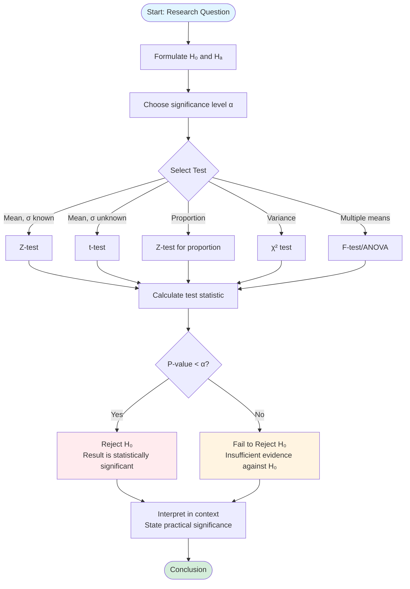

# Hypothesis Testing Framework

Hypothesis testing is the formal process of using sample data to evaluate claims about population parameters. It transforms scientific questions into precise mathematical statements and provides a rigorous framework for decision-making under uncertainty. This systematic approach allows researchers to draw conclusions while controlling the probability of errors.

## The Core Components

Every hypothesis test consists of five essential elements that work together to produce a statistically valid conclusion:

1. **Hypotheses:** Precise mathematical statements about population parameters
2. **Test Statistic:** A numerical summary of the sample data
3. **Sampling Distribution:** The probability distribution of the test statistic under the null hypothesis
4. **Decision Rule:** Criteria for choosing between hypotheses
5. **Conclusion:** An interpretation in the context of the original question

Understanding how these components interact is crucial for conducting and interpreting hypothesis tests correctly.

## Null and Alternative Hypotheses

The foundation of any hypothesis test is a pair of competing hypotheses about the population parameter of interest.

### The Null Hypothesis ($H_0$)

The **null hypothesis** represents the status quo, a baseline assumption, or a claim to be tested. It always contains an equality statement about the population parameter.

**Common forms:**
- $H_0: \mu = \mu_0$ (population mean equals a specific value)
- $H_0: p = p_0$ (population proportion equals a specific value)
- $H_0: \mu_1 = \mu_2$ (two population means are equal)
- $H_0: \sigma^2 = \sigma_0^2$ (population variance equals a specific value)

The null hypothesis typically represents:
- No change from a historical value
- No difference between groups
- No effect of a treatment
- No relationship between variables

**Example:** A pharmaceutical company claims their new drug lowers blood pressure by 10 mmHg on average. The null hypothesis is $H_0: \mu = 10$.

### The Alternative Hypothesis ($H_a$ or $H_1$)

The **alternative hypothesis** represents what we suspect is true or hope to demonstrate. It's the conclusion we draw if we reject the null hypothesis.

**Three forms based on research question:**

**1. Two-tailed (two-sided):**
$$H_a: \mu \neq \mu_0$$
Used when we're interested in detecting any difference from $\mu_0$, regardless of direction.

**Example:** Testing if a coin is fair: $H_0: p = 0.5$ vs $H_a: p \neq 0.5$

**2. Right-tailed (upper-tailed):**
$$H_a: \mu > \mu_0$$
Used when we want to detect if the parameter is greater than the null value.

**Example:** Testing if a new teaching method increases test scores: $H_0: \mu = 75$ vs $H_a: \mu > 75$

**3. Left-tailed (lower-tailed):**
$$H_a: \mu < \mu_0$$
Used when we want to detect if the parameter is less than the null value.

**Example:** Testing if a new fuel additive reduces emissions: $H_0: \mu = 200$ vs $H_a: \mu < 200$

**Choosing the direction:** The alternative hypothesis should be determined by the research question before collecting data, never by looking at the data first.

## Test Statistics

A **test statistic** is a function of the sample data that reduces all the information relevant to the hypothesis into a single number. It measures how far the sample result deviates from what we'd expect if $H_0$ were true.

### General Form

Most test statistics follow this pattern:
$$\text{Test Statistic} = \frac{\text{Sample Estimate} - \text{Null Value}}{\text{Standard Error}}$$

This standardizes the difference between our observation and the null hypothesis value in terms of standard errors.

### Common Test Statistics

**Z-statistic (for means when $\sigma$ is known):**
$$Z = \frac{\bar{x} - \mu_0}{\sigma / \sqrt{n}}$$

**Example:** A manufacturer claims light bulbs last 1000 hours on average ($\sigma = 50$ hours). A sample of 25 bulbs has $\bar{x} = 980$ hours.

$$Z = \frac{980 - 1000}{50/\sqrt{25}} = \frac{-20}{10} = -2.0$$

The sample mean is 2 standard errors below the claimed value.

**T-statistic (for means when $\sigma$ is unknown):**
$$t = \frac{\bar{x} - \mu_0}{s / \sqrt{n}}$$

**Example:** Testing if average study time is 5 hours per week. Sample: $n = 16$, $\bar{x} = 5.8$, $s = 1.6$.

$$t = \frac{5.8 - 5.0}{1.6/\sqrt{16}} = \frac{0.8}{0.4} = 2.0$$

**Z-statistic for proportions:**
$$Z = \frac{\hat{p} - p_0}{\sqrt{p_0(1-p_0)/n}}$$

**Example:** A website claims 30% conversion rate. In a sample of 200 visitors, 50 convert ($\hat{p} = 0.25$).

$$Z = \frac{0.25 - 0.30}{\sqrt{0.30(0.70)/200}} = \frac{-0.05}{0.032} = -1.56$$

## Sampling Distributions

Under the null hypothesis, the test statistic has a known **sampling distribution**. This distribution tells us how the test statistic would vary across different random samples if $H_0$ were true.

**Key distributions:**
- **Standard Normal ($Z$):** When population standard deviation is known or sample size is large
- **Student's t:** When population standard deviation is unknown and estimated from sample
- **Chi-squared ($\chi^2$):** For categorical data or variance tests
- **F-distribution:** For comparing variances or multiple means (ANOVA)

The sampling distribution allows us to determine what values of the test statistic are "unusual" under $H_0$.

## Decision Rules

We need a systematic way to decide whether to reject $H_0$ based on the test statistic. There are two equivalent approaches:

### Critical Value Approach

**Steps:**
1. Choose significance level $\alpha$ (typically 0.05)
2. Find critical value(s) from the sampling distribution
3. Reject $H_0$ if test statistic falls in the rejection region

**Two-tailed test at $\alpha = 0.05$:**
- Critical values for Z-test: $\pm 1.96$
- Reject $H_0$ if $Z < -1.96$ or $Z > 1.96$
- Equivalently: Reject if $|Z| > 1.96$

**Right-tailed test at $\alpha = 0.05$:**
- Critical value: $Z = 1.645$
- Reject $H_0$ if $Z > 1.645$

**Left-tailed test at $\alpha = 0.05$:**
- Critical value: $Z = -1.645$
- Reject $H_0$ if $Z < -1.645$

**Example:** Light bulb test with $Z = -2.0$ (two-tailed, $\alpha = 0.05$)

Since $|{-2.0}| = 2.0 > 1.96$, we reject $H_0$. The data provide strong evidence that the true mean differs from 1000 hours.

### P-Value Approach

The **p-value** is the probability of obtaining a test statistic at least as extreme as the observed value, assuming $H_0$ is true.

**Decision rule:** Reject $H_0$ if p-value $< \alpha$

**Calculating p-values:**

**Two-tailed:** $p = P(|Z| \geq |z_{obs}|) = 2 \cdot P(Z \geq |z_{obs}|)$

**Right-tailed:** $p = P(Z \geq z_{obs})$

**Left-tailed:** $p = P(Z \leq z_{obs})$

**Example:** Light bulb test with $Z = -2.0$ (two-tailed)

$$p = 2 \cdot P(Z \leq -2.0) = 2 \cdot 0.0228 = 0.0456$$

Since $0.0456 < 0.05$, we reject $H_0$ at the 5% significance level.

## The Six-Step Process

A systematic approach ensures you don't miss critical steps:

**Step 1: State hypotheses**
Clearly define $H_0$ and $H_a$ in terms of population parameters.

**Step 2: Choose significance level**
Select $\alpha$ (typically 0.05 or 0.01) based on consequences of errors.

**Step 3: Identify test statistic and sampling distribution**
Determine which test is appropriate based on:
- Parameter of interest (mean, proportion, variance)
- What you know (is $\sigma$ known?)
- Sample size
- Distribution of population

**Step 4: Calculate test statistic**
Compute from sample data using the appropriate formula.

**Step 5: Find p-value or compare to critical value**
Determine whether the result is statistically significant.

**Step 6: State conclusion**
Reject or fail to reject $H_0$ and interpret in context.

### Decision Flowchart

The following flowchart guides you through the hypothesis testing decision process:

## Worked Example: Complete Hypothesis Test

**Problem:** A coffee shop claims their new espresso machine produces shots with an average volume of 30 mL. A barista suspects it's less. She measures 20 shots and finds $\bar{x} = 28.5$ mL with $s = 2.4$ mL. Test at $\alpha = 0.05$.

**Step 1: Hypotheses**
- $H_0: \mu = 30$ (machine produces advertised volume)
- $H_a: \mu < 30$ (machine under-pours)
- This is a left-tailed test because we're only interested in detecting under-pouring.

**Step 2: Significance level**
$\alpha = 0.05$

**Step 3: Test statistic**
Since $\sigma$ is unknown and $n = 20$ is small, use a t-test with $df = n - 1 = 19$.

**Step 4: Calculate**
$$t = \frac{\bar{x} - \mu_0}{s/\sqrt{n}} = \frac{28.5 - 30}{2.4/\sqrt{20}} = \frac{-1.5}{0.537} = -2.79$$

**Step 5: Decision**

**Critical value approach:** For left-tailed t-test with 19 df and $\alpha = 0.05$, critical value is $-1.729$.

Since $t = -2.79 < -1.729$, we reject $H_0$.

**P-value approach:** Using t-table or software, $p = P(t_{19} \leq -2.79) \approx 0.006$.

Since $0.006 < 0.05$, we reject $H_0$.

**Step 6: Conclusion**
At the 5% significance level, we have sufficient evidence to conclude that the espresso machine produces shots with average volume less than 30 mL. The barista's suspicion appears justified.

## Interpreting Results

**"Reject $H_0$"** means:
- The sample data are inconsistent with the null hypothesis
- We have sufficient evidence to support the alternative hypothesis
- The result is statistically significant at level $\alpha$

**"Fail to reject $H_0$"** means:
- The sample data are consistent with the null hypothesis
- We lack sufficient evidence to support the alternative hypothesis
- The result is not statistically significant
- **Note:** This does NOT prove $H_0$ is true, only that we can't disprove it

## Summary

- Hypothesis tests evaluate claims about population parameters using sample data
- The null hypothesis $H_0$ represents the status quo; the alternative $H_a$ represents what we hope to demonstrate
- Test statistics standardize the difference between sample estimates and null values
- Decision rules based on critical values or p-values determine whether to reject $H_0$
- The six-step process ensures systematic, rigorous hypothesis testing
- Failing to reject $H_0$ is not the same as proving $H_0$ true
