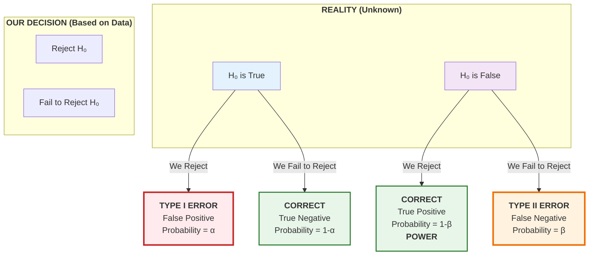

# Type I and Type II Errors and Statistical Power

In hypothesis testing, we make decisions under uncertainty. Even with perfect methodology, there's always a chance our conclusion will be wrong. Understanding the types of errors that can occur, their probabilities, and how to control them is essential for designing effective studies and interpreting results correctly.

## The Four Possible Outcomes

When we perform a hypothesis test, there are four possible outcomes based on our decision and the true state of nature:

| **Reality → Decision ↓** | **$H_0$ is True** | **$H_0$ is False** |
|-------------------------|-------------------|-------------------|
| **Reject $H_0$** | Type I Error ($\alpha$) | Correct Decision (Power = $1-\beta$) |
| **Fail to Reject $H_0$** | Correct Decision ($1-\alpha$) | Type II Error ($\beta$) |

We never know with certainty whether we've made the right decision because we don't know the true state of nature. However, we can control and calculate the probabilities of each outcome.

### Visual Representation of Errors

The following diagram illustrates the relationship between reality, our decision, and the types of errors:

## Type I Error (False Positive)

A **Type I error** occurs when we reject a true null hypothesis. We conclude there's an effect when there actually isn't one.

**Definition:**
$$\alpha = P(\text{Reject } H_0 \mid H_0 \text{ is true})$$

**Consequences depend on context:**

**Medical testing example:** A diagnostic test shows a patient has a disease when they're actually healthy.
- Unnecessary stress and anxiety
- Further invasive testing
- Potentially harmful treatments

**Criminal justice example:** Convicting an innocent person.
- Injustice to the individual
- Actual criminal remains free

**Quality control example:** Rejecting a good product batch.
- Wasted resources
- Production delays

### Controlling Type I Error: The Significance Level

The significance level $\alpha$ is the maximum Type I error rate we're willing to tolerate. By choosing $\alpha$ before conducting the test, we control this error probability.

**Common choices:**
- $\alpha = 0.05$ (5%): Standard in most fields
- $\alpha = 0.01$ (1%): When Type I errors are more serious
- $\alpha = 0.10$ (10%): Exploratory research where missing effects is more costly

**Example:** If we set $\alpha = 0.05$ and perform the test correctly, we have at most a 5% chance of rejecting $H_0$ when it's actually true.

**Key insight:** The significance level is chosen by the researcher based on the relative costs of different types of errors. It's not dictated by mathematics but by the context of the problem.

## Type II Error (False Negative)

A **Type II error** occurs when we fail to reject a false null hypothesis. We conclude there's no effect when there actually is one.

**Definition:**
$$\beta = P(\text{Fail to reject } H_0 \mid H_0 \text{ is false})$$

**Consequences depend on context:**

**Medical testing example:** A diagnostic test fails to detect a disease that's present.
- Disease progresses untreated
- Patient's health deteriorates
- Possible transmission to others

**Criminal justice example:** Acquitting a guilty person.
- Criminal remains free to commit more crimes
- No justice for victims

**Research example:** Failing to detect a real effect.
- Missing important scientific discoveries
- Wasting resources on ineffective treatments or interventions

### Factors Affecting Type II Error

Unlike Type I error, which we set directly through $\alpha$, Type II error $\beta$ depends on several factors:

1. **Significance level ($\alpha$):** Decreasing $\alpha$ increases $\beta$ (there's a tradeoff)
2. **Sample size ($n$):** Larger samples decrease $\beta$
3. **Effect size:** Larger real differences are easier to detect (lower $\beta$)
4. **Population variability ($\sigma$):** Less variability makes effects easier to detect
5. **Test type:** Two-tailed vs one-tailed (one-tailed has lower $\beta$ in the chosen direction)

## Statistical Power

**Statistical power** is the probability of correctly rejecting a false null hypothesis. It's the complement of the Type II error rate.

**Definition:**
$$\text{Power} = 1 - \beta = P(\text{Reject } H_0 \mid H_0 \text{ is false})$$

Power answers the question: "If there really is an effect, what's the probability my test will detect it?"

**Desirable power levels:**
- **0.80 (80%):** Minimum acceptable for most research
- **0.90 (90%):** Preferred for important studies
- **0.95 (95%):** High power for critical applications

### Calculating Power: An Example

**Problem:** A researcher wants to test if a new drug lowers cholesterol. Historical mean is $\mu_0 = 200$ mg/dL with $\sigma = 30$. They plan to test $n = 25$ patients at $\alpha = 0.05$ (two-tailed). What's the power to detect a true mean of $\mu_a = 185$ mg/dL?

**Step 1: Find critical values**
For two-tailed test at $\alpha = 0.05$, critical z-values are $\pm 1.96$.

Standard error: $SE = \sigma/\sqrt{n} = 30/\sqrt{25} = 6$

Critical sample means:
$$\bar{x}_{\text{lower}} = 200 - 1.96(6) = 188.24$$
$$\bar{x}_{\text{upper}} = 200 + 1.96(6) = 211.76$$

**Step 2: Calculate probability under the alternative**
If the true mean is $\mu_a = 185$, what's the probability that $\bar{x}$ falls in the rejection region?

Convert critical values to z-scores under $\mu_a = 185$:
$$z_{\text{lower}} = \frac{188.24 - 185}{6} = 0.54$$
$$z_{\text{upper}} = \frac{211.76 - 185}{6} = 4.46$$

**Step 3: Find power**
$$\text{Power} = P(\bar{x} < 188.24) + P(\bar{x} > 211.76 \mid \mu = 185)$$
$$= P(Z < 0.54) + P(Z > 4.46)$$
$$= 0.7054 + 0.000004 \approx 0.705$$

The test has about 70.5% power to detect a reduction from 200 to 185 mg/dL. This is below the desired 80% power level, suggesting a larger sample is needed.

## The Tradeoff Between Type I and Type II Errors

For a fixed sample size, there's an inevitable tradeoff between $\alpha$ and $\beta$:

**Decreasing $\alpha$ (being more conservative):**
- Reduces Type I errors (fewer false positives)
- Increases Type II errors (more false negatives)
- Decreases power
- Makes it harder to detect real effects

**Increasing $\alpha$ (being more liberal):**
- Increases Type I errors (more false positives)
- Reduces Type II errors (fewer false negatives)
- Increases power
- Makes it easier to detect real effects

**The only way to decrease both error rates simultaneously is to increase sample size.**

### Visualizing the Tradeoff

Consider testing $H_0: \mu = 100$ vs $H_a: \mu \neq 100$ with $\sigma = 15$ and $n = 25$ (SE = 3).

**At $\alpha = 0.05$:**
- Rejection region: $\bar{x} < 94.12$ or $\bar{x} > 105.88$
- If true $\mu = 106$: Power = 0.52

**At $\alpha = 0.01$:**
- Rejection region: $\bar{x} < 92.28$ or $\bar{x} > 107.72$
- If true $\mu = 106$: Power = 0.28

Reducing $\alpha$ from 0.05 to 0.01 decreased power from 52% to 28%.

## Sample Size Determination

We can determine the sample size needed to achieve desired power for detecting a specific effect size.

### Formula for One-Sample Z-Test (Two-Tailed)

To achieve power $1-\beta$ for detecting a difference $\delta = |\mu_a - \mu_0|$ at significance level $\alpha$:

$$n = \left(\frac{(z_{\alpha/2} + z_\beta)\sigma}{\delta}\right)^2$$

where:
- $z_{\alpha/2}$ is the critical value for significance level $\alpha$ (1.96 for $\alpha = 0.05$)
- $z_\beta$ is the z-value corresponding to power $1-\beta$ (0.84 for power = 0.80)

**Example:** How many patients needed to detect a reduction from 200 to 185 mg/dL in cholesterol ($\sigma = 30$) with 80% power at $\alpha = 0.05$?

$$n = \left(\frac{(1.96 + 0.84) \times 30}{|185 - 200|}\right)^2 = \left(\frac{2.80 \times 30}{15}\right)^2 = (5.6)^2 = 31.36$$

Round up to $n = 32$ patients.

### Formula for Two-Sample Z-Test (Equal Variances)

To detect a difference between two means:

$$n = \frac{2(z_{\alpha/2} + z_\beta)^2\sigma^2}{\delta^2}$$

where $n$ is the sample size per group and $\delta = |\mu_1 - \mu_2|$.

**Example:** Comparing two teaching methods. Want to detect a difference of 5 points with $\sigma = 8$, power = 0.90, $\alpha = 0.05$.

$$n = \frac{2(1.96 + 1.28)^2 \times 8^2}{5^2} = \frac{2(10.5) \times 64}{25} = 53.76$$

Need $n = 54$ students per group (108 total).

## Effect Size

**Effect size** measures the magnitude of the difference between the null and alternative hypotheses, standardized by variability. It's independent of sample size and represents practical significance.

### Cohen's d

For comparing means:
$$d = \frac{\mu_a - \mu_0}{\sigma}$$

**Interpretation (Cohen's conventions):**
- $d = 0.2$: Small effect
- $d = 0.5$: Medium effect
- $d = 0.8$: Large effect

**Example:** Cholesterol study with $\mu_0 = 200$, $\mu_a = 185$, $\sigma = 30$:
$$d = \frac{185 - 200}{30} = -0.5$$

This is a medium effect size.

**Relationship to power:** Larger effect sizes are easier to detect (require smaller samples for the same power).

| Effect Size (d) | n for 80% power |
|----------------|-----------------|
| 0.2 | 393 |
| 0.5 | 64 |
| 0.8 | 26 |

(Values for two-tailed test, $\alpha = 0.05$)

## Power Analysis in Practice

### A Priori Power Analysis (Before Data Collection)

Determine sample size needed to achieve desired power.

**Steps:**
1. Specify the effect size you want to detect (based on prior research or practical significance)
2. Choose significance level $\alpha$ (typically 0.05)
3. Choose desired power (typically 0.80 or 0.90)
4. Calculate required sample size
5. Adjust for practical constraints (cost, time, availability)

**Example:** Planning a study to test if a new exercise program reduces BMI.

- Previous research suggests programs reduce BMI by 1.5 units ($\sigma = 3$)
- Effect size: $d = 1.5/3 = 0.5$ (medium)
- Want 80% power at $\alpha = 0.05$
- Need $n = 64$ participants

### Post Hoc Power Analysis (After Data Collection)

Calculate the power of a completed study. This is controversial because:
- If you rejected $H_0$: power was clearly sufficient
- If you failed to reject: low power suggests inconclusive results, but this is already reflected in the non-significant p-value

**Better approach:** Report confidence intervals and effect sizes, which provide more information about precision and practical significance.

## Balancing Error Rates in Different Contexts

The choice of $\alpha$ and desired power depends on the relative costs of Type I and Type II errors:

### Medical Screening (Disease Present is $H_0$ False)

**Cancer screening:**
- Type I error: False positive → Unnecessary worry, follow-up tests
- Type II error: False negative → Missed cancer, delayed treatment
- **Strategy:** Use lower $\alpha$ (more conservative) to reduce false alarms, but ensure adequate power to catch real cases

### Criminal Justice ($H_0$: Defendant is Innocent)

**Court trial:**
- Type I error: Convict innocent person
- Type II error: Acquit guilty person
- **Strategy:** Very low $\alpha$ ("beyond reasonable doubt"), accepting higher $\beta$ to protect the innocent

### Quality Control ($H_0$: Product Meets Standards)

**Manufacturing:**
- Type I error: Reject good batch → Wasted product, production delay
- Type II error: Accept defective batch → Customers receive poor quality
- **Strategy:** Balance depends on costs; expensive products may use lower $\alpha$ to reduce waste

### Exploratory Research ($H_0$: No Effect)

**Pilot studies:**
- Type I error: Pursue ineffective treatment
- Type II error: Miss promising treatment
- **Strategy:** Higher $\alpha$ (0.10) acceptable to avoid missing potentially important discoveries

## Summary

- Type I error ($\alpha$): Rejecting a true $H_0$ (false positive)
- Type II error ($\beta$): Failing to reject a false $H_0$ (false negative)
- Power ($1-\beta$): Probability of correctly rejecting false $H_0$
- Significance level $\alpha$ is chosen by the researcher to control Type I error
- Type II error depends on $\alpha$, sample size, effect size, and variability
- Desired power is typically 0.80 (80%) or higher
- For fixed $n$, there's a tradeoff between $\alpha$ and $\beta$
- Sample size can be calculated to achieve desired power for detecting a specific effect size
- Effect sizes measure practical significance independent of sample size
- Error rate priorities depend on context and relative costs of mistakes
