# Chi-Squared Tests for Categorical Data

While z-tests and t-tests analyze quantitative data (means), chi-squared tests analyze categorical data (counts and proportions). These tests answer questions about how observed frequencies compare to expected frequencies, whether categorical variables are independent, and whether different populations have the same distribution. Chi-squared tests are essential tools for analyzing surveys, medical diagnoses, genetics, quality control, and countless other applications involving categorical data.

## The Chi-Squared Distribution

The **chi-squared ($\chi^2$) distribution** is the sampling distribution for sums of squared standard normal variables.

**Properties:**
- Right-skewed (not symmetric)
- Always positive (since it's based on squared values)
- Shape determined by degrees of freedom (df)
- Becomes more symmetric as df increases

**Mean:** $E[\chi^2] = df$
**Variance:** $Var[\chi^2] = 2 \cdot df$

**Degrees of freedom** depend on the specific test:
- Goodness of fit: $df = k - 1$ (where $k$ = number of categories)
- Test of independence: $df = (r-1)(c-1)$ (for $r \times c$ table)

## General Chi-Squared Test Statistic

All chi-squared tests use the same basic formula:

$$\chi^2 = \sum \frac{(O_i - E_i)^2}{E_i}$$

where:
- $O_i$ = observed frequency in category $i$
- $E_i$ = expected frequency in category $i$ under $H_0$
- Sum is over all categories

**Intuition:** Large differences between observed and expected frequencies produce large $\chi^2$ values, providing evidence against $H_0$.

```mermaid
graph TD
    subgraph Data["Categorical Data"]
        Obs["<b>Observed Frequencies</b><br/>O₁, O₂, ..., Oₖ<br/><br/>Actual counts in each category"]
    end

    subgraph Null["Under H₀"]
        Exp["<b>Expected Frequencies</b><br/>E₁, E₂, ..., Eₖ<br/><br/>What we'd expect if H₀ is true"]
    end

    subgraph Calculate["Compute Chi-Squared"]
        Formula["χ² = Σ &#40;Oᵢ - Eᵢ&#41;² / Eᵢ<br/><br/>Sum over all k categories"]
    end

    subgraph Interpret["Interpretation"]
        Small["<b>Small χ²</b><br/>O ≈ E<br/>Observed matches expected<br/>Consistent with H₀"]
        Large["<b>Large χ²</b><br/>O ≠ E<br/>Observed differs from expected<br/>Evidence against H₀"]
    end

    Obs --> Formula
    Exp --> Formula

    Formula --> Check{χ² value?}

    Check -->|Close to 0| Small
    Check -->|Far from 0| Large

    Small --> Fail["Fail to reject H₀<br/>p-value large"]
    Large --> Reject["Reject H₀<br/>p-value small"]

    style Obs fill:#e1f5ff
    style Exp fill:#fff3e0
    style Formula fill:#f3e5f5
    style Small fill:#e8f5e9
    style Large fill:#ffebee
    style Reject fill:#ffcdd2
    style Fail fill:#c8e6c9
```

**Rule of thumb for validity:** Each expected frequency should be at least 5 ($E_i \geq 5$). If not, combine categories or use exact tests (Fisher's exact test for 2×2 tables).

## Chi-Squared Goodness of Fit Test

Tests whether observed data follow a hypothesized distribution.

### Hypotheses

- $H_0$: The population follows the specified distribution
- $H_a$: The population does not follow the specified distribution

**Note:** Always a right-tailed test (we're looking for any deviation from expected)

### Test Statistic

$$\chi^2 = \sum_{i=1}^{k} \frac{(O_i - E_i)^2}{E_i}$$

with $df = k - 1$ (or $k - 1 - p$ if $p$ parameters were estimated from data)

### Assumptions

1. **Random sample** from the population
2. **Independent observations**
3. **Expected frequencies** $E_i \geq 5$ for all categories

### Decision Rule

Reject $H_0$ if $\chi^2 > \chi^2_{\alpha, df}$ or if $p < \alpha$

(Always right-tailed because large deviations in either direction contribute to $\chi^2$)

### Worked Example: Fair Die Test

**Problem:** A gambler suspects a die is loaded. She rolls it 120 times and observes:

| Outcome | 1 | 2 | 3 | 4 | 5 | 6 |
|---------|---|---|---|---|---|---|
| Observed | 15 | 18 | 22 | 25 | 19 | 21 |

Test at $\alpha = 0.05$ whether the die is fair.

**Step 1: Hypotheses**
- $H_0$: The die is fair (all outcomes equally likely)
- $H_a$: The die is not fair
- Right-tailed test

**Step 2: Expected frequencies**
For a fair die: $E_i = \frac{120}{6} = 20$ for each outcome

| Outcome | 1 | 2 | 3 | 4 | 5 | 6 |
|---------|---|---|---|---|---|---|
| Observed (O) | 15 | 18 | 22 | 25 | 19 | 21 |
| Expected (E) | 20 | 20 | 20 | 20 | 20 | 20 |

**Step 3: Calculate test statistic**
$$\chi^2 = \frac{(15-20)^2}{20} + \frac{(18-20)^2}{20} + \frac{(22-20)^2}{20} + \frac{(25-20)^2}{20} + \frac{(19-20)^2}{20} + \frac{(21-20)^2}{20}$$

$$= \frac{25}{20} + \frac{4}{20} + \frac{4}{20} + \frac{25}{20} + \frac{1}{20} + \frac{1}{20}$$

$$= 1.25 + 0.20 + 0.20 + 1.25 + 0.05 + 0.05 = 3.00$$

with $df = 6 - 1 = 5$

**Step 4: Decision**

**Critical value:** $\chi^2_{0.05, 5} = 11.07$

Since $3.00 < 11.07$, we fail to reject $H_0$.

**P-value:** From chi-squared table, $p > 0.10$ (approximately 0.70)

**Step 5: Conclusion**
At the 5% significance level, there is insufficient evidence to conclude the die is unfair. The observed deviations from equal frequencies are consistent with random variation.

### Worked Example: Mendelian Genetics

**Problem:** In pea plant genetics, Mendel's theory predicts a 9:3:3:1 ratio for four phenotypes in F2 generation. An experiment produces:

| Phenotype | Round-Yellow | Round-Green | Wrinkled-Yellow | Wrinkled-Green |
|-----------|--------------|-------------|-----------------|----------------|
| Observed | 315 | 108 | 101 | 32 |

Total: $n = 556$ plants. Test at $\alpha = 0.05$ whether data support Mendel's theory.

**Step 1: Hypotheses**
- $H_0$: True ratio is 9:3:3:1
- $H_a$: True ratio is not 9:3:3:1

**Step 2: Expected frequencies**
Total = 556 plants

| Phenotype | Expected Proportion | Expected Count |
|-----------|---------------------|----------------|
| Round-Yellow | 9/16 | 556(9/16) = 312.75 |
| Round-Green | 3/16 | 556(3/16) = 104.25 |
| Wrinkled-Yellow | 3/16 | 556(3/16) = 104.25 |
| Wrinkled-Green | 1/16 | 556(1/16) = 34.75 |

**Step 3: Calculate $\chi^2$**

$$\chi^2 = \frac{(315-312.75)^2}{312.75} + \frac{(108-104.25)^2}{104.25} + \frac{(101-104.25)^2}{104.25} + \frac{(32-34.75)^2}{34.75}$$

$$= \frac{5.06}{312.75} + \frac{14.06}{104.25} + \frac{10.56}{104.25} + \frac{7.56}{34.75}$$

$$= 0.016 + 0.135 + 0.101 + 0.218 = 0.470$$

with $df = 4 - 1 = 3$

**Step 4: Decision**

**Critical value:** $\chi^2_{0.05, 3} = 7.815$

Since $0.470 < 7.815$, we fail to reject $H_0$.

**Step 5: Conclusion**
The data are highly consistent with Mendel's predicted 9:3:3:1 ratio. The small $\chi^2$ value indicates very good fit to the theoretical distribution.

## Chi-Squared Test of Independence

Tests whether two categorical variables are associated (dependent) or independent.

### Setup: Contingency Table

Data organized in an $r \times c$ contingency table (r rows, c columns):

|  | Column 1 | Column 2 | ... | Column c | Row Total |
|--|----------|----------|-----|----------|-----------|
| **Row 1** | $O_{11}$ | $O_{12}$ | ... | $O_{1c}$ | $R_1$ |
| **Row 2** | $O_{21}$ | $O_{22}$ | ... | $O_{2c}$ | $R_2$ |
| ... | ... | ... | ... | ... | ... |
| **Row r** | $O_{r1}$ | $O_{r2}$ | ... | $O_{rc}$ | $R_r$ |
| **Column Total** | $C_1$ | $C_2$ | ... | $C_c$ | $n$ |

### Hypotheses

- $H_0$: The two variables are independent
- $H_a$: The two variables are dependent (associated)

### Expected Frequencies Under Independence

$$E_{ij} = \frac{(\text{Row } i \text{ total}) \times (\text{Column } j \text{ total})}{\text{Grand total}} = \frac{R_i \times C_j}{n}$$

**Intuition:** If variables are independent, the proportion in each cell should equal the product of the marginal proportions.

### Test Statistic

$$\chi^2 = \sum_{i=1}^{r} \sum_{j=1}^{c} \frac{(O_{ij} - E_{ij})^2}{E_{ij}}$$

with $df = (r-1)(c-1)$

### Worked Example: Smoking and Lung Cancer

**Problem:** A study examines the relationship between smoking status and lung cancer:

|  | Lung Cancer | No Lung Cancer | Total |
|--|-------------|----------------|-------|
| **Smoker** | 60 | 140 | 200 |
| **Non-smoker** | 15 | 185 | 200 |
| **Total** | 75 | 325 | 400 |

Test at $\alpha = 0.01$ whether smoking and lung cancer are independent.

**Step 1: Hypotheses**
- $H_0$: Smoking status and lung cancer are independent
- $H_a$: Smoking status and lung cancer are associated

**Step 2: Calculate expected frequencies**

$$E_{11} = \frac{200 \times 75}{400} = 37.5$$ (Smoker, Lung Cancer)
$$E_{12} = \frac{200 \times 325}{400} = 162.5$$ (Smoker, No Lung Cancer)
$$E_{21} = \frac{200 \times 75}{400} = 37.5$$ (Non-smoker, Lung Cancer)
$$E_{22} = \frac{200 \times 325}{400} = 162.5$$ (Non-smoker, No Lung Cancer)

|  | Lung Cancer | No Lung Cancer |
|--|-------------|----------------|
| **Smoker** | 37.5 | 162.5 |
| **Non-smoker** | 37.5 | 162.5 |

**Step 3: Calculate $\chi^2$**

$$\chi^2 = \frac{(60-37.5)^2}{37.5} + \frac{(140-162.5)^2}{162.5} + \frac{(15-37.5)^2}{37.5} + \frac{(185-162.5)^2}{162.5}$$

$$= \frac{506.25}{37.5} + \frac{506.25}{162.5} + \frac{506.25}{37.5} + \frac{506.25}{162.5}$$

$$= 13.5 + 3.12 + 13.5 + 3.12 = 33.24$$

with $df = (2-1)(2-1) = 1$

**Step 4: Decision**

**Critical value:** $\chi^2_{0.01, 1} = 6.635$

Since $33.24 > 6.635$, we strongly reject $H_0$.

**P-value:** $p < 0.001$ (extremely small)

**Step 5: Conclusion**
At the 1% significance level, there is very strong evidence that smoking status and lung cancer are associated. Smokers have much higher rates of lung cancer than expected under independence.

**Important note:** Association doesn't prove causation. This observational study shows a relationship, but experimental or additional evidence would be needed to establish causality.

### Worked Example: Education and Political Party

**Problem:** A survey asks 300 people about education level and political party preference:

|  | Democrat | Republican | Independent | Total |
|--|----------|------------|-------------|-------|
| **High School** | 35 | 42 | 23 | 100 |
| **College** | 40 | 38 | 22 | 100 |
| **Graduate** | 45 | 30 | 25 | 100 |
| **Total** | 120 | 110 | 70 | 300 |

Test at $\alpha = 0.05$ whether education level and party preference are independent.

**Step 1: Calculate expected frequencies**

For example:
$$E_{11} = \frac{100 \times 120}{300} = 40$$ (High School, Democrat)

Full expected table:

|  | Democrat | Republican | Independent |
|--|----------|------------|-------------|
| **High School** | 40 | 36.67 | 23.33 |
| **College** | 40 | 36.67 | 23.33 |
| **Graduate** | 40 | 36.67 | 23.33 |

**Step 2: Calculate $\chi^2$**

$$\chi^2 = \frac{(35-40)^2}{40} + \frac{(42-36.67)^2}{36.67} + ... + \frac{(25-23.33)^2}{23.33}$$

$$= 0.625 + 0.774 + 0.005 + 0 + 0.048 + 0.196 + 0.625 + 2.413 + 0.119$$

$$= 4.805$$

with $df = (3-1)(3-1) = 4$

**Step 3: Decision**

**Critical value:** $\chi^2_{0.05, 4} = 9.488$

Since $4.805 < 9.488$, we fail to reject $H_0$.

**P-value:** $p \approx 0.31$

**Step 4: Conclusion**
At the 5% significance level, there is insufficient evidence to conclude that education level and political party preference are associated in the population.

## Chi-Squared Test of Homogeneity

Tests whether multiple populations have the same distribution across categories.

### Difference from Test of Independence

**Test of Independence:**
- One sample classified by two variables
- "Are these variables associated?"
- Example: One group of people classified by smoking AND cancer status

**Test of Homogeneity:**
- Multiple samples, each classified by one variable
- "Do these populations have the same distribution?"
- Example: Smokers and non-smokers, each classified by cancer status

**Mathematical procedure:** Identical to test of independence (same formula, same df)
**Interpretation:** Different conceptual question

### Hypotheses

- $H_0$: All populations have the same distribution
- $H_a$: At least one population has a different distribution

### Worked Example: Product Preference Across Regions

**Problem:** A company tests product preference in three regions:

|  | Prefer A | Prefer B | Prefer C | Total |
|--|----------|----------|----------|-------|
| **Region 1** | 45 | 30 | 25 | 100 |
| **Region 2** | 52 | 28 | 20 | 100 |
| **Region 3** | 38 | 42 | 20 | 100 |
| **Total** | 135 | 100 | 65 | 300 |

Test at $\alpha = 0.05$ whether preference distribution is the same across regions.

**Step 1: Hypotheses**
- $H_0$: Preference distribution is the same in all three regions
- $H_a$: Preference distribution differs across regions

**Step 2: Expected frequencies**

Each region should have proportions 135/300, 100/300, 65/300:

|  | Prefer A | Prefer B | Prefer C |
|--|----------|----------|----------|
| **Region 1** | 45 | 33.33 | 21.67 |
| **Region 2** | 45 | 33.33 | 21.67 |
| **Region 3** | 45 | 33.33 | 21.67 |

**Step 3: Calculate $\chi^2$**

$$\chi^2 = \frac{(45-45)^2}{45} + \frac{(30-33.33)^2}{33.33} + ... + \frac{(20-21.67)^2}{21.67}$$

$$= 0 + 0.333 + 0.512 + 1.089 + 0.852 + 0.129 + 1.089 + 2.254 + 0.129$$

$$= 6.387$$

with $df = (3-1)(3-1) = 4$

**Step 4: Decision**

**Critical value:** $\chi^2_{0.05, 4} = 9.488$

Since $6.387 < 9.488$, we fail to reject $H_0$.

**P-value:** $p \approx 0.17$

**Step 5: Conclusion**
At the 5% significance level, there is insufficient evidence to conclude that product preference differs across the three regions. The observed differences could reasonably be due to sampling variability.

## Comparing the Three Chi-Squared Tests

| Feature | Goodness of Fit | Independence | Homogeneity |
|---------|----------------|--------------|-------------|
| **Number of variables** | 1 | 2 | 1 |
| **Number of samples** | 1 | 1 | Multiple |
| **Question** | Does distribution match theory? | Are variables associated? | Do populations have same distribution? |
| **df formula** | $k - 1$ | $(r-1)(c-1)$ | $(r-1)(c-1)$ |

## Common Mistakes and Best Practices

### Mistake 1: Confusing Independence and Homogeneity

**Key distinction:**
- Independence: One sample, two categorical variables
- Homogeneity: Multiple samples, one categorical variable

### Mistake 2: Using Chi-Squared with Small Expected Frequencies

**Problem:** When $E_i < 5$, chi-squared approximation is poor.

**Solutions:**
- Combine categories to increase expected counts
- Use Fisher's exact test (for 2×2 tables)
- Use simulation-based methods

### Mistake 3: Interpreting Association as Causation

**Wrong:** "The chi-squared test proved smoking causes cancer."

**Right:** "The chi-squared test shows smoking and cancer are associated."

Observational studies show association; causation requires experimental evidence or additional criteria.

### Mistake 4: Using Two-Tailed Test

Chi-squared tests are **always right-tailed** because we square all deviations. We're looking for any kind of departure from expected, whether higher or lower.

### Best Practices

1. **Check expected frequency condition** before conducting test
2. **Report observed and expected frequencies** for transparency
3. **Examine residuals** to understand which categories contribute most to $\chi^2$
4. **Consider effect size measures** like Cramér's V for strength of association
5. **Follow up significant results** with post-hoc analyses to identify specific differences

## Summary

- Chi-squared tests analyze categorical data (counts and proportions)
- General formula: $\chi^2 = \sum \frac{(O_i - E_i)^2}{E_i}$
- **Goodness of fit:** Tests whether data match a specified distribution
- **Test of independence:** Tests whether two categorical variables are associated (one sample)
- **Test of homogeneity:** Tests whether multiple populations have the same distribution
- All chi-squared tests are right-tailed
- Require expected frequencies $\geq 5$ in all cells
- Association doesn't prove causation
- Report effect sizes alongside significance tests
