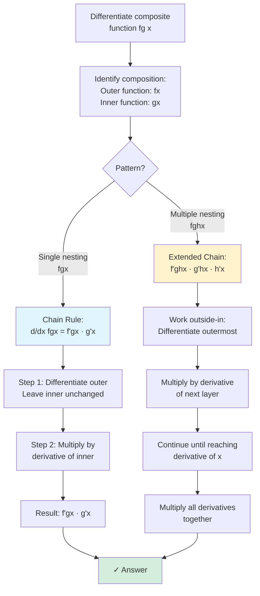
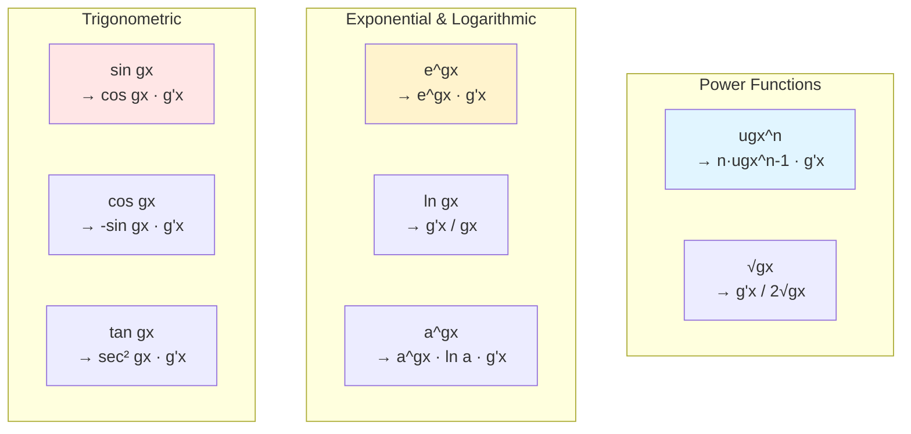

# The Chain Rule

The chain rule handles composite functions—functions inside other functions. It's perhaps the most important differentiation technique because nested functions appear everywhere in applications.

## The Chain Rule Statement

If $y = f(g(x))$, where $f$ and $g$ are differentiable, then:

$$\frac{dy}{dx} = f'(g(x)) \cdot g'(x)$$

Or equivalently: $(f \circ g)'(x) = f'(g(x)) \cdot g'(x)$

**Intuition:** The rate of change of the composition equals the rate of change of the outer function (evaluated at the inner function) times the rate of change of the inner function.

## Leibniz Notation Version

If $y = f(u)$ and $u = g(x)$, then:

$$\frac{dy}{dx} = \frac{dy}{du} \cdot \frac{du}{dx}$$

This looks like fractions canceling! (They don't really cancel, but the notation is suggestive and correct.)

## The "Inside-Outside" Method

1. **Identify the outer function** (what would you compute last?)
2. **Identify the inner function** (what's "inside"?)
3. **Differentiate outer function** (leaving inner alone, then multiply by derivative of inner)

### Visual Summary: Common Chain Rule Patterns

## Basic Examples

**Example 1:** Find $\frac{d}{dx}[(x^2 + 1)^3]$

- Outer function: $(\cdot)^3$
- Inner function: $x^2 + 1$

$$\frac{d}{dx}[(x^2 + 1)^3] = 3(x^2 + 1)^2 \cdot (2x) = 6x(x^2 + 1)^2$$

**Example 2:** Find $\frac{d}{dx}[\sqrt{3x + 5}]$

- Outer: $\sqrt{\cdot} = (\cdot)^{1/2}$
- Inner: $3x + 5$

$$\frac{d}{dx}[\sqrt{3x + 5}] = \frac{1}{2}(3x + 5)^{-1/2} \cdot 3 = \frac{3}{2\sqrt{3x + 5}}$$

**Example 3:** Find $\frac{d}{dx}[\sin(x^2)]$

- Outer: $\sin(\cdot)$
- Inner: $x^2$

$$\frac{d}{dx}[\sin(x^2)] = \cos(x^2) \cdot 2x = 2x\cos(x^2)$$

**Example 4:** Find $\frac{d}{dx}[e^{3x}]$

- Outer: $e^{(\cdot)}$
- Inner: $3x$

$$\frac{d}{dx}[e^{3x}] = e^{3x} \cdot 3 = 3e^{3x}$$

## Multiple Chain Rules (Nested Compositions)

For $y = f(g(h(x)))$:

$$\frac{dy}{dx} = f'(g(h(x))) \cdot g'(h(x)) \cdot h'(x)$$

Work from outside to inside, multiplying derivatives as you go.

**Example:** Find $\frac{d}{dx}[\sin^2(3x)]$

This is $[\sin(3x)]^2$:
- Outermost: $(\cdot)^2$
- Middle: $\sin(\cdot)$
- Innermost: $3x$

$$\frac{d}{dx}[\sin^2(3x)] = 2\sin(3x) \cdot \cos(3x) \cdot 3 = 6\sin(3x)\cos(3x)$$

Using identity: $= 3\sin(6x)$

## Chain Rule with Other Rules

The chain rule often combines with product or quotient rules.

**Example:** Find $\frac{d}{dx}[x^2 \cdot e^{-x}]$

Use product rule, with chain rule for $e^{-x}$:

$$= 2x \cdot e^{-x} + x^2 \cdot e^{-x} \cdot (-1) = 2xe^{-x} - x^2e^{-x} = xe^{-x}(2 - x)$$

**Example:** Find $\frac{d}{dx}\left[\frac{1}{(x^2+1)^2}\right]$

Rewrite as $(x^2+1)^{-2}$:

$$= -2(x^2+1)^{-3} \cdot 2x = \frac{-4x}{(x^2+1)^3}$$

## General Power Rule

A special case combining power and chain rules:

$$\frac{d}{dx}[[g(x)]^n] = n[g(x)]^{n-1} \cdot g'(x)$$

**Example:** $\frac{d}{dx}[(2x^3 - x)^5] = 5(2x^3 - x)^4 \cdot (6x^2 - 1)$

## Common Chain Rule Patterns

| Outer | Inner | Derivative |
|-------|-------|------------|
| $\sin(u)$ | $u = g(x)$ | $\cos(g(x)) \cdot g'(x)$ |
| $\cos(u)$ | $u = g(x)$ | $-\sin(g(x)) \cdot g'(x)$ |
| $e^u$ | $u = g(x)$ | $e^{g(x)} \cdot g'(x)$ |
| $\ln(u)$ | $u = g(x)$ | $\frac{1}{g(x)} \cdot g'(x) = \frac{g'(x)}{g(x)}$ |
| $u^n$ | $u = g(x)$ | $n[g(x)]^{n-1} \cdot g'(x)$ |
| $\sqrt{u}$ | $u = g(x)$ | $\frac{g'(x)}{2\sqrt{g(x)}}$ |

## Common Mistakes

1. **Forgetting the inside derivative:**
   Wrong: $\frac{d}{dx}[\sin(3x)] = \cos(3x)$
   Correct: $\frac{d}{dx}[\sin(3x)] = 3\cos(3x)$

2. **Differentiating the inside too:**
   Wrong: $\frac{d}{dx}[(x^2+1)^3] = 3(2x)^2$
   Correct: $\frac{d}{dx}[(x^2+1)^3] = 3(x^2+1)^2 \cdot 2x$

3. **Incorrect order:** Apply chain rule from outside in, not inside out.

## Why "Chain" Rule?

The name comes from chains of compositions. If $y$ depends on $u$, and $u$ depends on $x$, the rates multiply like links in a chain:

$$\frac{dy}{dx} = \frac{dy}{du} \cdot \frac{du}{dx}$$

With more links: $\frac{dy}{dx} = \frac{dy}{du} \cdot \frac{du}{dv} \cdot \frac{dv}{dx}$

## Physical Interpretation

The chain rule has a natural interpretation in terms of rates of change. Suppose:
- Temperature $T$ depends on altitude $h$: $T = f(h)$
- Altitude $h$ depends on time $t$: $h = g(t)$

Then $\frac{dT}{dt} = \frac{dT}{dh} \cdot \frac{dh}{dt}$

In words: the rate at which temperature changes with time equals (rate of temperature change per unit altitude) times (rate of altitude change with time). The "intermediate" rates multiply.

## Summary

- Chain rule: $(f(g(x)))' = f'(g(x)) \cdot g'(x)$
- Leibniz form: $\frac{dy}{dx} = \frac{dy}{du} \cdot \frac{du}{dx}$
- Identify outer and inner functions
- Differentiate outer (keeping inner intact), then multiply by derivative of inner
- For multiple compositions, work from outside to inside
- Don't forget the "inside derivative"!
