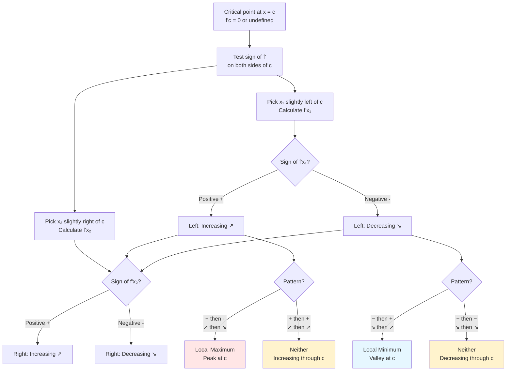

# Critical Points and Extrema

Understanding where functions reach their highest and lowest values is fundamental to calculus. Critical points are the key to finding these extrema.

## Definitions

A **critical point** of $f$ occurs at $x = c$ where either:
1. $f'(c) = 0$ (horizontal tangent), or
2. $f'(c)$ does not exist (but $f(c)$ is defined)

A **local maximum** at $x = c$ means $f(c) \geq f(x)$ for all $x$ near $c$.

A **local minimum** at $x = c$ means $f(c) \leq f(x)$ for all $x$ near $c$.

An **absolute (global) maximum** is the largest value of $f$ on its entire domain.

An **absolute (global) minimum** is the smallest value of $f$ on its entire domain.

## Finding Critical Points

**Step 1:** Find $f'(x)$

**Step 2:** Find where $f'(x) = 0$

**Step 3:** Find where $f'(x)$ is undefined (but $f(x)$ is defined)

**Example:** Find critical points of $f(x) = x^3 - 3x^2 - 9x + 5$.

$f'(x) = 3x^2 - 6x - 9 = 3(x^2 - 2x - 3) = 3(x-3)(x+1)$

Set $f'(x) = 0$: $x = 3$ or $x = -1$

$f'(x)$ exists everywhere (polynomial), so critical points are $x = -1$ and $x = 3$.

**Example:** Find critical points of $f(x) = x^{2/3}$.

$f'(x) = \frac{2}{3}x^{-1/3} = \frac{2}{3\sqrt[3]{x}}$

$f'(x) \neq 0$ for any $x$, but $f'(0)$ is undefined.

Since $f(0) = 0$ is defined, $x = 0$ is a critical point.

## Why Critical Points Matter

**Fermat's Theorem:** If $f$ has a local extremum at $c$ and $f'(c)$ exists, then $f'(c) = 0$.

**Interpretation:** Local extrema can only occur at critical points (where $f' = 0$ or $f'$ doesn't exist).

**Warning:** Not every critical point is an extremum! For $f(x) = x^3$, $f'(0) = 0$ but $x = 0$ is neither a max nor min—it's an inflection point with horizontal tangent.

## The First Derivative Test

To classify a critical point at $x = c$:

1. Check the sign of $f'$ on either side of $c$
2. Apply the following rules:

| $f'$ before $c$ | $f'$ after $c$ | Classification |
|-----------------|----------------|----------------|
| $+$ (increasing) | $-$ (decreasing) | Local maximum |
| $-$ (decreasing) | $+$ (increasing) | Local minimum |
| $+$ | $+$ | Neither (increasing through) |
| $-$ | $-$ | Neither (decreasing through) |

**Example:** For $f(x) = x^3 - 3x^2 - 9x + 5$ with $f'(x) = 3(x-3)(x+1)$:

| Interval | Sign of $f'(x)$ | $f$ behavior |
|----------|-----------------|--------------|
| $x < -1$ | $(-)(-) = +$ | Increasing |
| $-1 < x < 3$ | $(-)( +) = -$ | Decreasing |
| $x > 3$ | $(+)(+) = +$ | Increasing |

At $x = -1$: changes from + to − → **local maximum**
At $x = 3$: changes from − to + → **local minimum**

## Absolute Extrema on Closed Intervals

**Extreme Value Theorem:** A continuous function on a closed interval $[a, b]$ attains both an absolute maximum and an absolute minimum.

**To find absolute extrema on $[a, b]$:**

1. Find all critical points in $(a, b)$
2. Evaluate $f$ at each critical point and at the endpoints $a$ and $b$
3. The largest value is the absolute maximum; the smallest is the absolute minimum

**Example:** Find absolute extrema of $f(x) = x^3 - 3x$ on $[-2, 3]$.

$f'(x) = 3x^2 - 3 = 3(x^2 - 1) = 3(x-1)(x+1)$

Critical points: $x = 1$ and $x = -1$ (both in $[-2, 3]$)

Evaluate:
- $f(-2) = -8 + 6 = -2$
- $f(-1) = -1 + 3 = 2$
- $f(1) = 1 - 3 = -2$
- $f(3) = 27 - 9 = 18$

**Absolute maximum:** $f(3) = 18$
**Absolute minimum:** $f(-2) = f(1) = -2$ (occurs at two points)

## Critical Points Where f' Doesn't Exist

**Example:** $f(x) = |x|$ has $f'(0)$ undefined (corner).

$f'(x) = \begin{cases} 1 & x > 0 \\ -1 & x < 0 \end{cases}$

Changes from − to + at $x = 0$ → local minimum.

**Example:** $f(x) = x^{1/3}$ has $f'(0)$ undefined (vertical tangent).

$f'(x) = \frac{1}{3}x^{-2/3} > 0$ for all $x \neq 0$

Function is always increasing → $x = 0$ is neither max nor min.

## Summary

- Critical points: where $f' = 0$ or $f'$ doesn't exist
- Local extrema can only occur at critical points
- First derivative test: check sign changes of $f'$
- For absolute extrema on $[a, b]$: check critical points and endpoints
- Not every critical point is an extremum
